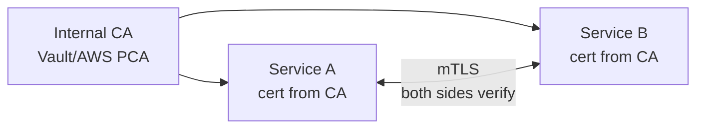

# Public-Key Cryptography Basics

> **TL;DR** — **Public-key (asymmetric) cryptography** uses a key pair: a **public key** anyone can have, a **private key** only the owner possesses. With that asymmetry you get two powerful primitives — **encryption** (anyone can encrypt to you; only you can decrypt) and **signatures** (only you can sign; anyone can verify). It's the foundation of TLS, SSH, code signing, software updates, blockchain, JWT, WebAuthn — basically every secure protocol on the internet. **PKI** (Public Key Infrastructure) is the system of certificates, certificate authorities, and trust chains that lets you map a public key to a real-world identity. The math is RSA, ECDSA, EdDSA, ECDH; the operational machinery is X.509 certificates and CAs.

---

## 1. The Big Idea

```
                       ┌────────────────────────┐
                       │   Alice's Key Pair     │
                       │   ┌────────┐ ┌──────┐  │
                       │   │ Public │ │Privat│  │
                       │   └────────┘ └──────┘  │
                       └────────────────────────┘
                                ↑       ↑
                           shareable   secret
                            with all   to Alice
                            the world  only

ENCRYPTION   Anyone with Alice's public key encrypts a message.
             Only Alice's private key can decrypt.

SIGNATURE    Alice signs a message with her private key.
             Anyone with her public key can verify it came from her,
             unaltered.
```

The break-through (Diffie–Hellman 1976, RSA 1978) was that this is *possible at all* — that you can publish half of a key pair and the other half retains its power.

---

## 2. Why You Need Asymmetric Crypto

Symmetric encryption (AES) is fast and great — once two parties share a key. But how do they share that key over an untrusted network in the first place? That's the **key exchange problem**, and it's why asymmetric exists.

Public-key crypto solves four practical problems:

| Problem | Solution |
| --- | --- |
| Sharing a key over an untrusted network | Diffie–Hellman / ECDHE key exchange |
| Proving who sent a message | Digital signatures |
| Proving identity to a counterparty | Certificates + signatures (TLS, mTLS) |
| Authenticating software | Code signing |

In production protocols (TLS, SSH, JWT, Signal), asymmetric is used to bootstrap symmetric crypto. The bulk encryption is always symmetric — asymmetric is too slow for that.

---

## 3. The Algorithms

| Algorithm | What it does | Status |
| --- | --- | --- |
| **RSA** | Encrypt, sign | Ubiquitous, slow, requires 2048+ bit keys |
| **DH / ECDH** | Key exchange | DH is legacy; ECDH (X25519, P-256) is modern |
| **DSA** | Signatures | Legacy |
| **ECDSA** (P-256, P-384) | Signatures | Mainstream, fast |
| **EdDSA** (Ed25519, Ed448) | Signatures | Modern, recommended where supported |
| **ECIES** | Hybrid encryption | Pairs ECDH + AEAD |
| **Post-quantum** (Kyber, Dilithium) | Future-proofing | Standardized 2024; adoption underway |

### RSA in 90 seconds

```
Generate two large primes p, q.
n = p * q
phi = (p-1)(q-1)
Choose e (commonly 65537) coprime to phi.
d = e^-1 mod phi  →  private exponent.

Public key:  (n, e)
Private key: (n, d)

Encrypt:  c = m^e mod n
Decrypt:  m = c^d mod n
Sign:     s = H(m)^d mod n
Verify:   H(m) == s^e mod n
```

RSA-2048 is the minimum acceptable size today; 3072 or 4096 for new long-lived keys.

### Elliptic-curve crypto (ECC)

ECC achieves the same security with much smaller keys. A 256-bit ECC key ≈ 3072-bit RSA. So all signatures and key exchanges are smaller and faster.

- **P-256** (NIST), **X25519** (Bernstein, Ed25519's curve), **P-384** (higher security).
- Used everywhere — TLS 1.3 default, SSH, Signal, Bitcoin, Ethereum, WebAuthn.

**Recommendation:** Ed25519 for signatures, X25519 for key exchange, where supported. Fall back to ECDSA P-256 and ECDHE P-256 for compatibility. Avoid RSA for new systems unless required by a counterparty.

---

## 4. The Two Primitives in Detail

### Encryption: hybrid by necessity

In practice, no one RSA-encrypts a 10 MB file. The pattern (called **hybrid encryption**):

```
1. Generate a random AES key K.
2. Encrypt the data with K (AES-GCM).
3. Encrypt K with the recipient's public RSA / ECIES key.
4. Send: (RSA(K), AES_GCM(data)).
```

The recipient decrypts K with their private key, then decrypts the data with K. This combines asymmetric (key exchange) and symmetric (bulk) strengths. JOSE's JWE works exactly like this. So does PGP, S/MIME, TLS, and almost every encrypted file format.

### Signatures

```
sign:    signature = ECDSA_sign(private_key, hash(message))
verify:  ECDSA_verify(public_key, hash(message), signature) → true/false
```

Signatures give you:
- **Authenticity** — the signer holds the private key.
- **Integrity** — any modification breaks the signature.
- **Non-repudiation** — the signer can't later deny signing.

You sign a *hash* of the message because signature algorithms operate on fixed-size inputs. The hash is collision-resistant (SHA-256), so signing the hash is equivalent to signing the message.

---

## 5. Key Exchange — Diffie–Hellman

The "how do two strangers agree on a secret over a public channel" trick.

```
1. Alice picks private 'a', computes A = g^a mod p, sends A to Bob.
2. Bob picks private 'b', computes B = g^b mod p, sends B to Alice.
3. Alice computes shared = B^a mod p.
4. Bob computes shared = A^b mod p.
5. Both have the same shared secret. Eavesdroppers see A and B but cannot derive it.
```

Modern variants use elliptic curves (ECDHE) for speed and shorter keys. ECDHE is the **E**phemeral version — keys are generated per session and discarded, giving **forward secrecy**: even if the server's long-term private key leaks later, past sessions stay safe.

Every modern TLS 1.3 handshake uses ECDHE.

---

## 6. PKI — Making Identity Real

Public-key crypto by itself gives you cryptographic identities, not human identities. A public key proves "the holder of the private key sent this" — but who is that holder?

**PKI** binds keys to identities via **certificates** signed by **Certificate Authorities (CAs)**.

```
                   Root CA
                (self-signed)
                      ↓ signs
                Intermediate CA
                (online, day-to-day issuance)
                      ↓ signs
            Server / End-entity certs
       (example.com, github.com, your service)
```

Browsers ship with ~150 root CA certificates pre-installed (Mozilla CA store, Apple, Microsoft, Google). They trust those roots; they trust any cert chain leading back to a trusted root.

### X.509 — the certificate format

A certificate is a signed document containing:

```
Subject:      CN=example.com
Issuer:       CN=Let's Encrypt R3
Public Key:   <bytes>
Validity:     2026-01-15 to 2026-04-15
Extensions:   Subject Alternative Names (example.com, www.example.com)
              Key Usage (signature, key encipherment)
              Extended Key Usage (server auth)
Signature:    <issuer's signature over the above>
```

The **signature** is made by the issuer's private key. Anyone can verify it using the issuer's public key (which is in the issuer's own cert, signed by the next CA up, etc., to the root).

### Verifying a chain

```
1. Server presents cert + intermediates.
2. Client builds chain: server → intermediate(s) → trusted root.
3. For each link: verify(child_cert, parent_public_key).
4. Check each cert's validity dates.
5. Check revocation (OCSP, CRL, OCSP stapling).
6. Check name (Subject Alternative Name) matches hostname.
7. All checks pass → trust established.
```

If any step fails, browser shows "your connection is not private."

### Revocation

What if a cert is compromised before expiry? Two mechanisms:

- **CRL** (Certificate Revocation Lists) — periodically downloaded list of revoked serial numbers. Slow to propagate.
- **OCSP** (Online Certificate Status Protocol) — query the CA per cert. Privacy concern (CA sees every site you visit).
- **OCSP stapling** — server attaches a fresh signed status to its TLS handshake. Best of both.

Honest truth: revocation is partially broken. Browsers often soft-fail (treat unknown as valid). Short certificate lifetimes (Let's Encrypt: 90 days, Apple/Google pushing 47 days) are the real defense.

---

## 7. Certificate Authorities

| CA | Used by |
| --- | --- |
| **Let's Encrypt** | ~half the public web, free, automated |
| **DigiCert, GlobalSign, Sectigo** | Enterprise, EV certs, paid |
| **Cloudflare, AWS Certificate Manager, Google Trust Services** | Cloud-managed |
| **Internal CAs** (your own) | mTLS within the company |

The CA's job is to verify that the entity requesting a cert for `example.com` actually controls `example.com`. Verification methods:

- **DV** (Domain Validation) — proves DNS or HTTP control. Automated, cheap.
- **OV** (Organization Validation) — also verifies legal entity. Manual.
- **EV** (Extended Validation) — even more verification; used to show the green bar (now mostly cosmetic).

**ACME** (Automatic Certificate Management Environment) — RFC 8555, the protocol behind Let's Encrypt. Your server proves control of the domain (HTTP-01 challenge: serve a token at a specific URL; DNS-01: add a TXT record), then receives a cert.

```
certbot certonly --webroot -w /var/www -d example.com
```

Or with Caddy, even simpler — just configure a domain and TLS is automatic.

---

## 8. Internal PKI / Private CAs

When you don't need a publicly trusted cert — service-to-service inside a VPC — you run your own CA:

- **HashiCorp Vault PKI**, **AWS Private CA**, **GCP Private CA**, **smallstep CA**, **cert-manager** (Kubernetes).
- Each service gets a short-lived cert (1–24 hours) signed by your internal CA.
- Every service's TLS config trusts your internal root.
- Result: mTLS everywhere, with auto-rotation.

This is the backbone of modern service-mesh security (Istio, Linkerd, Consul Connect).



---

## 9. Trust Models Beyond X.509

Not every system uses CA-based trust:

- **TOFU** (Trust On First Use) — SSH. First connection: you accept the host key. After that: alerts if it changes.
- **Web of Trust** — PGP. Users sign each other's keys. Has never scaled.
- **DANE** (DNS-Based Authentication of Named Entities) — public keys in DNS, secured by DNSSEC. Limited adoption.
- **Certificate Transparency** (CT) — public append-only logs of every certificate ever issued. Anyone can audit. Browsers require certs be CT-logged. This caught Symantec mis-issuing certs in 2017.

CT logs are searchable (e.g., crt.sh) — useful for spotting unauthorized certs issued for your domain.

---

## 10. Common Cryptographic Constructions Built on This

| Construction | Built from |
| --- | --- |
| **TLS** | ECDHE for key exchange, RSA/ECDSA cert for identity, AES-GCM for bulk |
| **SSH** | ECDSA/Ed25519 for host & user keys, ECDH for session keys |
| **JWT (RS256/ES256)** | RSA/ECDSA signatures over claims |
| **Signal protocol** | X3DH (extended triple Diffie–Hellman) + double ratchet |
| **WebAuthn / passkeys** | ECDSA/Ed25519 signatures bound to a device |
| **Code signing** | RSA/ECDSA signatures over binaries |
| **Blockchain** | ECDSA/Ed25519 signatures over transactions |

Every secure protocol is some combination of these primitives. Understanding the building blocks lets you read any spec.

---

## 11. Post-Quantum Cryptography

Future quantum computers will break RSA and ECC (Shor's algorithm). NIST standardized post-quantum algorithms in 2024:

- **Kyber** (ML-KEM) — key exchange.
- **Dilithium** (ML-DSA) — signatures.
- **Falcon, SPHINCS+** — alternative signatures.

Cloudflare, Google, Apple, AWS have begun deploying **hybrid** post-quantum TLS: ECDHE + Kyber in parallel. If quantum breaks the EC half, the Kyber half still protects.

For most engineers in 2026: don't roll your own. Use TLS libraries that ship hybrid PQ key exchange (BoringSSL, OpenSSL 3.3+, Cloudflare's circl). Plan for a multi-year migration; the bigger pain will be embedded devices and IoT.

---

## 12. Common Mistakes / Anti-Patterns

- **Rolling your own crypto.** Use libsodium / BoringSSL / Tink. Every line of custom crypto code is liability.
- **Signing data without hashing.** Some algorithms allow it; signed payload size becomes attack surface.
- **Using the same key for encryption and signing.** Mathematically fragile; separate keys per purpose.
- **No key rotation plan.** Long-lived keys get compromised; have automation ready.
- **Hard-coded public keys without rotation strategy.** Same problem in reverse — if the corresponding private key is lost, you're stuck.
- **Skipping cert validation** (`InsecureSkipVerify`, `verify=False`). Defeats the entire point.
- **Self-signed certs in production.** Acceptable for internal mTLS via an internal CA; never for public-facing services.
- **Long-lived certs (years).** Modern best practice: 90 days or less, fully automated.
- **Trusting expired or untrusted certs "just to make it work."** This is how every supply-chain attack starts.
- **No CT monitoring for your domains.** Attackers can mis-issue certs; without CT alerts, you don't notice.
- **Using RSA-1024 or weaker.** Long since broken at scale. RSA-2048 minimum.
- **PKCS#1 v1.5 padding for new RSA.** Bleichenbacher attacks; use OAEP for encryption, PSS for signatures.
- **Confusing X.509 attributes with semantics.** `Common Name` was deprecated for hostname matching long ago — use `Subject Alternative Name`.
- **Treating PKI as a one-time setup.** It's a continuous operations problem: enrolment, rotation, revocation, monitoring.

---

## 13. Cheat Card

```
ASYMMETRIC PRIMITIVES
  encryption    anyone encrypts to public key, only private decrypts
  signature     private signs, public verifies
  key exchange  ECDHE → shared symmetric key, no pre-shared secret

ALGORITHMS (2026)
  signatures    Ed25519 (best) | ECDSA P-256 | RSA-3072 (legacy)
  encryption    ECIES / hybrid (ECDH + AES-GCM) | RSA-OAEP (legacy)
  key exchange  X25519 | ECDH P-256
  hashing       SHA-256 / SHA-3

X.509 CERT     Subject + Public Key + Validity + SAN + Issuer + Signature
PKI TRUST      root CA → intermediate CA → end-entity cert
VERIFY         chain + dates + SAN matches hostname + revocation
REVOCATION     OCSP stapling + short cert lifetime

INTERNAL CA    Vault PKI / AWS PCA / smallstep / cert-manager
               short-lived certs (hours) + mTLS via service mesh

DON'T          custom crypto · RSA-1024 · skip verify · self-signed in prod
              · same key for enc+sign · MD5/SHA-1 · long-lived certs

POST-QUANTUM   Kyber + Dilithium standardized 2024; hybrid TLS deploying.
              For most: track BoringSSL/OpenSSL releases, not your own code.

RULE: asymmetric bootstraps symmetric. Use libsodium or BoringSSL.
```

---

## 14. Resources

### Books
- *Serious Cryptography* — Jean-Philippe Aumasson. Best modern intro.
- *Real-World Cryptography* — David Wong.
- *Cryptography Engineering* — Ferguson, Schneier, Kohno. Deep, classic.
- *Bulletproof TLS and PKI* — Ivan Ristić. The TLS/PKI ops bible.

### Documentation
- **RFC 5280** — X.509 v3 Certificates.
- **RFC 8446** — TLS 1.3.
- **RFC 8555** — ACME.
- **Mozilla CA Certificate Program** — <https://wiki.mozilla.org/CA>
- **Certificate Transparency** — <https://certificate.transparency.dev/>
- **OWASP TLS Cheat Sheet** — <https://cheatsheetseries.owasp.org/cheatsheets/Transport_Layer_Security_Cheat_Sheet.html>

### Articles
- "Cryptographic Right Answers" — Latacora.
- "How the certificate trust chain works" — Cloudflare blog.
- "Let's Encrypt overview" — <https://letsencrypt.org/how-it-works/>
- "Post-Quantum Cryptography at Cloudflare" — <https://blog.cloudflare.com/post-quantum-to-origins/>

### Videos
- Computerphile — "Public Key Cryptography" and "TLS" series.
- ByteByteGo — "How HTTPS works".
- "The Heartbleed Bug" — Computerphile (helpful for understanding what goes wrong).

### Tools
- **OpenSSL CLI** — generate keys, inspect certs, debug TLS.
- **cfssl, smallstep CLI** — modern CA tooling.
- **crt.sh** — search CT logs for your domain.
- **Mozilla Observatory / SSL Labs** — audit a public site.
- **age** — modern file encryption tool.
- **libsodium, Tink, BoringSSL** — implementation libraries.

### Adjacent reading
- [HTTPS, TLS/SSL Handshake →](../02-networking/https-tls.md)
- [Encryption at Rest & In Transit →](./encryption.md)
- [JWT — JSON Web Tokens →](./jwt.md)
- [Zero Trust Architecture →](./zero-trust.md)
- [Secrets Management →](./secrets-management.md)
- [API Keys, HMAC Signing →](./api-keys-hmac.md)

---

*Previous:* [← Hashing, Salting, Password Storage](./password-storage.md)  |  *Next:* [Secrets Management →](./secrets-management.md)
