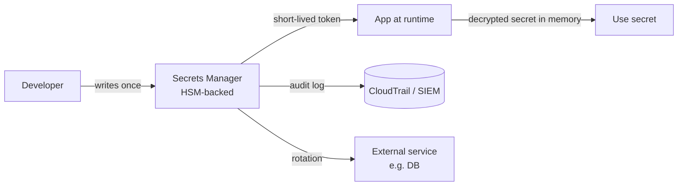

# Secrets Management (Vault, AWS KMS, Secrets Manager)

> **TL;DR** — A **secret** is anything whose disclosure compromises the system: database passwords, API keys, TLS private keys, signing keys, OAuth client secrets, SSH keys, encryption keys. A **secrets manager** is a centralized service that stores, distributes, audits, and rotates secrets so applications never store them in code, environment files, or container images. The leading tools are **HashiCorp Vault**, **AWS Secrets Manager / AWS KMS**, **GCP Secret Manager / Cloud KMS**, **Azure Key Vault**, and **Doppler/1Password**. The hard part isn't picking a tool — it's the **lifecycle**: who issues the secret, who fetches it, how is it rotated, what's audited, what happens when it leaks. Build for rotation from day one, never commit secrets to git, and use short-lived dynamic credentials where possible.

---

## 1. What Counts as a Secret

Anything in this list:

- Database connection strings and passwords.
- API keys (third-party services you call: Stripe, Twilio, SendGrid, OpenAI).
- API keys *you* issue to customers (less central, but still a secret).
- OAuth client secrets.
- TLS private keys.
- Signing keys (JWT, code signing, webhook HMAC).
- SSH private keys.
- Encryption keys (data encryption keys, root keys).
- Service-account credentials.
- Webhook signing secrets.
- Encryption peppers and tokens.

If a leak of the value forces you to rotate it and notify someone, it's a secret.

---

## 2. The Anti-Patterns to Eliminate

Almost every "we got hacked" postmortem mentions one of these:

| Anti-pattern | What's wrong |
| --- | --- |
| Secrets in source code | Visible to everyone with repo access, propagated through git history forever |
| Secrets in env files committed to git | Same as above |
| Secrets in container images | Anyone with the image (registry, CI logs) has them |
| Secrets in CI configuration files | Same |
| Secrets passed via long-lived env vars | Visible in `/proc`, sometimes core dumps |
| Secrets shared in Slack / email | Indexed forever, search-able by attackers |
| Secrets stored on developer laptops in plaintext | Stolen laptops = stolen prod access |
| One secret reused everywhere | Compromise = total compromise |
| No rotation | Old secrets outlive employees, contractors, vendors |
| No audit | "Who saw this?" — unanswerable |

The job of a secrets manager is to eliminate every one of these.

---

## 3. What a Secrets Manager Does



A real secrets manager provides:

1. **Encrypted storage** — values encrypted at rest with HSM-backed master keys.
2. **Access control** — IAM-policy or role-based access; least privilege.
3. **Audit logs** — every read/write logged, often to immutable storage.
4. **Rotation** — automated re-generation of secrets and propagation.
5. **Dynamic secrets** — credentials generated on-demand with short TTLs.
6. **Distribution mechanisms** — fetched at runtime via API, sidecar, or mounted file.
7. **Versioning** — old versions retrievable until purged.

---

## 4. The Major Tools

| Tool | Strengths | Caveats |
| --- | --- | --- |
| **HashiCorp Vault** | Mature, multi-cloud, dynamic secrets, transit/PKI engines | Operational overhead; HA & unseal complexity |
| **AWS Secrets Manager** | Tight IAM integration, rotation Lambdas for RDS/Redshift | AWS-only; per-secret cost |
| **AWS Systems Manager Parameter Store** | Cheaper than Secrets Manager for static config | Less powerful rotation |
| **AWS KMS** | The key-encryption-key store; HSM-backed | Encrypts keys, not arbitrary blobs (use with Secrets Manager) |
| **GCP Secret Manager** | Simple API, IAM-native | GCP-only |
| **Azure Key Vault** | Keys, secrets, certs in one place | Azure-only |
| **Doppler, 1Password Secrets Automation, Infisical** | Developer ergonomics, good DX | Vendor risk for enterprise data |
| **SOPS** (Mozilla) + KMS | Git-encrypted YAML/JSON | Works well for IaC; less ideal for app runtime |
| **Sealed Secrets** (Bitnami, K8s) | Encrypted secrets safe in git | K8s-only |
| **External Secrets Operator** | Glue: pull from any secrets manager into K8s Secrets | Adds an operator |

The right tool depends on your environment. If you're on AWS, start with Secrets Manager + KMS. If multi-cloud or hybrid, Vault. If you're a small team, Doppler/1Password.

---

## 5. KMS vs Secrets Manager — the Distinction

These often get conflated.

- **KMS** holds **cryptographic keys** (KEKs). You give it data, it returns ciphertext (or vice versa). It doesn't store arbitrary blobs.
- **Secrets Manager** holds **arbitrary secret values** (passwords, API keys, JSON). It uses KMS internally to encrypt those values at rest.

A typical AWS stack:

```
AWS KMS  ────►  protects data encryption keys + Secrets Manager's storage
  ↑
  used by
  ↓
Secrets Manager  ────►  stores app secrets (passwords, API keys)
  ↑
  used by
  ↓
Your app at runtime
```

For application code, you almost always interact with **Secrets Manager** (or Vault). KMS is the foundation underneath.

---

## 6. Dynamic vs Static Secrets

### Static secrets
A value stored, retrieved, used. Lifetime measured in months to years (with rotation).

### Dynamic secrets (the Vault model)
The secrets manager **generates** credentials on demand with a short TTL.

```
1. App requests a database credential from Vault.
2. Vault generates: user="vault-tmp-X", password="<random>", grants permissions.
3. Vault returns credentials + 1-hour TTL.
4. App uses them for the hour.
5. After TTL, Vault revokes the user (DROP USER) in the DB.
```

Benefits:
- Every app instance has its own credentials → identifiable in DB logs.
- Compromise has a 1-hour blast radius.
- No "rotation" needed — credentials never live long enough to need it.

Vault supports dynamic secrets for: most databases, SSH, cloud IAM, AD/LDAP, PKI certificates, RabbitMQ, MongoDB, MySQL, Postgres, etc.

This is the model to aim for. Static API keys for third parties remain unavoidable (Stripe doesn't issue dynamic keys), but for *internal* credentials, dynamic should be the default.

---

## 7. Workload Identity — Killing the "First Secret" Problem

The classic chicken-and-egg: your app needs a secret to authenticate to the secrets manager. Where does *that* secret come from?

**Workload identity** solves it:

| Platform | Mechanism |
| --- | --- |
| **AWS** | IAM roles for EC2 / ECS / Lambda / EKS; IRSA for K8s |
| **GCP** | Workload Identity for GKE; service accounts on Compute Engine |
| **Azure** | Managed Identities |
| **Kubernetes** | SPIFFE/SPIRE; service-account tokens |
| **CI/CD** | OIDC federation (GitHub Actions, GitLab CI → AWS/GCP/Vault) |

The platform attests to the workload's identity (signed JWT, metadata service, or mTLS), and the secrets manager trusts the platform. **No long-lived credentials anywhere in the app.**

GitHub Actions OIDC is the model:

```yaml
permissions:
  id-token: write   # GitHub mints an OIDC JWT for this job

- uses: aws-actions/configure-aws-credentials@v4
  with:
    role-to-assume: arn:aws:iam::123:role/github-deploy
    # → AWS verifies the OIDC token, returns short-lived AWS creds
```

The CI job ends, the credentials evaporate. No `AWS_ACCESS_KEY_ID` in repo secrets — there's nothing to leak.

---

## 8. Distribution Patterns

How does the secret actually get to the app?

| Pattern | Mechanism |
| --- | --- |
| **Env var at startup** | Init process fetches secret, sets `$DB_PASSWORD`, execs app |
| **Sidecar** | A sidecar container fetches and refreshes; app reads from shared volume / IPC |
| **Mutating webhook** | K8s injects secrets at pod create (Vault Agent Injector) |
| **SDK fetches at runtime** | App calls Secrets Manager directly with workload identity |
| **Files mounted from CSI** | Vault / AWS / GCP / Azure secret store CSI drivers mount secrets as files |
| **Encrypted in IaC** | SOPS-encrypted in git, decrypted at deploy time |

The sidecar / mounted-file patterns are most modern: the app sees a file, never reaches for the secrets manager directly. Vault Agent, External Secrets Operator, and CSI Secrets Store all implement this.

### Avoid: env vars from the manager's UI

Pasting a secret value into a Heroku/Vercel/Netlify env var via the dashboard is convenient but bad:
- Anyone with dashboard access has the secret.
- Rotation requires re-pasting.
- Audit is weak.

Use a secrets manager that pushes into the platform via API.

---

## 9. Rotation in Practice

Rotation isn't just "change the value." It's a multi-step coordinated operation:

1. **Generate** the new secret.
2. **Distribute** to consumers (deploys, sidecars, or live API fetch).
3. **Activate** at the external service (DB user re-issued, third-party key updated).
4. **Verify** old and new both work briefly (overlap window).
5. **Deactivate** the old.
6. **Log** the rotation event.

For DB credentials, AWS Secrets Manager's rotation Lambda handles this for RDS/Aurora. For third-party APIs, you write the rotator yourself.

The pattern that works:

- **Two secrets active at all times.** Apps always try v2; fall back to v1.
- **Rotate v1 → v3 next time.** Always have a stable and a new in flight.

Without two-active-at-once, every rotation requires a synchronized cutover — fragile and outage-prone.

### Rotation cadence

| Secret type | Cadence |
| --- | --- |
| Dynamic credentials | Hours |
| Service-to-service API keys | 30 days |
| Third-party API keys | 90 days |
| TLS certificates | 90 days (Let's Encrypt default; pushing to 47) |
| Root signing keys | Yearly, with key versioning |
| Encryption KEKs in KMS | Yearly automatic |

After any suspected leak: rotate immediately, no waiting.

---

## 10. Detection — When Secrets Leak (and They Do)

Secrets leak. The question is how fast you detect.

Layers:

- **Pre-commit hooks** — `git-secrets`, `gitleaks`, `trufflehog` scan diffs before commit.
- **Repository scanning** — GitHub secret scanning (free, default), GitGuardian, Doppler — scan every push.
- **Public scanning** — paid services scan GitHub gists, paste sites, npm packages, Docker Hub for your prefixed secrets.
- **Anomaly detection in audit logs** — unusual secret-fetch patterns, secrets fetched from unexpected IPs, off-hours access.
- **Provider-side scanning** — Stripe, AWS, OpenAI scan public sources for their key prefixes and proactively revoke. Use prefixed keys so this catches them.

Set up alerts. When a secret leaks, the rotation playbook should already exist.

---

## 11. Compliance / Governance Considerations

Mature programs treat secrets as a first-class asset:

- **Inventory.** A registry of every secret, its owner, its rotation policy.
- **Ownership.** Each secret has a team owner.
- **Least privilege.** IAM scopes secret access to the workloads that need it. Engineers can't read prod secrets routinely.
- **Break-glass access.** Emergency procedures with mandatory dual control and audit.
- **Audit retention.** Logs of secret access kept for ≥1 year (SOC 2, ISO 27001).
- **Separation of duties.** The person who writes the secret isn't the person who can read it from the manager.

---

## 12. Architectures, End to End

### Small SaaS on AWS
- AWS Secrets Manager (or Parameter Store for non-rotating config).
- KMS-encrypted at rest.
- EC2/ECS/Lambda use IAM roles; no long-lived AWS keys anywhere.
- Rotation via Secrets Manager rotation Lambda for RDS; manual for third parties.
- GitHub Actions → AWS via OIDC.

### Multi-cloud / hybrid enterprise
- HashiCorp Vault (HA cluster).
- Workload identity via JWT auth (Kubernetes, GitHub Actions, GCP, AWS).
- Dynamic secrets for databases, cloud IAM, SSH.
- Transit engine for encrypted-blob-as-a-service.
- PKI engine for internal CA.

### Kubernetes-native
- External Secrets Operator pulling from Vault / AWS / GCP into K8s Secrets.
- Or CSI Secrets Store driver mounting directly as files.
- Or Vault Agent Injector via mutating webhook.

### Local dev
- 1Password / Doppler CLI exporting secrets per-shell.
- Or `.env.local` with non-prod secrets only, gitignored.
- **Never** the same secrets as prod.

---

## 13. Common Mistakes / Anti-Patterns

- **Secrets in git history.** Even after deleting, they're there forever. Rotate immediately if discovered.
- **Hardcoded fallbacks** — `os.getenv("API_KEY") or "sk_test_..."`. The fallback ends up in production.
- **Same secret in dev, staging, prod.** A dev leak compromises prod.
- **Plaintext secrets in CI logs.** Mask in CI configs; check echoed values.
- **No rotation.** When a contractor leaves, secrets they touched still work.
- **One secret per service, used by many instances.** Hard to attribute leaks.
- **Reading secrets at every request.** Cache after fetch; refresh on TTL.
- **Mixing secret storage with config.** Feature flags are not secrets; database passwords are. Separate the tools.
- **Trusting cloud-provider IAM blindly.** Verify policies allow only the necessary secrets. `secretsmanager:GetSecretValue` on `*` is too broad.
- **No break-glass plan.** When the secrets manager itself fails, can you still operate?
- **Storing secrets in K8s Secrets without encryption-at-rest on etcd.** Plain Base64-encoded — anyone with etcd access reads them. Enable encryption-at-rest.
- **Stashing secrets in monitoring tags / Slack notifications.** Logs are forever.
- **Granting human engineers permanent read access to prod secrets.** Use just-in-time access with approval.
- **No alerting on secret access.** Suspicious activity goes unnoticed.

---

## 14. Cheat Card

```
SECRET = anything whose disclosure forces rotation.
         passwords, API keys, TLS keys, signing keys, OAuth secrets.

WHERE TO STORE
  AWS         Secrets Manager + KMS    |    Parameter Store for cheap config
  GCP         Secret Manager + Cloud KMS
  Azure       Key Vault
  Multi-cloud HashiCorp Vault
  Small team  Doppler / 1Password / Infisical
  K8s         External Secrets Operator OR CSI Secrets Store

NEVER
  in git, in container image, in CI logs, in Slack,
  in env vars copy-pasted to dashboards.

GET IT TO THE APP
  workload identity (IAM role / OIDC / SPIFFE) → fetch at runtime
  sidecar / CSI mount as files
  short-lived dynamic creds where possible

ROTATION
  static keys     30–90 d (immediately on suspicion)
  dynamic creds   hourly TTL via Vault
  two active at once → safe cutover
  audit every read

DETECT LEAKS
  gitleaks pre-commit · GitHub secret scanning · GitGuardian
  prefixed keys (sk_live_ etc.) make scanning effective
  alert on anomalous secret access

WORKLOAD IDENTITY > LONG-LIVED CREDS
  AWS IAM Roles, IRSA, GitHub OIDC, GCP Workload Identity, SPIFFE

RULE: code should never read a literal secret. It should ask a system for one.
```

---

## 15. Resources

### Documentation
- **HashiCorp Vault** — <https://developer.hashicorp.com/vault/docs>
- **AWS Secrets Manager** — <https://docs.aws.amazon.com/secretsmanager/>
- **GCP Secret Manager** — <https://cloud.google.com/secret-manager/docs>
- **Azure Key Vault** — <https://learn.microsoft.com/azure/key-vault/>
- **OWASP Secrets Management Cheat Sheet** — <https://cheatsheetseries.owasp.org/cheatsheets/Secrets_Management_Cheat_Sheet.html>
- **SPIFFE/SPIRE** — <https://spiffe.io/>

### Articles
- "Don't manage secrets, eliminate them" — HashiCorp blog (dynamic secrets philosophy).
- "Secret rotation at scale" — Snowflake / Lyft engineering blogs.
- "GitHub Actions OIDC with AWS" — GitHub docs.
- "Twelve-Factor App — Config" — <https://12factor.net/config>

### Videos
- HashiCorp — "Intro to Vault".
- AWS re:Invent — Secrets Manager and KMS deep dives.
- ByteByteGo — "Why your team needs a secrets manager".

### Tools
- **gitleaks, trufflehog, git-secrets** — scan repos.
- **SOPS** — encrypt secrets in YAML/JSON safely in git.
- **External Secrets Operator, Vault Agent Injector, CSI Secrets Store** — K8s integration.
- **GitGuardian, Doppler, Infisical, 1Password Secrets Automation** — managed secrets.

### Books
- *Building Secure and Reliable Systems* — Google. Strong secrets-management chapter.

### Adjacent reading
- [Encryption at Rest & In Transit →](./encryption.md)
- [Public-Key Cryptography Basics →](./pki.md)
- [API Keys, HMAC Signing →](./api-keys-hmac.md)
- [Zero Trust Architecture →](./zero-trust.md)
- [Authentication vs Authorization →](./authn-vs-authz.md)
- [Infrastructure as Code →](../15-deployment/iac.md)

---

*Previous:* [← Public-Key Cryptography Basics](./pki.md)  |  *Next:* [DDoS Protection & WAF →](./ddos-waf.md)
