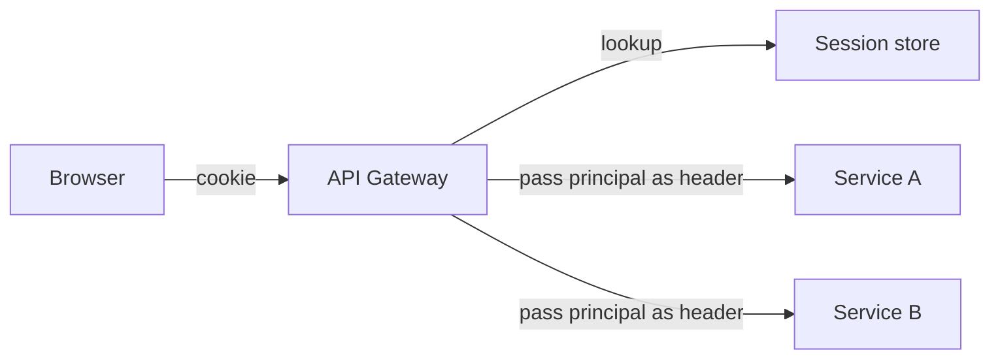

# Session-Based Authentication

> **TL;DR** — In **session-based authentication**, the server creates a session record on login, hands the client an opaque **session ID** (usually in a cookie), and looks up the session in a store (Redis, Postgres, Memcached) on every request. The session is server-side state; the cookie is just a pointer. This is the boring, dominant pattern for web applications — and it's almost always the right answer for browser-based logins. Sessions trade a tiny amount of state for **instant revocation, server-controlled expiry, and immunity to most JWT footguns**. Pair them with `HttpOnly`, `Secure`, `SameSite` cookies and CSRF protection.

---

## 1. The Idea

```mermaid
sequenceDiagram
    participant U as Browser
    participant A as App Server
    participant S as Session Store (Redis)

    U->>A: POST /login (email, password)
    A->>A: Verify bcrypt hash
    A->>S: SET sess:abc123 {user_id:42, ...} EX 86400
    A-->>U: Set-Cookie: sid=abc123;<br/>HttpOnly; Secure; SameSite=Lax

    U->>A: GET /dashboard<br/>Cookie: sid=abc123
    A->>S: GET sess:abc123
    S-->>A: { user_id: 42, ... }
    A-->>U: 200 + page
```

The cookie value `abc123` is a **random, unguessable string** — typically 128 bits of entropy or more. It carries no meaning on its own; all the real data lives in the session store keyed by that string.

This pattern has been used since the late 1990s and is still the default in Rails, Django, ASP.NET, Spring, Laravel, Express, Phoenix — every mainstream web framework.

---

## 2. Why Server-Side Sessions Beat JWTs for Web Logins

The "stateless JWT" hype convinced a generation of developers to abandon sessions. For most browser-based applications, this was a mistake.

| Concern | Server-side session | JWT in cookie/localStorage |
| --- | --- | --- |
| Instant logout | Delete the row | Wait for `exp` or maintain a denylist |
| Role/permission change takes effect | Immediately | At next token issuance |
| Token theft mitigation | Rotate ID on activity, invalidate on suspicion | Hard |
| Size on wire | ~30-byte cookie | 500–2000 bytes |
| Storage cost | One row per active user | None (claimed advantage) |
| Operational simplicity | Trivial | Key rotation, JWKS, audience checks |
| Cross-domain APIs | Awkward | Easy |

For a typical SaaS web app, **the cost of one Redis row per logged-in user is invisible**. Even at 10 million active sessions × 1 KB each = 10 GB — a tiny Redis instance. You get all the operational simplicity in return.

---

## 3. The Anatomy of a Secure Session Cookie

```
Set-Cookie: sid=2b6d4e7f1a8c9b5e3d7f2a1c4e8b9d3a;
            HttpOnly;
            Secure;
            SameSite=Lax;
            Path=/;
            Max-Age=86400;
            Domain=example.com
```

Every attribute matters:

| Attribute | Purpose |
| --- | --- |
| `HttpOnly` | JavaScript cannot read the cookie. XSS can't steal the session. |
| `Secure` | Only sent over HTTPS. No leaks via plaintext. |
| `SameSite=Lax` | Not sent on cross-site POST/AJAX. Mitigates CSRF. |
| `SameSite=Strict` | Even stricter. Breaks "follow a link to logged-in site." |
| `SameSite=None; Secure` | Needed for true cross-site contexts (third-party iframes, OAuth callbacks). |
| `Path` | Restricts which URLs receive the cookie. |
| `Domain` | Restricts to apex + subdomains. Default = exact host only — usually correct. |
| `Max-Age` / `Expires` | Absolute or relative expiry. Without these, cookie dies on browser close. |

**Default profile for a logged-in session cookie:**
`HttpOnly; Secure; SameSite=Lax; Path=/; Max-Age=…` — with `Domain` omitted unless you have explicit reasons to span subdomains.

### Cookie prefixes

Modern browsers honor two cookie name prefixes that prevent certain attacks:
- **`__Host-`** — must be `Secure`, no `Domain` attribute, `Path=/`. Locks the cookie to the exact host.
- **`__Secure-`** — must be `Secure`.

Prefer `__Host-sid` for session cookies in modern apps.

---

## 4. Session Storage Backends

| Store | Latency | Persistence | Best for |
| --- | --- | --- | --- |
| **Redis / Memcached** | <1 ms | RAM (Redis snapshots) | Default for most apps |
| **Postgres / MySQL** | 1–5 ms | Durable | When you already have a DB and traffic is moderate |
| **DynamoDB / Cosmos / Spanner** | 5–10 ms | Durable + replicated | Multi-region |
| **Signed cookies (no store)** | 0 ms | None (lives in cookie) | Tiny apps, ephemeral data |

The defaults at large companies:
- Most monoliths and small services → Redis.
- High-scale multi-region (GitHub, Shopify, Stripe) → Redis + sharded, sometimes with a fallback to a durable store.
- ASP.NET defaults → SQL Server; can swap.
- Express → `connect-redis`, `connect-pg-simple`.

**Signed cookie sessions** (Rails `cookies.signed`, Express `cookie-session`, Django signed cookies) store all the data in the cookie itself, signed with a server-side key. No store needed, but you lose instant revocation — the cookie is valid until expiry. It's a halfway-house between sessions and JWTs.

---

## 5. The Login Flow

```
1. User submits email + password (HTTPS).
2. Server fetches user by email, verifies bcrypt/Argon2 hash.
3. (Optional) MFA prompt.
4. Server creates session:
     - Generates random 128-bit session ID.
     - Writes { user_id, created_at, ip, ua, csrf_token } to store with TTL.
5. Server sets cookie: __Host-sid=<id>; HttpOnly; Secure; SameSite=Lax.
6. Server redirects to / dashboard.
```

Every subsequent request:

```
1. Read cookie → session ID.
2. Look up session in store.
   - Missing/expired → 401, redirect to /login.
3. (Optional) Verify session metadata (IP, UA) matches.
4. Touch session (extend TTL on activity).
5. Run authorization checks.
6. Handle request.
```

The handler sees a **typed Principal**, not a raw cookie. The session lookup happens once per request, usually in middleware.

---

## 6. Session Expiry

Two clocks every session needs:

- **Absolute timeout** — the session dies N hours/days after creation, no matter what. Typical: 24 hours for normal apps, 12 hours for sensitive, 30 days for "remember me."
- **Idle timeout** — the session dies after N minutes without activity. Typical: 15–30 min for banking, 24h for SaaS.

In Redis: idle timeout is `EXPIRE` reset on each request. Absolute timeout is checked manually by comparing `created_at`.

**Sensitive operations should require re-auth**: changing password, viewing billing, deleting account. Even if the session is valid, prompt for the password (or step-up MFA). This is called **step-up authentication**.

---

## 7. Session Fixation, Hijacking, and Theft

The three classic session attacks:

### Session fixation
Attacker sets a known session ID into the victim's browser before login. After the victim logs in, the attacker uses the same ID.
**Fix:** **always rotate the session ID on login** (and on privilege change). Generate a new ID, copy any needed state, delete the old.

### Session hijacking (theft)
Attacker steals the session cookie via XSS, network sniffing, or a logged URL.
**Fixes:**
- `HttpOnly` — defeats XSS theft.
- `Secure` + HSTS — defeats network sniffing.
- Don't put session IDs in URLs (no `?sid=…`) — they leak via Referer, logs, analytics.

### Session prediction
Session IDs guessable due to weak randomness.
**Fix:** use a cryptographic RNG (`crypto/rand`, `secrets.token_urlsafe(32)`, `crypto.randomBytes(32)`). 128 bits of entropy minimum.

### CSRF (cross-site request forgery)
Attacker tricks the victim's browser into making an authenticated request to your site. Browser sends the session cookie automatically.
**Fixes:**
- `SameSite=Lax` blocks most cross-site POSTs.
- **CSRF tokens** — a random value bound to the session, included as a form field or header on state-changing requests, verified server-side.
- For APIs accessed by SPAs, use the **double-submit cookie** pattern or require a custom header (`X-CSRF-Token`) — browsers don't send custom headers cross-site without CORS preflight.

See [CORS, CSRF, Same-Origin Policy →](../02-networking/cors-csrf.md).

---

## 8. Logout — Done Right

```
POST /logout
  → delete session row in store
  → Set-Cookie: __Host-sid=; Max-Age=0; HttpOnly; Secure; SameSite=Lax
  → redirect to /
```

**Don't** just clear the cookie client-side — the session is still valid server-side. Delete the row in the store.

For "log out everywhere," delete **all** sessions for that user:

```sql
DELETE FROM sessions WHERE user_id = $1;
```

Or in Redis: maintain a `user:42:sessions` set with all session IDs and delete them on logout-all.

---

## 9. Sessions in Microservices

If your services share an auth service, the typical pattern:



The gateway resolves the session to a Principal (`X-User-Id: 42`, `X-Org-Id: 7`, signed) and downstream services trust the gateway's attestation. This keeps sessions out of every service while preserving instant revocation.

Some teams pair this with internal JWTs: the gateway mints a short-lived JWT from the session, services verify the JWT. Best of both worlds — instant revocation at the edge, statelessness internally.

---

## 10. When Sessions Don't Fit

Use something else when:
- **Native mobile or desktop apps** that can't use cookies cleanly. (OAuth + refresh tokens are common.)
- **Cross-domain federated identity** — different apps, different domains, central IdP. Use OIDC.
- **Fully stateless edge functions** — Lambda@Edge, Cloudflare Workers — where every cold start hitting a session store is expensive. JWTs may be better; or accept the session-store hop.
- **APIs consumed by third-party developers.** Use OAuth bearer tokens, not cookies.

But for "user logs into my web app and uses it," sessions are the default. The reflex "we'll use JWTs because they're stateless" is a 2015 trend that aged poorly.

---

## 11. Common Mistakes / Anti-Patterns

- **No `HttpOnly` on the session cookie.** XSS → instant session theft.
- **Missing `Secure` flag.** Cookie leaks over HTTP, MITM-friendly.
- **No `SameSite` or `SameSite=None` without need.** Open CSRF.
- **Predictable session IDs.** Sequential integers, low-entropy UUIDs. Use 128+ bits from a CSPRNG.
- **Not rotating session ID on login.** Vulnerable to fixation.
- **Session IDs in URLs.** Leak via Referer, server logs, analytics, browser history.
- **No expiry.** Sessions live forever. Set both idle and absolute timeouts.
- **Not invalidating on password change.** Old sessions remain valid after the password is reset.
- **Storing sensitive data in signed cookies.** Visible to users (only signed, not encrypted).
- **Forgetting CSRF.** Cookies are sent automatically; mutating endpoints need a token check.
- **Database in the hot path with no caching.** A Postgres lookup per request scales until it doesn't. Use Redis or add a request-scoped cache.
- **One session per user enforced poorly.** Users have multiple devices. Track sessions per user (list view) rather than forcing single-session.
- **Sticky sessions instead of shared store.** Couples users to specific app instances and breaks horizontal scaling. Use a shared session store. See [Sticky Sessions →](../06-load-balancing/sticky-sessions.md).

---

## 12. Cheat Card

```
SESSION = random ID in a cookie ↔ server-side record

COOKIE PROFILE
  __Host-sid=<128-bit-random>;
  HttpOnly; Secure; SameSite=Lax; Path=/; Max-Age=…

STORE      Redis (default).   Postgres if you have to.   Signed cookies for tiny apps.

LIFECYCLE
  login   → new ID + new record (ROTATE!)
  active  → touch (refresh TTL)
  logout  → delete record + clear cookie
  pwd chg → invalidate ALL sessions for that user

TIMEOUTS   idle 15–30 min  |  absolute 12–24 h  |  remember-me ≤ 30 d

ATTACKS    fixation → rotate ID on login
           hijack   → HttpOnly + Secure + HSTS
           predict  → CSPRNG, ≥128 bits
           CSRF     → SameSite + CSRF token

RULE: if you have a browser-based login and a Redis, use sessions. Don't reach for JWT.
```

---

## 13. Resources

### Books
- *Web Application Security* — Andrew Hoffman. Sessions, cookies, CSRF, XSS — all the basics done right.
- *The Tangled Web* — Michal Zalewski. Cookie and same-origin internals.

### Documentation
- **OWASP Session Management Cheat Sheet** — <https://cheatsheetseries.owasp.org/cheatsheets/Session_Management_Cheat_Sheet.html>
- **MDN — HTTP cookies** — <https://developer.mozilla.org/en-US/docs/Web/HTTP/Cookies>
- **RFC 6265bis** — HTTP State Management Mechanism (current cookie spec).

### Articles
- "Cookies have always been a bad idea" — Eevee.
- "Stop using JWT for sessions" — Sven Slootweg.
- "Cookies vs Tokens" — Auth0 (the practical comparison).

### Videos
- ByteByteGo — "Session vs JWT".
- OktaDev — sessions/cookies explainer.

### Tools
- **express-session** + **connect-redis** (Node).
- **Django's** built-in session framework.
- **Rails** sessions (cookies, ActiveRecord, or Redis).
- **Iron Session** (Node) — signed cookies for serverless.

### Adjacent reading
- [JWT — JSON Web Tokens →](./jwt.md)
- [OAuth 2.0 & OpenID Connect →](./oauth-oidc.md)
- [CORS, CSRF, Same-Origin Policy →](../02-networking/cors-csrf.md)
- [Sticky Sessions →](../06-load-balancing/sticky-sessions.md)
- [Hashing, Salting, Password Storage →](./password-storage.md)
- [OWASP Top 10 →](./owasp-top-10.md)

---

*Previous:* [← JWT — JSON Web Tokens](./jwt.md)  |  *Next:* [SSO — Single Sign-On →](./sso.md)
