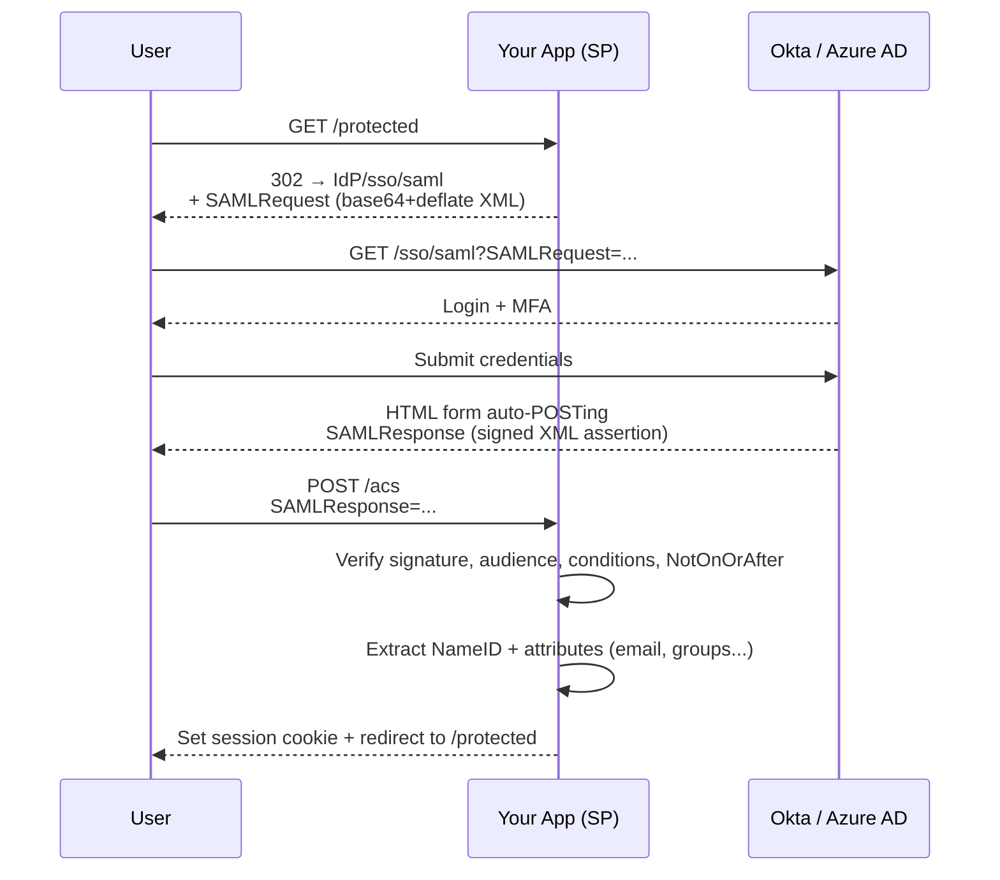
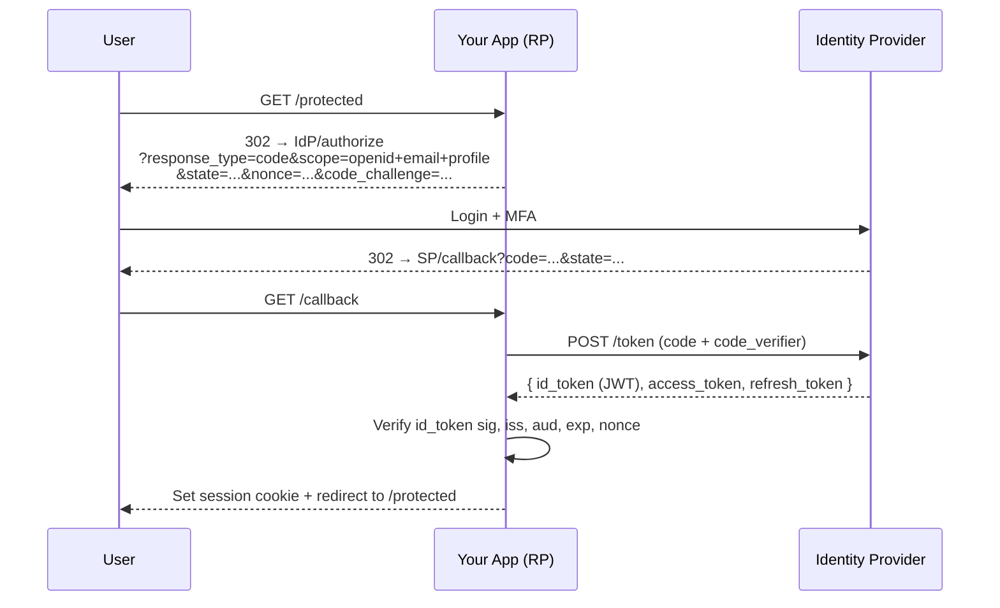

# SSO — Single Sign-On (SAML, OIDC)

> **TL;DR** — **Single Sign-On (SSO)** lets a user authenticate once at a central **Identity Provider (IdP)** and then access many **Service Providers (SPs)** without logging in again. The two protocols that matter are **SAML 2.0** (XML, dominant in enterprise, mandatory for many B2B contracts) and **OpenID Connect** (JSON/JWT-based, modern, friendlier for developers). SSO is not just a convenience feature — for B2B SaaS it's a *table-stakes* requirement to sell to mid-market and enterprise. Build for both protocols, use a vendor (Auth0, Okta, WorkOS, JumpCloud, Keycloak) instead of rolling your own, and design around **just-in-time provisioning, group sync, and SCIM**.

---

## 1. The Problem SSO Solves

Without SSO:
- Every app has its own login.
- Users have one password per app — they reuse the same password, or store them in spreadsheets, or forget.
- IT can't quickly disable a leaving employee across 60 apps.
- Each app has its own MFA, lockout policies, audit trails.
- Compliance is a nightmare.

With SSO:
- The IdP holds identity. Apps trust the IdP.
- User logs in once per day at the IdP; downstream apps issue sessions automatically.
- Disabling the user at the IdP cuts off all apps.
- MFA, password policy, lifecycle — owned by the IdP.

For enterprise IT, SSO is the foundation of **Identity and Access Management (IAM)**.

---

## 2. The Actors

```
┌─────────────────┐         ┌─────────────────┐
│   Identity      │  trust  │  Service        │
│   Provider      │ ◄─────► │  Provider       │
│   (IdP)         │         │  (SP / RP)      │
│   Okta, Azure AD│         │  Your app       │
└─────────────────┘         └─────────────────┘
        ▲                            ▲
        │                            │
        └────── User Browser ────────┘
```

- **IdP** — owns authentication. Stores user database (or federates further to AD/LDAP). Issues assertions/tokens. Common: Okta, Azure AD/Entra ID, Google Workspace, OneLogin, Ping, JumpCloud, Auth0, Keycloak.
- **SP** (SAML) / **Relying Party** (OIDC) — your app. Trusts the IdP's assertions.
- **User** — the human being SSO'd.

The **trust relationship** is configured ahead of time:
- For SAML: exchange XML metadata (certificates, URLs, entity IDs).
- For OIDC: register your app at the IdP, receive `client_id` / `client_secret`; the IdP publishes its config at `/.well-known/openid-configuration`.

---

## 3. SAML 2.0 — Enterprise SSO

SAML is XML-based, from 2005. It's verbose, awkward to debug, and exactly what enterprise procurement departments demand. If you sell B2B, you support SAML.

### The Web SSO flow (SP-initiated, the common case)



Key elements:
- **AuthnRequest** — what the SP sends to the IdP.
- **Assertion** — the signed XML payload from the IdP saying "this user is authenticated, here are their attributes."
- **ACS (Assertion Consumer Service)** — the SP endpoint that receives the response.
- **NameID** — the user identifier. Format matters: `email`, `persistent`, `transient`.
- **Attribute statements** — name, email, groups, department, employee ID — whatever the IdP chooses to release.
- **Signing** — the assertion is XML-DSig signed by the IdP's private key. The SP verifies with the IdP's certificate (pre-shared via metadata).

### Bindings

How the SAML message is transported:
- **HTTP-Redirect** — request goes via URL parameters (deflated + base64). Used for `AuthnRequest`.
- **HTTP-POST** — message in a hidden form, auto-submitted via JS. Used for `Response` (too big for URLs).
- **HTTP-Artifact** — back-channel fetch (less common).

### IdP-initiated vs SP-initiated

- **SP-initiated:** user starts at the app, gets bounced to the IdP. **Preferred.**
- **IdP-initiated:** user starts at a portal (Okta dashboard), clicks the app tile. Works but is more vulnerable to certain replay/CSRF attacks; many security pros recommend disabling it.

### What goes wrong with SAML

- **XML signature wrapping (XSW) attacks** — attacker rearranges XML so the signature covers attacker-controlled elements. Your library must be modern.
- **Clock skew** — assertions have `NotBefore` / `NotOnOrAfter` valid for a few minutes. Synchronize clocks (NTP).
- **NameID format mismatch** — IdP sends `transient` ID changing every login. You can't link the user to their record. Configure the IdP to send `persistent` or `email`.
- **Misconfigured ACS URL** — typos and `http` vs `https` cost hours.
- **No `wantAssertionsSigned` enforcement** — accepting unsigned assertions = forging logins.

SAML is fiddly. Use a maintained library: `python3-saml`, `passport-saml`, `Spring Security SAML`, or a vendor like WorkOS, BoxyHQ SAML Jackson.

---

## 4. OIDC for SSO

OIDC (OpenID Connect) is OAuth 2.0 + an ID token, covered in detail in [OAuth 2.0 & OpenID Connect →](./oauth-oidc.md). For SSO purposes:



This is the same flow you'd use for any user login — for SSO, the IdP is enterprise-managed (Okta, Azure AD/Entra) rather than Google/Facebook.

### When to use OIDC vs SAML for B2B SSO

| | SAML | OIDC |
| --- | --- | --- |
| Enterprise IT familiarity | High (everyone has it) | Growing |
| Developer ergonomics | Painful (XML, signing) | Great (JSON, JWT) |
| Mobile/SPA support | Awkward | Native |
| Modern IdPs | All support | All support |
| Legacy IdPs (older ADFS) | Required | Sometimes missing |

**Practical answer:** support both. Many enterprises will only configure SAML. Some new ones prefer OIDC. Vendors like WorkOS and BoxyHQ exist primarily to unify these so you can write one integration.

---

## 5. JIT Provisioning and SCIM

SSO authenticates. It doesn't fully solve **lifecycle**: when an admin adds a new user in Okta, do they automatically get a seat in your app? When they're deactivated?

Two patterns:

### Just-in-Time (JIT) provisioning
First time a user SSOs in, your app creates their account from the assertion's attributes. Easy. Default for many SaaS apps.

Downsides: deactivation doesn't propagate (the user is just "unable to log in" rather than removed); group/role sync happens only at login.

### SCIM (System for Cross-domain Identity Management)
A REST API your app exposes so the IdP can push users and groups: create, update, deactivate. The IdP calls your `/scim/v2/Users` endpoints when admins change anything.

- Standard: RFC 7643 (schema), RFC 7644 (protocol).
- Reality: every IdP implements it slightly differently. Auth0, Okta, Azure AD each have quirks.

**Rule of thumb:** offer SSO at the Pro/Enterprise tier; offer SCIM at Enterprise only. Buyers will ask for both.

---

## 6. Session Lifecycle Across IdP + SP

Two sessions exist after SSO:
1. **IdP session** — at Okta/Azure. Lifespan ≈ 8–24 hours.
2. **SP session** — at your app. Lifespan independent.

Implications:
- A user can be logged out at the IdP but still active in your app until the SP session expires. This is expected.
- For **forced re-auth**, the SP can send `prompt=login` (OIDC) or `ForceAuthn=true` (SAML).
- For **logout**, **Single Logout (SLO)** specs exist but are notoriously unreliable. In practice, most teams accept "log me out of this app" being separate from "log me out of every app." A logout button at the IdP plus short SP sessions is a pragmatic compromise.

---

## 7. Multi-Tenant SSO at Scale

A B2B SaaS supports many customer companies, each with their own IdP.

```
Acme Corp → Okta (configured for app.example.com/sso/acme)
Initech    → Azure AD (configured for app.example.com/sso/initech)
Globex     → OneLogin
```

Two routing strategies:

### Per-tenant URL
Each customer has a subdomain or path: `acme.example.com` or `example.com/o/acme`. The path tells you which IdP to redirect to.

### Email domain → tenant
User types `alice@acme.com` → look up the email domain → find Acme's IdP config → bounce. Used by Slack, Notion, Figma, GitHub.

The email-domain pattern is more user-friendly but requires you to verify domain ownership (DNS TXT record) before enabling SSO for a domain. This prevents "someone signs up alice@acme.com personally, then later Acme buys SSO, claims the domain, and inherits the user's account."

---

## 8. Building It Yourself vs Using a Vendor

For a startup, building SSO from scratch is a 2–6 month detour for one engineer. Choices:

| Option | Pros | Cons |
| --- | --- | --- |
| **Self-hosted Keycloak / Authentik** | Free, full control | Operational burden, security responsibility on you |
| **Auth0, Okta CIC, Cognito** | Best-in-class, easy | $$$ at scale, vendor lock |
| **WorkOS, BoxyHQ, Stytch** | Specifically built for B2B SSO/SCIM | Less general than Auth0 |
| **In-house SAML/OIDC libraries** | Educational | Foot-guns galore |

**Recommendation:** unless identity is your core competency, use a vendor. Even Stripe — who run their own everything — outsource enterprise SAML to a managed layer.

---

## 9. A B2B SaaS Login Flow With SSO

```
User visits app.example.com/login
  → enters email alice@acme.com
  → backend: check domain "acme.com" → SSO-enabled, IdP = Okta
  → 302 to Okta SAML/OIDC flow
  → user authenticates at Okta (with MFA)
  → returns to app, app creates session
  → app provisions user (JIT) or finds existing record (SCIM-managed)
  → app assigns role from group claim (e.g. "Engineering" → role=member)
  → user lands on dashboard
```

Without SSO config for that domain, the flow falls back to password login.

---

## 10. Common Mistakes / Anti-Patterns

- **Treating SSO as optional forever.** B2B procurement will hit you the day a Fortune 500 wants to buy. Build the abstraction early; flip it on per tenant.
- **Hardcoding a single IdP.** You'll have N customers and N IdPs. Make IdP config a per-tenant record.
- **Trusting unsigned SAML assertions.** Configure `wantAssertionsSigned`/`wantResponseSigned=true`. Reject anything else.
- **Skipping audience/issuer checks.** A signed assertion meant for app A replayed against app B.
- **Charging only the smallest tier for SSO.** ("SSO tax" is contentious but real — many devs argue SSO should be standard. Reasonable middle ground: SSO at Pro, SCIM at Enterprise.)
- **No domain verification before enabling SSO.** Attackers claim email domains they don't own and SSO-takeover existing accounts.
- **Storing the IdP's private signing key.** You only ever store **public** keys/certificates from the IdP. Same direction for your own keys: you publish the public part.
- **Forgetting clock sync.** SAML assertions are valid for ~5 minutes. NTP-skew across regions silently breaks logins.
- **Building Single Logout naively.** SLO is unreliable across IdPs; build expectations accordingly.
- **Mixing IdP-initiated SSO with sensitive defaults.** IdP-initiated flows are more exposed to certain attacks — restrict or disable when you can.
- **Tying authorization to SAML group attributes without sync.** Group memberships from an old assertion can be stale by hours.

---

## 11. Cheat Card

```
SSO    one login → many apps.    Required for B2B SaaS.

PROTOCOLS
  SAML 2.0   XML, enterprise, mandatory   ACS URL + signed assertion
  OIDC       JSON/JWT, modern              redirect_uri + id_token

ACTORS
  IdP   Okta · Azure AD · Google · Auth0 · Keycloak
  SP    your app
  Trust pre-shared cert/metadata (SAML) or client_id+JWKS (OIDC)

FLOW (SP-initiated)
  user → SP redirects → IdP login+MFA → IdP returns signed assertion/token
       → SP verifies (sig, iss, aud, exp, audience, NotOnOrAfter) → session

LIFECYCLE
  JIT   create user on first login
  SCIM  IdP pushes users/groups via REST (RFC 7644)

TENANT ROUTING
  per-tenant URL  or  email-domain → IdP map (verify ownership!)

KEY CHECKS
  signature · issuer · audience · NotBefore/NotOnOrAfter · nonce (OIDC)

RULE: don't write SAML by hand. Use a vendor or a maintained library.
```

---

## 12. Resources

### Books
- *Solving Identity Management in Modern Applications* — Yvonne Wilson & Abhishek Hingnikar.
- *Modern Authentication with Azure Active Directory for Web Applications* — Vittorio Bertocci.

### Documentation
- **SAML 2.0 Technical Overview** — <https://docs.oasis-open.org/security/saml/Post2.0/sstc-saml-tech-overview-2.0.html>
- **OpenID Connect Core 1.0** — <https://openid.net/specs/openid-connect-core-1_0.html>
- **SCIM 2.0** — RFC 7643 / RFC 7644.
- **OWASP SAML Security Cheat Sheet** — <https://cheatsheetseries.owasp.org/cheatsheets/SAML_Security_Cheat_Sheet.html>

### Articles
- "The SSO Wall of Shame" — <https://sso.tax/> — pricing critique.
- "WorkOS SSO Guide" — comprehensive vendor-neutral overview.
- "What is SAML?" — Cloudflare Learning Center.

### Videos
- OktaDev — SAML and OIDC deep dives.
- ByteByteGo — "How SSO works".

### Tools
- **WorkOS, BoxyHQ SAML Jackson, Stytch B2B** — B2B SSO unification.
- **SAML Tracer** (Firefox extension) — debug SAML flows in the browser.
- **samltool.com** — decode/validate SAML.
- **jwt.io** — decode OIDC ID tokens.
- **Keycloak / Authentik** — self-hosted IdPs.

### Adjacent reading
- [OAuth 2.0 & OpenID Connect →](./oauth-oidc.md)
- [JWT — JSON Web Tokens →](./jwt.md)
- [Session-Based Authentication →](./sessions.md)
- [Authentication vs Authorization →](./authn-vs-authz.md)
- [RBAC, ABAC, ReBAC →](./access-control.md)
- [Multi-Tenant SaaS Architecture →](../19-advanced/multi-tenant-saas.md)

---

*Previous:* [← Session-Based Authentication](./sessions.md)  |  *Next:* [API Keys, HMAC Signing →](./api-keys-hmac.md)
