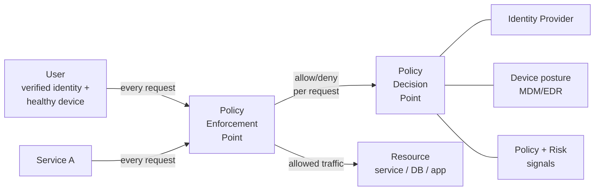
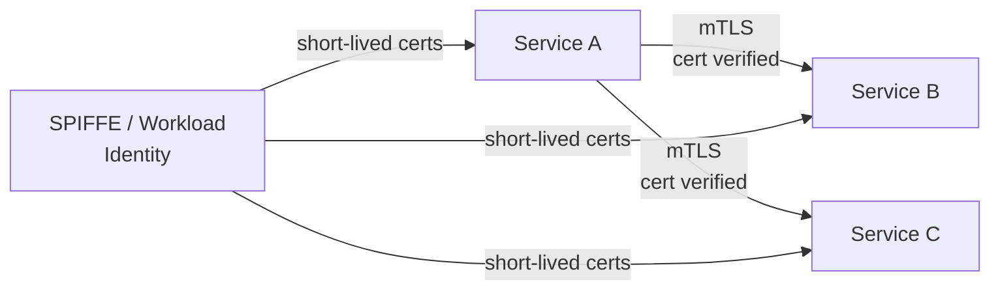

# Zero Trust Architecture

> **TL;DR** — **Zero Trust** is the security model that replaces the old "trusted internal network" with **never trust, always verify**. Every request, internal or external, is authenticated, authorized, and encrypted — based on the identity of the workload or user, not the network location. The classic perimeter model (firewall around the data center, anything inside is trusted) was destroyed by cloud, mobile, microservices, and supply-chain attacks. Zero Trust replaces it with: identity-based access on every call, short-lived credentials, mTLS between services, contextual policies, and rich telemetry. Google's **BeyondCorp**, NIST **SP 800-207**, and CISA's **Zero Trust Maturity Model** are the canonical references. In practice it shows up as: SSO+MFA everywhere, mTLS via service mesh, IAM-driven access to cloud resources, and continuous verification rather than one-time login.

---

## 1. The Old Model and Why It Broke

For thirty years, network security looked like a castle:

```
                                ┌──────────────────────┐
                                │  Trusted internal    │
                                │  network             │
                                │                      │
   Internet ───► Firewall ────► │  Anything inside is  │
   (untrusted)                  │  trusted             │
                                └──────────────────────┘
```

The promises:
- A strong perimeter (firewalls, DMZs, NAT) keeps attackers out.
- Inside the perimeter, services trust each other.
- VPN bridges remote users into the trusted zone.

The problems by ~2015:
- **Cloud.** "Inside the network" stopped meaning anything when half the services are SaaS.
- **Microservices.** Hundreds of services calling each other. A breach of one = breach of all if they trust each other implicitly.
- **Remote work.** Everyone's a VPN'd user; the perimeter is everywhere.
- **Supply chain.** SolarWinds, npm packages, container images. Trusted code wasn't trustworthy.
- **Phishing.** Once an internal user is phished, the attacker is "inside the perimeter" and everything is open.

The fundamental observation: **network location is a terrible identity signal.** "On the VPN" doesn't mean "should be allowed to read the production DB."

---

## 2. The Zero Trust Core Principles

NIST SP 800-207 boils it down:

1. **Every asset and service is a resource.** All access decisions apply.
2. **All communication is secured regardless of network location.** TLS or mTLS always. No "we're inside, we don't need encryption."
3. **Access to individual resources is granted on a per-session basis.** Authentication once doesn't mean access forever.
4. **Access is determined by dynamic policy.** Not just identity — also device posture, time, location, behavior.
5. **The enterprise monitors and measures integrity and security posture continuously.**
6. **All resource authentication and authorization are dynamic and strictly enforced before access is allowed.**
7. **The enterprise collects information about the current state of assets, network, communications, and uses it to improve security posture.**

In one sentence: **stop trusting the network; start trusting strong, fresh identities under continuous evaluation.**

---

## 3. The Architecture



The components:

| Component | What it does |
| --- | --- |
| **Identity provider (IdP)** | Authenticates users and services (Okta, Azure AD, AWS IAM, Vault) |
| **Device trust / posture** | Verifies the device (MDM-managed, EDR healthy, OS patched) |
| **Policy Decision Point (PDP)** | Evaluates whether to allow a request, based on identity + context + policy |
| **Policy Enforcement Point (PEP)** | Blocks or allows the actual request — typically a proxy, sidecar, or service mesh |
| **Telemetry / SIEM** | Logs everything; feeds risk signals |

The **PEP–PDP split** mirrors the AuthZ model in [RBAC, ABAC, ReBAC →](./access-control.md). It's the same architecture applied to all access, not just app-level.

---

## 4. Zero Trust for Users (Workforce / BeyondCorp)

Google published **BeyondCorp** (2014, 2017) — the first widely-publicized Zero Trust deployment. The shift:

| Before | After (BeyondCorp) |
| --- | --- |
| VPN gates access | No VPN needed |
| Trust based on IP | Trust based on identity + device |
| All-or-nothing access | Per-app access with policy |
| Login once, trusted forever | Continuous verification |

Architecture:
1. User signs into the IdP (SSO + MFA).
2. Device is enrolled (MDM tracks state).
3. User accesses an internal app via a public URL.
4. Access proxy intercepts; checks identity + device posture + policy.
5. Allowed → forwards request. Denied → block.

This is now packaged as **Zero Trust Network Access (ZTNA)** products: Cloudflare Access, Google BeyondCorp Enterprise, Zscaler Private Access, Tailscale, Twingate, Netskope. They replace VPNs for most use cases.

---

## 5. Zero Trust for Services (mTLS Everywhere)

Inside a microservices system, ZT means **every internal call is mutually authenticated and encrypted**.



The pattern:
- Every workload has a **cryptographic identity** (X.509 cert, SPIFFE ID).
- Certs are issued by an internal CA (Vault PKI / smallstep / cert-manager) with short TTLs (hours).
- Service mesh (Istio, Linkerd, Consul Connect) enforces mTLS automatically — apps don't write TLS code.
- Authorization policies declare which service can call which:

```yaml
# Istio AuthorizationPolicy
spec:
  selector: { matchLabels: { app: payments } }
  rules:
  - from: [{ source: { principals: ["cluster.local/ns/billing/sa/billing-api"] } }]
    to: [{ operation: { methods: ["POST"], paths: ["/charge"] } }]
```

Result: even if an attacker pwns one pod, they can't call arbitrary services — they're cryptographically constrained to whatever the policy allows.

This is **the** modern alternative to "network policies = security." Network policies (calico, K8s NetworkPolicy) are useful as defense-in-depth, but mTLS is the primary control.

---

## 6. Zero Trust for Data / Cloud Resources

In cloud:
- **IAM as the security boundary.** Everything is an IAM-authenticated call. No "trusted account" with broad access.
- **Workload identity** rather than long-lived API keys (IRSA on EKS, IAM Roles for EC2, GCP Workload Identity).
- **Short-lived credentials** via STS / token exchange.
- **Least privilege per role.** Per-resource policies. Tags + ABAC to scale policy without role explosion.
- **Continuous policy validation** (AWS Config, GCP Forseti, custom OPA gatekeepers in CI).
- **Audit logging** of every API call (CloudTrail, Cloud Audit Logs).

Anything in the cloud that says "anyone in account X can do Y" is anti-pattern. Even your own account isn't trusted; specific identities are.

---

## 7. Context-Aware Policy

Zero Trust elevates decision inputs beyond "who is the user."

```
allow if
  user.identity == Authenticated AND
  user.role contains "engineer" AND
  device.trust == "managed" AND
  device.posture.osPatched AND
  device.posture.diskEncrypted AND
  request.location not in HighRiskCountries AND
  request.time within BusinessHours AND
  recentMfa(user, 1h) AND
  resource.classification <= user.clearance
```

These are ABAC rules ([RBAC, ABAC, ReBAC →](./access-control.md)) applied to the access-layer instead of inside apps. Risk-based policies are dynamic — a new device or unusual location triggers step-up MFA or denies access.

This is where products like Okta Identity Engine, Microsoft Conditional Access, Cloudflare Access, and Google BeyondCorp Enterprise differentiate.

---

## 8. The Maturity Model

CISA publishes a **Zero Trust Maturity Model** with five pillars and four stages.

Pillars:

| Pillar | What |
| --- | --- |
| **Identity** | Users and services authenticated strongly |
| **Devices** | Endpoint trust, EDR, posture checks |
| **Networks** | Microsegmentation, encryption |
| **Applications & workloads** | Continuous auth, secure development |
| **Data** | Encryption, classification, DLP |

Stages: **Traditional → Initial → Advanced → Optimal**. Most enterprises in 2026 are at *Initial* or *Advanced* — full *Optimal* requires deep automation.

For most teams, the practical roadmap:

1. **SSO + MFA for all user access** (workforce IdP, mandatory MFA, ideally passkeys).
2. **MDM and EDR** on all employee devices.
3. **ZTNA** replacing VPN for remote access to internal apps.
4. **Workload identity + mTLS** for service-to-service.
5. **Centralized policy** (OPA, Cedar) for application AuthZ.
6. **Cloud IAM hardening** — no long-lived keys, scoped roles.
7. **Continuous monitoring** — SIEM, audit logs, anomaly detection.
8. **Risk-based / conditional access** for sensitive resources.

Don't try to do all at once. Pick one pillar, get to *Advanced*, move on.

---

## 9. The Things Zero Trust Is Not

- **Not a product.** Many vendors sell "Zero Trust Suites." It's an architecture; products implement pieces.
- **Not VPN replacement only.** ZTNA replaces VPN but is a fraction of ZT.
- **Not no-firewall.** Firewalls and network segmentation are still useful as defense-in-depth.
- **Not "every request is fully reverified from scratch."** Caching tokens and decisions for minutes is fine.
- **Not anti-microservices.** Done well it makes microservices safer.
- **Not free.** Operating mTLS, MDM, IdP, ZTNA, SIEM all costs money and people.

---

## 10. Real-World Examples

| Company | Notable ZT moves |
| --- | --- |
| **Google** | BeyondCorp (2014) — eliminated VPN for employees, identity+device-driven access |
| **Cloudflare** | Cloudflare Access — productized BeyondCorp for the rest of us |
| **Netflix** | Strong workload identity (Bless for SSH, Lemur for certs), no-trust internal network |
| **Microsoft** | Conditional Access, Azure AD; "Assume Breach" mantra |
| **U.S. Federal Government** | Executive Order 14028 mandates Zero Trust |
| **Apple** | Internal ZT for corporate apps; BeyondCorp-style |

---

## 11. A Worked Walkthrough

**Scenario:** Alice, a Cloudflare engineer, accesses an internal dashboard from a coffee shop on her laptop.

1. Alice opens `internal.cloudflare.com/dash`.
2. DNS resolves to Cloudflare Access' public anycast IP, not a private network.
3. Cloudflare Access checks her cookie. Not signed in → bounce to Okta.
4. Okta requires SSO + WebAuthn (passkey on her YubiKey). Passes.
5. Cloudflare Access checks device posture: laptop must be MDM-enrolled, OS patched within 30 days, disk encrypted. Pass.
6. Access policy: "engineers in group dash-users can access this app from any location." Pass.
7. Cloudflare Access mints a short-lived signed JWT, sets cookie.
8. Alice's request is proxied to the origin (cloudflare's internal network) with the JWT and `X-Authenticated-User` header.
9. The origin app trusts only requests from Cloudflare Access (mTLS or signed identity header).
10. App checks the JWT's signature + claims, performs its own per-feature AuthZ.

Total time: ~2 seconds the first time, then transparent. No VPN, no IP allowlist, no trust based on network.

---

## 12. Common Mistakes / Anti-Patterns

- **Calling your VPN "Zero Trust."** VPN is the opposite of ZT — once on, you have broad network access.
- **mTLS without authorization policy.** You proved who the caller is, but allow anyone to call anything. Useless.
- **Workload identity with one role for everything.** Re-introduces the trust-anything pattern.
- **No device posture.** Identity-only ZT misses "user logged in from a malware-infected laptop."
- **Static policies that never re-evaluate.** Continuous verification matters; cache decisions, don't pin them.
- **Skipping mobile / contractor devices.** "We'll get to those later" → they're now the soft underbelly.
- **All-at-once rollout.** Big-bang ZT projects fail. Iterate per app, per service.
- **Putting everything behind one giant Access proxy.** Single point of failure; performance bottleneck. Distribute.
- **No telemetry.** ZT without observability is theatre — you can't know whether policies are right.
- **Treating ZT as a one-time project.** It's a continuous operations posture; budget ongoing work.
- **Ignoring data layer.** "ZT to the app, but the DB still accepts any request from the app's pod." Encrypt at rest, audit reads.
- **Friction killing it.** If users are challenged on every request, they'll circumvent. Use risk-based policies to be invisible most of the time.

---

## 13. Cheat Card

```
ZERO TRUST = never trust, always verify.   Identity > network location.

CORE PRINCIPLES (NIST 800-207)
  every resource access authenticated + authorized + encrypted
  decisions per request, per session
  context-aware policy (identity + device + location + risk)
  continuous monitoring and re-evaluation

PILLARS (CISA)
  Identity · Devices · Networks · Apps/Workloads · Data

WORKFORCE       SSO + MFA (passkeys ideal), MDM/EDR, ZTNA replaces VPN
SERVICES        Workload identity (SPIFFE), mTLS via mesh, AuthZ policies
CLOUD           IAM roles + short-lived creds, no long-lived keys
DATA            encrypt at rest + transit, classify, audit

CONTEXT SIGNALS  user · device posture · location · time · MFA recency · risk
                 evaluated by PDP, enforced by PEP

NOT             a product · VPN-only · no-firewall · all-or-nothing rollout

ROADMAP         SSO+MFA → MDM → ZTNA → workload identity/mTLS →
                centralized AuthZ → cloud IAM hardening → continuous monitoring

RULE: "on the VPN" is not a permission. Identity + device + context is.
```

---

## 14. Resources

### Documentation
- **NIST SP 800-207 — Zero Trust Architecture** — <https://csrc.nist.gov/pubs/sp/800/207/final>
- **CISA Zero Trust Maturity Model 2.0** — <https://www.cisa.gov/zero-trust-maturity-model>
- **Executive Order 14028** — <https://www.whitehouse.gov/briefing-room/presidential-actions/2021/05/12/executive-order-on-improving-the-nations-cybersecurity/>

### Articles & Papers
- **BeyondCorp papers** (Google, 2014–2017) — <https://research.google/pubs/beyondcorp-a-new-approach-to-enterprise-security/>
- "Zero Trust Networks" — O'Reilly book chapters online.
- Cloudflare Learning Center — <https://www.cloudflare.com/learning/security/glossary/what-is-zero-trust/>

### Books
- *Zero Trust Networks* — Evan Gilman & Doug Barth. The canonical book.
- *Project Zero Trust* — George Finney (narrative implementation story).
- *Building Secure and Reliable Systems* — Google (chapters on ZT-style design).

### Videos
- "BeyondCorp at Google" — Google Cloud Next talks.
- "Zero Trust 101" — CISA / John Kindervag (originator of the term).
- Cloudflare TV — ZT product walkthroughs.

### Tools
- **Identity:** Okta, Azure AD/Entra, Auth0, Google Workspace, JumpCloud.
- **ZTNA:** Cloudflare Access, Tailscale, Zscaler ZPA, Twingate, Netskope, Google BeyondCorp Enterprise.
- **Service mesh:** Istio, Linkerd, Consul Connect.
- **Workload identity:** SPIFFE/SPIRE, Vault PKI, smallstep CA.
- **Policy:** OPA, Cedar, SpiceDB.
- **Device posture:** Jamf, Intune, Kandji, CrowdStrike, SentinelOne.

### Adjacent reading
- [Authentication vs Authorization →](./authn-vs-authz.md)
- [Encryption at Rest & In Transit →](./encryption.md)
- [Public-Key Cryptography Basics →](./pki.md)
- [RBAC, ABAC, ReBAC →](./access-control.md)
- [Secrets Management →](./secrets-management.md)
- [Service Mesh →](../03-apis/service-mesh.md)
- [DDoS Protection & WAF →](./ddos-waf.md)

---

*Previous:* [← DDoS Protection & WAF](./ddos-waf.md)  |  *Next:* [OWASP Top 10 →](./owasp-top-10.md)
