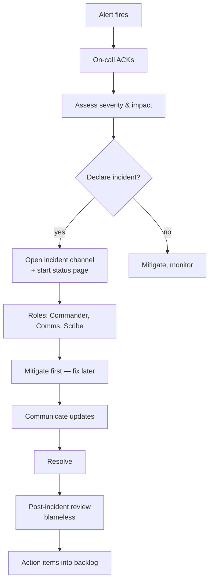

# Alerting & On-Call

> **TL;DR** — An **alert** wakes a human up because the system can't fix itself. Good alerting is brutally simple: page only when something **a user can feel** is broken (or about to break), give the on-call engineer enough context to act in seconds, route via a paging system (PagerDuty, Opsgenie, Incident.io) with clear escalation, and run post-incident reviews that improve the alerts. The two cardinal sins are **alert fatigue** (so many pages that real incidents are ignored) and **silent failure** (no page when the user is suffering). Modern best practice: alert on **SLO burn rate**, not on raw metrics; use **multi-window, multi-burn-rate** rules; keep severity levels strict; and treat the on-call rotation as critical infrastructure with healthy hand-offs and post-incident learning.

---

## 1. The Job of an Alert

An alert is a message that says: *"a human must intervene now."* That's the entire job. Three implications:

1. **If a human doesn't need to act, it shouldn't be an alert** — it's a notification, a dashboard entry, or a ticket.
2. **If a human must act but the alert doesn't tell them what's wrong**, it's worse than no alert.
3. **Alerts are a tax on attention.** Each one costs sleep, focus, and trust. Spend them carefully.

The number-one operational problem on most teams isn't too few alerts — it's too many.

---

## 2. Alerting Anti-Patterns (Recognize Them First)

The wrong way to alert (sadly common):

- **Alert on every metric.** "Disk over 70%", "CPU spiked", "GC pause > 100 ms" — every dashboard becomes a pager. Real incidents drown in noise.
- **Alert on causes, not symptoms.** Page when a single disk is slow rather than when users are seeing errors. Wakes you for non-incidents and misses real ones.
- **Alert without runbook context.** "PaymentsServiceDown — investigate." That's it. No links, no steps, no signals.
- **Alert that needs a human to acknowledge but no action.** "Build succeeded" — please no.
- **Symptoms that auto-resolve in 30 seconds.** Page fires, engineer checks, all green. Repeat at 3am.
- **Multi-page outages with no aggregation.** Twenty alerts about the same incident — phone explodes, dashboard buried.
- **Alerts owned by nobody.** Nobody knows who tunes them, why they exist, or whether they still matter.

If your on-call rotation jokes about "the usual 3 a.m. nonsense alert," that nonsense is destroying your incident response.

---

## 3. What Should Alert

Alert on **symptoms that affect users** — derived from your **SLOs**.

The Google SRE rule: *alert on the user-facing manifestation, not the underlying cause.*

| User-facing symptom | Alert |
| --- | --- |
| Requests failing | Yes |
| Requests too slow | Yes |
| Background jobs piling up | Yes (eventually leads to delays) |
| Specific server's CPU at 90% | **No** — autoscaler / failover should handle |
| Database replica lagging | **No** — unless it's the only replica or affects latency |
| Disk at 80% | **No** — at 95% with hours-to-projected-full, yes |

The hard part is the gray zone: some causes (replication lag, lock waits, queue backlog) lead to user pain eventually. Alert on **leading indicators when the lag-to-impact is short** and on **the symptom directly when not**.

---

## 4. SLO-Based Alerting — The Modern Default

The Google SRE Workbook formalized **alert on error budget burn rate**:

```
SLO              "99.9% of requests succeed and respond in <200ms over 30 days"
Error budget     1 − 0.999 = 0.1% of requests may fail
Burn rate        consumption rate of that budget

Burn rate 1×     burning at the long-term sustainable rate
Burn rate 14.4×  budget would burn in 30/14.4 ≈ 2 days if sustained
Burn rate 36×    burn in ~20 hours
```

Multi-window, multi-burn-rate (the SRE standard):

| Severity | Burn rate threshold | Short window | Long window |
| --- | --- | --- | --- |
| **Page** (act now) | 14.4× over 1h **and** 1d | 1h | 1d |
| **Page** (act now) | 6× over 6h **and** 3d | 6h | 3d |
| **Ticket** (this week) | 1× over 3d **and** 30d | 3d | 30d |

Two windows in AND avoid pages from short-lived blips and avoid missing slow-burn outages. This is the standard. See [SLA, SLO, SLI, Error Budgets →](../11-reliability/sla-slo-sli.md).

Example PromQL:

```promql
(
  sum(rate(http_requests_total{status=~"5.."}[1h]))
  / sum(rate(http_requests_total[1h]))
  > (14.4 * 0.001)
)
and
(
  sum(rate(http_requests_total{status=~"5.."}[5m]))
  / sum(rate(http_requests_total[5m]))
  > (14.4 * 0.001)
)
```

Use the short window to ensure the issue is still happening; the long window confirms it's not noise.

---

## 5. Severity Levels — Be Strict

Three or four levels is right:

| Severity | Wakes someone? | Examples |
| --- | --- | --- |
| **SEV1 / page** | Yes, immediately | User-facing outage, data loss in progress, regulatory breach |
| **SEV2 / page (business hours)** | During work hours | Degraded latency over SLO budget; key cron not running |
| **SEV3 / ticket** | No — appears in queue | Capacity warning, certificate expiring next week |
| **Info / dashboard** | No | Deploys, scale events, normal cron output |

Rules:
- Page = wake someone up. If it can wait, it's not a page.
- Defaults matter. Most teams have too many SEV1s and too few SEV3s.
- Auto-resolve when conditions clear. Don't require manual close.

---

## 6. The Anatomy of a Good Alert

Every alert should have:

1. **Title** — what's wrong, in human terms. `"checkout-api error rate > SLO (5xx 4.2% > 0.1%)"` not `"alert_8472 firing"`.
2. **Severity & owner** — who's paged, which team.
3. **Links** — to the relevant dashboard, the runbook, the affected service in your service catalog, recent deploys, recent incidents.
4. **Time-range query links** — pre-built to the metric over the past hour, the trace search, the log query.
5. **Suggested first actions** — "Check recent deploys; if rollback needed: <one-line command>."

Bad alert:
> 🔴 alert.checkout_api_errors_high

Good alert:
> 🔴 [PAGE] checkout-api error rate 4.2% (SLO 0.1%) — 14.4× burn rate, 1h window
> Affecting: checkout user flow (~$X/min revenue impact)
> Recent deploys: PR #4382 deployed 12m ago [link]
> Dashboard: [link]   Runbook: [link]
> Traces with errors: [link]

A page should answer "what" in three seconds and "what should I look at first" in ten.

---

## 7. Routing and Escalation

Paging systems (PagerDuty, Opsgenie, Incident.io, FireHydrant, Rootly, Better Stack):

- Alerts arrive from monitoring (Prometheus Alertmanager, Datadog, etc.).
- Routed by service / owner / severity to the right rotation.
- Primary on-call gets paged.
- After N minutes without ack, escalates to secondary.
- After M minutes, manager.
- After P minutes, incident commander page.

Standard rotation patterns:
- **Follow-the-sun** for global teams (US/EU/APAC handoffs).
- **One-week shifts** — short enough not to burn out, long enough not to miss incident context.
- **Primary + secondary** so one person isn't single point of failure.

Compensation matters: paid carry-pay or comp time. People who get paged for free disengage.

---

## 8. Dependency / Suppression Rules

A real outage triggers many alerts. Don't deliver them all:

- **Grouping** — alerts with the same labels (`alertname`, `service`) collapsed into one page.
- **Suppression / inhibition** — if `entire-region-down` is firing, don't also page on `service-A-down`, `service-B-down`, ...
- **Maintenance windows** — suppress alerts during planned work.
- **Topology-aware suppression** — if `database-down` is firing, also suppress `service-using-database-slow`.

Alertmanager and Datadog support this directly; tools like FireHydrant / Incident.io layer richer dependency models.

The aim: **one page per incident**, not one per affected service.

---

## 9. On-Call: The Human Side

The rotation is critical infrastructure. Treat it as such.

### Healthy on-call

- **Predictable load.** Track pages per week per engineer. If anyone's getting >5–10 pages/week, you have a tuning problem, not a person problem.
- **Compensated.** Paid or time-off in lieu.
- **Bounded.** Max consecutive shifts. Encourage cover for life events.
- **Hand-off ritual.** End-of-shift report: what fired, what's still hot, what to watch.
- **Permission to escalate** without judgment.
- **Permission to fix root causes.** Time in next sprint to address the source of repeated pages.

### Unhealthy on-call

- "Whoever wrote the code is on call forever for it" (heroism culture).
- One person pages disproportionately because they fix it themselves.
- Hand-offs are "just check the channel."
- Engineers dread the rotation; turnover happens.

The mantra (from Google SRE): **operations work shouldn't exceed 50% of an SRE's time**. If on-call dominates, something is wrong upstream.

---

## 10. Runbooks

A **runbook** is the document the alert points to. It contains:

- What this alert means.
- The fastest signals to check (dashboards, traces, logs to grep).
- Common root causes with mitigation steps.
- Escalation contacts.
- When to declare an incident.
- When to rollback / failover / scale out.

A good runbook means **someone unfamiliar with the system can mitigate at 3 a.m.** Bad runbooks ("see the team Slack channel") are a failure of empathy.

Maintain runbooks as code (markdown in the same repo as the service), reviewed in PRs, exercised in **game days**. A runbook that's never tested is fiction.

---

## 11. Incident Response Flow



Key principles:
- **Mitigate first.** Rollback, failover, scale, kill flag. Root cause comes later.
- **Communicate clearly.** Status page updates every 15–30 min during major incidents.
- **One channel.** All chatter in one place — easier scribe, easier review.
- **Defined roles** (Incident Command System, simplified):
  - **Commander** — runs the response, makes calls.
  - **Communications** — talks to leadership, customers, status page.
  - **Scribe** — captures the timeline.
  - **Operators** — actually fix the system.
- **Blameless post-incident review** — the goal is learning, not punishment.

---

## 12. Post-Incident Review (Postmortem)

After every significant incident, run a review:

- **Timeline** — what happened when, in detail.
- **Impact** — affected users, revenue, SLA implications.
- **Root causes** — usually multiple contributing factors, not one.
- **What went well** — celebrate good detection, communication, mitigations.
- **What went poorly** — slow detection, missing alerts, bad runbooks.
- **Action items** — owned, dated, prioritized. Tracked to completion.

**Blameless** isn't permissive — it's a recognition that systems fail because of conditions, not individual mistakes. Focus on changing conditions.

Templates: Google's, Etsy's, Hashicorp's, Honeycomb's, Incident.io's are all public. Adopt one.

---

## 13. Tooling

| Category | Tools |
| --- | --- |
| **Monitoring → alert generation** | Prometheus Alertmanager, Datadog, New Relic, Grafana Cloud, Cloudwatch, Stackdriver |
| **Paging / on-call** | PagerDuty, Opsgenie, VictorOps, Better Stack, OnCall (Grafana) |
| **Incident management** | Incident.io, FireHydrant, Rootly, Jeli (Honeycomb) |
| **Status pages** | Statuspage (Atlassian), Better Stack, Instatus |
| **ChatOps** | Slack, Teams — incident channels with bot integrations |
| **Runbooks** | Markdown in the repo; Confluence; Notion |

A modest stack: Prometheus / Datadog → PagerDuty → Slack with Incident.io. Mature stacks add status pages, automation, and runbook-as-code.

---

## 14. Practice — Game Days

Alerts and runbooks fail under stress in ways they don't under inspection. Periodic **game days** (chaos exercises):

- Simulate a region outage; on-call must respond.
- Kill a primary database; verify replicas take over and the right alerts fire.
- Block a dependency; observe how circuit breakers respond.
- New on-call shadows an incident.

Treat it like a fire drill. See [Chaos Engineering →](../11-reliability/chaos-engineering.md).

---

## 15. Metrics on Your Alerting

Track:
- **Alerts per week per service.** Hotspots = tune candidates.
- **Pages per week per engineer.** Health check on the rotation.
- **MTTR (mean time to recovery).** Trending down = improvement.
- **MTTA (mean time to acknowledge).** Slow = paging/escalation broken.
- **False positive rate.** % of alerts that didn't need human action. Should be < 10%.
- **Coverage** — % of incidents caught by an alert vs found by a customer / dashboard scan. Goal: high.

Alerts about alerts: meta but essential.

---

## 16. Common Mistakes / Anti-Patterns

- **Alerting on cause not symptom.** Pages for transient blips; misses user-visible outages.
- **One alert per metric.** Hundreds of rules; nobody knows which matter.
- **No SLOs.** Alerts based on intuition rather than user impact.
- **Page for everything.** Alert fatigue. Real incidents missed.
- **Alerts that auto-resolve before anyone looks.** Tune the threshold or remove.
- **Single-window thresholds.** Either page on blips or miss slow burns.
- **No runbook links.** On-call wastes minutes orienting at 3 a.m.
- **No grouping/inhibition.** 50 pages per outage.
- **One person on call all the time.** Burnout, bus factor.
- **Compensation as an afterthought.** Pages without paid time = resentment.
- **Skip post-incident reviews.** Same incident recurs.
- **Blaming individuals.** Drives concealment of incidents.
- **Status page surprises customers.** Customers told before status page = trust hit.
- **Manual alert tuning, no version control.** Drift, regression, nobody owns.
- **Synthetic uptime alerts only.** Misses partial degradation.
- **No business-impact alerts.** Pages on infra but not on "purchases dropped 30%".

---

## 17. Cheat Card

```
RULE OF ALERTING
  Alert ONLY when a human must act on a USER-FACING symptom.
  Anything else = ticket, dashboard, or nothing.

WHAT TO ALERT
  SLO burn rate (multi-window, multi-burn-rate)
  → 14.4×/1h+5m  paging
  → 6×/6h+30m   paging
  → 1×/3d+6h    ticket

SEVERITY
  SEV1 page now      | SEV2 page biz-hours | SEV3 ticket | info = no page

GOOD ALERT INCLUDES
  title (symptom in human words) · severity · owner ·
  links (dashboard, runbook, traces, recent deploys) · first steps

ROUTING
  Alertmanager / Datadog → PagerDuty → Slack/Incident.io
  Group by service + alertname; inhibit dependents during outages

ON-CALL HEALTH
  predictable load · compensated · primary+secondary · short shifts
  pages/week/engineer ≤ 5–10 · operational toil ≤ 50% of time

DURING INCIDENT
  ACK → declare → roles (Commander, Comms, Scribe) → MITIGATE first
  one channel · status page updates · blameless post-incident review

GAME DAYS, RUNBOOKS-AS-CODE, METRICS ON ALERTS (FP rate, MTTA, MTTR)

DON'T page on cause · don't alert per metric · don't single-window threshold ·
don't run on-call without rotation hygiene.

RULE: alert on symptoms tied to SLOs, route with care, learn from every page.
```

---

## 18. Resources

### Books
- *Site Reliability Engineering* — Google. Chapters on alerting, on-call, postmortems.
- *The SRE Workbook* — Google. Concrete SLO-based alerting recipes.
- *Seeking SRE* — Curated essays.
- *The Field Guide to Understanding Human Error* — Sidney Dekker. Blameless mental model.
- *Incident Management for Operations* — Rob Schnepp et al.

### Documentation
- **Google SRE — Alerting Philosophy** — <https://sre.google/sre-book/monitoring-distributed-systems/>
- **Multi-window, Multi-Burn-Rate Alerting** — SRE Workbook chapter: <https://sre.google/workbook/alerting-on-slos/>
- **Prometheus Alertmanager** — <https://prometheus.io/docs/alerting/latest/alertmanager/>
- **PagerDuty Incident Response** — <https://response.pagerduty.com/>
- **Incident.io playbooks** — <https://incident.io/guide>

### Articles
- "My Philosophy on Alerting" — Rob Ewaschuk (Google), the canonical post.
- "On the care and feeding of an on-call rotation" — Charity Majors.
- "How we manage incidents at Stripe / Slack / GitHub" — engineering blogs.
- "Why SRE is hard: the page that wasn't" — various postmortems.

### Videos
- "SLO-based alerting" — Liz Fong-Jones, SREcon.
- "Incident command" — PagerDuty training.
- ByteByteGo — "On-call best practices".

### Tools
- **Alertmanager, Datadog Monitors, Grafana Alerting** — alert generation.
- **PagerDuty, Opsgenie, Better Stack** — paging.
- **Incident.io, FireHydrant, Rootly** — incident management + retros.
- **Statuspage, Instatus** — customer communication.

### Adjacent reading
- [Metrics & Time-Series →](./metrics.md)
- [Logging Best Practices →](./logging.md)
- [Distributed Tracing →](./tracing.md)
- [The Three Pillars of Observability →](./three-pillars.md)
- [Health Checks & Heartbeats →](./health-checks.md)
- [SLA, SLO, SLI, Error Budgets →](../11-reliability/sla-slo-sli.md)
- [Chaos Engineering →](../11-reliability/chaos-engineering.md)

---

*Previous:* [← The Three Pillars of Observability](./three-pillars.md)  |  *Next:* [Centralized Log Aggregation →](./log-aggregation.md)
