# Distributed Tracing (Jaeger, Zipkin, OpenTelemetry)

> **TL;DR** — A **distributed trace** is the full path a single request takes across services: which hop called which, how long each took, where it failed. Each unit of work is a **span**; spans form a tree under a shared **trace ID**. Tracing answers the question logs and metrics can't: *"the request was slow — where did the time go?"* The dominant standard is **OpenTelemetry**: one SDK, one wire format (OTLP), one set of semantic conventions, any backend (Jaeger, Tempo, Zipkin, Honeycomb, Datadog, Lightstep, New Relic). The hard parts aren't libraries — they're **propagation** (carry the trace context across every hop, including async/message-queue boundaries), **sampling** (you can't keep 100% at scale), and **finding the signal** in a haystack of millions of traces.

---

## 1. Why Tracing

A typical request in a microservices system hops through 10–30 services:

```
User → CDN → API Gateway → Auth → Order Svc → Inventory → Pricing
                                       ↓
                                    Payments → External PSP
                                       ↓
                                    Email worker (async)
                                       ↓
                                    Analytics stream
```

When a request is slow or fails, **which hop?** Metrics tell you "p99 of api is 4s" — they don't tell you the 4s was in Pricing. Logs tell you per-service noise — they don't show the path. Tracing answers exactly this.

```mermaid
gantt
    title Trace for one slow request (4.2s total)
    dateFormat  X
    axisFormat  %S
    section API Gateway
    span                  :a1, 0, 4200
    section Auth
    span                  :a2, 30, 60
    section Order Svc
    span                  :a3, 80, 4100
    section Pricing
    span                  :a4, 200, 3500
    section Payments
    span                  :a5, 3700, 400
```



In one glance: the time vanished in **Pricing**. That's the value of tracing.

---

## 2. The Data Model

```
Trace        — one ID, many spans, organized as a tree.
Span         — one operation: name, start_time, end_time, status, attributes, events.
Span context — what propagates: trace_id + span_id + flags.
Parent / child — span relationships; root span has no parent.
Attributes   — key-value pairs on the span (`http.method=POST`).
Events       — timestamped sub-points within a span ("cache miss", "retry").
Links        — cross-trace references (useful for batch / fan-in).
```

A trace might have 50–500 spans. Every span has:

```json
{
  "trace_id":  "4f2c8a1b9d3e6f0a8c5b2d7e9f1a3c6e",
  "span_id":   "9d3e6f0a8c5b2d7e",
  "parent_id": "8c5b2d7e9f1a3c6e",
  "name":      "POST /v1/charges",
  "kind":      "server",
  "start":     "2026-05-20T09:14:22.413Z",
  "end":       "2026-05-20T09:14:22.500Z",
  "status":    "OK",
  "attributes": {
    "service.name":    "payments",
    "http.method":     "POST",
    "http.route":      "/v1/charges",
    "http.status_code": 201,
    "net.peer.ip":     "10.0.4.21",
    "user.id":         "user_42",
    "db.system":       "postgres"
  }
}
```

---

## 3. Context Propagation — The Make-or-Break

A trace only works if every service in the path shares the same `trace_id` and parent-child relationships. That requires **propagation**: every outgoing call carries the current context to the next service.

### W3C Trace Context — the standard
```
traceparent: 00-4f2c8a1b9d3e6f0a8c5b2d7e9f1a3c6e-9d3e6f0a8c5b2d7e-01
              │  │                                │                │
              │  trace-id (16 bytes / 32 hex)      │                trace-flags (sampled?)
              version                              parent-id (8 bytes)
```

Optionally:
```
tracestate: vendor-a=foo,vendor-b=bar
```

Every modern HTTP library understands this header. Set it on the outgoing call; read it on the incoming side.

### Beyond HTTP

You must propagate across **every** boundary:

- HTTP → `traceparent` header.
- gRPC → `traceparent` metadata.
- Message queues (Kafka, SQS, RabbitMQ) → embed traceparent in headers/metadata of the message; the consumer extracts it.
- Async tasks (Celery, Sidekiq, BullMQ) → trace context attached to the task payload.
- Database queries → trace context as a SQL comment (`/* traceparent=... */`) for downstream correlation; not used by the DB itself.
- Scheduled jobs → root span at the scheduler.

A common failure: trace stops at the Kafka boundary because the consumer doesn't extract context. The downstream looks orphaned. Always propagate.

---

## 4. Sampling

You can't keep 100% of traces at scale — 10,000 RPS × 50 spans × 1 KB ≈ 500 MB/s of trace data. So you sample.

### Sampling strategies

| Strategy | When |
| --- | --- |
| **Head-based** (decide at root) | Cheap; simple; default in most OTel pipelines |
| **Tail-based** (decide after seeing the whole trace) | Keep all errors, slow traces; sample the rest. Best signal-to-noise. |
| **Rate limiting** | "Keep at most N per second of this service" |
| **Priority** | Always keep traces with `is_priority` attribute set |
| **Adaptive** | Adjust sample rate based on backend capacity |

A common production pattern: **1–5% head-based sampling** with **always-keep on errors** and **always-keep for specific debug headers/users**. Tail-based when you can afford the buffering (OTel Collector tail sampler).

### The sampling decision propagates

Sampling decision lives in the `traceparent` flags. If service A decides "sampled", services B, C, D all participate. If not sampled, they skip the cost of span creation.

### Don't sample logs/metrics by trace
Even if a trace isn't kept, the metrics and logs still are. Tracing samples; metrics don't.

---

## 5. OpenTelemetry — The Standard

OpenTelemetry (OTel) merged OpenTracing + OpenCensus around 2019. It's now the standard.

```
your app
  ↓ OTel SDK
  ↓ OTLP (gRPC / HTTP)
  ↓
OTel Collector (sidecar or fleet)
  ↓
backend(s): Jaeger / Tempo / Zipkin / Honeycomb / Datadog / NewRelic / ...
```

What you get:
- **One SDK** per language with idiomatic instrumentation.
- **Auto-instrumentation** for popular frameworks (Java agent, Python opentelemetry-instrumentation-*, Node @opentelemetry/instrumentation-*).
- **Semantic conventions** — agreed names for common attributes (`http.method`, `db.system`, `messaging.system`, `peer.service`).
- **OTLP wire format** — vendor-agnostic; switch backends without re-instrumenting.

The right answer for any new tracing in 2026 is OTel.

---

## 6. Manual vs Auto Instrumentation

### Auto instrumentation
For mainstream frameworks (Spring, Flask, Express, Django, gRPC, libraries like Redis/Postgres clients) OTel can hook in automatically. Drop in a Java agent or import an instrumentation package — server spans, client spans, DB spans appear.

```bash
# Java
java -javaagent:opentelemetry-javaagent.jar -jar myapp.jar
```

Best place to start. Provides 80% of value with minimal code.

### Manual instrumentation
For business logic, async paths, custom boundaries:

```go
ctx, span := tracer.Start(ctx, "calculate_pricing")
defer span.End()
span.SetAttributes(attribute.String("plan", planID))
// ... work ...
if err != nil {
    span.RecordError(err)
    span.SetStatus(codes.Error, err.Error())
}
```

Rules of thumb:
- Wrap any meaningful unit of work (function that does an external call, a complex calculation, a transaction).
- Don't wrap tiny pure functions — overhead > value.
- Add high-signal attributes (`user.id`, `order.id`, `tenant.id`) — these are what makes traces searchable.

---

## 7. Span Attributes — What to Attach

The trace is only as good as the attributes. A well-attributed span:

```
service.name      = payments
http.method       = POST
http.route        = /v1/charges
http.status_code  = 201
http.scheme       = https
net.peer.name     = api.example.com
user.id           = user_42
org.id            = org_7
db.system         = postgres
db.statement      = INSERT INTO ... (sanitized)
messaging.system  = kafka
messaging.destination = orders
exception.type    = TimeoutError    (on error)
exception.message = ...             (on error)
```

OpenTelemetry's **semantic conventions** define standard attribute names. Use them — dashboards and queries written against `http.status_code` work everywhere.

Cardinality applies to attributes too — they're stored on each span. Don't dump large objects; pick meaningful identifiers.

---

## 8. Finding Signal in Traces

A backend storing millions of traces is useless if you can't find the slow / failing ones. Modern tracing UIs (Jaeger, Tempo+Grafana, Honeycomb, Datadog APM) support:

- **Filter by attributes** — `service:payments status:error duration:>3s`.
- **Trace search** — by trace ID (from a log line) or by attribute query.
- **Service maps** — auto-derived dependency graph.
- **Span aggregates** — "p99 latency of `payments.charge` over the last hour."
- **Compare traces** — side-by-side waterfalls of a slow vs fast request.

Honeycomb pioneered the **wide-event analytics** view (each event has 100+ attributes; slice/dice arbitrarily). Many trace backends are converging on this style.

---

## 9. Trace + Log + Metric Correlation

The killer feature of modern observability is **clicking from one signal to another**:

```
metric alert (p99 latency spiked)
  → click into traces in that window
  → find a slow trace
  → click span attributes → drill into logs for that trace_id
  → see the actual error message
```

For this to work, every log line must include `trace_id` and `span_id` (auto-injected by OTel logging exporters in most languages). See [Logging Best Practices →](./logging.md).

---

## 10. Backends Compared

| Backend | Notes |
| --- | --- |
| **Jaeger** | CNCF, open source, ubiquitous; Cassandra/Elasticsearch backends |
| **Zipkin** | The original; simpler than Jaeger; still in use |
| **Grafana Tempo** | Object-storage-backed; cheap at scale; integrates with Grafana |
| **Honeycomb** | Wide-event analytics; high cardinality friendly |
| **Datadog APM** | Strong UX; integrated with logs/metrics |
| **New Relic** | Long-standing; "Distributed Tracing" feature |
| **AWS X-Ray, GCP Cloud Trace, Azure Monitor** | Cloud-native managed |
| **SigNoz, Uptrace, Lightstep** | OTel-native alternatives |

For self-hosted: Grafana Tempo + Loki + Mimir + Grafana is the modern open-source stack — all OTel-compatible.

---

## 11. Common Worked Example — Diagnosing a Slow Request

Story: `POST /checkout` p99 jumped from 400 ms to 2 s after a deploy.

1. Open APM, filter `service:checkout latency:>1.5s status:ok`.
2. Pick a representative trace.
3. Waterfall shows: `checkout` span is 1.9 s, `inventory.reserve` span is 1.7 s of that.
4. Drill into `inventory.reserve` — attributes show `db.statement=SELECT ... FROM products ...`.
5. The same span 24 h ago: 30 ms. Today: 1.7 s.
6. Open DB span attributes — table size? Query plan? See `db.statement` and check it against the deploy diff.
7. Find the new join introduced in PR #4382. Fix.

Without tracing: hours of log spelunking, comparing dashboards, asking team members. With tracing: minutes.

---

## 12. Async and Fan-Out Patterns

Tracing is straightforward for synchronous calls. The hard cases:

### Async / message queue
Producer → queue → consumer is one logical operation but two processes. Standard solution:
- Producer adds `traceparent` to message headers.
- Consumer extracts it, starts a new span with `kind=consumer` linked to the producer span (`SpanLink`).
- The consumer span is part of the same trace.

### Fan-out
One incoming request triggers parallel calls to 50 services (e.g., search aggregator). The trace tree branches; each child has the same parent. UIs show this as a wide waterfall.

### Long-running jobs
A job spans minutes/hours. Make it a span; emit events for milestones (`event: shard 5 of 20 completed`). Don't try to keep the span open across processes — break it into linked spans per stage.

### Streaming
A stream of records → tracing is statistical. Trace a sample of records end-to-end; don't trace each event.

---

## 13. Common Mistakes / Anti-Patterns

- **Tracing only HTTP.** DB calls, queue ops, cache reads matter most when latency hides somewhere.
- **Forgetting to propagate.** Trace ends at a service boundary; downstream looks orphaned.
- **Manually instrumenting before turning on auto.** Auto gets you 80% for free; only manual where it adds value.
- **Storing whole request bodies as attributes.** Cost + privacy. Store identifiers, not payloads.
- **High-cardinality attributes that backends index** — same problem as metrics' labels.
- **No sampling.** Backends crater under load. Sample head-based + always-keep errors.
- **Sampling 0.1% on a low-traffic critical service.** Now no traces exist when something goes wrong. Use higher rates on low-volume services.
- **Wrapping every function in a span.** Overhead dominates; UI becomes unreadable.
- **Mismatched clock domains.** Clock skew between machines makes spans look out of order. Use NTP; modern UIs tolerate small skew.
- **Treating tracing as a debugging tool only.** Use it for SLO assessment, capacity planning, dependency mapping.
- **Custom propagation headers.** Use W3C Trace Context. Don't reinvent.
- **Disabling tracing because "it costs too much".** With sampling, cost is bounded; tracing pays for itself the first big incident.
- **No `trace_id` in logs.** Lost the correlation. Fix it once at the logging layer.
- **Recording errors but not setting span status to ERROR.** Search-by-status misses them.

---

## 14. Cheat Card

```
TRACE = trace_id with a tree of spans.   span = one operation.
USE FOR: where did the time go?   what's the path?   which dep failed?

STANDARDS
  Wire        W3C Trace Context (traceparent header)
  Format      OTLP (OpenTelemetry Protocol)
  Conventions OpenTelemetry semantic attributes
                http.method · http.route · db.system · messaging.system · ...

PROPAGATE EVERYWHERE
  HTTP/gRPC headers · Kafka/SQS message headers · job payloads · SQL comments
  if it's missing one hop, the trace breaks

INSTRUMENT
  auto first (Java agent, OTel auto packages)
  manual for business boundaries; attach user.id, org.id, etc.
  RecordError() + SetStatus(Error) on failures

SAMPLING
  head-based 1–5%, always-keep errors + slow + priority
  tail-based via OTel Collector when feasible
  decision lives in traceparent flags; propagates

BACKENDS (open source)   Jaeger · Tempo · Zipkin
BACKENDS (SaaS)          Honeycomb · Datadog APM · New Relic · Lightstep · SigNoz

CORRELATION
  every log line carries trace_id + span_id
  every metric exemplar can link to a trace
  click metric → trace → log seamlessly

RULE: if you can't see the request's full path, you don't have observability.
```

---

## 15. Resources

### Books
- *Distributed Tracing in Practice* — Austin Parker et al. (O'Reilly).
- *Observability Engineering* — Charity Majors et al. Strong on event-based observability.
- *Mastering Distributed Tracing* — Yuri Shkuro (Jaeger creator).

### Documentation
- **OpenTelemetry** — <https://opentelemetry.io/docs/>
- **OTel semantic conventions** — <https://opentelemetry.io/docs/specs/semconv/>
- **W3C Trace Context** — <https://www.w3.org/TR/trace-context/>
- **Jaeger** — <https://www.jaegertracing.io/docs/>
- **Grafana Tempo** — <https://grafana.com/docs/tempo/>

### Papers / Articles
- **"Dapper, a Large-Scale Distributed Systems Tracing Infrastructure"** — Google, 2010. The original.
- "Distributed tracing at Lyft" — Lyft engineering.
- "Honeycomb's high-cardinality observability"  — blog series.
- "Tail sampling in production" — Cloudflare / Grafana posts.

### Videos
- "What is distributed tracing?" — Charity Majors.
- ByteByteGo — "Observability: traces vs logs vs metrics".
- KubeCon — OTel project updates.

### Tools
- **OpenTelemetry SDKs** — all major languages.
- **OTel Collector** — receive, process, route trace data.
- **Jaeger, Tempo, Zipkin** — open source backends.
- **Honeycomb, Datadog APM, New Relic, Lightstep, SigNoz** — SaaS/OSS.
- **Grafana** — visualization (Tempo + Loki + Mimir integration).

### Adjacent reading
- [Logging Best Practices →](./logging.md)
- [Metrics & Time-Series →](./metrics.md)
- [The Three Pillars of Observability →](./three-pillars.md)
- [Alerting & On-Call →](./alerting.md)
- [Service Mesh →](../03-apis/service-mesh.md)
- [Tail Latency & p99 →](../16-performance/tail-latency.md)

---

*Previous:* [← Metrics & Time-Series](./metrics.md)  |  *Next:* [The Three Pillars of Observability →](./three-pillars.md)
