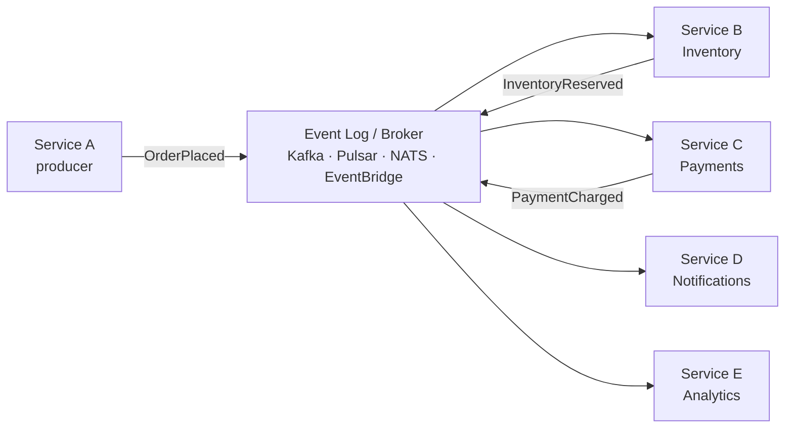

# Event-Driven Microservices

> **TL;DR** — **Event-driven microservices** communicate primarily by **publishing and consuming events** through a durable log or broker (Kafka, Pulsar, NATS, EventBridge, SNS+SQS) instead of synchronous HTTP/gRPC calls. Services emit *"something happened"* facts; other services react. The benefits: loose coupling, natural fan-out, asynchronous fault isolation, replay-ability, audit-by-construction. The costs: eventual consistency by default, harder debugging, harder mental model, schema-evolution discipline becomes critical. Most real systems are **hybrid** — synchronous for read paths and immediate-response commands, event-driven for state propagation and cross-service workflows. Patterns to master: **outbox**, **sagas**, **idempotent consumers**, **event versioning**, **CQRS**, **event sourcing**.

---

## 1. The Idea

In synchronous microservices, services call each other:

```
Order service → POST /reserve → Inventory service
              → POST /charge  → Payment service
              → POST /notify  → Email service
```

In event-driven microservices, services publish facts and other services react:

```
Order service ─ "OrderPlaced" ──► Event log
                                    ▼ ▼ ▼
                          Inventory   Payment   Email
                          (reserves)  (charges) (sends)
```

**Producer doesn't know consumers.** Consumers don't know producers. Both know the event schema.

This is the central design trade-off of event-driven: **loose coupling for the price of asynchrony**.

---

## 2. Events vs Commands vs Messages

Sloppy terminology causes most confusion. Be precise:

| | Definition | Sender's intent |
| --- | --- | --- |
| **Command** | "Do this thing" | Caller wants an action performed; expects a result or failure |
| **Event** | "This thing happened" | Producer announces a fact; reaction is up to consumers |
| **Document / message** | "Here's some data" | Pure data transfer |

A command names what the caller wants (`ChargePayment`); an event names what occurred (`PaymentCharged`). Confusing them produces tightly-coupled "event-driven" systems that are actually RPC in disguise.

**Rule of thumb:** if a service that emits the event would care which consumer handled it, it's a command, not an event.

---

## 3. Architectural Building Blocks



- **Producers** publish events.
- **Brokers / logs** durably store events (often partitioned, ordered per key).
- **Consumers** subscribe to topics and react.
- **Schema registry** owns the contract for each event type.
- **Dead letter queues (DLQ)** catch poison messages.

The choice of broker matters:

| Broker | Style | Use |
| --- | --- | --- |
| **Kafka / Pulsar** | Distributed log | Default for high volume, replay, ordering per key |
| **RabbitMQ / ActiveMQ** | Queue with routing | Lower volume, complex routing rules |
| **NATS / JetStream** | Lightweight pub/sub + persistence | Cloud-native, fast, simple |
| **AWS SNS + SQS** | Pub/sub + queues | Default on AWS; serverless-friendly |
| **AWS EventBridge** | Event bus + rules | Cloud-event routing, integrations |
| **GCP Pub/Sub** | Managed pub/sub | Default on GCP |
| **Redis Streams** | Lightweight log | Small/medium scale, low ops |

See [Message Brokers →](../07-messaging/message-brokers.md) and [Kafka Deep Dive →](../07-messaging/kafka.md).

---

## 4. Event Schema and Naming

The event is the contract. Get it right or pay forever.

### Naming
- **Past tense**, business language: `OrderPlaced`, `PaymentRefunded`, `UserDeleted`.
- **Not** `PlaceOrder`, `RefundPayment` (those are commands).
- **Not** technical: `RowInserted`, `TableUpdated`.

### Structure
A typical event:

```json
{
  "event_id":   "evt_01HXCP3K9Z...",
  "event_type": "OrderPlaced",
  "version":    "v1",
  "occurred_at":"2026-05-20T09:14:22.413Z",
  "aggregate_id":"order_19hxc3",
  "data": {
    "order_id": "order_19hxc3",
    "user_id":  "user_42",
    "currency": "USD",
    "amount_cents": 4200,
    "lines": [...]
  },
  "metadata": {
    "trace_id": "4f2c8a...",
    "producer": "orders@2026.05.18",
    "tenant":   "org_7"
  }
}
```

### Versioning
Events live forever — once consumers exist, you can't unilaterally change them. Rules:

- **Backward compatible by default.** Add fields; never remove or repurpose.
- **Versioned event types** when you must break: `OrderPlaced.v2` alongside `OrderPlaced.v1` until consumers migrate.
- **Schema registry** (Confluent, Apicurio) enforces compatibility at publish time.
- **Tolerant readers** — consumers ignore unknown fields.

This is the same discipline as [API Versioning →](../03-apis/versioning.md) but stricter — events propagate to many consumers you may not know about.

### Open standards
**CloudEvents** (CNCF) standardizes envelope fields (`source`, `type`, `subject`, `time`, `id`). Useful when integrating across vendors / clouds.

---

## 5. Synchronous vs Event-Driven — When to Choose

Most teams oscillate. The honest framing:

| Use synchronous (HTTP/gRPC) when | Use events when |
| --- | --- |
| Caller needs an immediate answer | State change should propagate; reaction can be later |
| One-to-one interaction | One-to-many fan-out |
| Strong consistency required *now* | Eventual consistency acceptable |
| Read path (query / lookup) | Write path that touches multiple services |
| Idempotency easy on caller side | Producer just records what happened |
| Latency budget tight | Latency budget loose |

Real systems use both. Order service synchronously calls Pricing (read), then publishes `OrderPlaced` and lets Inventory + Payments + Email react asynchronously.

The dangerous middle ground: **chained synchronous calls** through five services. Use events to break the chain.

---

## 6. The Outbox Pattern (Essential)

Naïve producer:

```python
def place_order(...):
    db.save(order)
    broker.publish("OrderPlaced", event)
```

Problem: DB commits but broker publish fails (or vice versa). Two systems, no atomic transaction.

**Outbox pattern:** in the same DB transaction, write the event to an `outbox` table. A separate process reads the outbox and publishes to the broker, marking events sent.

```sql
BEGIN;
INSERT INTO orders (...) VALUES (...);
INSERT INTO outbox (id, type, payload) VALUES (...);
COMMIT;

-- Outbox relay process:
SELECT * FROM outbox WHERE sent_at IS NULL ORDER BY id LIMIT 100;
publish to broker;
UPDATE outbox SET sent_at = now() WHERE id IN (...);
```

Variants:
- **Polling outbox** — simple, slight latency.
- **CDC outbox** (Debezium) — read the WAL/binlog, no polling.
- **Transactional outbox + log capture** — modern hybrid.

This is the **canonical solution** to "DB write + event publish." Adopt it from day one. See [Outbox Pattern →](../07-messaging/outbox-pattern.md).

---

## 7. Idempotent Consumers

Brokers guarantee at-least-once delivery; consumers will see duplicates. Designing for this is the consumer's job.

Standard patterns:

- **Deduplication by event_id.** Consumer stores processed `event_id`s; skips duplicates.
- **Idempotent operations.** "Set status = shipped" is naturally idempotent; "increment counter" is not.
- **Idempotency keys** flowing into downstream HTTP calls.
- **Per-aggregate ordering** + ignoring out-of-order events (`if event.version <= seen_version: drop`).

See [Idempotency →](../03-apis/idempotency.md) and [Delivery Guarantees →](../07-messaging/delivery-guarantees.md).

---

## 8. Sagas — Distributed Workflows

A business operation that spans services (place order → reserve → charge → ship) can't be a single ACID transaction. The **saga pattern** breaks it into local transactions with compensating actions on failure.

```
OrderPlaced
  → Inventory.Reserve (ok) → InventoryReserved
  → Payment.Charge (ok)    → PaymentCharged
  → Shipping.Ship (FAIL)   → ShippingFailed
       ⇨ compensate: Payment.Refund   → PaymentRefunded
       ⇨ compensate: Inventory.Release → InventoryReleased
       ⇨ Order.MarkFailed
```

Two flavors:

- **Choreography** — services react to events, no central coordinator. Simple at first, complex as steps multiply.
- **Orchestration** — a central service (Temporal, Camunda, Step Functions, AWS Step Functions) drives the workflow.

For non-trivial flows, **orchestrated sagas** win on visibility and maintenance. See [Saga Pattern →](../07-messaging/saga-pattern.md).

---

## 9. Event Sourcing — Distinct from Event-Driven

Easy to confuse, important to separate:

| Event-driven microservices | Event sourcing |
| --- | --- |
| Services **communicate** via events | A service **stores** its state as a sequence of events |
| Current state stored normally (DB rows) | Current state derived by replaying events |
| Required: broker + schema + idempotent consumers | Required: event store + projections + snapshots |

You can do event-driven without event sourcing (common). You can do event sourcing inside a single service without making everything event-driven (rare).

Event sourcing is powerful for auditability, time-travel debugging, and complex domain models — but it's a deep commitment. Most teams adopt event-driven first; event sourcing in a few services where it pays off. See [Event Sourcing →](../07-messaging/event-sourcing.md).

---

## 10. CQRS — Often Paired

**Command Query Responsibility Segregation:** separate the write model (commands) from the read model (queries). Writes go through commands; events propagate; read models are projected from events.

Why pair with event-driven:
- Write model = consistent local DB.
- Reads served by purpose-built denormalized stores (Elasticsearch, materialized views, caches), updated by event consumers.
- Each read model is independently optimized.

The trade: complexity. Two stores per domain, eventual consistency between write and read. Right for high-read systems, complex reporting, multi-channel APIs. Wrong for small CRUD apps. See [CQRS →](../07-messaging/cqrs.md).

---

## 11. Observability for Event-Driven

Standard observability ([Three Pillars →](../13-observability/three-pillars.md)) plus event-specific concerns:

- **Trace context propagation** through events. Producer attaches `traceparent`; consumer extracts and continues the trace.
- **Lag monitoring** per consumer group. Kafka consumer lag = the most important metric in a Kafka-based system.
- **DLQ monitoring** — alert when poison messages accumulate.
- **End-to-end latency** — time from event production to last consumer processing.
- **Reprocess capability** — re-publish events from a point in time for recovery.

Tools: Kafka UI, Confluent Control Center, Redpanda Console, Lenses, OpenTelemetry for messaging.

---

## 12. Real Architectures

| Company | Pattern |
| --- | --- |
| **LinkedIn** | Built Kafka (open-sourced 2011). Heavy event-driven internals. |
| **Uber** | Massive Kafka (1M+ messages/sec) backbone; many services event-driven. |
| **Netflix** | Mixed sync + async; Keystone (Kafka) for telemetry; SQS / SNS / Kafka for app events. |
| **Shopify** | Event-driven for inventory and analytics; sync for checkout hot path. |
| **Stripe** | Event-driven internally; outbox + dedicated event pipelines for webhooks to customers. |
| **DoorDash** | Cadence/Temporal for orchestrated sagas around delivery workflows. |
| **Airbnb** | EventBridge-style internal bus; sagas for booking lifecycle. |

Common pattern: **sync where latency matters, async via Kafka or equivalent for state propagation, orchestration engine for complex business workflows.**

---

## 13. When Event-Driven Is Wrong

Don't reach for events when:

- **The interaction is naturally request/response.** Don't put a "query" through Kafka because "events are cool."
- **You need an immediate result.** Async events make UI feedback hard.
- **You have 2–3 services and a small team.** Synchronous is simpler.
- **You can't invest in schema discipline.** Without it, events become a tarpit of mismatches.
- **You can't invest in observability.** Without distributed tracing, debugging is impossible.
- **Strong consistency across services is required.** Sagas are eventual; many workflows can't tolerate that.

A common failure: a team adopts event-driven for the "decoupling" hype, doesn't invest in tooling, ends up with an undebugged tangle where nobody knows which event triggers which behavior.

---

## 14. Common Mistakes / Anti-Patterns

- **Calling commands "events."** "OrderPlaced" with a single intended consumer = command; just say so.
- **Tight semantic coupling.** Producer assumes consumer X will react in way Y. If consumer changes, producer breaks.
- **Sync chains disguised as events.** A → emit → B → emit (sync wait) → C. The chain is brittle whether sync or async.
- **No schema registry.** Schemas drift, producers ship breaking changes, consumers fail.
- **Removing or repurposing event fields.** Production-incident generator.
- **No outbox pattern.** "We saved the row but the event publish failed" goes silent.
- **Non-idempotent consumers.** Duplicate processing → duplicate side effects.
- **No DLQ; no DLQ alerts.** Poison messages block consumers silently.
- **Out-of-order assumption.** Most brokers guarantee order within a partition/key, not globally. Build for it.
- **One giant "all events" topic.** Hot partitions, broad blast radius for schema changes. Topic-per-event-type or topic-per-aggregate is usually right.
- **Choreography for complex sagas.** Becomes unreadable. Use orchestration.
- **No trace propagation through events.** Debugging cross-service flows requires it.
- **No tooling for replay.** Recovery from a bad consumer means re-publishing — make this routine.
- **Treating events like database changes.** Events should be domain facts, not "row X column Y updated."
- **Forgetting GDPR / right-to-be-forgotten.** Once events propagate, deleting user data is hard. Plan for it.
- **No backpressure consideration.** Consumer slow → broker fills → producers blocked.
- **Choosing Kafka because "everyone uses Kafka."** Sometimes RabbitMQ or SNS+SQS is simpler and sufficient.

---

## 15. Worked Example — Order Flow

```
1. Customer submits POST /orders to Order service.
2. Order service saves Order(state=Placed) + outbox row in one TX.
3. Outbox relay publishes OrderPlaced.v1 to Kafka.

4. Inventory consumer receives OrderPlaced:
   - Reserves stock (idempotently keyed by order_id).
   - Saves InventoryReservation + outbox.
   - Publishes InventoryReserved.

5. Payment consumer receives InventoryReserved:
   - Charges card via Stripe (idempotency key = order_id).
   - Saves PaymentRecord + outbox.
   - Publishes PaymentCharged on success / PaymentFailed on error.

6. On PaymentCharged: Order service updates Order(state=Paid).
   Notification consumer sends confirmation email.

7. On PaymentFailed: orchestrator triggers compensation:
   - Inventory.ReleaseReservation
   - Order.MarkFailed
   - Notification.SendFailureEmail
```

Each step:
- One local DB transaction + outbox write.
- Idempotent on retries.
- Observable via trace_id propagated in event headers.
- Failure modes handled by saga compensations.

A non-trivial system but each piece is small and locally reasoning is possible.

---

## 16. Cheat Card

```
EVENT-DRIVEN = services communicate via published facts on a durable log.

EVENT vs COMMAND
  event   = "X happened" (past tense, fan-out, producer doesn't care who reacts)
  command = "do X" (producer wants action; single intended handler)

BROKERS    Kafka · Pulsar · NATS · RabbitMQ · SNS+SQS · EventBridge · Pub/Sub

SCHEMAS    backward compatible · tolerant readers · schema registry ·
           CloudEvents envelope · version explicitly (OrderPlaced.v1)

CORE PATTERNS
  Outbox            atomic write + publish; relay or CDC ships from outbox
  Idempotent consume by event_id dedupe; idempotent ops; per-aggregate ordering
  Saga              local TX per step + compensations on failure
                    choreography (simple) vs orchestration (complex)
  CQRS              separate write model + projected read models
  Event sourcing    state IS the event log (deeper commitment; per-service)

WHEN TO USE
  state propagation across services · one-to-many fan-out ·
  workflows spanning services · eventual consistency OK ·
  audit/replay-ability matters

WHEN NOT
  request/response with immediate result · strong consistency now ·
  tiny teams · no observability investment · no schema discipline

OBSERVABILITY
  trace_id in event headers · consumer lag · DLQ alerts ·
  end-to-end latency · replay tooling

ANTI-PATTERNS
  sync chains disguised as events · commands called events · no outbox ·
  non-idempotent consumers · schema drift · choreography for big sagas ·
  one giant "all events" topic · no DLQ monitoring

RULE: events are domain facts.  Outbox to publish, idempotent to consume,
      orchestrate complex sagas, observe everything via trace_id.
```

---

## 17. Resources

### Books
- *Designing Event-Driven Systems* — Ben Stopford. Best modern intro.
- *Building Event-Driven Microservices* — Adam Bellemare.
- *Microservices Patterns* — Chris Richardson. Saga + event chapters.
- *Event Streams in Action* — Alexander Dean & Valentin Crettaz.
- *Designing Data-Intensive Applications* — Martin Kleppmann.

### Documentation
- **Kafka** — <https://kafka.apache.org/documentation/>
- **CloudEvents** — <https://cloudevents.io/>
- **Confluent Schema Registry** — <https://docs.confluent.io/platform/current/schema-registry/>
- **Debezium (CDC)** — <https://debezium.io/documentation/>
- **Temporal** — <https://docs.temporal.io/>

### Articles
- "What do you mean by 'Event-Driven'?" — Martin Fowler.
- "The Many Meanings of Event-Driven Architecture" — Martin Fowler keynote.
- "Why Outbox?" — Debezium / Microservices.io.
- "Sagas" — Chris Richardson: <https://microservices.io/patterns/data/saga.html>
- "The Log: What every software engineer should know about real-time data's unifying abstraction" — Jay Kreps.

### Videos
- "The Many Meanings of Event-Driven" — Martin Fowler.
- Ben Stopford talks on event-driven microservices.
- "Temporal: Reliable workflows" — Temporal team.

### Tools
- **Brokers:** Kafka, Pulsar, NATS, RabbitMQ, SNS+SQS, EventBridge, Pub/Sub, Redis Streams.
- **CDC:** Debezium, Maxwell, Materialize.
- **Schema registries:** Confluent Schema Registry, Apicurio, Karapace.
- **Workflow engines:** Temporal, Cadence, Camunda, AWS Step Functions, Argo Workflows, Conductor (Netflix).
- **Tracing for messaging:** OpenTelemetry, Jaeger, Honeycomb.

### Adjacent reading
- [Microservices Architecture →](./microservices.md)
- [Event-Driven Architecture →](../07-messaging/event-driven-architecture.md)
- [Event Sourcing →](../07-messaging/event-sourcing.md)
- [CQRS →](../07-messaging/cqrs.md)
- [Saga Pattern →](../07-messaging/saga-pattern.md)
- [Outbox Pattern →](../07-messaging/outbox-pattern.md)
- [Kafka Deep Dive →](../07-messaging/kafka.md)
- [Delivery Guarantees →](../07-messaging/delivery-guarantees.md)
- [Idempotency →](../03-apis/idempotency.md)

---

*Previous:* [← Serverless / FaaS](./serverless.md)  |  *Next:* [Strangler Fig Pattern →](./strangler-fig.md)
