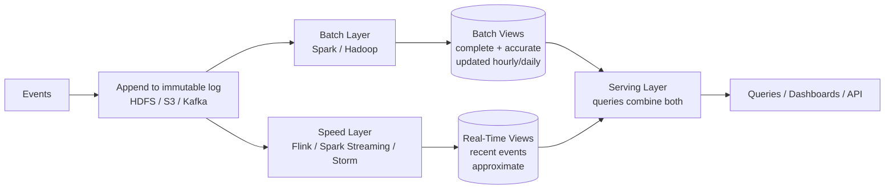
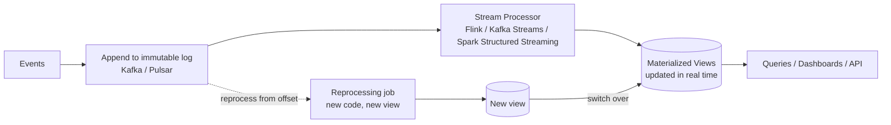

# Lambda vs Kappa Architecture

> **TL;DR** — Both are **big-data pipeline architectures** for systems that need to produce analytical or operational results from large event streams. **Lambda Architecture** (Nathan Marz, 2011) runs **two pipelines in parallel** — a *batch* layer for accurate historical results and a *speed* layer for near-real-time approximate results — combined at query time. **Kappa Architecture** (Jay Kreps, 2014) argues that with modern streaming engines (Kafka + Flink/Spark Streaming/Kafka Streams) the batch layer is unnecessary: do everything as a stream, reprocess by replaying the log. Lambda is robust but expensive — you write and maintain two pipelines computing the same thing. Kappa is leaner but demands a streaming engine you trust to do batch-like reprocessing. The honest 2026 answer for most teams: **start streaming-first (Kappa-style)**, fall back to a batch pipeline only where it earns its keep (heavy historical reprocessing, ML training, regulatory reporting). The names matter less than the underlying ideas: idempotent processing, an immutable log as the source of truth, the ability to reprocess from history.

---

## 1. Why Either Pattern Exists

The original problem: you have a continuous stream of events (clicks, transactions, sensor readings, log lines) and need to answer queries like:

- "How many unique users visited each page in the last hour, last day, last month?"
- "What's the running 99th percentile of order latency?"
- "Did this user trigger a fraud rule across all their recent activity?"
- "What's the total revenue today, this week, this quarter?"

Two competing requirements:

- **Low latency** — answers within seconds.
- **Accuracy / completeness** — over historical windows, with exactly-once or at-least-once semantics, handling late and out-of-order events.

Historically, **batch processing** (Hadoop MapReduce, nightly Spark jobs) handled the accurate-but-slow side. **Stream processing** (Storm, early Kafka) handled the fast-but-approximate side. Lambda combined them. Kappa argued the combination was no longer necessary.

---

## 2. Lambda Architecture



Three layers:

### Batch layer
- Stores the master dataset — **immutable, append-only** event log (HDFS, S3).
- Runs **batch jobs** to recompute "batch views" from scratch periodically (every hour, every day).
- Slow but **accurate**: handles late data, schema changes, full recompute.

### Speed layer
- Processes events in near real time.
- Updates **real-time views** incrementally.
- Approximate; tolerated because the batch layer eventually corrects it.

### Serving layer
- Stores batch views (low write, low latency reads) and real-time views (high write, low latency reads).
- Queries combine both: most of the answer from batch views, recent gap filled from real-time views.

Example: counting unique users per day.
- Batch layer recomputes yesterday's complete counts overnight.
- Speed layer maintains today's running count from a stream.
- Serving layer answers "unique users this week" by summing batch days + today's stream count.

### Marz's argument (2011)

Nathan Marz formalized Lambda in *Big Data*. His thesis: if you have an immutable log and recompute, you have **human-fault tolerance** — code bugs can be fixed and the batch layer can re-derive correct state. Real-time is "best-effort," batch is "ground truth."

---

## 3. Kappa Architecture



One pipeline. The stream processor reads from a durable log; views are materialized in real time. When you change processing logic:

1. Spin up a **new processor** reading the same log from the beginning (or from N days ago).
2. Materialize a parallel view.
3. When the new view catches up, switch consumers to it.
4. Tear down the old.

No batch layer. The "reprocessing" capability replaces it.

### Kreps's argument (2014)

Jay Kreps (Kafka, Confluent) argued that Lambda's complexity — two pipelines, two codebases, two skill sets, two operational burdens — was avoidable. With **Kafka** as a durable, replayable log and **Flink / Kafka Streams** as a robust stream processor, you can:

- Reprocess history by reading the log from any offset.
- Get exactly-once semantics via Kafka's transactional writes + Flink's checkpoints.
- Handle late data via event-time windows + watermarks.

So why maintain two systems? Use the stream system for both.

---

## 4. Side-by-Side

| Aspect | Lambda | Kappa |
| --- | --- | --- |
| Pipelines | Two (batch + speed) | One (stream) |
| Storage of truth | HDFS/S3 (raw events) | Kafka log (raw events) |
| Reprocessing | Batch job re-runs from raw data | Replay stream from earlier offset |
| Code duplication | Yes (batch code + stream code) | No |
| Operational complexity | Higher | Lower (in theory) |
| Latency to query | Real-time view + batch overlay | Real-time |
| Accuracy guarantee | Batch is canonical | Whatever the stream processor guarantees |
| Late data | Handled by next batch run | Handled by event-time windows + watermarks |
| Best for | Heavy historical recompute, ML training, regulatory reports | Most operational analytics, real-time dashboards, alerting |

The fundamental difference: **Lambda views batch as a source of truth**; **Kappa trusts the stream processor to be the source of truth, with replay as the recovery mechanism**.

---

## 5. When Lambda Still Makes Sense

Even Kreps acknowledged Lambda has scenarios:

- **Heavy machine-learning training** that's naturally batch (TF/PyTorch over the whole dataset).
- **Regulatory / financial reporting** with strict "this is the official number" semantics where a batch reconciliation provides comfort.
- **Hadoop-era investment** — petabytes already in HDFS, with mature Spark jobs.
- **Cross-system reconciliation** — a nightly batch reconciles streamed events against another system of record.
- **Reports that don't need real-time** — daily exec reports run once a day from a warehouse.

For these, the **data warehouse** (Snowflake, BigQuery, Redshift, Databricks Lakehouse) effectively becomes the batch layer. Modern teams often run:

- **Stream pipeline** → real-time dashboards, alerting, operational APIs.
- **Warehouse / Lakehouse** → analyst SQL, ML training, exec reports.

This is essentially Lambda by another name: streaming + warehousing. The clean separation is now between **operational** and **analytical** uses of the same events.

---

## 6. When Kappa Wins

Strong fit:
- **Operational analytics** — dashboards, alerting, real-time KPIs.
- **Event-driven services** that materialize views per their needs.
- **Most modern OLAP-light use cases.**
- **Greenfield architectures** with no Hadoop legacy.
- **Teams that can confidently operate Kafka + Flink (or equivalent).**

Greenfield teams in 2026 default to streaming-first. The classic "Lambda" two-pipeline pattern is rarely the right choice anymore.

---

## 7. The Reprocessing Problem

The whole point of either architecture is being able to fix things by reprocessing. In practice:

### Lambda
Re-run the batch job with new code. Slow but predictable. Computed against immutable raw data.

### Kappa
Spin up a new stream processor, start from offset 0 (or N days ago), let it catch up. Requires:

- Long enough Kafka retention to replay (often weeks).
- Idempotent sinks (re-deriving views doesn't double-write).
- Stream-engine support for parallel reprocessing without disrupting the active job.

Flink and Kafka Streams both support this; it's now standard. Companies routinely reprocess weeks of data this way.

---

## 8. Lake / Lakehouse and Modern Storage

Modern data platforms blur the distinction:

- **Apache Iceberg, Delta Lake, Hudi** — table formats over object storage that support streaming writes + batch reads + ACID.
- **Snowflake / BigQuery / Databricks** — managed warehouses/lakehouses where streaming ingest is first-class.
- **Materialize, RisingWave** — streaming SQL databases that maintain materialized views over event streams.

These erase the line between "batch table" and "streaming view." You can write a single SQL query that's computed incrementally as events arrive. The Lambda/Kappa debate fades — the question becomes "where do I store the data?" and "what's my freshness SLA?"

See [Lakehouse Architecture →](../04-databases/lakehouse.md), [Data Warehouses & Data Lakes →](../04-databases/warehouses-lakes.md).

---

## 9. A Modern Hybrid

What most successful teams actually run in 2026:

```mermaid
flowchart LR
    EV[Application events] --> K[Kafka log]
    K --> FLINK[Flink / Kafka Streams<br/>operational streaming]
    FLINK --> OPS[(Real-time KPIs<br/>operational dashboards<br/>alerts)]
    K --> SINK[Streaming sink<br/>(Iceberg/Delta/Hudi)]
    SINK --> WH[Data Warehouse / Lakehouse<br/>Snowflake / BigQuery / Databricks]
    WH --> AN[(Analyst SQL<br/>ML training<br/>exec reports)]
```

- Kafka is the immutable log.
- Streaming engine handles operational uses.
- Same events also land in a lakehouse for batch analytics.
- Both consume the **same source** — no duplicated business logic, just two read paths optimized for different access patterns.

This is "neither Lambda nor Kappa" — or, if you squint, it's both. The label matters less than the property: **one source of truth (the log), multiple materializations, reprocessable when code changes.**

---

## 10. Worked Example — Real-Time Counters

Counting events per dimension (page, user, country, product).

### Lambda
- All events written to S3 partitioned by hour.
- Nightly Spark job recomputes complete counts → Snowflake.
- Streaming job (Spark Streaming) maintains today's running counts → Redis.
- Dashboard query: `Snowflake counts for prior days + Redis counts for today`.

### Kappa
- All events on Kafka topic, retention 30 days.
- Flink job consumes, maintains rolling windows → keyed state + materialized to a serving store (Cassandra / RocksDB / DynamoDB).
- Reprocess: kick off Flink job from offset 0, materialize to a parallel view, switch.

The Kappa version has half the moving parts and a single codebase. The Lambda version may handle "10 years of data" recomputes more comfortably if S3 retention is cheaper than Kafka.

---

## 11. Operational Realities

Both architectures require:

- **Idempotent writes** to materialized stores (UPSERTs by event_id).
- **Schema evolution** discipline — events live forever.
- **Watermarks / late data handling** in stream processing (Flink event-time, Kafka Streams windowing).
- **Monitoring** — consumer lag, processing latency, materialization freshness, DLQ for poison events.
- **Backfill tooling** that's exercised regularly.
- **Cost control** — Kafka retention, warehouse storage, compute hours.

The architectures don't relieve you of getting these right; they shape **where** you implement them.

---

## 12. Common Mistakes / Anti-Patterns

- **Adopting Lambda without need.** Two pipelines, twice the code, same answers. Most apps don't need it.
- **Adopting Kappa without a good stream processor.** Trying to do Kappa with home-grown Kafka consumers will fail on exactly-once and late data.
- **Treating Kafka retention as infinite.** Kappa relies on replayability; design your retention for the worst reprocess scenario.
- **Code duplication between batch and stream** in Lambda — different logic in each side leads to inconsistent results. Use shared libraries.
- **No idempotency in materialized stores.** Reprocessing double-counts.
- **Ignoring late and out-of-order data.** Stream processors handle this with event-time + watermarks; using processing time silently drops data.
- **No way to reprocess.** Code changes; can't backfill. Stuck with wrong results.
- **Two pipelines computing different things.** Lambda only makes sense if both compute the same logical view; otherwise it's just two unrelated pipelines.
- **Putting business logic in batch but not stream.** Real-time misses it.
- **Materialized view explosions.** One topic, 20 views — operationally crushing.
- **Skipping schema discipline.** Events evolve; consumers break silently.
- **Forgetting cost.** Stream + warehouse + cache can balloon; model the bill.
- **Dogma about Lambda vs Kappa.** The architectures are tools. Most production systems are pragmatic hybrids.

---

## 13. Choosing — A Decision Sketch

```
Do I need historical recompute over years of data, frequently?
  yes → Lambda-style (batch + stream), with warehouse as batch layer
  no  → likely Kappa-style with Kafka + Flink/Kafka Streams

Do I have an existing Hadoop/Spark batch investment?
  yes → keep using it; layer a stream pipeline on top — looks like Lambda
  no  → start Kappa

Do my analysts query the same data as my operational dashboards?
  yes → land events in both Kafka and warehouse; one source, two readers
  no  → either is fine

Can my team operate Kafka + Flink confidently?
  yes → Kappa is leaner
  no  → managed alternatives (Confluent Cloud, Materialize, ksqlDB) or batch-leaning

Do I need < 5-second freshness on key metrics?
  yes → must include a stream layer
  no  → consider batch-only with frequent micro-batches
```

---

## 14. Cheat Card

```
LAMBDA  batch + speed in parallel; serving layer combines both.
        accurate batch overwrites approximate stream.
        Marz 2011.

KAPPA   one stream pipeline; reprocess by replay from log.
        no batch layer.
        Kreps 2014.

CORE INVARIANTS (both)
  immutable log as source of truth · idempotent writes ·
  schema discipline · reprocessable from history · late-data handling

LAMBDA SHINES
  heavy historical recompute · ML training · regulatory reports ·
  existing Hadoop investment

KAPPA SHINES
  operational analytics · real-time dashboards / alerting ·
  greenfield · teams capable of Flink/Kafka Streams

MODERN PATTERN (most teams now)
  Kafka log → Flink/Kafka Streams (operational)
            ↘ Iceberg/Delta/Hudi → Snowflake/BigQuery/Databricks (analytical)
  one source, two readers — neither Lambda nor Kappa, both ideas.

TOOLING
  log: Kafka · Pulsar · Kinesis · Redpanda
  stream: Flink · Kafka Streams · Spark Structured Streaming · Materialize · RisingWave
  batch / warehouse: Spark · Snowflake · BigQuery · Databricks · Trino
  table formats: Iceberg · Delta Lake · Hudi

ANTI-PATTERNS
  Lambda without need · Kappa with weak processor · finite-retention surprise ·
  duplicated business logic · no idempotency · processing-time semantics ·
  schema neglect · no backfill tooling

RULE: pick by operational need, not by buzzword. Default streaming-first.
       Batch where it pays — usually as a warehouse alongside, not in series.
```

---

## 15. Resources

### Books
- *Big Data: Principles and best practices of scalable realtime data systems* — Nathan Marz & James Warren. The Lambda book.
- *Designing Data-Intensive Applications* — Martin Kleppmann. Best treatment of stream vs batch.
- *Streaming Systems* — Akidau, Chernyak, Lax (Google). The streaming/late-data bible.
- *Kafka: The Definitive Guide* — Narkhede, Shapira, Palino.

### Articles
- "Questioning the Lambda Architecture" — Jay Kreps (the Kappa essay): <https://www.oreilly.com/radar/questioning-the-lambda-architecture/>
- "The Log: What every software engineer should know about real-time data's unifying abstraction" — Jay Kreps.
- "Streams and Tables Two Sides of the Same Coin" — Martin Kleppmann.
- "The Dataflow Model" — Google paper, foundational for Apache Beam / Flink.

### Videos
- "Streaming 101 / 102" — Tyler Akidau, Google.
- "Designing Data-Intensive Applications" — Kleppmann conference talks.
- "Lambda vs Kappa" — various Flink Forward / Kafka Summit talks.

### Tools
- **Logs:** Kafka, Pulsar, Kinesis, Redpanda.
- **Stream processors:** Flink, Kafka Streams, Spark Structured Streaming, ksqlDB, Materialize, RisingWave, Apache Beam.
- **Lakehouse formats:** Iceberg, Delta Lake, Hudi.
- **Warehouses:** Snowflake, BigQuery, Databricks, Redshift.

### Adjacent reading
- [Stream Processing →](../07-messaging/stream-processing.md)
- [Batch vs Stream Processing →](../07-messaging/batch-vs-stream.md)
- [Kafka Deep Dive →](../07-messaging/kafka.md)
- [Event-Driven Microservices →](./event-driven-microservices.md)
- [Data Warehouses & Data Lakes →](../04-databases/warehouses-lakes.md)
- [Lakehouse Architecture →](../04-databases/lakehouse.md)
- [Change Data Capture →](../04-databases/cdc.md)
- [Real-Time Analytics →](../19-advanced/real-time-analytics.md)

---

*Previous:* [← Ambassador & Adapter Patterns](./ambassador-adapter.md)  |  *Next:* [Domain-Driven Design (DDD) →](./ddd.md)
