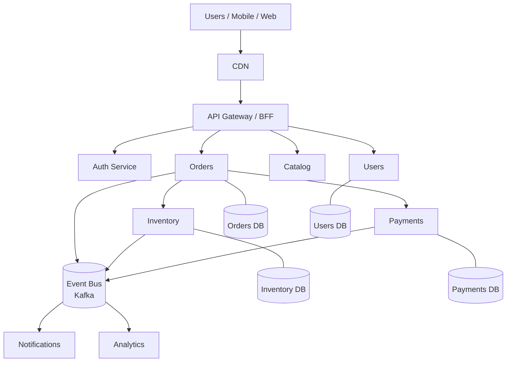

# Microservices Architecture

> **TL;DR** — A **microservices architecture** decomposes an application into many small services, each owned by a team, each deployable independently, each communicating over the network. The promise: independent teams, independent deploys, smaller blast radius, polyglot freedom, targeted scaling. The price: **distributed-systems complexity** — networks fail, transactions span services, debugging crosses 20 hops, infrastructure exists in two dimensions (per-service + cross-cutting). Microservices are not a default; they're a response to **scaling people and codebases**, not a path to "better architecture." Most teams adopt them too early and pay a tax for years. When you do adopt them, optimize for **service boundaries that match team boundaries**, prefer **async + eventual consistency** where possible, invest heavily in **observability, contracts, and platform tooling**, and accept that you've traded one class of problem (monolith change-coordination) for another (distributed correctness).

---

## 1. The Definition (and Why "Micro" Is Misleading)

The term "microservices" is a misnomer. Size doesn't define them; **independent deployability** does.

A working definition (Sam Newman):
> **Microservices are independently deployable services modeled around a business domain. They communicate via networks, hold their own data, and have explicit interfaces.**

Key properties:

- **Owned by a single team.** A team can ship a change to a service without coordinating with other teams.
- **Owns its data.** No shared database. Other services access this service's data only through its API.
- **Independently deployable.** Deploys today don't break consumers.
- **Communicates over the network.** HTTP, gRPC, async via brokers — never in-process.
- **Bounded by a business capability.** "Orders," "Payments," "Inventory" — not "RestApiUtils."

"Micro" is the wrong adjective. Services should be **the size of a team's responsibility**, which might be 1k or 100k lines of code.

---

## 2. Why Microservices Won (Where They Did)

Adoption stories that ring true:

| Driver | Example |
| --- | --- |
| **Hundreds of engineers stepping on each other in one monorepo** | Amazon (2002 mandate), Netflix (2008–2012) |
| **Different parts of the system need wildly different scaling** | Netflix recommendations vs Netflix billing |
| **Faster, safer deploys per team** | Etsy, Shopify (partially), GitLab |
| **Diverse stacks for different domains** | Uber (Python, Java, Go, Node) |
| **Strict failure isolation** | Banking-level systems requiring blast radius limits |
| **Cloud-native economics** | Pay only for the services that scale |

These all share a pattern: **organizational scaling**, not technical superiority. A monolith with 5 engineers is healthier than 20 microservices with 5 engineers. Two-pizza teams owning two-pizza services is the model.

---

## 3. The Real Costs

Microservices import nearly every problem from [Distributed Systems Theory →](../08-distributed-systems/cap-theorem.md):

- Network calls fail (timeouts, partitions, retries, idempotency).
- Distributed transactions are hard ([Saga Pattern →](../07-messaging/saga-pattern.md)).
- Strong consistency is expensive and rare across services.
- Latency adds up (10 hops × 5ms = 50ms minimum).
- Debugging requires distributed tracing.
- Schema changes require versioning across producers and consumers.
- Local development gets harder (run 30 services? mocks? docker-compose?).
- Observability is non-negotiable (you can't `grep` across services).
- Security perimeter explodes — every service is a possible attack surface.

A **monolith** has none of these problems. The question is whether you have other problems that justify trading.

---

## 4. The Canonical Architecture



Common building blocks:

- **API Gateway / BFF** — single front door, auth, routing, aggregation. See [API Gateway →](../03-apis/api-gateway.md) and [BFF →](../03-apis/bff.md).
- **Service registry / discovery** — Consul, etcd, K8s services.
- **Service mesh** — mTLS, retries, traffic shaping (Istio, Linkerd). See [Service Mesh →](../03-apis/service-mesh.md).
- **Event bus** — Kafka, Pulsar, RabbitMQ, NATS, SQS.
- **Centralized observability** — logs, metrics, traces correlated by trace ID. See [Three Pillars of Observability →](../13-observability/three-pillars.md).
- **Per-service databases** — own data, own technology.

---

## 5. Service Boundaries — The Hardest Question

Bad boundaries are the most expensive mistake. Common heuristics, ordered best-to-worst:

### Best: bounded contexts (DDD)
Identify cohesive sub-domains in the business model. Each context becomes a service (or a small cluster). The Order context owns the order lifecycle; the Inventory context owns stock; the Payments context owns charges. See [Bounded Contexts & Aggregates →](./bounded-contexts.md).

### Good: team / two-pizza ownership
Boundaries align with how the org wants to scale. "This team owns service X."

### Mediocre: technical resource type
"Users service," "Notifications service" — technical groupings that hide business rules.

### Bad: "by entity"
One service per database table. Hundreds of nano-services with chatty inter-service calls. Anti-pattern.

### Worst: "the dev team kept the names the same"
A monolith carved into services by directory, sharing the same database, still requiring lock-step deploys. The "distributed monolith." Worst of both worlds.

Conway's Law: *organizations design systems that mirror their communication structures*. Plan the org first; the architecture follows.

---

## 6. Communication Styles

Two big choices:

### Synchronous (request/response)
- HTTP/REST, gRPC.
- Caller blocks for the reply.
- Easy to reason about; tight coupling; cascading failures common.

### Asynchronous (events / messages)
- Kafka, SQS, RabbitMQ, Pub/Sub.
- Producer fires; consumers process later.
- Loose coupling, eventual consistency, harder to debug.

Reality: every mature system uses both.

| Pattern | When |
| --- | --- |
| **Sync HTTP/gRPC** | Read paths, low-latency UI calls, simple commands |
| **Async events** | State change notifications, fan-out, eventual workflows |
| **Saga** | Distributed business transactions (Order → Reserve → Charge → Ship) |
| **Outbox + CDC** | Reliably publishing events from DB writes |

Default to **async + events** for inter-service communication except where you genuinely need a synchronous reply. The pattern is *publish what happened*, *let other services react*. See [Event-Driven Microservices →](./event-driven-microservices.md).

---

## 7. Data Ownership and Distributed Transactions

The **own-your-data** principle: no service reaches into another service's database. All access via the owning service's API or via published events.

Why: shared databases create hidden coupling that destroys independent deployability. Change one column, break ten services without realizing.

Implications:

- **No JOIN across services.** Each service has only its own data. Aggregations happen via composed reads or materialized views.
- **No distributed transactions.** Two-phase commit across HTTP services is dead. Use:
  - **Sagas** — compensating actions for partial failures. See [Saga Pattern →](../07-messaging/saga-pattern.md).
  - **Outbox pattern** — atomic DB write + event publish. See [Outbox Pattern →](../07-messaging/outbox-pattern.md).
  - **Eventual consistency** — accept it as the default.
- **Data duplication.** The Orders service may cache product names; the Notifications service may cache user emails. Each service has its own view of facts. Sync via events.

If you find yourself wanting transactions across services, your boundaries are probably wrong.

---

## 8. Versioning, Contracts, and Backward Compatibility

Services evolve independently → contracts must evolve carefully.

- **Backward compatible by default.** Add fields, never remove or repurpose.
- **Tolerant reader.** Consumers ignore unknown fields.
- **Schema registries** for messages (Confluent Schema Registry, Apicurio).
- **Consumer-driven contract tests** (Pact) — consumers publish what they need; producers verify.
- **Versioned endpoints** (`/v1/orders`) when breaking changes are unavoidable. See [API Versioning →](../03-apis/versioning.md).
- **Long deprecation windows** — measured in months/quarters, not weeks.

Without these, "independent deploys" becomes "the whole house of cards just fell."

---

## 9. Reliability Patterns

A microservices system is a distributed system, so every dependency hop is a failure mode. The patterns from [Reliability & Resilience →](../11-reliability/fault-tolerance.md) are mandatory, not optional:

- **Timeouts** at every call (no infinite waits).
- **Retries with backoff + jitter.** Idempotency required.
- **Circuit breakers** to fail fast when downstream is dead.
- **Bulkheads** to limit blast radius.
- **Health checks** for LB pool management.
- **Graceful degradation** — return partial results rather than 500.
- **Idempotency keys** on POSTs.
- **Compensating actions** in sagas.

Without these, a microservice failure cascades into a multi-service outage in seconds.

---

## 10. Observability is Mandatory

In a monolith, `grep` and stack traces tell you what happened. In microservices, those tools tell you nothing.

The minimum:

- **Structured logs** with trace_id propagated across services. See [Logging →](../13-observability/logging.md).
- **Distributed tracing** end-to-end. See [Distributed Tracing →](../13-observability/tracing.md).
- **Metrics** (RED + USE) per service. See [Metrics →](../13-observability/metrics.md).
- **Alerts on SLOs** at service boundaries. See [Alerting →](../13-observability/alerting.md).
- **Service map** (auto-generated dependency graph).

Teams that adopt microservices without observability are blind. They will have outages they cannot diagnose. Build observability before service #3 ships.

---

## 11. Platform Engineering

When you go from one service to fifty, the per-service operational toil becomes the dominant cost. The response: a **platform team** that provides:

- **Service template / scaffold** — `create-service my-service` produces a working CI/CD pipeline, observability hooks, auth, deploy manifests.
- **Deployment pipeline** — same path for every service.
- **Infrastructure as code** — Terraform / Pulumi modules.
- **Service mesh** — automatic mTLS, retries, traffic shifting.
- **Shared libraries** — auth, logging, tracing, metrics, error reporting.
- **Documentation hub** — Backstage / Cortex / OpsLevel.

Without a platform, each team reinvents the wheel and the org bleeds productivity. Platform engineering is now its own discipline (Internal Developer Platforms, IDP).

---

## 12. Local Development and Testing

Hard, often underestimated.

Options:

- **Run everything locally** via docker-compose. Works up to ~10 services; collapses past that.
- **Run your service + mocks for the rest.** Mocks drift from reality; bugs show up only in staging.
- **Shared remote dev environments.** Each developer has a slice of a real cluster.
- **Service virtualization** (WireMock, Hoverfly).
- **Contract tests + ephemeral environments per PR.**

Modern teams trend toward "code locally, run remotely" — write code in your editor, deploy to a personal namespace in K8s, exercise against real downstream services. Vendor tools: Tilt, Skaffold, Garden, Telepresence.

Testing strategy:

- **Unit tests** per service.
- **Integration tests** per service (real DB, mocked downstream).
- **Contract tests** between producer/consumer.
- **End-to-end** sparingly, in a staging environment.

---

## 13. Migration: Monolith → Microservices

A common journey:

1. **Strangler Fig pattern** — incrementally peel services off the monolith. See [Strangler Fig →](./strangler-fig.md).
2. Carve **read paths** first (less risky than writes).
3. Carve **bounded contexts**, not technical layers.
4. Use the **outbox pattern** to bridge monolith and services.
5. Keep a single source of truth during migration (the monolith DB), then split.
6. Migrate one service at a time; resist a "big rewrite."

Take 2–4 years for a substantial migration. Quarter-by-quarter wins.

When **not** to migrate:
- Small teams (< 20–30 engineers).
- Stable, scaling-OK monolith.
- No team boundary problem.
- No domain complexity requiring isolation.

A modular monolith is often the better intermediate (Shopify, Basecamp). See [Monolith vs Microservices vs Serverless →](../01-foundations/monolith-microservices-serverless.md).

---

## 14. Common Mistakes / Anti-Patterns

- **Distributed monolith.** Services that must deploy together; shared DB; tight in-memory contracts. All the costs of microservices, none of the benefits.
- **Premature decomposition.** Splitting before you understand the domain, before team boundaries demand it.
- **Nano-services.** One endpoint per service. Latency, debugging, ops nightmare.
- **Service-per-table.** Decomposed by data, not by domain.
- **Shared database.** Defeats independent deployability and data ownership.
- **Sync chains 10 deep.** One request hits 10 services serially. Latency adds up; one slow hop kills everything.
- **No retries / timeouts / circuit breakers.** Cascading failures.
- **Sync where async would do.** Tight coupling, fragile chains.
- **No idempotency on POSTs.** Retries duplicate work.
- **No tracing.** Debugging requires god-mode access to many systems.
- **One platform per team.** Each team rolls its own CI, K8s manifests, observability stack. Massive waste.
- **Breaking changes without consumer-driven contract tests.** Production smoke tests in the worst sense.
- **No SLOs at service boundaries.** Reliability is "whatever each team feels."
- **Polyglot for sport.** Eight languages, no shared infra. Hire pain, ops pain.
- **Forgetting Conway's Law.** Architecture and org structure conflict; the org wins.
- **Security perimeter only at the edge.** Internal calls assumed trusted. Move to [Zero Trust →](../12-security/zero-trust.md).
- **No data lifecycle strategy.** Each service stores user data; deletion / GDPR coordination is a nightmare.

---

## 15. When Microservices Are Right

You should consider microservices when **at least two** of these are true:

- 50+ engineers stepping on each other in one codebase.
- Different parts of the system need radically different scaling.
- Different parts have radically different reliability/security needs.
- You need many independent deploy cadences (some teams ship hourly, some monthly).
- Domain naturally splits into well-bounded contexts.
- The cost of a monolith outage is unacceptable, but isolating it would be tractable.

You probably shouldn't if:

- < 20 engineers.
- Domain is uniform, simple.
- One team owns everything.
- "Tech debt" is the framing — microservices don't fix that.

---

## 16. Cheat Card

```
MICROSERVICES = independently deployable services modeled around business capabilities.
                "micro" is misleading; size = team-sized.

CORE PROPERTIES
  own deploys · own data · network boundaries · explicit contracts
  bounded by domain, not by entity

PRICE        distributed systems problems (timeouts, partial failure, sagas, eventual consistency)
              observability mandatory · platform team usually mandatory
              local dev gets harder

COMMUNICATE
  sync       HTTP/gRPC for low-latency reads / immediate replies
  async      events/Kafka for state changes — preferred default

DATA         each service owns its DB.  no JOINs, no shared schemas.
              cross-service workflows = sagas + outbox + idempotency

CONTRACTS    backward compatible · tolerant reader · schema registry
              consumer-driven contract tests (Pact)

RELIABILITY  timeout · retry+jitter · circuit breaker · bulkhead · idempotency
              graceful degradation · health checks · SLOs per service

OBSERVABILITY trace_id everywhere · distributed tracing · RED/USE per service ·
              service map · SLO-based alerts

BOUNDARIES   align with bounded contexts AND teams (Conway's Law)
              NOT by entity, NOT by technical layer

DISTRIBUTED MONOLITH = the worst of both worlds.  Always check.

WHEN TO ADOPT
  50+ engineers · diverse scaling needs · diverse deploy cadences ·
  clear bounded contexts · cost of monolith change-coordination too high

WHEN NOT TO
  < 20 engineers · uniform domain · single team · "for the resume"

RULE: microservices solve organizational problems, not architectural ones.
       Default to a modular monolith; carve services where the org demands it.
```

---

## 17. Resources

### Books
- *Building Microservices* — Sam Newman. The canonical book.
- *Monolith to Microservices* — Sam Newman. The migration companion.
- *Microservices Patterns* — Chris Richardson. Pattern catalog.
- *Designing Data-Intensive Applications* — Martin Kleppmann. The bedrock for the distributed-systems half.
- *Release It!* — Michael Nygard. Stability patterns.
- *Team Topologies* — Skelton & Pais. The org-architecture link.

### Documentation
- **AWS Microservices** — <https://aws.amazon.com/microservices/>
- **microservices.io** — Chris Richardson's pattern catalog: <https://microservices.io/>
- **Twelve-Factor App** — <https://12factor.net/>
- **Backstage** — Spotify's developer portal: <https://backstage.io/>

### Articles
- "Microservices" — Martin Fowler & James Lewis (2014): <https://martinfowler.com/articles/microservices.html>
- "MonolithFirst" — Martin Fowler.
- "Microservices Trade-Offs" — Fowler.
- "Don't start with microservices — monoliths are your friend" — Arnold Galovics.
- "How Netflix Thinks of DevOps" — Dianne Marsh, Netflix.
- "Goodbye Microservices: From 100s of problems to 1" — Segment engineering (they consolidated back).
- "Shopify's Modular Monolith" — Shopify engineering.

### Videos
- Sam Newman — multiple talks on microservices and migration.
- "Mastering Chaos: A Netflix Guide to Microservices" — Josh Evans, QCon.
- "The Microservices Tax" — various conference talks (cautionary tales).

### Tools
- **Service mesh:** Istio, Linkerd, Consul Connect.
- **Discovery:** Consul, etcd, K8s services.
- **Brokers:** Kafka, RabbitMQ, NATS, Pulsar.
- **Tracing:** Jaeger, Tempo, Datadog APM, Honeycomb.
- **Contracts:** Pact, Spring Cloud Contract.
- **Platform / IDP:** Backstage, Cortex, Humanitec, Kratix.
- **Dev tooling:** Tilt, Skaffold, Telepresence, Garden.

### Adjacent reading
- [Monolith vs Microservices vs Serverless →](../01-foundations/monolith-microservices-serverless.md)
- [Service-Oriented Architecture →](./soa.md)
- [Event-Driven Microservices →](./event-driven-microservices.md)
- [Strangler Fig Pattern →](./strangler-fig.md)
- [Bounded Contexts & Aggregates →](./bounded-contexts.md)
- [Saga Pattern →](../07-messaging/saga-pattern.md)
- [Outbox Pattern →](../07-messaging/outbox-pattern.md)
- [API Gateway →](../03-apis/api-gateway.md)
- [Service Mesh →](../03-apis/service-mesh.md)
- [Three Pillars of Observability →](../13-observability/three-pillars.md)

---

*Previous:* [← Clean Architecture / Onion](./clean-architecture.md)  |  *Next:* [Service-Oriented Architecture (SOA) →](./soa.md)
