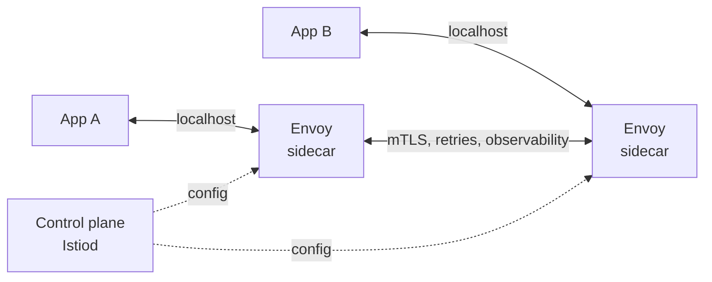

# Sidecar Pattern

> **TL;DR** — A **sidecar** is a separate process or container deployed **alongside** a main application, sharing its lifecycle (same pod, same VM, same machine) and providing cross-cutting infrastructure capabilities — TLS, observability, configuration, secrets, service-mesh proxying, log shipping. The app keeps doing its job; the sidecar augments it without library dependencies. Sidecars are the dominant pattern for service mesh proxies (Envoy in Istio/Linkerd), logging agents (Fluent Bit, Vector), secrets injectors (Vault Agent), and dev tooling. Trade-offs: extra latency (one hop through localhost), extra memory per pod, deployment complexity. New trends — eBPF and **ambient mesh** (Istio Ambient, Cilium) — push some sidecar functions back into the node kernel to reduce overhead. Used judiciously, sidecars give you language-agnostic infrastructure without bloating the app.

---

## 1. The Idea

```
┌─────────────────────────────────────────────────────────────────┐
│                       Pod / VM / Host                           │
│                                                                 │
│    ┌──────────────────┐         ┌──────────────────┐            │
│    │                  │         │                  │            │
│    │    Main app      │◄──────► │    Sidecar       │            │
│    │   (business      │ shared  │   (infra:        │            │
│    │    logic)        │ network │    mesh proxy,   │            │
│    │                  │   FS    │    log shipper,  │            │
│    │                  │  signals│    secrets, ...) │            │
│    │                  │         │                  │            │
│    └──────────────────┘         └──────────────────┘            │
│                                                                 │
└─────────────────────────────────────────────────────────────────┘
```

The app and sidecar:

- Run as separate processes/containers.
- Share **network namespace** (localhost), **filesystem** (mounted volume), and **lifecycle** (start/stop together).
- Communicate over loopback (HTTP, gRPC, Unix sockets) or shared files.

The principle is **single responsibility, separately deployed**: the app focuses on its business logic; the sidecar handles infrastructure concerns.

---

## 2. Why Sidecars Exist

Three drivers:

### Cross-cutting concerns that don't belong in app code
TLS, retries, observability, secrets, auth — every service needs them. Implementing in each app:
- Multiplies code in many languages.
- Couples app code to infrastructure libraries.
- Forces lock-step upgrades.

A sidecar handles them externally.

### Polyglot environments
A team running Go, Java, Python, Node services can't realistically maintain 4 versions of every infra library. One sidecar serves all.

### Operational decoupling
Sidecar can be updated independently of the app. The Envoy proxy in Istio is updated via mesh control plane, not via app deploys.

---

## 3. Common Sidecar Use Cases

| Sidecar | What it does | Examples |
| --- | --- | --- |
| **Service mesh proxy** | mTLS, retries, traffic shifting, telemetry between services | Envoy (Istio, Consul), Linkerd-proxy |
| **Log/metrics shipper** | Tail app logs, ship to aggregator | Fluent Bit, Vector, Promtail, Datadog Agent |
| **Secrets injector** | Fetch and refresh secrets, mount as files | Vault Agent, AWS Secrets Manager CSI driver |
| **Auth proxy** | Handle OAuth/OIDC, attach identity headers | oauth2-proxy, Pomerium, Cloudflare Access |
| **Reverse proxy / TLS terminator** | TLS off-load, header transform | Envoy, Nginx, Caddy |
| **Service discovery / connection pooler** | Discover services, hold pooled connections | HAProxy, pgBouncer (DB), Consul Connect |
| **Config syncer** | Fetch and refresh configuration | Confd, Consul Template, Reloader |
| **Database connection proxy** | Pool, route, fail over | PgBouncer, AWS RDS Proxy (as sidecar) |
| **Backup / snapshot agent** | Periodic backups, ship to storage | Velero workers, custom |
| **Dev-time tooling** | Hot reload, debugger bridge | Telepresence, devspace |

For Kubernetes specifically, sidecars are everywhere. Most production pods run 2+ containers — the app and at least an Envoy proxy.

---

## 4. The Canonical Example: Service Mesh

Service-mesh sidecars (Envoy in Istio, linkerd-proxy in Linkerd) are the most-deployed sidecar pattern in the world.



The flow for `App A → App B`:

1. App A makes a normal HTTP call to `app-b:8080`.
2. Outbound iptables (or `ip rules` / eBPF) intercepts and redirects to local Envoy.
3. Envoy resolves `app-b` via service mesh discovery.
4. Envoy connects to App B's Envoy via mTLS.
5. App B's Envoy forwards to App B's localhost.

The apps think they're making plain HTTP calls. The sidecars provide:

- **mTLS** between services (zero-trust).
- **Retries / timeouts / circuit breaking.**
- **Load balancing across replicas.**
- **Telemetry** (RED metrics, traces).
- **Traffic shifting** (canary, mirror, A/B).
- **Authorization policies** (which services can call which).

See [Service Mesh →](../03-apis/service-mesh.md) and [Zero Trust Architecture →](../12-security/zero-trust.md).

---

## 5. Kubernetes Sidecars in Practice

A typical pod with sidecars:

```yaml
apiVersion: v1
kind: Pod
spec:
  containers:
  - name: app
    image: myorg/myservice:1.0
    ports: [{containerPort: 8080}]
    volumeMounts:
    - { name: logs, mountPath: /var/log/app }
    - { name: secrets, mountPath: /vault/secrets }
  - name: envoy           # service-mesh sidecar
    image: envoyproxy/envoy:v1.30
    ports: [{containerPort: 15001}]
  - name: fluent-bit      # log-shipper sidecar
    image: fluent/fluent-bit:3.0
    volumeMounts:
    - { name: logs, mountPath: /var/log/app, readOnly: true }
  - name: vault-agent     # secrets sidecar (or init container)
    image: hashicorp/vault:1.16
    volumeMounts:
    - { name: secrets, mountPath: /vault/secrets }
  volumes:
  - name: logs   ; emptyDir: {}
  - name: secrets; emptyDir: {medium: Memory}
```

Patterns visible here:

- **Shared volumes** for inter-container communication (log dir, secrets dir).
- **emptyDir + memory** for secrets — pod-local, ephemeral, not on disk.
- **Sidecars usually injected automatically** by a mutating webhook (Istio injector, Vault injector) rather than written by hand.
- **Resource overhead** — each sidecar uses CPU and RAM. 5 sidecars × 50 MB = 250 MB per pod, × 1000 pods = noticeable.

### Sidecar containers vs init containers

- **Init containers** run **before** main containers, exit, then the main containers start.
- **Sidecar containers** run **alongside** main containers for the lifetime of the pod.

Kubernetes 1.28+ introduced first-class **sidecar containers** (`restartPolicy: Always` on init containers) — they start before main containers and stay running. This fixes long-standing race conditions with logging and proxy sidecars (e.g., logs lost on shutdown because the shipper exited first).

---

## 6. Communication Patterns

How the app talks to the sidecar:

| Mechanism | Use |
| --- | --- |
| **Localhost HTTP** | Most common — app calls `http://localhost:N` to reach the sidecar |
| **Unix domain socket** | Lower latency, no TCP overhead |
| **Shared file/volume** | Sidecar writes a config or secret file; app reads it |
| **iptables redirect** | Transparent — app does normal egress; iptables routes through sidecar |
| **eBPF redirect** | Same as iptables but kernel-level, faster |
| **Signals (SIGHUP)** | Sidecar tells app to reload |

Service mesh proxies use iptables redirection so apps don't need to know the sidecar exists. Log shippers use shared volumes. Secrets injectors use shared volumes + signals.

---

## 7. Trade-offs

### Pros

- **Language-agnostic.** One Envoy / Fluent Bit / Vault Agent across 8 languages.
- **Decoupled lifecycle.** Upgrade sidecar without app rebuild.
- **Operational consistency.** Same observability stack everywhere.
- **Polyglot teams can share infra.** Platform team owns the sidecar; product teams stay focused.
- **Zero-trust enforcement.** mTLS via sidecar without app changes.

### Cons

- **Latency.** Even localhost adds microseconds; mesh sidecar adds ~0.5–2 ms per hop typically.
- **Memory and CPU.** Each sidecar consumes resources, multiplied by every pod.
- **Complexity.** More processes to operate, debug, observe.
- **Startup ordering.** Apps that call out before the sidecar is ready hit errors (mitigated by sidecar containers in K8s 1.28+).
- **Update coordination.** Some changes still need both app and sidecar coordinated.
- **Per-pod scaling cost.** 1000 pods × 50 MB sidecar = 50 GB extra memory.

For a small team or low service count, the overhead may not be worth it. For platforms with hundreds of services across many languages, sidecars are decisive wins.

---

## 8. Sidecar vs Library vs Daemon

Three ways to provide cross-cutting infra:

| Approach | Pro | Con |
| --- | --- | --- |
| **In-process library** | Lowest latency, simplest deploy | One per language; tight coupling; tight lifecycle |
| **Sidecar per pod** | Language-agnostic, decoupled lifecycle | Memory overhead per pod |
| **Daemon per node** (DaemonSet) | One instance per node, lowest overhead | Shared across all pods on node; isolation weaker |

Often the choice is sidecar (Envoy per pod) vs daemon (Cilium per node, Fluent Bit per node). The right answer depends on isolation needs:

- **Per-tenant / per-app isolation needed** → sidecar.
- **Pure efficiency, shared infra** → daemon.

---

## 9. The Move Toward Ambient / Sidecar-less Mesh

The sidecar tax — memory and CPU per pod — became painful at scale. Two responses:

### Istio Ambient
Replace the per-pod sidecar with two node-level components:
- **ztunnel** — per-node L4 mTLS proxy.
- **Waypoint** — optional per-namespace L7 proxy (only deployed when L7 features needed).

Result: most pods don't carry an Envoy. Memory drops significantly.

### Cilium Service Mesh
Uses **eBPF** at the node kernel for many tasks that sidecars previously did (L4 routing, mTLS, observability). Some L7 features still use Envoy at the node level.

### Linkerd vs Istio sidecar size
Linkerd's `linkerd2-proxy` is famously small (~10 MB memory, written in Rust) — already mitigates the sidecar cost.

What hasn't gone away: log shippers, secrets injectors, auth proxies — these remain as sidecars (or DaemonSets) because they're specific to the workload, not just the network layer.

The pattern still matters; the network-mesh implementation is evolving. Watch this space.

---

## 10. Worked Example — Vault Agent as a Sidecar

A K8s deployment using Vault Agent to provide refreshed secrets to the app via a file:

```yaml
apiVersion: apps/v1
kind: Deployment
spec:
  template:
    metadata:
      annotations:
        vault.hashicorp.com/agent-inject: "true"
        vault.hashicorp.com/role: "myapp"
        vault.hashicorp.com/agent-inject-secret-db: "kv/data/myapp/db"
        vault.hashicorp.com/agent-inject-template-db: |
          {{- with secret "kv/data/myapp/db" -}}
          DB_USER={{ .Data.data.user }}
          DB_PASSWORD={{ .Data.data.password }}
          {{- end -}}
    spec:
      containers:
      - name: app
        image: myorg/myapp:1.0
        # reads /vault/secrets/db on startup and on SIGHUP
```

The Vault mutating webhook injects a `vault-agent` sidecar that:
- Authenticates to Vault using K8s service-account JWT.
- Fetches the secret.
- Renders it to `/vault/secrets/db`.
- Refreshes before expiry.
- Sends SIGHUP to the app to reload.

App code doesn't import a Vault SDK. The infra concern lives in the sidecar.

See [Secrets Management →](../12-security/secrets-management.md).

---

## 11. Anti-Patterns

- **Sidecar that owns business logic.** Sidecars are for cross-cutting infra. Business code belongs in the app.
- **Three sidecars duplicating work.** Two log shippers, two metrics agents. Audit and consolidate.
- **Sidecar too heavyweight.** A 500 MB sidecar in every 1000 pods of a fleet = 500 GB wasted. Right-size.
- **No startup ordering.** App calls out before mesh proxy is ready; first requests fail. Use K8s sidecar containers (1.28+) or readiness gates.
- **No graceful shutdown.** Sidecar terminates before app finishes flushing logs / draining; logs lost. Coordinate via `preStop` hooks.
- **App tightly coupled to sidecar address/port.** Hardcoded `localhost:15001`. Use env vars or service mesh conventions.
- **Sidecar reaches back to control plane on hot path.** Latency hit on every request. Cache configs locally.
- **Sidecar without observability.** It's another process; it can fail. Monitor its health, memory, CPU.
- **"Just one more sidecar."** Five sidecars per pod becomes a per-pod monolith. Consolidate where possible.
- **Sidecar updates done in lockstep with app deploys.** Defeats the decoupling benefit.
- **Manual sidecar injection.** Fragile; prefer mutating webhooks (Istio, Vault, Linkerd) so injection is automatic and consistent.
- **Confusing sidecar with init container.** Init runs once before main. Sidecar lives alongside. Different patterns.

---

## 12. When to Use Sidecars

Use a sidecar when:
- The capability is **infrastructure**, not business logic.
- It's needed by **many services**, especially across languages.
- You want **decoupled lifecycle** (upgrade independently).
- The latency / memory cost is acceptable for the benefit.

Don't use a sidecar when:
- A library would do, and you have one language.
- The latency budget is sub-millisecond and the sidecar adds 1+ ms.
- Memory budget is tight per pod (large fleets, IoT devices).
- The capability is so simple (`uuid` generation) that a sidecar is absurd.

For shared infra across nodes (CNI, log forwarders), a **DaemonSet (one per node)** often beats a sidecar.

---

## 13. Common Mistakes / Anti-Patterns

(See list in §11 — the cardinal sins are heavyweight sidecars, ordering bugs at startup/shutdown, business logic in sidecars, and over-consolidating or over-multiplying them.)

Additional:

- **Sidecar storing state on local disk.** Pod restarts → state lost. Use persistent volumes or shared state stores.
- **No per-environment overrides.** Same sidecar config in dev and prod; one breaks.
- **Sidecar consuming the app's port via localhost loopback inadvertently** — port conflicts cause head-scratching.
- **Treating sidecar configuration as code-only.** Operations need to tune it without redeploying the app; expose via config maps or control plane.

---

## 14. Cheat Card

```
SIDECAR  separate process/container alongside the main app, sharing
         lifecycle and (often) network/FS — provides cross-cutting infra.

EXAMPLES
  service mesh    Envoy (Istio, Consul Connect), linkerd-proxy
  log shipper     Fluent Bit, Vector, Promtail, DD Agent
  secrets         Vault Agent, AWS Secrets Manager CSI
  auth proxy      oauth2-proxy, Pomerium, Cloudflare Access
  TLS terminator  Envoy, Nginx, Caddy
  config syncer   Consul Template, Confd

COMMUNICATION
  localhost HTTP/gRPC · Unix socket · shared volume · iptables/eBPF redirect

PROS
  language-agnostic · decoupled lifecycle · platform-owned infra · zero-trust
CONS
  per-pod memory/CPU · added latency · startup ordering · debug complexity

K8s SPECIFIC
  init containers run BEFORE app; sidecar containers (1.28+) run ALONGSIDE
  mutating webhooks inject sidecars automatically (Istio injector, Vault)
  shared volumes (emptyDir, memory-medium) for logs/secrets

ALTERNATIVES
  in-process library — fast but per-language
  per-node daemon (DaemonSet) — efficient, weaker isolation

TREND   sidecar tax → ambient mesh / eBPF push network features to node level
        log/secrets/etc still sidecars (or daemons)

ANTI-PATTERNS
  business logic in sidecar · 5+ sidecars per pod · ordering bugs ·
  hardcoded localhost ports · no graceful shutdown · no health monitoring ·
  manual injection ·  state on local disk

RULE: sidecar = cross-cutting infra, not domain logic.
       Inject automatically; observe like any other workload.
```

---

## 15. Resources

### Books
- *Cloud Native Patterns* — Cornelia Davis.
- *Kubernetes Patterns* — Bilgin Ibryam, Roland Huß. Chapter on sidecar.
- *Istio in Action* — Christian Posta, Rinor Maloku.
- *Linkerd Reference* — Buoyant.

### Documentation
- **Kubernetes Sidecar Containers** — <https://kubernetes.io/docs/concepts/workloads/pods/sidecar-containers/>
- **Istio Sidecar Injection** — <https://istio.io/latest/docs/setup/additional-setup/sidecar-injection/>
- **Istio Ambient Mesh** — <https://istio.io/latest/docs/ambient/>
- **Linkerd Architecture** — <https://linkerd.io/2/reference/architecture/>
- **Vault Agent Injector** — <https://developer.hashicorp.com/vault/docs/platform/k8s/injector>
- **Cilium Service Mesh** — <https://docs.cilium.io/en/stable/network/servicemesh/>

### Articles
- "Pattern: Service Sidecar" — microservices.io.
- "Sidecar pattern" — Microsoft Azure Architecture Center.
- "The end of the sidecar (maybe)" — various 2023–2024 takes on ambient mesh.
- "Designing distributed systems" — Brendan Burns (Microsoft).

### Videos
- "Sidecars for Productivity at Lyft" — Matt Klein (Envoy creator).
- "Istio Ambient Mesh deep dive" — Solo.io / Istio talks.
- "Service Mesh at Scale" — various KubeCon talks.

### Tools
- **Service mesh:** Istio, Linkerd, Consul Connect, Cilium Service Mesh, Kuma.
- **Logging:** Fluent Bit, Vector, Promtail.
- **Secrets:** Vault Agent, External Secrets Operator, CSI Secrets Store.
- **Auth proxies:** oauth2-proxy, Pomerium, Cloudflare Access, AWS ALB OIDC.
- **Database proxies:** PgBouncer, AWS RDS Proxy, ProxySQL.

### Adjacent reading
- [Service Mesh →](../03-apis/service-mesh.md)
- [Microservices Architecture →](./microservices.md)
- [Ambassador & Adapter Patterns →](./ambassador-adapter.md)
- [Zero Trust Architecture →](../12-security/zero-trust.md)
- [Secrets Management →](../12-security/secrets-management.md)
- [Logging Best Practices →](../13-observability/logging.md)
- [Centralized Log Aggregation →](../13-observability/log-aggregation.md)

---

*Previous:* [← Strangler Fig Pattern](./strangler-fig.md)  |  *Next:* [Ambassador & Adapter Patterns →](./ambassador-adapter.md)
