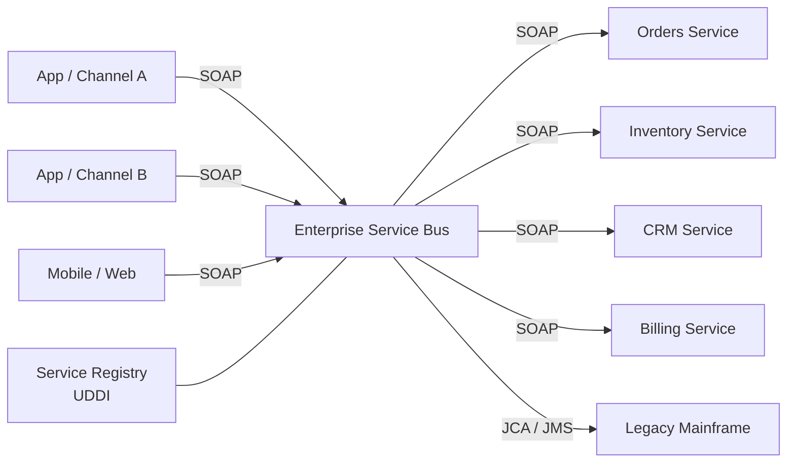

# Service-Oriented Architecture (SOA)

> **TL;DR** — **SOA** (Service-Oriented Architecture) is the enterprise-grade ancestor of microservices: applications composed of network-accessible services with formal contracts, often coordinated by an **Enterprise Service Bus (ESB)**. Born in the late 1990s, peaking in the 2000s, SOA emphasized standardized protocols (SOAP, WSDL, XML), centralized integration, and reuse across the entire enterprise. It produced both real wins (decoupled departments, standardized data, contract-first thinking) and infamous failures (ESB-as-bottleneck, vendor lock-in, change paralysis). Microservices descended from SOA but consciously rejected the heavyweight middleware and central governance. Understanding SOA matters because: (1) many enterprises still run SOA-shaped systems you'll integrate with, (2) the principles — contracts, capability-driven services, governance — are still right, and (3) seeing where SOA went wrong helps avoid microservices' equivalents.

---

## 1. SOA, Defined

A reasonable definition:

> SOA is an architectural style where business functionality is exposed as **reusable, network-accessible services** with **formal contracts**, and where applications are composed by orchestrating these services.

The core ideas — services as integration units, contracts as the source of truth, services aligned to business capabilities — are sound. Microservices kept them.

What SOA also typically included (and microservices rejected):

- **Heavy middleware** — Enterprise Service Bus.
- **Synchronous, request/response interactions** as the default.
- **Coarse-grained services** sharing one big enterprise data model.
- **Centralized governance** — committees, standards bodies, service registries.
- **Standardized protocols** — SOAP, WSDL, UDDI, XML Schema, BPEL.
- **WS-\* family** — WS-Security, WS-Trust, WS-AtomicTransaction, ~30 specs.

---

## 2. The Canonical SOA Diagram



The **ESB** sits in the middle: every service-to-service call passes through it. The bus performs:

- Routing (which service handles this request).
- Protocol translation (HTTP ↔ JMS ↔ MQ ↔ FTP).
- Message transformation (XML schemas mapped).
- Authentication and policy enforcement.
- Logging and audit.
- Sometimes orchestration (BPEL workflows).

This shape was the dominant integration architecture in large enterprises from ~2002 to ~2012.

---

## 3. The Eight SOA Principles (Erl, simplified)

Thomas Erl codified SOA in the 2000s. The principles still resonate:

1. **Standardized service contracts** — interfaces are explicit, formal, versioned.
2. **Loose coupling** — services depend on contracts, not implementations.
3. **Abstraction** — internals hidden behind the contract.
4. **Reusability** — services designed for multiple consumers.
5. **Autonomy** — services control their own logic and data.
6. **Statelessness** — minimize per-conversation state at the service.
7. **Discoverability** — services discoverable via registry / metadata.
8. **Composability** — services compose into larger flows.

These line up with modern microservices principles almost exactly. The execution is what changed.

---

## 4. SOA vs Microservices

| Aspect | SOA (classical) | Microservices |
| --- | --- | --- |
| Service granularity | Coarse, enterprise-wide capabilities | Fine, team-owned |
| Communication | Mostly synchronous SOAP via ESB | HTTP/gRPC + async events |
| Integration intelligence | In the bus ("smart pipes, dumb endpoints") | In the endpoints ("dumb pipes, smart endpoints") |
| Data model | Often shared enterprise canonical model | Each service owns its model |
| Governance | Central, committee-driven | Federated, team-driven |
| Protocols | SOAP, XML, WS-\*, WSDL | REST/JSON, gRPC/Protobuf, async events |
| Deployment | Shared app server / ESB | Independent containers / functions |
| Team ownership | Many teams share infrastructure | One team per service |
| Tooling | IBM, Oracle, TIBCO, Software AG, Mule | OSS-heavy (Spring Boot, Kafka, K8s) |
| Cadence | Long release cycles | Continuous deployment |

Sam Newman: *"SOA was right; the implementations were wrong."* The pendulum-swing was: kill the central bus, push intelligence into services, allow async communication via lightweight brokers, give teams autonomy. That's microservices.

---

## 5. The Enterprise Service Bus (ESB)

The ESB was the most visible artifact of SOA — and the most criticized.

A typical ESB (IBM Integration Bus, TIBCO BusinessWorks, Oracle Service Bus, Mule, Spring Integration) provided:

- **Mediation flows** that intercept messages, transform them, route them.
- **Adapter library** for legacy systems (mainframe, ERP, MQ).
- **Orchestration engine** running BPEL workflows.
- **Centralized monitoring and policy.**

What went wrong:

- **Bottleneck.** Every service-to-service call passes through the bus → single point of failure and performance ceiling.
- **Central team owns the bus.** Cross-team changes require a ticket to the "ESB team." Adoption velocity collapses.
- **Vendor lock-in.** Logic encoded in proprietary mediation languages.
- **Business logic creeps into the bus.** "Just add this routing rule." Five years later, the bus contains business rules no service owns.
- **Cost.** Licensing, infrastructure, ESB experts.
- **Hard to test.** Mediation flows opaque to standard tooling.

The microservices reaction: **dumb pipes (Kafka, REST), smart endpoints**. Don't centralize integration logic.

That said, message brokers, API gateways, and service meshes are arguably the modern, distributed ESB — they handle routing, transformation, and policy without being a single point of contention. So the *role* of the ESB lives on; the *deployment shape* changed.

---

## 6. SOAP, WSDL, and the WS-\* Family

SOAP (Simple Object Access Protocol) was the canonical SOA protocol — XML over HTTP (mostly). A SOAP request:

```xml
<soapenv:Envelope xmlns:soapenv="http://schemas.xmlsoap.org/soap/envelope/">
  <soapenv:Header>
    <wsse:Security>... credentials ...</wsse:Security>
  </soapenv:Header>
  <soapenv:Body>
    <ord:PlaceOrder>
      <ord:UserId>42</ord:UserId>
      <ord:Items>
        <ord:Item><ord:Sku>ABC</ord:Sku><ord:Qty>2</ord:Qty></ord:Item>
      </ord:Items>
    </ord:PlaceOrder>
  </soapenv:Body>
</soapenv:Envelope>
```

Properties:

- **WSDL** (Web Services Description Language) — formal XML contract describing operations, types, bindings.
- **UDDI** — registry of services. Largely abandoned.
- **WS-\* specs** — security (WS-Security), reliable messaging (WS-RM), transactions (WS-AtomicTransaction), addressing (WS-Addressing), policy (WS-Policy), and dozens more.

What it got right: rigorous contracts, schema-validated payloads, support for end-to-end security across mediators.

What it got wrong: verbosity (XML), complexity (just authenticating a message could require multiple specs), tool dependence (generated code from WSDL was the norm), slow iteration cycles.

REST + JSON won the public web because it was simpler. Inside enterprises, SOAP lingers — and you'll encounter it integrating with bank APIs, government systems, healthcare backbones, telcos, and legacy Oracle/SAP/IBM stacks.

---

## 7. Orchestration vs Choreography

A core SOA debate, still alive in microservices:

### Orchestration
A central controller calls services in order:

```
Orchestrator → ValidateOrder → ReserveInventory → ChargePayment → ShipOrder
```

Languages: BPEL (Business Process Execution Language), workflow engines (Camunda, Temporal, Step Functions).

### Choreography
Services react to events, no central controller:

```
OrderPlaced event → inventory reserves → InventoryReserved event → payment charges → PaymentSucceeded → shipping ships
```

| | Orchestration | Choreography |
| --- | --- | --- |
| Control | Centralized | Distributed |
| Visibility | Single workflow source | Many event consumers |
| Coupling | Orchestrator knows all | Loose; producers don't know consumers |
| Best for | Complex flows, sagas with compensations, regulated workflows | Reactive systems, fan-out, event sourcing |

Most real systems mix. Long, business-critical flows (payment processing, claims) → orchestration. Reactive notifications, fan-outs → choreography. See [Event-Driven Microservices →](./event-driven-microservices.md) and [Saga Pattern →](../07-messaging/saga-pattern.md).

---

## 8. SOA's Real Wins

It's fashionable to dunk on SOA. But the wins were real:

- **Decoupled departments.** Different lines of business could integrate without merging codebases.
- **Standardized data models.** Customer-360 efforts, canonical product schemas — useful artifacts for analytics and operations.
- **Contract-first thinking.** The discipline of agreeing on a contract before writing code is valuable.
- **Integration of legacy systems.** ESB adapters made mainframes usable from new web apps.
- **Reusability** — same loan-calculation service across web, branch, mobile, partner.

Many enterprises that "moved off SOA to microservices" actually kept the SOA principles and replaced the implementation.

---

## 9. SOA's Real Failures

Equally real:

- **ESB became a monolith with extra steps.** Centralized, fragile, slow to change.
- **Canonical data models** became fights to merge incompatible schemas; took years.
- **Governance committees** slowed everything to crawl.
- **Reusability rarely materialized** as imagined. Services designed "for reuse" became overgeneralized and hard to evolve.
- **Vendor lock-in** plus 7-figure license bills.
- **WS-\* spec proliferation** made interoperability theoretical, not practical.
- **BPEL workflows** ended up containing critical business logic in XML files no developer wanted to maintain.

These failures pushed the industry toward microservices.

---

## 10. SOA Today

Most enterprises with serious SOA investments (banks, telcos, insurers, healthcare) still run SOA-shaped systems. They typically:

- Keep the SOAP services for legacy interop.
- Wrap them with REST/JSON gateways for new development.
- Migrate the ESB workflows to event-driven patterns over time.
- Adopt microservices for greenfield work.
- Keep the contract-first discipline for new APIs.

In practice you'll meet SOA when:

- Integrating with a bank's payment API (often SOAP).
- Talking to a national health system (HL7 over MQ).
- Working with a government tax/customs API.
- Maintaining an "API modernization" project at a Fortune-500.

Don't reflexively dismiss it; understand it.

---

## 11. Lessons Microservices Inherited

Worth being explicit about the SOA lessons that **survived** into microservices:

- **Services aligned to business capabilities.** SOA called these "capabilities"; DDD calls them "bounded contexts." Same idea.
- **Contracts are first-class.** WSDL → OpenAPI / Protobuf / AsyncAPI.
- **Discoverability.** UDDI → service registries (Consul, etcd, K8s DNS).
- **Federated identity.** WS-Trust / SAML → OAuth / OIDC.
- **Backward-compatible evolution.** Both eras agreed.
- **Standardize observability.** Both eras (eventually) agreed.

And the lessons microservices added:

- **Push integration intelligence to the edges.** Not the bus.
- **Default to lightweight protocols.** REST/JSON, gRPC.
- **Default to async events for state propagation.** Not synchronous orchestration.
- **Team ownership, not committee governance.**
- **Independent deploys are non-negotiable.**

---

## 12. Common Mistakes / Anti-Patterns

- **Repeating ESB mistakes under new names.** A "central platform team" that owns all integration becomes the new ESB bottleneck.
- **Canonical enterprise data model.** Decade-long projects to "agree on a customer schema." They never finish.
- **Service reuse over service usefulness.** Designing for hypothetical future consumers; ending up with no clear owner and no real use case.
- **BPEL-style orchestration languages chosen for "low-code" reasons.** End up unmaintainable.
- **Putting business logic in routing/transformation layers.** Hidden, untested, owned by nobody.
- **Confusing SOAP-with-JSON for REST.** A POST endpoint that takes `{"action":"placeOrder", "params":{...}}` is RPC, not REST.
- **WSDL-driven integration with no human design.** Generated code becomes the contract; nobody understands the actual semantics.
- **Treating SOA as evil and microservices as good without understanding why.** The same mistakes repeat.

---

## 13. SOA → Microservices Migration

If you inherit a SOA system, the typical playbook:

1. **Inventory the services and the ESB flows.** Understand what's actually used.
2. **Wrap critical services in REST APIs.** Modern consumers stop touching SOAP.
3. **Move event-style notifications off the ESB to Kafka/Pulsar.**
4. **Strangler-fig the ESB workflows.** Move them to either app code (best) or a modern workflow engine (Temporal, Camunda).
5. **Replace UDDI with Consul / K8s DNS.**
6. **Replace WS-Security with OAuth / mTLS.**
7. **Cut the ESB last.** It's load-bearing for years.

This is not a 6-month project; plan for 2–5 years.

---

## 14. Cheat Card

```
SOA   network-accessible services with formal contracts, often via an ESB.
       1998–2010s golden age.   Microservices = SOA without the heavy middleware.

PRINCIPLES (Erl, simplified)
  contracts · loose coupling · abstraction · reuse · autonomy ·
  statelessness · discoverability · composability

CLASSICAL STACK
  SOAP / WSDL / UDDI / WS-Security / WS-* / BPEL
  ESB:  IBM IIB · TIBCO · Oracle SOA · Mule · WebMethods

PRO    contract-first · enterprise integration · legacy interop
CON    ESB bottleneck · committee governance · vendor lock-in ·
       canonical data model wars · slow iteration

SOA vs MICROSERVICES
  smart pipes / dumb endpoints   →   dumb pipes / smart endpoints
  central governance             →   federated team ownership
  shared canonical model         →   each service owns its data
  SOAP+XML                       →   REST/JSON, gRPC, async events
  shared app server              →   independent containers

ORCHESTRATION vs CHOREOGRAPHY
  orchestration  central controller (BPEL → Temporal/Camunda/Step Functions)
  choreography   services react to events (Kafka-style)
  most systems mix

INHERITED LESSONS
  align services to business capabilities · contracts as first-class ·
  backward-compatible evolution · federated identity · observability

NEW MISTAKES TO AVOID
  ESB-by-another-name (central platform bottleneck)
  reuse over usefulness
  business logic in routing / transformation layers

RULE: SOA was right about ends, wrong about means.
       Keep the discipline; ditch the middleware.
```

---

## 15. Resources

### Books
- *SOA: Principles of Service Design* — Thomas Erl. The canonical text.
- *Enterprise Integration Patterns* — Hohpe & Woolf. Still essential; influenced ESB and modern event design.
- *Service-Oriented Architecture: Analysis and Design for Services and Microservices* — Erl (revised, microservices-aware).
- *Building Microservices* — Sam Newman. Frames microservices as SOA-done-right.

### Articles
- "Microservices and SOA" — Martin Fowler: <https://martinfowler.com/articles/microservices.html>
- "ESB: the rise and fall of an architecture" — InfoQ articles.
- "Where Did SOA Go Wrong" — various retrospectives.
- "Smart endpoints, dumb pipes" — Fowler / Lewis.

### Documentation
- **W3C SOAP 1.2** — <https://www.w3.org/TR/soap12/>
- **WSDL 2.0** — <https://www.w3.org/TR/wsdl20/>
- **BPEL 2.0** — OASIS.
- **WS-Security** — OASIS.

### Videos
- "SOA vs Microservices" — Sam Newman, various conferences.
- "The history of the ESB" — InfoQ talks.

### Tools
- **Classical ESBs:** IBM Integration Bus, TIBCO BusinessWorks, Oracle Service Bus, MuleSoft, WSO2 ESB.
- **Modern equivalents (federated):** Kafka + service mesh + API gateway + Temporal/Camunda.
- **SOAP clients:** SoapUI, Postman (SOAP mode), wsimport.

### Adjacent reading
- [Microservices Architecture →](./microservices.md)
- [Event-Driven Microservices →](./event-driven-microservices.md)
- [Monolith vs Microservices vs Serverless →](../01-foundations/monolith-microservices-serverless.md)
- [Saga Pattern →](../07-messaging/saga-pattern.md)
- [API Gateway →](../03-apis/api-gateway.md)
- [Service Mesh →](../03-apis/service-mesh.md)
- [Bounded Contexts & Aggregates →](./bounded-contexts.md)

---

*Previous:* [← Microservices Architecture](./microservices.md)  |  *Next:* [Serverless / FaaS →](./serverless.md)
