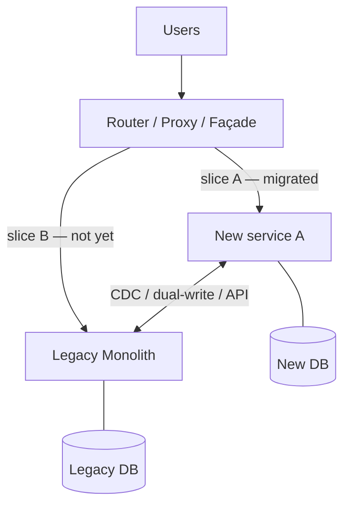

# Strangler Fig Pattern (Monolith → Microservices)

> **TL;DR** — The **Strangler Fig** pattern (named by Martin Fowler after the *Ficus* tree that grows around its host until the host dies) replaces a legacy system by **incrementally building the new alongside the old, routing traffic gradually from old to new**, and removing the old once its responsibilities have all moved. It is the safe, default playbook for **monolith → microservices** migrations and most "big rewrite" situations. The opposite — a Big-Bang Rewrite — is the most reliable way to fail a multi-year project. Strangler Fig works because each step ships value, each step is reversible, and at no point is the system half-rewritten and unreleasable. Success requires a clean **boundary** (router, proxy, anti-corruption layer), **per-slice migration**, **dual writes or CDC for shared data**, and the discipline to actually delete the old code.

---

## 1. The Metaphor

```
       OLD MONOLITH                    OLD MONOLITH (smaller)        NEW SYSTEM
                              →                          +                     →   NEW SYSTEM
                                       NEW FEATURE A                            (monolith retired)
                                       NEW FEATURE B
                                       NEW FEATURE C
```

The strangler fig tree wraps a host tree, sending roots down, branches up, until the host rots away inside the fig. Same shape:

1. New system is built **alongside** the legacy system.
2. A **routing layer** decides which calls go to old vs new.
3. Functionality migrates **a slice at a time**.
4. The old shrinks until nothing depends on it. Then you remove it.

This contrasts with:

- **Big Bang Rewrite** — build the replacement in parallel for 2 years, switch over in a weekend. Famously fails (Netscape, FogBugz, countless others — see Joel Spolsky's "Things You Should Never Do, Part I").
- **Lift and shift** — same software, new infrastructure. Doesn't change the architecture.
- **Leave it alone** — sometimes correct, but a topic for another day.

---

## 2. Why It Works

- **Value at every step.** Each slice migrated improves something users can see (or operations can measure).
- **Reversible.** If a slice goes badly, route it back to the legacy.
- **No long branches.** Both old and new are always in production. Trunk-based discipline.
- **Spreads risk.** Migrations of small slices fail in small ways.
- **Funds itself.** Quarter by quarter, you can defend the work because something visibly improved.
- **Forces clarity.** Each slice migration requires you to understand a piece of the legacy in detail — knowledge gets written down.

The pattern's reputation is so strong because the alternative (big rewrite) is so catastrophic when it goes wrong, which it usually does.

---

## 3. The Five Components



1. **Legacy system** — the host tree.
2. **Router / proxy / façade** — decides where each request goes. Could be:
   - An API gateway (Kong, Tyk, AWS API Gateway).
   - A reverse proxy (Nginx, Envoy, Cloudflare Workers).
   - The legacy's own routing (a feature flag inside it).
3. **New components** — services or modules taking over slices.
4. **Bridge / anti-corruption layer** — translates between legacy and new data models so the new isn't poisoned by the old's schema.
5. **Telemetry** — observability to track migration progress (% of traffic, error rates, latency parity).

---

## 4. Where to Place the Router

The router is the strangler's spine. Three common placements:

### At the edge (API gateway / CDN)
Routes per URL / per header. Best for HTTP APIs.

```nginx
location ^~ /v2/orders { proxy_pass http://new-orders-svc; }
location /              { proxy_pass http://legacy-monolith; }
```

### Inside the monolith
The legacy itself calls the new service:

```ruby
def list_orders
  return new_orders_client.list(user_id: current_user.id) if flagged?(:new_orders)
  LegacyOrder.where(user_id: current_user.id)
end
```

Useful when you can't (or don't want to) add a proxy layer and want fine-grained control. Most Ruby/Rails strangler migrations start this way.

### At the database layer
For DB migrations (e.g., one DB → many): a router/library decides where to read/write. Vitess and ProxySQL are common tools.

Pick what matches your migration unit. For carving off business-domain slices, edge or in-monolith routing is most common.

---

## 5. The Migration Loop

A repeating cycle, slice by slice:

```
1. Choose a slice.
2. Define its API contract.
3. Build the new component implementing it.
4. Mirror traffic (shadow) to the new component; compare results.
5. Route a small % of real traffic to the new component (canary).
6. Watch metrics; increase share if healthy.
7. Cut over 100%.
8. Delete the slice from the legacy.
9. Repeat.
```

Each step is days-to-weeks. The whole migration is months-to-years. Resist the temptation to skip steps.

### Shadow traffic (a.k.a. dark launch)

Send real requests to **both** legacy and new, compare responses, but only **legacy's response is served to the user**. This:

- Tests the new path under real load.
- Surfaces real differences (data, ordering, behavior).
- Doesn't break users when the new path is wrong.

GitHub's Scientist library is the classic implementation. Most teams build a small comparison harness.

### Canary

Route 1% → 5% → 25% → 50% → 100% over days/weeks. Watch error rates, latency, business metrics. Roll back instantly if something breaks. See [Canary Deployment →](../15-deployment/canary.md).

### Don't forget step 8

Strangler fig only completes if the legacy code is **deleted**. Otherwise both exist forever — worst of both worlds, double maintenance. Some teams require a "delete the old" PR as the closing ticket of each slice.

---

## 6. Choosing What to Migrate First

A useful prioritization rubric:

| Priority | Why |
| --- | --- |
| **High change rate + high value** | Migrating relieves the most pain |
| **Independent / low coupling** | Easiest, builds momentum, learns the playbook |
| **Read-only / idempotent** | Lower risk, easier rollback |
| **A bounded context that's clearly a unit** | Clean seam |
| **The path you'll need for many later slices** | Migrate the foundation first |

Avoid as first slices:
- **The most coupled, most-changed module.** "Let's start with the hardest" sounds heroic, fails predictably.
- **A part with shared DB tables that many other modules also write to.** You'll get stuck on data ownership.

The classic first slice for B2B SaaS: a **read-only API for one entity** (e.g., a `/products` listing endpoint). Build the muscle, then go after writes.

---

## 7. Handling Shared Data

The biggest practical challenge. Both old and new often need to read/write the same data during migration. Options, in increasing complexity:

### Option A — Single source of truth in the legacy
- New service **reads** the legacy DB (read-only or via API).
- Legacy still owns writes.
- New service eventually takes over writes; legacy migrates to read from new.
- Final step: drop tables in legacy.

### Option B — New service owns the data; legacy reads via API
- Migrate the data to the new service's DB.
- Legacy code that needs the data calls the new service.
- Risks performance regression (network where there used to be SQL).

### Option C — Dual writes
- Both systems write to their respective DBs synchronously.
- Eventual consistency between them.
- Famously hard to keep in sync; bug-prone.

### Option D — Change Data Capture (CDC) bridge
- One side is authoritative.
- CDC streams changes to the other.
- Loose coupling, eventual consistency, well-tooled (Debezium).
- The modern best answer for most migrations.

See [Change Data Capture →](../04-databases/cdc.md) and [Outbox Pattern →](../07-messaging/outbox-pattern.md).

Don't try Option C unless you must. CDC-bridged migrations (A → D → B) are the path of least pain.

---

## 8. Anti-Corruption Layer (ACL)

Legacy data models are often shaped by years of compromise. If you let those shapes bleed into the new service, you've imported the legacy's confusion.

An **Anti-Corruption Layer** is a translation layer between old and new — protecting the new domain model:

```
Legacy "user_account" record
  with 47 columns and 12 deprecated flags
        │
        ▼
  ACL translator
        │  → User domain model:
        ▼     User { id, email, name, plan, status }
   New service
```

Implementation: a service or library that reads the legacy shape and emits the new shape. Place it at the boundary. Resist the temptation to inline this translation in business code — the ACL is your defense.

The ACL term comes from DDD ([Domain-Driven Design →](./ddd.md)).

---

## 9. Migration Patterns That Work

### API façade
Put a new API in front; redirect to legacy initially; replace endpoint by endpoint behind the façade. Consumers never see the migration.

### Branch by abstraction
Create an abstraction inside the legacy that hides "old impl" vs "new impl." Roll out behind a flag. Useful when an external proxy isn't an option.

### Event interception
Legacy emits events (via outbox); new services subscribe. Once subscribers handle a domain, route writes to them.

### Database carve-out
Take a coherent set of tables, move them into a new DB owned by a new service. Provide a read-only sync back to legacy until callers migrate.

### Read-then-write
Migrate read traffic first (lower risk). Once the new service is reliably serving reads, migrate writes.

---

## 10. Anti-Patterns

- **Pause feature work** for the migration. Six months in, leadership pulls funding. Always migrate **with** feature work, not instead of.
- **Build the new system to spec, then switch.** The bigger the cutover, the more it costs when it fails.
- **No router / no abstraction.** Every legacy caller knows which slice is migrated. Coupling everywhere.
- **No "delete the old code" discipline.** Both exist forever; complexity doubles.
- **One team owns the migration entirely.** They get bottlenecked. Spread ownership: each migrating team owns its slice.
- **Dual writes without testing for divergence.** Two systems drift; you don't notice until accounting shows discrepancies.
- **Migrate the hardest piece first.** "Prove we can do it" → fail visibly → lose support.
- **Don't measure progress.** No idea what % is migrated; no idea when you're done.
- **Treat the legacy as untouchable.** Strangler fig assumes you can change the legacy (add hooks, add CDC, add abstractions). If you can't, you have a much harder problem.
- **Mistake refactoring for migration.** Strangler is about replacing chunks with new components; reshaping internals of the legacy is a different game.
- **Pure architecture without a business case.** "We need microservices" doesn't fund a 3-year project. "Reduce checkout latency" does.

---

## 11. Worked Example — Strangling a Rails Monolith

A B2B SaaS Rails monolith. Migration targets: extract the `billing` and `analytics` modules into services. Plan:

**Phase 1: Lay the foundation (months 1–3)**
- Stand up an API gateway in front of the monolith (or use the monolith as the gateway).
- Add observability for per-route metrics.
- Wire feature flags so any route can be switched.
- CI/CD ready for service deployments.

**Phase 2: Carve off billing (months 4–9)**
- New `billing-api` Rails service, own Postgres.
- Existing billing tables stay in monolith DB for now.
- New service reads via Postgres FDW (cross-DB read) and via internal REST from the monolith.
- Migrate `GET /billing/invoices` endpoint behind the gateway: 1% → 100% over weeks.
- Add Debezium CDC from monolith to new service for invoices; the new service starts owning the data.
- Migrate the `POST /billing/invoices` write endpoint similarly.
- Once all billing endpoints are on the new service, remove `app/controllers/billing/*` from monolith.
- Drop monolith's billing tables.

**Phase 3: Carve off analytics (months 10–14)**
- Analytics is read-heavy; build new service with a column-store (Clickhouse).
- Backfill from monolith via batch jobs.
- Switch new aggregations to the new service.
- Deprecate monolith's analytics tables.

**Phase 4: Continue with smaller modules (months 15+)**
- Notifications, search, etc.
- Each iteration follows the same pattern.

At each phase: features continue shipping. No big bang. Each carve-out is reviewable, reversible, measurable.

---

## 12. Knowing When to Stop

Strangler doesn't always finish. Some legacy code is small enough, stable enough, and far enough from active development that **the monolith never fully dies** — it becomes a domain service in its own right, unchanged for years. That's fine. The goal isn't aesthetic purity; it's solving the problems that justified the migration.

Stop migrating when:
- The remaining legacy is small, stable, low-criticality.
- The pain that justified the migration is gone.
- Continued migration costs more than the value it would unlock.

A **modular monolith with a few extracted services** is the right end state for many companies. Don't carve to 50 services just because the playbook says monoliths are bad.

---

## 13. Common Mistakes / Anti-Patterns

- **Big Bang Rewrite disguised as Strangler.** "We'll start strangling next quarter, after the new platform is built." That's a rewrite.
- **No metric of progress.** Six months in, "are we halfway? a quarter?" — no idea.
- **No deletion plan.** The legacy never shrinks; new service is just an addition.
- **Router not built first.** Migration logic scattered through the legacy codebase.
- **Dual writes without divergence checking.** Data inconsistencies accumulate silently.
- **Skipping shadow/canary.** "We tested in staging" is not the same.
- **One team owns the migration, others keep adding features.** New features land in legacy; migration falls behind.
- **Migrate by org chart instead of bounded context.** Sometimes aligned; often not.
- **Use Strangler to introduce microservices when a modular monolith would do.** The migration was supposed to reduce complexity, not 10× it.
- **Strangle to a new language for novelty.** Each extracted service in a different language = ops nightmare.
- **Ignore the database.** Code migration without data migration leaves you with a distributed monolith.
- **Pause feature work indefinitely.** The business stops believing in the migration.
- **No anti-corruption layer.** Legacy data shape bleeds into the new domain.

---

## 14. Cheat Card

```
STRANGLER FIG  build new alongside old · route gradually · delete old.
                opposite of Big Bang Rewrite (which almost always fails).

COMPONENTS
  legacy · router/proxy/façade · new components · anti-corruption layer · telemetry

LOOP (per slice)
  pick slice → contract → build new → shadow → canary → 100% → DELETE legacy → next

ROUTER WHERE
  API gateway / reverse proxy (Kong, Envoy, CDN)
  inside the monolith (feature flag)
  DB layer (Vitess, ProxySQL)

DATA STRATEGIES (choose progression)
  A  legacy owns writes; new reads
  D  CDC bridge (Debezium) - the modern default
  B  new owns; legacy reads via API
  C  dual writes (last resort; divergence-prone)

ACL  anti-corruption layer translates legacy ↔ new domain model

PICK FIRST SLICES THAT ARE
  high change × value · low coupling · idempotent / read-only ·
  clear bounded context

DON'T
  Big Bang · skip shadow/canary · forget to DELETE · pause feature work ·
  one team for everything · migrate hardest piece first ·
  dual-write without divergence checks

STOP WHEN  remaining legacy is small/stable and migration cost > value

RULE: every quarter ships visible progress.  Each slice is reversible.
       Death of the old code is the only true success metric.
```

---

## 15. Resources

### Books
- *Monolith to Microservices* — Sam Newman. The migration companion to his Building Microservices.
- *Working Effectively with Legacy Code* — Michael Feathers. Pre-migration discipline.
- *Refactoring* — Martin Fowler. Sub-system-level moves.
- *Migrating to Cloud-Native Application Architectures* — Matt Stine.

### Articles
- "StranglerFigApplication" — Martin Fowler: <https://martinfowler.com/bliki/StranglerFigApplication.html>
- "Things You Should Never Do, Part I" — Joel Spolsky (on rewrite disasters): <https://www.joelonsoftware.com/2000/04/06/things-you-should-never-do-part-i/>
- "How GitHub uses GitHub to be productive" — engineering blog on incremental migration.
- "Strangling a monolith at Shopify" — Shopify engineering.
- "Branch by Abstraction" — Paul Hammant.
- "The Scientist library" — GitHub: <https://github.com/github/scientist>

### Videos
- "Patterns of Refactoring to Microservices" — Sam Newman.
- "Death of the Big Bang Rewrite" — various NDC / GOTO talks.

### Tools
- **Routing:** Kong, Tyk, Nginx, Envoy, Cloudflare Workers, AWS API Gateway, Istio.
- **Feature flags:** LaunchDarkly, Flagsmith, Unleash, custom.
- **Shadow / experiments:** Scientist (Ruby), DiffyProxy, Lyft Refactor Lab.
- **CDC:** Debezium, Maxwell, AWS DMS, GoldenGate.
- **Service discovery:** Consul, K8s, AWS Cloud Map.
- **Observability:** Datadog, Grafana stack, Honeycomb — to measure migration progress.

### Adjacent reading
- [Microservices Architecture →](./microservices.md)
- [Monolith vs Microservices vs Serverless →](../01-foundations/monolith-microservices-serverless.md)
- [API Gateway →](../03-apis/api-gateway.md)
- [Change Data Capture →](../04-databases/cdc.md)
- [Database Migrations at Scale →](../04-databases/migrations.md)
- [Feature Flags & Dark Launches →](../15-deployment/feature-flags.md)
- [Canary Deployment →](../15-deployment/canary.md)
- [Outbox Pattern →](../07-messaging/outbox-pattern.md)
- [Bounded Contexts & Aggregates →](./bounded-contexts.md)

---

*Previous:* [← Event-Driven Microservices](./event-driven-microservices.md)  |  *Next:* [Sidecar Pattern →](./sidecar.md)
