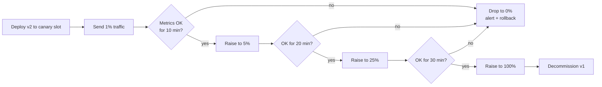

# Canary Deployment

> **TL;DR** — A **canary deployment** routes a small percentage of traffic — typically 1%, 5%, then 25%, then 100% — to a new version, watches metrics in real time, and either promotes or rolls back based on what it sees. The name comes from canaries in coal mines: send the small, vulnerable cohort first and watch for trouble before committing the rest. Canary is the **default progressive-delivery strategy** for most modern production services because it gives you a real signal on real traffic at a contained blast radius. The catch: canary is only as good as your **metrics-based promotion gate** — a manual canary that nobody watches is just a slow rolling deploy. Pair it with feature flags for fine-grained control and with automated analysis (Argo Rollouts, Flagger, Spinnaker) for unattended promotion.

---

## 1. The big picture

```
                  ┌──────────────────┐
                  │  Load Balancer / │
                  │   Service Mesh   │
                  └────────┬─────────┘
                           │
              ┌────────────┴────────────┐
              │ 95% traffic            │ 5% traffic
              ▼                        ▼
       ┌────────────┐           ┌────────────┐
       │ Stable v1  │           │ Canary v2  │
       │ N replicas │           │ small slice│
       └────────────┘           └────────────┘
                       │
                       ▼
              ┌─────────────────┐
              │   Analysis      │
              │ p99, errors,    │
              │ business KPIs   │
              └────────┬────────┘
                       │
              ┌────────┴────────┐
        promote                rollback
       (raise to 100%)      (drop to 0%)
```

The new version runs alongside the old. A small share of traffic is sent to the new version. You watch metrics. If the new version looks healthy, you increase the share. If it doesn't, you drop the share back to zero. At full promotion, the old version is retired.

The mental model: **canary is a slow, observable, reversible commitment**. You're not buying the whole thing — you're tasting it.

---

## 2. Why canary beats other strategies

| Property | Blue-Green | Canary | Rolling |
|---|---|---|---|
| Mixed-version window | None at cutover | Yes (controlled %) | Yes (during rollout) |
| Real-traffic signal before full promotion | No | **Yes — at small % first** | Partial |
| Rollback speed | Instant | Fast (drop %) | Slow (re-deploy) |
| Infrastructure cost | 2× during cutover | 1.05–1.2× | 1× + maxSurge |
| Granular targeting (region, cohort) | Hard | Easy | Hard |
| Best signal-to-blast-radius ratio | No | **Yes** | No |

What canary does that nothing else does well: **let a tiny, real-user slice find the bug before it's everyone's problem.** A synthetic test can't simulate the long tail of real production traffic. Canary can.

---

## 3. The promotion gate — the heart of it

A canary without a promotion gate is just a misconfigured deploy. The gate is a function:

```
gate(metrics_canary, metrics_baseline) → {promote, hold, rollback}
```

What you compare:

- **Error rate** — canary vs baseline. Often the strongest signal.
- **Latency** — p50, p95, p99. p99 is the most informative for tail-latency regressions.
- **Saturation** — CPU, memory, GC pressure, queue depth, file descriptors.
- **Business KPIs** — checkout conversion, signups, ad clicks. These catch bugs that don't show in technical metrics. (Facebook and Google use these heavily.)
- **Downstream dependency health** — DB QPS, cache hit rate.

You don't compare canary vs *itself before deploy*. You compare canary (v2) vs baseline (v1) **at the same time, under the same traffic mix**. Otherwise you'll confuse time-of-day load patterns with bugs.

### Statistical rigor

A 5% canary with 100 RPS sees 5 RPS. If the baseline has 1% error rate, that's 0.05 errors/sec on canary — most minute-windows see 0 errors. Don't promote on "0 errors in 2 minutes" — your false-negative rate is huge.

Use:
- **Sequential probability tests** (Mann-Whitney U, t-tests) on rolling windows.
- **Minimum sample sizes** before allowing promotion.
- **Confidence intervals** rather than point estimates.

Tools like Kayenta (Spinnaker) and Flagger automate this. Most teams need this only above moderate scale; smaller teams can use simple percentage thresholds plus a watch window.

---

## 4. Routing the traffic — how the split actually happens

Several mechanisms, often combined:

### Weighted routing at the LB

ALB, NLB, Envoy, Istio, Linkerd — most modern proxies let you assign weights to backends. Set v1 = 95, v2 = 5, and the LB does the rest. Probabilistic per-request.

```yaml
# Istio VirtualService example
http:
  - route:
      - destination: {host: api, subset: v1}
        weight: 95
      - destination: {host: api, subset: v2}
        weight: 5
```

### Header / cookie-based routing

Route requests with `X-Canary: true` or with a cookie indicating beta cohort. Used for opt-in early access. **Stickier than random** — once a user is in the canary, they stay, which is critical for stateful UX.

### Geographic / cohort routing

Route a single region (e.g., one PoP, one AZ) to canary. Lets you observe behavior at a smaller blast radius without changing application logic.

### Internal-first canary

Route only requests from corporate IPs / internal users for hours or days before opening to the public. "Dogfooding" gives you free human signal alongside automated metrics.

### Mirror / shadow traffic (not really canary)

Send a copy of production traffic to the new version, discard responses. No risk to users. Useful before canary, but doesn't tell you about user-visible effects.

---

## 5. A canary, end to end

A typical pipeline:



Each stage has:
- A **minimum dwell time** (no auto-promote in under N minutes).
- A **traffic step** (no jumping 1% → 100%).
- An **abort condition** (any metric breach → drop, alert, run incident).
- A **manual override** (an engineer can pause or accelerate).

The defaults that work for most services: **1% → 10% → 50% → 100%, dwell 10–30 min per step, hard abort on any error-rate breach > 2× baseline.**

---

## 6. Canary at the infrastructure level

### Kubernetes-native (Argo Rollouts, Flagger)

Argo Rollouts replaces `Deployment` with a `Rollout` resource:

```yaml
apiVersion: argoproj.io/v1alpha1
kind: Rollout
metadata: {name: api}
spec:
  replicas: 10
  strategy:
    canary:
      steps:
        - setWeight: 5
        - pause: {duration: 10m}
        - setWeight: 25
        - pause: {duration: 20m}
        - setWeight: 50
        - pause: {duration: 30m}
        - setWeight: 100
      analysis:
        templates:
          - templateName: success-rate
        startingStep: 1
        args:
          - name: service-name
            value: api
```

The `analysis` block invokes a separate `AnalysisTemplate` that queries Prometheus for SLI breaches and fails the rollout if thresholds are violated.

### Service mesh canary

Istio, Linkerd, Consul Connect let you do percentage-based routing at the mesh layer, with mTLS, retries, and observability built in.

### AWS / GCP managed canary

- **AWS CodeDeploy** for ECS/Lambda has canary configs (`Canary10Percent5Minutes`, etc.).
- **AWS App Mesh** + **Lambda traffic-shifting** for serverless canary.
- **GCP Cloud Deploy** + **Cloud Run revisions** with traffic splits.
- **Azure Front Door** + slot-swap.

### Application-level canary (feature flags)

You don't even need infra-level routing if you can ship the new code path behind a flag and ramp the flag percentage. See [Feature Flags & Dark Launches →](./feature-flags.md). This is canary at the *code path* level rather than the deployment level — often complementary.

---

## 7. Database and stateful concerns

Like blue-green, canary cannot reshape the database under the running service. The constraints:

- **Schema must be compatible across v1 and v2** for the duration of the canary. Use expand-contract. See [Database Migrations at Scale →](../04-databases/migrations.md).
- **Background jobs/cron** — decide whether v1 or v2 runs them, or both. Usually you pin to one until the canary completes.
- **Caches** — if v2 stores cache entries in an incompatible format, you need versioned keys.
- **Message queue consumers** — both versions may consume from the same queue. Test with mixed consumers in staging first.
- **Session affinity** — if v2 has a new session shape, you might need a header / cookie that pins users to the version that wrote their session.

---

## 8. Common Mistakes / Anti-Patterns

- **No automated promotion gate.** A canary that requires a human to "check the dashboard" gets promoted by the busy engineer who skipped the check. Automate the gate or accept slow rollouts.
- **Comparing canary to its own past metrics.** Diurnal patterns will mislead you. Compare canary to **baseline at the same time**.
- **Tiny canary, low signal.** 1% of a 10 RPS service is 0.1 RPS — useless for rare bugs. Either bigger %, longer dwell, or rely on synthetic + integration tests for low-traffic services.
- **Promoting too fast.** 1% → 100% in 5 minutes defeats the purpose. Some failure modes only show after warm caches and long-tail traffic patterns.
- **Rolling back code but not data.** v2 wrote new-shape data. v1 chokes on it. Use expand-contract.
- **Different deploy units for canary and baseline.** Same image, same config, only the traffic share differs.
- **One deploy of many services at once.** Canary one service per deploy. Otherwise you can't tell which one regressed.
- **Promotion gate that only watches HTTP 500s.** Misses logical errors that return 200 with wrong content. Add business KPIs.
- **Sticky session leak.** Once a user lands on v2, they stay. If v2 has a bug for users with certain attributes, they get stuck on broken until you roll back.
- **Canary in production without observability.** No tracing, no per-version metrics → you can't tell v1 from v2 in the dashboards. Add a `version` label to every metric and trace.
- **Skipping shadow traffic for risky changes.** Shadow first, then canary. Cheaper than rolling back a user-visible incident.

---

## 9. Cheat Card

```
PURPOSE   Send a small % of real traffic to the new version, watch
          real metrics, promote or rollback based on what you see.

MECHANIC
  Deploy v2 alongside v1
  Route X% to v2 (start 1–5%)
  Watch metrics vs baseline v1
  Step up: 1% → 5% → 25% → 50% → 100%
  Abort: drop to 0% on any breach

PROMOTION GATE INPUTS
  Error rate (canary vs baseline)
  Latency p50/p95/p99
  Saturation (CPU, mem, GC, queues)
  Business KPIs (conversion, signups)

ROUTING MECHANISMS
  Weighted LB / mesh   (probabilistic)
  Header / cookie       (sticky, opt-in)
  Region / AZ          (cohort)
  Internal-first        (dogfood)
  Feature flag          (per-code-path)

WHEN TO USE
  Default for most online services
  When you want real-traffic signal at small blast radius
  When metrics are good enough to drive a gate

WHEN NOT TO USE
  Low-traffic services (1% of nothing = nothing)
  Where a sharp atomic cutover is required (use blue-green)
  Synchronous critical paths with no metrics
  Big bang DB schema changes (do expand-contract first)

PITFALLS
  No automated gate, just "engineer watches dashboard"
  Comparing canary to its own past (diurnal trap)
  Promoting in 5 minutes — too fast for warm-state bugs
  Different config between canary and baseline
  No per-version label in metrics/traces
  Sticky users get stuck on broken canary

RULE   Canary on real traffic, judge against a baseline running
       right now, step slowly enough that rare bugs surface.
```

---

## 10. Resources

### Documentation
- **Argo Rollouts** — Canary strategy: <https://argoproj.github.io/argo-rollouts/features/canary/>
- **Flagger** — Progressive delivery operator: <https://flagger.app>
- **Istio** — Traffic splitting: <https://istio.io/latest/docs/tasks/traffic-management/traffic-shifting/>
- **AWS CodeDeploy** — Lambda canary: <https://docs.aws.amazon.com/codedeploy/>
- **Spinnaker Kayenta** — Automated canary analysis: <https://spinnaker.io/docs/guides/user/canary/>

### Articles
- "Automated canary analysis" — Netflix Tech Blog: <https://netflixtechblog.com/automated-canary-analysis-at-netflix-with-kayenta-3260bc7acc69>
- "Canary releases" — Martin Fowler: <https://martinfowler.com/bliki/CanaryRelease.html>
- "Deploying code at Facebook" — Engineering at Meta (long-running canary practices).
- "How Stripe ships" — Stripe engineering blog.

### Videos
- *Progressive delivery with Argo Rollouts* — KubeCon talks.
- *Canary analysis at scale* — Netflix QCon talk.
- ByteByteGo — "Canary Deployment Explained."

### Tools
- **Argo Rollouts** — Kubernetes-native canary.
- **Flagger** — Service-mesh-driven canary with automated analysis.
- **Spinnaker / Kayenta** — Statistical canary analysis.
- **LaunchDarkly / Statsig / Unleash / Flagsmith** — Feature flag platforms (per-code-path canary).
- **Prometheus + Grafana** — Per-version metrics.
- **Honeycomb / Lightstep / Datadog APM** — Per-version traces and BubbleUp.

### Adjacent reading
- [Blue-Green Deployment →](./blue-green.md)
- [Rolling Deployment →](./rolling.md)
- [Feature Flags & Dark Launches →](./feature-flags.md)
- [CI/CD Pipelines →](./cicd.md)
- [Container Orchestration (Kubernetes) →](./kubernetes.md)
- [Service Mesh →](../03-apis/service-mesh.md)
- [Database Migrations at Scale →](../04-databases/migrations.md)
- [SLA, SLO, SLI, Error Budgets →](../11-reliability/sla-slo-sli.md)
- [Chaos Engineering →](../11-reliability/chaos-engineering.md)

---

*Previous:* [← Blue-Green Deployment](./blue-green.md)  |  *Next:* [Rolling Deployment →](./rolling.md)
