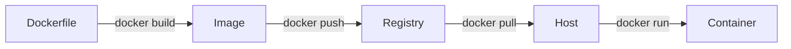

# Containers (Docker)

> **TL;DR** — A **container** is a process (or a small group of processes) isolated by Linux kernel features — **namespaces** for what it can see, **cgroups** for what it can consume, and a **union filesystem** for a layered, immutable rootfs. **Docker** popularized the format: a `Dockerfile` builds an image, the image becomes a running container, and the image is portable across any host with a compatible kernel. Containers are not VMs — they share the host kernel — which is why they start in milliseconds, weigh tens of MB, and pack densely. The trade-off: weaker isolation than a VM, and a much sharper learning curve for *production* operation (networking, storage, security, registries) than for *local* use. Today the runtime layer is largely commoditized — **containerd**, **CRI-O**, **runc**, **Podman** — but the image format (**OCI**) is universal.

---

## 1. The big picture

A container looks like a lightweight VM but is something quite different.

```
┌──────────────────────────────────────────────────┐
│                  Host OS Kernel                  │
├──────────────┬──────────────┬────────────────────┤
│ Container A  │ Container B  │ Container C        │
│ (nginx)      │ (postgres)   │ (your-app)         │
│ own PID ns   │ own PID ns   │ own PID ns         │
│ own net ns   │ own net ns   │ own net ns         │
│ own mount ns │ own mount ns │ own mount ns       │
│ cgroup limit │ cgroup limit │ cgroup limit       │
└──────────────┴──────────────┴────────────────────┘
```

Every container sees its own filesystem, network interfaces, process tree, and hostname — but it's all the same Linux kernel underneath. There is no hypervisor, no guest OS boot, no virtualized hardware. That is the entire trick.

Compare to a VM:

```
┌─────────────────────────────────────────────┐
│                Hypervisor                    │
├──────────────┬──────────────┬───────────────┤
│ Guest Linux  │ Guest Linux  │ Guest Windows │
│ + kernel     │ + kernel     │ + kernel      │
│ + apps       │ + apps       │ + apps        │
└──────────────┴──────────────┴───────────────┘
```

VMs virtualize **hardware**. Containers virtualize the **OS abstraction**. Both isolate workloads; they isolate at different layers, with very different cost profiles.

| Property | Container | VM |
|---|---|---|
| Boot time | 50–500 ms | 10–60 s |
| Image size | 10 MB – 1 GB | 1 – 20 GB |
| Density per host | 100s–1000s | 10s |
| Isolation strength | Process-level | Hardware-level |
| Cold start cost | Cheap | Expensive |
| Cross-OS | Linux only (mostly) | Any guest |
| Kernel exploits | Shared blast radius | Isolated |

The decision is rarely "containers or VMs" anymore — most production stacks run **containers inside VMs**. The VM is the security/tenant boundary; containers are the deployment unit.

---

## 2. What containers are *actually* made of

Containers are not a single feature. They are a combination of long-existing Linux primitives, assembled by a runtime.

### Namespaces — *what a process can see*

A namespace partitions a kernel resource so that processes inside see their own copy.

| Namespace | What it isolates |
|---|---|
| `pid` | Process IDs (PID 1 inside the container is just a regular process outside) |
| `net` | Network interfaces, routing tables, sockets |
| `mnt` | Mount points (its own view of the filesystem) |
| `uts` | Hostname and domain name |
| `ipc` | SysV IPC, POSIX message queues |
| `user` | UID/GID mapping (root inside ≠ root outside) |
| `cgroup` | Cgroup hierarchy view |

### Cgroups — *what a process can consume*

**Control groups** (`cgroups v2` is the modern API) cap and account for CPU, memory, I/O, and network bandwidth. When you write `--memory=512m`, that's a cgroup limit, and if the process exceeds it, the **OOM killer** terminates it.

### Union filesystem — *layered images*

The container's root filesystem is built from stacked, read-only layers plus one writable layer on top. **OverlayFS** is the default driver. Each `Dockerfile` instruction creates a new layer. Layers are content-addressed by SHA-256, so identical layers across images are stored once and pulled once.

### Capabilities, seccomp, AppArmor/SELinux

Containers drop dangerous Linux capabilities by default (e.g., `CAP_SYS_ADMIN`), restrict syscalls with seccomp profiles, and may be confined by MAC (mandatory access control) policies. This is what makes them more than "just chroot."

The runtime (`runc`, `crun`) calls into these primitives via the **OCI runtime spec**. Docker, Kubernetes, Podman, and containerd all sit on top.

---

## 3. The Docker mental model

Docker introduced four concepts that became universal:

- **Image** — an immutable, layered tarball plus a JSON manifest. Identified by digest (`sha256:...`) and optionally tagged (`nginx:1.27-alpine`).
- **Container** — a running instance of an image with its own writable layer.
- **Registry** — a content-addressable store of images (Docker Hub, ECR, GCR, GHCR, Harbor, Quay).
- **Dockerfile** — a declarative recipe for building an image.

Lifecycle:



The image is the artifact. Everything else — registries, runtimes, schedulers — is plumbing for moving images and running them.

---

## 4. The Dockerfile — what good looks like

A minimal `Dockerfile`:

```dockerfile
FROM node:20-alpine
WORKDIR /app
COPY package*.json ./
RUN npm ci --omit=dev
COPY . .
USER node
EXPOSE 3000
CMD ["node", "server.js"]
```

That works. It is also full of subtle mistakes a production team would catch.

### Multi-stage build — *cut image size, drop build tools*

Build artifacts and build tools don't belong in the runtime image. Use multi-stage:

```dockerfile
# ---- build stage ----
FROM node:20 AS build
WORKDIR /app
COPY package*.json ./
RUN npm ci
COPY . .
RUN npm run build

# ---- runtime stage ----
FROM node:20-alpine
WORKDIR /app
COPY --from=build /app/dist ./dist
COPY --from=build /app/node_modules ./node_modules
USER node
EXPOSE 3000
CMD ["node", "dist/server.js"]
```

Runtime image now ships only what's needed to run. Build tools, source, dev dependencies — gone.

### Distroless and scratch — *minimum surface area*

Google's **distroless** images contain only the language runtime and your app — no shell, no package manager, no `ls`. For Go binaries, you can go further and use `FROM scratch`: a 5 MB image with literally one file in it. Smaller image = smaller attack surface = faster pulls.

### Layer ordering — *cache discipline*

`docker build` caches each layer. The cache invalidates when an input changes. **Put rarely-changing things first**:

```dockerfile
# Good — dependencies cached separately from source
COPY package*.json ./
RUN npm ci
COPY . .

# Bad — every source change re-runs npm ci (slow)
COPY . .
RUN npm ci
```

For Go: copy `go.mod`/`go.sum`, run `go mod download`, then copy source.
For Python: copy `requirements.txt`, run `pip install`, then copy source.

### Pin the base image

Don't use `node:latest`. That's a moving target. Pin by tag *and* by digest for reproducibility:

```dockerfile
FROM node:20.11.1-alpine@sha256:f1a3...
```

### Run as non-root

Default container UID is root (UID 0) inside, which can amplify any kernel escape. Always `USER` to a non-root account.

### `.dockerignore`

Excludes files from the build context. Without it, your `node_modules`, `.git`, and `dist` directories get uploaded to the daemon on every build. Treat it like `.gitignore`.

### One process per container — *with nuance*

The folklore is "one process per container." The reality: one *concern* per container. A signal-handling init (`tini`, `dumb-init`) inside a container running multiple subprocesses (e.g., nginx + php-fpm) is perfectly fine. The rule exists because PID 1 has special semantics: it must reap zombies and forward signals. If your app doesn't, use an init.

---

## 5. Networking

Containers get an IP via one of several network drivers:

| Driver | Behavior | Use case |
|---|---|---|
| `bridge` (default) | Containers share a virtual bridge, NAT to host | Single-host setups |
| `host` | Container shares the host's network namespace | Max performance, lose isolation |
| `none` | No network at all | Batch jobs, sandboxing |
| `overlay` | Multi-host networking via VXLAN | Swarm / multi-node |
| `macvlan` | Container gets a MAC on the physical network | Legacy apps that expect "real" L2 |
| CNI plugins | Calico, Cilium, Flannel | Kubernetes |

Port publishing (`-p 8080:3000`) inserts iptables/nftables rules that DNAT host port 8080 to container port 3000. **It's just NAT.**

In Kubernetes, the **CNI** plugin owns networking and the model is different: every pod gets a real IP routable across the cluster, no NAT between pods. See [Kubernetes →](./kubernetes.md).

---

## 6. Storage and persistence

Containers are **ephemeral** by design. Anything written to the writable layer disappears when the container is removed. For state, you mount volumes.

| Mount type | Behavior |
|---|---|
| **Named volume** (`-v mydata:/data`) | Docker-managed, lives in `/var/lib/docker/volumes/` |
| **Bind mount** (`-v /host/path:/data`) | Direct host path passthrough |
| **tmpfs** (`--tmpfs /tmp`) | RAM-backed, vanishes on stop |

Production databases in containers are *fine* — Postgres, MySQL, Redis all run well containerized — but the data goes on a volume, and on Kubernetes that volume is typically backed by a **PersistentVolume** sourced from EBS, GCE PD, or a CSI driver. Container ≠ stateless.

---

## 7. The image registry

Registries are the supply chain. Every image lives in one. Important practices:

- **Use a private registry** for production (ECR, GCR, GHCR, Harbor). Don't pull anonymously from Docker Hub on every deploy — rate limits exist and supply chain risk is real.
- **Scan images** for CVEs at push time (Trivy, Grype, Snyk, Docker Scout).
- **Sign images** (Cosign, Notary v2) so you can verify provenance before running.
- **Mirror or proxy upstream images** — don't depend on Docker Hub being up on deploy day.
- **Set retention policies** — image tags accumulate forever otherwise. Old, untagged layers can be tens of GB.

### Tags are not immutable

`nginx:1.27` today and `nginx:1.27` next month are *different images*. Tags get re-pushed. Use **digests** (`nginx@sha256:...`) for anything that must be reproducible — production manifests, signed deployments, supply-chain attestations.

---

## 8. Runtimes — Docker isn't the only one

Docker the daemon (`dockerd`) became the dominant runtime in 2014–2018, but the ecosystem split:

- **containerd** — the lower-level runtime extracted from Docker. Now a CNCF graduated project. Default in Kubernetes since 1.24 (when dockershim was removed).
- **CRI-O** — Red Hat's Kubernetes-focused runtime. Smaller, simpler than Docker.
- **runc** — the OCI reference implementation that actually `clone()`s the process. Both containerd and CRI-O call into runc.
- **crun** — a C rewrite of runc; faster and uses less memory.
- **Kata Containers** — wraps each container in a lightweight VM for stronger isolation. Used by Confidential Containers and some FaaS platforms.
- **gVisor** — Google's user-space kernel; intercepts syscalls in a sandbox. Used in Google Cloud Run.
- **Podman** — daemonless, rootless, mostly Docker-compatible CLI. Drop-in replacement on RHEL/Fedora.

For developers, `docker` and `podman` are interchangeable for 95% of use. For Kubernetes, the runtime is invisible behind the **CRI** (Container Runtime Interface). The OCI image format means images built by any of these run on any of these.

---

## 9. Image size, density, and pull cost

Image size matters more than developers think. The first time a node pulls an image, that's network bandwidth + decompression time + disk space. At scale (autoscaling a fleet, cold-starting Lambdas, restarting after a node failure), pull time is **the first half of recovery time**.

| Base image | Size | Notes |
|---|---|---|
| `ubuntu:24.04` | ~80 MB | General-purpose |
| `debian:slim` | ~30 MB | Smaller |
| `alpine:3.20` | ~7 MB | musl libc — can break Python wheels |
| `gcr.io/distroless/static` | ~2 MB | Statically linked binaries only |
| `scratch` | 0 B | Bring everything yourself |

**Alpine warning**: `musl` instead of `glibc` causes subtle bugs in Python (DNS resolution under load, native wheels), Node (some `node-gyp` modules), and any C extension assuming glibc. For Go and Rust binaries, Alpine is great. For Python and Node in production, lean toward `debian-slim`.

### Practical size tactics

- Multi-stage builds (covered above).
- Combine `RUN` commands to avoid intermediate layers carrying junk:

```dockerfile
# Bad — apt cache stays in the layer
RUN apt-get update
RUN apt-get install -y curl
RUN rm -rf /var/lib/apt/lists/*

# Good — single layer, clean
RUN apt-get update && \
    apt-get install -y --no-install-recommends curl && \
    rm -rf /var/lib/apt/lists/*
```

- Use `--squash` or `docker buildx` for further compaction.
- Avoid `ADD` for URLs — it doesn't cache. Use `RUN curl -fSL ... && ...` instead, or `COPY` from a build stage.

---

## 10. Security model — what containers *don't* protect you from

Default containers share a kernel. A kernel exploit inside a container can compromise the host. Treat containers as a deployment convenience, not a hard security boundary.

### Threats to know

- **Container escape via kernel CVE** — rare but real. Dirty Pipe (CVE-2022-0847), runc CVE-2019-5736.
- **Privileged containers** — `--privileged` disables almost all isolation. Don't use it for application workloads.
- **Mounting the Docker socket** — `-v /var/run/docker.sock:/var/run/docker.sock` gives the container root on the host. Used by tools like Portainer and CI runners, but it's effectively a backdoor.
- **Supply chain** — base images and dependencies are the most common attack vector. Trivy, Grype, Snyk scans are mandatory.
- **Secrets in env vars / image layers** — anyone with image access reads them. Use Kubernetes Secrets, Vault, or cloud KMS — never bake credentials into images.

### Hardening checklist

```
[ ] Run as non-root user
[ ] Drop all capabilities, add only what's needed
[ ] Read-only root filesystem (--read-only)
[ ] No-new-privileges flag set
[ ] Resource limits set (memory, CPU, pids)
[ ] Image signed and verified
[ ] Image scanned and CVE-free at push
[ ] Pinned base image digest
[ ] Distroless/minimal base where possible
[ ] Secrets injected at runtime, never built in
[ ] Audit logs enabled on the runtime
```

For higher isolation, use **Kata Containers**, **gVisor**, or **Firecracker** — each container becomes a microVM. AWS Lambda runs every function invocation in a Firecracker microVM for exactly this reason.

---

## 11. docker-compose — local multi-container

`docker-compose.yml` describes a stack of containers as code. It's the right tool for local development, demos, and small single-host deployments. It is **not** a production orchestrator — no rolling updates, no autoscaling, no self-healing across hosts.

```yaml
services:
  api:
    build: .
    ports: ["3000:3000"]
    environment:
      DATABASE_URL: postgres://app:app@db:5432/app
    depends_on: [db]

  db:
    image: postgres:16-alpine
    volumes: [pgdata:/var/lib/postgresql/data]
    environment:
      POSTGRES_USER: app
      POSTGRES_PASSWORD: app
      POSTGRES_DB: app

volumes:
  pgdata:
```

For production, graduate to **Kubernetes**, **ECS**, **Nomad**, or a PaaS (Fly, Railway, Render).

---

## 12. Common Mistakes / Anti-Patterns

- **Treating containers as long-lived VMs.** SSHing into containers, manually patching files, then forgetting which container has the fix. Containers are cattle; rebuild and redeploy.
- **Running as root inside the container.** Default behavior, almost never necessary. One missed `USER` line ≠ catastrophe; the cumulative effect across a fleet is.
- **Using `:latest` in production.** Tag drift will eventually deploy something unexpected. Use digests or immutable tags.
- **Baking secrets into images.** They live forever in layer history, even after you remove them from later layers.
- **Massive images.** A 2 GB Java image with Maven, JDK, and `/root/.m2` still inside. Multi-stage.
- **Mounting `/var/run/docker.sock` into untrusted containers.** That's root on the host.
- **Ignoring `.dockerignore`.** Your CI uploads `node_modules` on every build.
- **No health checks.** The container "runs" but the app inside hung 10 minutes ago. Use `HEALTHCHECK` (Docker) or Kubernetes probes.
- **Stateful data in the container's writable layer.** It's gone the moment the container restarts.
- **One-process dogma taken too literally.** Sidecar processes (log shippers, mesh proxies) are fine; you just need a proper init.
- **Privileged containers used to "fix" permission issues.** That's not fixing, that's removing the safety rail.

---

## 13. Cheat Card

```
PURPOSE   Package an app + its deps into a portable, isolated unit
          that runs identically on any Linux host with a compatible kernel.

CORE
  Image      = immutable, layered tarball + JSON manifest, OCI format
  Container  = running process(es) with own namespaces + cgroups
  Registry   = where images live (ECR, GHCR, Harbor)
  Runtime    = containerd / CRI-O → runc → kernel

KEY PRIMITIVES
  namespaces = what the process can see
  cgroups    = what the process can consume
  overlayfs  = layered, copy-on-write rootfs

WHEN TO USE
  Deployable units across heterogeneous environments
  Microservices, CI runners, ephemeral compute
  Local dev parity with prod
  Anything that benefits from "same artifact, anywhere"

WHEN NOT TO USE
  GUI apps, Windows-only stacks (without WSL/Windows containers)
  Anything needing hard tenant isolation (use VMs or microVMs)
  Stateful databases without a clear volume strategy and backup plan
  Workloads bottlenecked on kernel features you can't change

PITFALLS
  Running as root inside the container
  :latest tags in production
  Secrets baked into images
  Mounting docker.sock into untrusted containers
  No resource limits → noisy neighbors
  No HEALTHCHECK / readiness probe
  Alpine + Python C extensions (musl breaks wheels)

RULE       Build small, pin digests, run as non-root, never trust
           an image you didn't scan and sign.
```

---

## 14. Resources

### Books
- *Docker Deep Dive* — Nigel Poulton. Best end-to-end practical book.
- *Container Security* — Liz Rice. The definitive guide on the security model.
- *Kubernetes Up and Running* — Hightower, Burns, Beda. Containers in context.

### Documentation
- **Docker** — <https://docs.docker.com>
- **OCI specs** — <https://opencontainers.org>
- **containerd** — <https://containerd.io>
- **Buildkit** — <https://docs.docker.com/build/buildkit/>

### Articles
- "What even is a container" — Julia Evans: <https://jvns.ca/blog/2016/10/10/what-even-is-a-container/>
- "Best practices for building containers" — Google Cloud: <https://cloud.google.com/architecture/best-practices-for-building-containers>
- "Distroless images" — Google: <https://github.com/GoogleContainerTools/distroless>

### Videos
- *Containers from scratch* — Liz Rice (GOTO talk).
- *containerd Deep Dive* — KubeCon.
- ByteByteGo — "How Docker works in 5 minutes".

### Tools
- **Trivy** / **Grype** — image vulnerability scanning.
- **Cosign** / **Notary v2** — image signing.
- **Dive** — interactive image layer explorer.
- **Hadolint** — Dockerfile linter.
- **BuildKit** / **buildx** — modern Docker builder, multi-arch builds.
- **Podman** — daemonless Docker alternative.

### Adjacent reading
- [Container Orchestration (Kubernetes) →](./kubernetes.md)
- [CI/CD Pipelines →](./cicd.md)
- [Immutable Infrastructure →](./immutable-infra.md)
- [Infrastructure as Code →](./iac.md)
- [Microservices Architecture →](../14-architecture/microservices.md)
- [Sidecar Pattern →](../14-architecture/sidecar.md)

---

*Up:* [README ↑](../README.md)  |  *Next:* [Container Orchestration (Kubernetes) →](./kubernetes.md)
