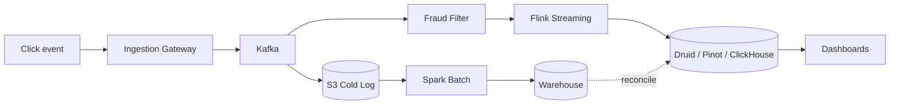

# Design an Ad Click Aggregator

> **TL;DR** — Ad click aggregation is **stream processing with money attached**. Every click is an event; aggregated counts drive billing, fraud, and analytics. The system must be **exactly-once** (you can't bill twice for one click) and **near-real-time** (advertisers want minutes-fresh data, not next-day). The canonical architecture: **clicks → Kafka → Flink/Spark Streaming → OLAP store (Druid/Pinot/ClickHouse)** with idempotency keys, watermarks for late events, and a reconciliation job that compares stream output against the raw log. Click fraud detection runs in parallel.

---

## 1. Requirements

### Functional
- Ingest click events at scale.
- Aggregate by ad, campaign, advertiser, time window.
- Detect and drop fraudulent clicks.
- Real-time dashboards for advertisers.
- Daily / hourly billing reports.
- Replay capability for late corrections.

### Non-Functional
- Ingest throughput: 1 M+ clicks/sec at peak.
- Freshness: dashboards lag < 1 min.
- Exactly-once aggregation.
- Reconciled to 100% accuracy daily for billing.

---

## 2. High-Level Architecture



Lambda-architecture flavor: a fast streaming path + a batch path for correctness.

---

## 3. The Click Event

Each click is small but heavily annotated:
```
click_id        unique (used for dedup)
timestamp
ad_id
campaign_id
advertiser_id
user_id        (or anonymous cookie)
ip
user_agent
referrer
position       on page
session_id
```

Generated when the user clicks the ad. Sent via a beacon to the ingest endpoint.

---

## 4. Ingestion

Click ingestion endpoints behind a CDN/load balancer:
- Lightweight; just append to Kafka.
- ~1 ms latency target.
- Geo-distributed (clicks happen worldwide).
- HTTPS only; signed tokens to prevent forgery.

Kafka topic partitioned by `campaign_id` or hash for parallel processing.

---

## 5. Stream Processing

Flink (or Spark Streaming, Kafka Streams) consumes the click topic.

Operations:
1. **Dedup**: by `click_id`. Late retries of the same beacon must not double-count.
2. **Fraud filter**: drop suspicious clicks (covered below).
3. **Window aggregation**: counts per (ad, campaign, hour) etc.
4. **Sink**: write per-window aggregates to OLAP store.

```python
clicks
  .keyBy(click_id).distinct()
  .filter(not fraud)
  .keyBy(campaign_id)
  .window(TumblingWindow(1 minute))
  .aggregate(count())
  .sinkTo(druid)
```

Tumbling 1-minute windows are common.

---

## 6. Exactly-Once Aggregation

Stream processing exactly-once = combination of:
- **Idempotent dedup** on click_id (writes to dedup state — Flink's keyed state).
- **Checkpoints** that include both Kafka offsets and processor state, committed atomically.
- **Idempotent sinks** (the OLAP store accepts updates keyed by (window_start, dimensions)).

See [Delivery Guarantees →](../07-messaging/delivery-guarantees.md). Flink's "exactly-once" semantics are the gold standard here.

---

## 7. Watermarks and Late Events

Some clicks arrive late (mobile network hiccup, page-close delay). Watermarks track "event time progress."

When watermark passes window-end + grace period:
- Window is closed; output aggregate.
- Later events go to a separate "late path" → late updates.

Late-data handling is the difference between a real stream processor and a toy.

---

## 8. Fraud Detection

Real-time and async layers:

### 8.1 Real-time (in-stream)
- Per-IP click rate too high.
- Same user clicking the same ad N times.
- Bot signatures (UA, no JS execution).
- Geo mismatches.

Drop or mark suspicious in-stream so they don't get billed.

### 8.2 Async (batch)
- ML models on full feature sets.
- Cross-publisher patterns.
- Reverse anomaly detection.

Refunds issued for fraud detected later.

---

## 9. Storage — OLAP

The aggregate store needs:
- Append-only writes from the stream.
- Fast group-by queries over dimensions and time.
- Sub-second response on terabyte datasets.

[Druid / Pinot / ClickHouse →](../19-advanced/real-time-analytics.md) are purpose-built for this. Columnar layout, bitmap indices, time-partitioned segments.

Dashboards query this store directly.

---

## 10. Reconciliation

Daily, the batch job re-aggregates from the raw log:
- Reads everything from S3 (raw events).
- Computes "ground truth" per-window aggregates.
- Compares to streaming output.
- Updates discrepancies.

This is the source of truth for billing. Stream is for dashboards.

---

## 11. Billing

Advertisers are billed based on reconciled aggregates:
- Cost-per-click × clicks - fraud refunds.
- Generated nightly.
- Integrated with [payment system →](./payment-system.md).

---

## 12. Multi-Region

Click ingestion is geographically distributed. Aggregation can:
- Run regionally with cross-region merge at the storage layer.
- Or centralize in a single region (high latency for write but simpler).

Most ad platforms run regional aggregation + global reconciliation.

---

## 13. Common Mistakes

- **No dedup on click_id** — retries double-bill.
- **Stream-only without batch reconcile** — billing errors silent.
- **Counting in OLTP DB** — write throughput dies.
- **No watermarking** — late events break windows.
- **Trusting client timestamps** — clock skew. Use server-side ingest time too.
- **Fraud detected in batch only** — fraudulent clicks bill, refund later → bad advertiser experience.
- **No replay capability** — code bugs become permanent losses.

---

## 14. Cheat Card

```
PURPOSE    Real-time aggregation of click events for ads, with exact billing.

CORE       Ingest → Kafka → Flink stream → OLAP store
           Dedup by click_id; watermarks for late events
           Batch reconciliation against raw log for ground truth
           In-stream fraud filter + async ML for deeper fraud

GUARANTEES  Stream: exactly-once (Flink checkpoints)
            Billing: reconciled batch is source of truth

PITFALLS   no dedup, no batch reconcile, sync DB writes,
           no watermarks, in-stream-only fraud.

RULE       Stream for speed.
           Batch for money.
```

---

## Resources

### Articles
- "Apache Flink for Exactly-Once Stream Processing" — Apache Flink blog
- "Real-time Analytics at Druid scale" — Druid blog
- "How we serve ad analytics in seconds" — various ad-tech engineering blogs

### Documentation
- **Apache Flink** — <https://flink.apache.org>
- **Apache Druid** — <https://druid.apache.org>
- **Apache Pinot** — <https://pinot.apache.org>

### Books
- *Streaming Systems* — Tyler Akidau et al.

### Videos
- ByteByteGo: "Ad Click Counter"
- Tyler Akidau: "Streaming 101 and 102"

### Adjacent reading
- [Stream Processing →](../07-messaging/stream-processing.md)
- [Delivery Guarantees →](../07-messaging/delivery-guarantees.md)
- [Real-Time Analytics →](../19-advanced/real-time-analytics.md)
- [Distributed Counter →](./distributed-counter.md)
- [Lambda vs Kappa →](../14-architecture/lambda-kappa.md)

---

*Previous:* [← Monitoring System](./monitoring-system.md)  |  *Next:* [Recommendation System →](./recommendation-system.md)
