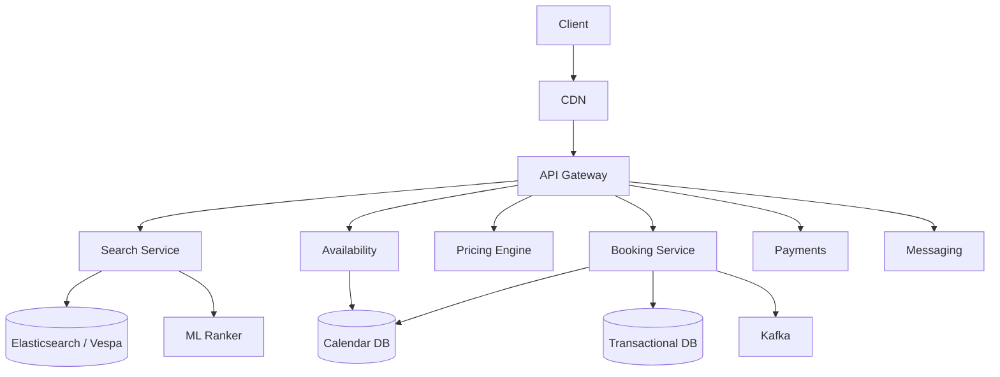
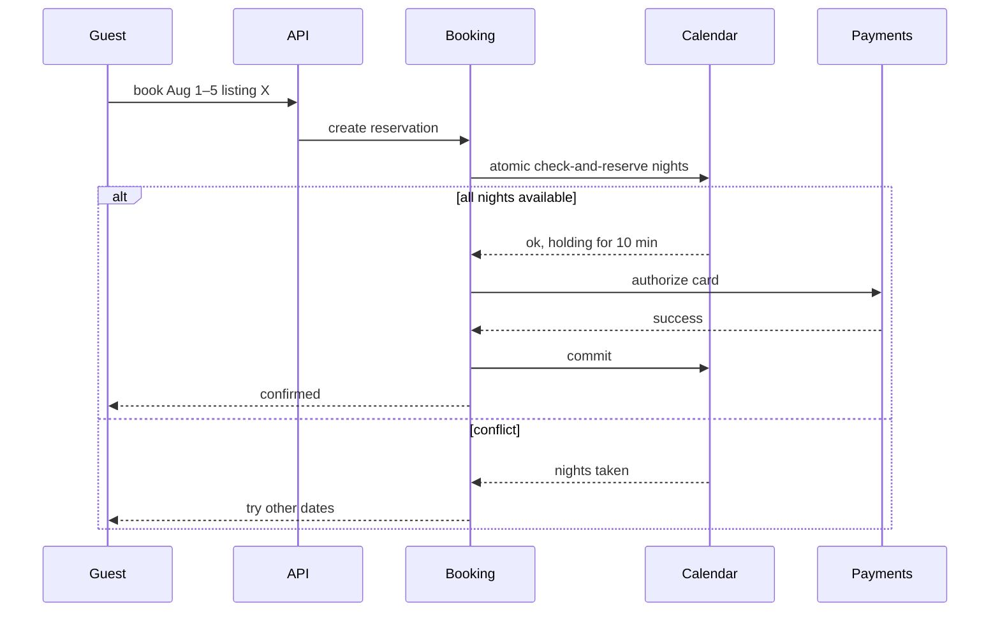

# Design Airbnb / Booking.com

> **TL;DR** — Booking platforms look like e-commerce but the inventory is **a calendar of nights**, not stock units. The hard problems: (1) **search ranking** over geographically and topically varied inventory, (2) **availability + pricing** that updates in real time as bookings happen and avoids double-booking, (3) **payment escrow** between guest and host with cancellation windows, and (4) **trust** (reviews, fraud, ID verification). At Airbnb's scale (~7 M listings, ~150 M users), search is ML-ranked and inventory is mostly read-heavy with bursty writes during booking peaks.

---

## 1. Requirements

### Functional
- Search listings by location, dates, guests, filters.
- View listing details (photos, amenities, reviews).
- Check availability for given dates.
- Book a listing (reserve inventory + pay).
- Host management: create listings, manage calendar.
- Messaging between guest and host.
- Reviews after stay.
- Cancellation, refunds.

### Non-Functional
- Search latency p99 < 500 ms.
- Availability: 99.99%.
- **No double bookings** under any concurrency.
- Scale: ~7 M listings, ~150 M users, ~2 M bookings/day at peak.

---

## 2. Back-of-the-Envelope

- 100 M searches/day → ~1,200 searches/sec average.
- Each search joins inventory × pricing × ranking. ML inference under 100 ms.
- 2 M bookings/day → ~25 bookings/sec average. Burst on Mondays / holidays.
- Photo storage: 7 M listings × 30 photos × 2 MB = ~400 TB.

---

## 3. High-Level Architecture



The booking service is the consistency hotspot. Everything else is read-mostly.

---

## 4. Search

### 4.1 Indexing
- Each listing is a document in Elasticsearch (Airbnb actually uses **Vespa** at scale).
- Indexed fields: location (geo_point), price, amenities, beds, ratings, listing description.
- Refresh on every listing update; eventual consistency over a few seconds is fine.

### 4.2 Query
- Geo filter: bounding box from map viewport.
- Date filter: drop listings unavailable for those dates (joined against availability).
- Other filters: price range, amenities, instant book.
- Sort by ML score.

### 4.3 Availability filtering at search time
You can't search the full 7 M-listing catalog every time. Pre-aggregate availability into the search index:
- "Listing X is available for at least 90% of nights in next 90 days" → flag in index.
- At query time, exact date check filters down candidates.

### 4.4 Ranking
ML model scores each candidate listing on:
- Personalization (your prior preferences).
- Conversion probability.
- Listing quality (reviews, photos, host responsiveness).
- Price competitiveness for the location.

A famous Airbnb paper described their deep-learning ranking journey.

---

## 5. Availability and Calendar

This is the hardest piece.

```
SCHEMA (per listing)
  listing_id
  date
  is_available     bool
  min_nights       int
  max_nights       int
  base_price       money
```

Per-listing × per-night row. 7 M listings × 365 nights × 2 years lookahead = ~5 B rows. Cassandra or sharded Postgres.

Reads dominate (every search joins this). Writes happen at booking time + when host edits.

---

## 6. Booking — Avoiding Double Booking

The classic problem. Two guests trying to book the same listing for the same nights at the same moment.



Options for the atomic check-and-reserve:
1. **Single-row transactional update** with `WHERE is_available = true` predicates — works if all calendar rows for one listing live on one shard.
2. **Pessimistic lock** on listing for the duration of booking attempt — kills concurrency.
3. **Optimistic concurrency**: read calendar, write with version check, retry on conflict.
4. **Booking saga** that reserves a hold, then confirms after payment ([Saga Pattern →](../07-messaging/saga-pattern.md)).

Real platforms use option 4 — reserve a hold (10-min TTL), authorize payment, then confirm. Holds expire automatically.

---

## 7. Pricing

Dynamic pricing:
- **Host base price** + **dynamic adjustments** (events nearby, season, day of week).
- Airbnb's "Smart Pricing" ML model suggests prices to hosts.
- Final price = base × multipliers + cleaning fee + service fees.

Pricing service is invoked by search (per listing) and at booking time (re-priced to match user-shown price).

---

## 8. Payments and Escrow

Airbnb holds guest payment from booking until ~24 hours after check-in, then releases to host. Complex flow:

- Guest charged at confirmation.
- Funds held in Airbnb's escrow account.
- After check-in + cooling period, paid to host.
- Cancellation refunds executed per cancellation policy.

This is implemented as a state machine on top of [payment system →](./payment-system.md).

---

## 9. Messaging

Pre-booking and during-stay communication between guest and host.
- Similar to [WhatsApp →](./whatsapp.md) but lower throughput and richer (attachments, structured messages).
- Persistent history kept.
- PII scrubbed (no phone numbers exchanged outside the platform).

---

## 10. Reviews

After a stay:
- Both guest and host write reviews.
- **Blind reveal** — reviews shown only after both submit or after 14 days. Prevents retaliation bias.
- Reviews feed into ranking + trust signals.

Aggregated into per-listing summaries cached for display.

---

## 11. Photos and Media

- Direct-to-S3 upload via presigned URLs (same as [Instagram →](./instagram.md)).
- Multiple sizes per photo (thumbnail to high-res).
- CDN delivery.

---

## 12. Trust & Safety

- Identity verification (gov ID upload, face match).
- Fraud detection on booking attempts (ML model).
- Listing fraud detection (fake listings).
- ML-flagged messages for safety review.
- Insurance / host protection processes.

Not optional. Major incident → regulatory exposure.

---

## 13. Multi-Region

- Read replicas of catalog in major regions.
- Booking transactions go to a primary region for the listing's home (avoid cross-region locks).
- Search index globally replicated, queried locally.

---

## 14. Common Mistakes

- **Storing calendar in a single Postgres table** — fine to ~1 M listings, breaks at 10 M.
- **Cross-region locks during booking** — latency explodes. Pin listing-writes to one region.
- **Synchronous payment authorization in the booking transaction** — risks DB locks during slow payment networks. Use saga.
- **Search hitting source-of-truth DB** — must use Elasticsearch/Vespa. Eventual consistency OK.
- **No hold expiry** — abandoned bookings block inventory.
- **Reviews visible immediately** — destroys honesty in feedback.

---

## 15. Cheat Card

```
PURPOSE    Search + book temporal inventory (nights), guest <-> host marketplace.

CORE       Vespa/Elasticsearch search with ML ranking
           Per-night availability rows; sharded by listing
           Booking saga: hold (TTL) → payment auth → confirm
           Dynamic pricing (host + ML adjustments)
           Escrow payments (capture at booking, release after check-in)

INVENTORY  7M listings × 365 nights × N years = billions of rows

PITFALLS   pessimistic locks, single global region, sync payment in booking tx,
           reviews without blind reveal, no hold expiry.

RULE       Inventory is a calendar.
           Concurrency control on dates is the entire game.
```

---

## Resources

### Articles
- "Real-time Personalization using Embeddings for Search Ranking at Airbnb" — Airbnb research paper
- "Smart Pricing" — Airbnb Engineering
- "Improving Deep Learning for Ranking Stays at Airbnb" — Airbnb research

### Documentation
- **Vespa** — <https://vespa.ai>
- **Stripe Connect** for marketplace payments

### Videos
- ByteByteGo: "Design Airbnb"
- Airbnb @scale talks on search architecture

### Adjacent reading
- [Hotel Reservation System →](./hotel-reservation.md)
- [Payment System →](./payment-system.md)
- [Ticketmaster →](./ticketmaster.md)
- [Recommendation System →](./recommendation-system.md)
- [Saga Pattern →](../07-messaging/saga-pattern.md)

---

*Previous:* [← Uber / Lyft](./uber.md)  |  *Next:* [Amazon / E-Commerce →](./amazon.md)
