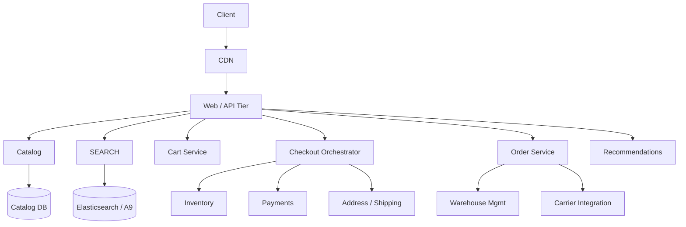
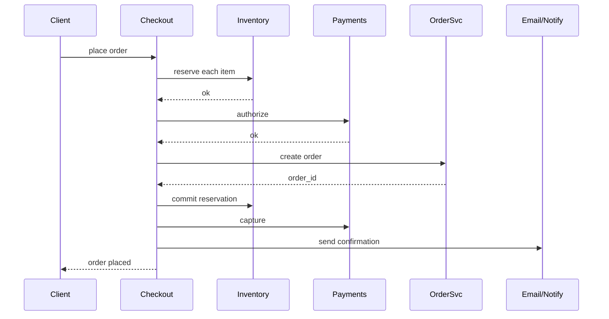

# Design Amazon / E-Commerce Platform

> **TL;DR** — A retail platform is **catalog + cart + checkout + fulfillment**, each with its own scaling characteristics. The catalog is read-heavy and cacheable. The cart is per-user state — small writes, low latency. **Checkout is where consistency matters most** — inventory decrement, payment, order creation all must be coordinated. Fulfillment is a logistics/warehouse problem distinct from web. Amazon's signature engineering moves are: **service-oriented architecture from day one (Bezos's mandate)**, **eventual consistency by default** (DynamoDB came from this work), **two-pizza teams**, and **independent deployability**.

---

## 1. Requirements

### Functional
- Search and browse catalog (categories, filters, recommendations).
- Product detail pages with reviews, ratings, images.
- Cart (add/remove items, save for later).
- Checkout (address, shipping, payment).
- Order tracking.
- Reviews, ratings.
- Returns.

### Non-Functional
- Latency: product page p99 < 200 ms.
- Availability: 99.99% on the customer path.
- Inventory accuracy: must not oversell.
- Scale: ~300 M active customers, ~12 M products, ~7 K orders/sec at Black Friday peaks.

---

## 2. Back-of-the-Envelope

- 5 B page views/day → ~60 K/sec.
- Product detail cache hit rate target > 95%.
- Catalog storage: 12 M products × ~50 KB metadata each = ~600 GB.
- Order events at peak: ~7 K orders/sec × multiple downstream events = ~70 K events/sec.

---

## 3. High-Level Architecture



Amazon's actual SOA has hundreds of services. The diagram is a sketch.

---

## 4. Catalog

- Products stored in a sharded key-value store + relational metadata. Amazon's actual catalog stack is custom.
- Each product page is denormalized at write time so reads are single-key lookups.
- Heavy caching: edge (CDN for static), Redis (per-product), application-level.
- Updates flow through Kafka so search index and recommendations subscribe.

---

## 5. Search

Amazon's search engine is called **A9**. Functionally similar to Elasticsearch but heavily customized.

- Indexes products by title, description, attributes, brand, category.
- Personalization re-rank by user history + relevance.
- Heavy A/B testing — ranking changes can swing billions in revenue.

For your purposes: Elasticsearch / Vespa with ML re-ranking.

---

## 6. Cart

- Per-user state: small JSON or list of `(sku, quantity, options)`.
- Stored in a fast KV (Redis, DynamoDB).
- Cross-device persistence: cart attached to user account; merged on login.
- Anonymous cart in browser cookie + server-side session.

Cart is intentionally **NOT** locked to inventory — you can have items in cart that go out of stock. Inventory is checked at checkout.

---

## 7. Inventory

Hardest piece because over-selling is unforgivable.

```
SCHEMA
  sku           string
  warehouse_id  string
  on_hand       int
  reserved      int
  available     int (derived: on_hand - reserved)
```

Inventory is **partitioned by SKU + warehouse**. A single SKU may have stock in 10 warehouses; aggregate "available" is computed.

At checkout, system must:
1. **Reserve** the item (decrement `available`).
2. Hold reservation until order completes (5–15 min TTL).
3. **Commit** the reservation when order is paid and confirmed.
4. **Release** if checkout abandons.

Implementation:
- Atomic `UPDATE ... WHERE available >= qty` in the inventory store.
- Or `INCR/DECR` in Redis + async reconciliation to DB.
- High-velocity SKUs (Black Friday TV deal) need sharded counters and may use [distributed counter →](./distributed-counter.md) techniques.

---

## 8. Checkout (the Saga)



This is a [saga →](../07-messaging/saga-pattern.md). Each step is reversible with a compensating action:
- Payment auth → reverse with `void`.
- Inventory reserve → release.
- Order created → cancel.

Compensations run on failure. Distributed transactions (2PC) would not scale; sagas are how this is done.

---

## 9. Orders

Once placed, orders are immutable for accounting. Lifecycle states:
```
CREATED → PAID → PICKING → PACKED → SHIPPED → DELIVERED
                                    → RETURNED → REFUNDED
```

Each state transition emits Kafka events for downstream (warehouse, carrier, customer notifications).

Storage: relational (Postgres / Aurora) for the order header + items. Long-term archived to columnar store.

---

## 10. Recommendations

Famous Amazon contribution: **item-to-item collaborative filtering** (the original Amazon recommender paper, 2003).
- "Customers who bought X also bought Y" — precomputed per SKU.
- Personalized homepage rows.
- Cart-bottom upsells.

Modern Amazon adds embeddings, deep models, and contextual signals. See [Recommendation System →](./recommendation-system.md).

---

## 11. Reviews

- One review per (user, product, order).
- Verified purchase badge from order linkage.
- Moderation pipeline: ML for spam/profanity + human reviewers for flagged.
- Helpfulness votes feed ranking.

Storage: per-product partition; recent reviews cached.

---

## 12. Fulfillment

Outside the web stack:
- **WMS** (Warehouse Management): pick lists, robotics integration, packing stations.
- **Carrier integration**: shipping labels via UPS/FedEx/USPS APIs.
- **Tracking**: poll carrier or receive webhook updates; surface to customer.
- **Last-mile delivery**: Amazon Logistics, AMZL.

For interview purposes, this is where you stop. But it's a massive system.

---

## 13. Returns

- RMA (Return Merchandise Authorization) created.
- Customer ships back (label provided).
- Receipt at warehouse triggers refund.
- Item inspected and re-introduced to inventory or scrapped.

---

## 14. Multi-Region / Marketplaces

Amazon has separate marketplaces (US, UK, JP, IN, ...) each with their own catalogs, currencies, taxes. Cross-marketplace orders are rare.

This is fundamentally a **multi-tenant** problem. Per-region clusters with shared user identity service.

---

## 15. Common Mistakes

- **Locking inventory rows for the entire checkout** — burns concurrency. Use reserve-then-commit.
- **2PC across order, payment, inventory** — slow, fragile. Use sagas.
- **Cart in the order DB** — different access pattern; keep separated.
- **Synchronous recommendations on every page** — pre-compute, cache.
- **No idempotency on order creation** — double-clicks create double orders. Use idempotency keys.
- **Hot SKU on Black Friday in single shard** — needs sharded counters.

---

## 16. Cheat Card

```
PURPOSE    Search → cart → checkout → fulfill, at planetary scale.

CORE       Catalog read-heavy, denormalized, heavily cached
           Cart = per-user KV (Redis/DynamoDB), eventual consistency OK
           Inventory partitioned by SKU+warehouse, reserve→commit pattern
           Checkout = saga across inventory, payment, order
           Orders immutable; events flow to fulfillment, comms, analytics

NUMBERS    7K orders/sec peak (Black Friday)
           Search p99 < 300 ms, product page < 200 ms
           Catalog hit rate > 95%

PITFALLS   2PC across services, sync recommendations, no idempotency,
           cart-as-inventory, locking rows during slow payments.

RULE       SOA with eventual consistency + sagas.
           The right consistency for the right step.
```

---

## Resources

### Articles
- "Amazon's Dynamo paper" — Werner Vogels et al. (SOSP 2007)
- "Amazon.com Recommendations: Item-to-Item Collaborative Filtering" — Linden et al. 2003
- "All Things Distributed" — Werner Vogels' blog
- "Bezos API Mandate" memo (widely circulated)

### Documentation
- **DynamoDB** — <https://docs.aws.amazon.com/dynamodb/>
- **Stripe Connect** marketplace payments (analogous patterns)

### Videos
- Werner Vogels keynotes on Amazon's architecture
- ByteByteGo: "Design Amazon"

### Adjacent reading
- [Airbnb / Booking →](./airbnb.md)
- [Payment System →](./payment-system.md)
- [Saga Pattern →](../07-messaging/saga-pattern.md)
- [Distributed Counter →](./distributed-counter.md)
- [Recommendation System →](./recommendation-system.md)

---

*Previous:* [← Airbnb / Booking.com](./airbnb.md)  |  *Next:* [Payment System →](./payment-system.md)
