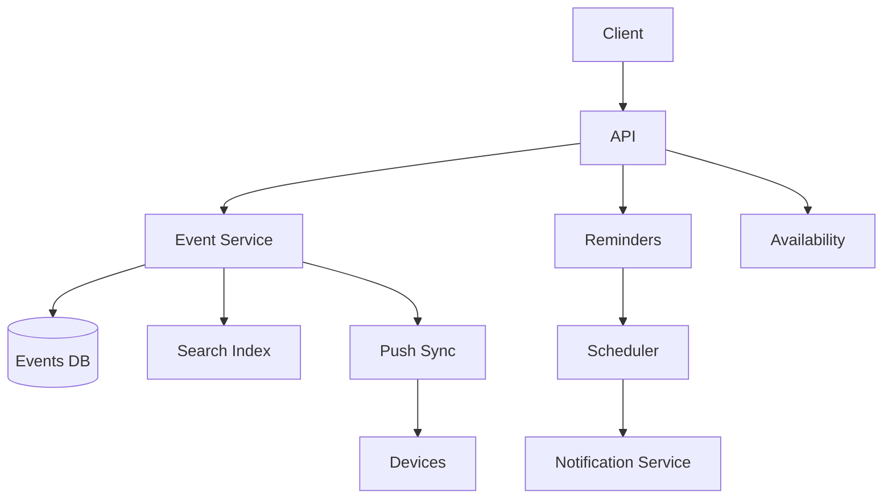

# Design a Calendar System

> **TL;DR** — A calendar system looks deceptively simple, but **recurring events** and **time zones** make it hard. Every event has a "schedule" — possibly a complex recurrence rule (RRULE per RFC 5545) — and computing "what events are in this view" requires **expanding recurrences** for the query window. Time zones add intricate edge cases (DST transitions, location vs creator time zone). Add **invitations** (your event involves N people whose calendars must be updated), **conflicts**, and **availability** queries (Google Calendar's "Find a Time"), and you have a system with real complexity hiding behind a friendly UI.

---

## 1. Requirements

### Functional
- Create / edit / delete events.
- Recurring events (daily, weekly, custom RRULEs).
- Invite attendees; RSVP.
- View events in day/week/month views.
- Search.
- Notifications and reminders.
- Find-a-time across multiple calendars.

### Non-Functional
- View load p99 < 300 ms.
- Reminders fire within 1 minute of scheduled time.
- Multi-device sync within seconds.
- Time zone correctness across DST and location moves.

---

## 2. High-Level Architecture



---

## 3. Event Storage

```
SCHEMA
  event_id        uuid
  owner_id
  calendar_id     belongs to a calendar
  title
  description
  location
  start_at        UTC instant
  end_at          UTC instant
  timezone        IANA tz id (e.g., "America/Los_Angeles")
  rrule           RFC 5545 recurrence rule, nullable
  attendees       list of (user_id, status)
  reminders       list of (offset, channel)
```

Store **start in UTC + the user's intended time zone**. Convert to local time for display.

Why both? Time zones change rules (DST, political moves). Store the tz so future occurrences of recurrence are calculated correctly.

---

## 4. Recurring Events

RFC 5545 RRULE:
```
RRULE:FREQ=WEEKLY;BYDAY=MO,WE,FR;UNTIL=20261231T235959Z
```

Recurrence is **virtual** — you don't store every occurrence; you store the rule and expand at query time.

Exceptions: "every Monday except Christmas" → `EXDATE` overrides.
Modifications: "this specific occurrence runs from 3 to 4 instead of the usual 2 to 3" → override row referencing parent.

Storage:
- Master event row + recurrence rule.
- Override rows for modified instances (`recurrence_id` = original start of that occurrence).

---

## 5. Query — "Show This Week"

To render the user's view:
1. Fetch non-recurring events overlapping [start, end].
2. Fetch recurring event masters whose rule could intersect [start, end].
3. **Expand** each recurrence within the window.
4. Apply overrides.
5. Render.

Expansion is computed on-demand. Cache for common views (week/month) to avoid re-computation.

---

## 6. Time Zones

The minefield:
- DST transitions: 2 AM happens twice (fall back) or doesn't happen at all (spring forward).
- Location changes: "I'll be in Tokyo next week, meetings in Tokyo time."
- Recurring meetings across DST: "weekly Monday 10 AM" should stay 10 AM in your tz even when DST changes.

Storing time zone (not just UTC) handles this correctly. Use a robust library (Joda, java.time, dateutil, Luxon).

---

## 7. Invites and RSVP

Event has attendees. Inviting:
- Create event in owner's calendar.
- Send invitation to each attendee (email + in-app).
- Attendee accepts → event appears on their calendar.
- Decline → not shown but tracked.

Each attendee's calendar references the same event ID; views show their own RSVP status.

iCalendar (.ics) format is the protocol for cross-system invitations (e.g., Outlook → Gmail).

---

## 8. Find-a-Time

Given attendees and a window, find slots where all are free.

- For each attendee, compute busy intervals in the window.
- Intersect the **complements** to find common free slots.
- Rank by preferences (within work hours, not too early/late).

For 5 attendees over a week, this is fast. For 50 attendees over a month, careful caching.

---

## 9. Reminders

When an event approaches:
- Reminder created with `(event_id, fire_at)`.
- Stored in a scheduler ([Job Scheduler →](./job-scheduler.md)).
- Fired → notification sent via push/email.

Multiple reminders per event (10 min before, 1 day before).

Time zone matters: "10 min before" means 10 min before local-time start.

---

## 10. Sync Across Devices

Each client maintains a local copy. Sync via:
- Server pushes diff on connect.
- Long-poll / WebSocket for live updates.
- iCal / CalDAV for third-party clients.

Each calendar has a sync token; client passes it, gets all changes since.

---

## 11. Search

- Full-text on title, description, attendees.
- Time-range queries.
- Indexed in Elasticsearch.

---

## 12. Sharing

- Calendar-level (share entire calendar).
- Event-level (one event with others).
- Permissions: see free/busy only, see details, modify.

Implemented as ACLs per calendar / event.

---

## 13. Common Mistakes

- **Storing only UTC, no time zone** — recurring events break on DST.
- **Materializing all recurring occurrences in DB** — explodes with `FREQ=DAILY` and no end date.
- **Naive recurrence expansion on every query** — cache.
- **Synchronous reminder firing in app** — use a scheduler.
- **Trusting client time zone for storage** — clocks drift; use the IANA tz on the event.
- **No conflict / overlap detection in UI** — bad UX.
- **iCal/CalDAV ignored** — third-party clients can't subscribe.

---

## 14. Cheat Card

```
PURPOSE    Personal + shared scheduling with recurring events.

CORE       Event row + RRULE (RFC 5545) + override rows for exceptions
           Store UTC instant + IANA timezone id
           Expand recurrences within query window (cache common views)
           Find-a-time = intersect free intervals of attendees
           Reminders via scheduler service; fire as notifications
           iCal/CalDAV for interop with Outlook etc.

PITFALLS   UTC-only storage, materialized recurrences,
           naive expansion per query, sync reminders.

RULE       Recurrence is a rule, not a row per occurrence.
           Time zones are part of the truth.
```

---

## Resources

### Articles
- "Calendar Date and Time Standards" — Joel Spolsky / various
- "Why Calendars Are So Hard" — multiple engineering blogs
- "Time Zones Are Sneakier Than You Think" — talks/articles

### Documentation
- **RFC 5545** — iCalendar spec
- **CalDAV (RFC 4791)** — calendar sync protocol
- **IANA Time Zone Database** — <https://www.iana.org/time-zones>

### Books
- *The Long, Painful History of Time* — Tom van Baak (deep on horology)

### Videos
- ByteByteGo: calendar / scheduling topics

### Adjacent reading
- [Job Scheduler →](./job-scheduler.md)
- [Notification System →](./notification-system.md)
- [Hotel Reservation System →](./hotel-reservation.md)

---

*Previous:* [← Email System (Gmail)](./email-system.md)  |  *Next:* [To-Do App with Offline Sync →](./todo-offline-sync.md)
