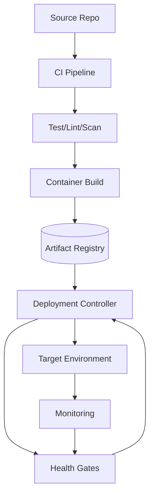

# Design a Code Deployment System

> **TL;DR** — A code deployment system takes **artifacts** (containers, binaries) and gets them onto **fleets of servers** safely. Three big concerns: (1) **artifact distribution** — push GBs to thousands of machines without melting your network, (2) **rollout orchestration** — canary, blue-green, rolling, with health gates and instant rollback, (3) **drift detection** — what's actually running matches what was deployed. Modern stack: container registry → declarative orchestrator (Kubernetes / Spinnaker / Argo CD) → progressive delivery (Flagger / Argo Rollouts) with metrics-based promotion. The legacy world (Capistrano-era SSH-push) was simpler and far more fragile.

---

## 1. Requirements

### Functional
- Build artifact from source.
- Push to artifact registry.
- Deploy to environments (dev/staging/prod).
- Multiple deployment strategies (rolling, canary, blue-green).
- Health checks, automatic rollback.
- Audit trail of who deployed what.

### Non-Functional
- Deploy 1000s of services per day at scale.
- Rollback in < 1 min.
- Zero downtime.
- Audit / compliance traceability.

---

## 2. High-Level Architecture



CI builds artifacts; CD pushes them. Health gates feedback loop.

---

## 3. Artifact Build

- Container image (Docker / OCI), or platform-specific binary.
- Built per commit; tagged with commit SHA.
- Stored in artifact registry (Docker Hub, ECR, GCR, Artifactory).
- Signed for provenance (Sigstore, cosign).

Cache aggressively — most builds change only a few layers.

---

## 4. Artifact Distribution

Pushing a 1 GB image to 10K hosts:
- **Pull-based**: hosts pull from central registry. Simple. Registry must scale to thundering herd.
- **Peer-to-peer**: hosts share among themselves (Dragonfly, Kraken at Uber). Drastically reduces central load.
- **Pre-warming**: pull on hosts before deploy command.

For containers in Kubernetes: kubelets pull from a registry. Use regional mirrors to reduce latency.

---

## 5. Rollout Strategies

### 5.1 Rolling
Replace N pods at a time; new version comes up, old terminates.
- Pros: simple, no extra resources.
- Cons: two versions live simultaneously; can't roll back instantly.

### 5.2 Blue-Green
Two complete environments (blue = current, green = new). Switch traffic in one move.
- Pros: instant rollback (switch back).
- Cons: 2× infra cost during deploy.

### 5.3 Canary
New version to a small subset (1%, 5%, 25%, 100%), gated by metrics.
- Pros: tiny blast radius for bad deploys.
- Cons: complex orchestration.

### 5.4 Shadow
New version receives mirrored traffic but doesn't serve responses.
- Pros: tests with real traffic safely.
- Cons: cost; can't catch user-facing bugs.

See [Blue-Green →](../15-deployment/blue-green.md), [Canary →](../15-deployment/canary.md), [Rolling →](../15-deployment/rolling.md).

---

## 6. Health Gates

Automated decision: is the new version healthy enough to promote / continue rollout?

Sources:
- Health check endpoints.
- Error rate metrics.
- Latency metrics.
- Business KPIs (conversions, revenue).

Implementation: compare new-version metrics vs baseline (old version) over a window. If new is worse beyond threshold, **abort and roll back**.

Tools: Flagger, Argo Rollouts, Spinnaker pipelines.

---

## 7. Rollback

Fast rollback is non-negotiable. Approaches:
- **Image rollback**: redeploy previous image tag.
- **Blue-green switch**: re-point traffic to the unchanged blue environment.
- **Database migration handling**: ensure forward AND backward compatibility (see expand-contract pattern).

Rollback must be one-click or automatic. If a rollback takes 30 min, you'll be down for 30 min.

---

## 8. Database Migrations

The hardest part of deploys. Schema changes can break either:
- **Old code with new schema** (forward incompatibility).
- **New code with old schema** (backward incompatibility).

**Expand-contract pattern**:
1. Expand: add new column / table (compatible with old code).
2. Deploy code that uses new column.
3. Contract: drop old column.

Each step independently deployable and rollback-able.

See [Database Migrations →](../04-databases/migrations.md).

---

## 9. Feature Flags

Decouple deploy from release:
- Code deployed with new feature gated by a flag.
- Flag flipped (via central service) to enable for some users.
- No new deploy needed to roll back the feature.

See [Feature Flags →](../15-deployment/feature-flags.md).

LaunchDarkly, Flagsmith, in-house. Combined with progressive delivery, decouples engineering velocity from release risk.

---

## 10. GitOps

Declarative deployment model:
- Desired state (manifests) stored in git.
- Controller (Argo CD, Flux) reconciles cluster to git state.
- Deploys = git commits.
- Auditable, reversible.

The modern default for Kubernetes deployments.

---

## 11. Pipelines

CI/CD pipelines automate the whole flow:
```
push → build → test → security scan → push artifact → deploy dev → smoke test → deploy staging → integration test → canary prod → full prod
```

Tools: GitHub Actions, GitLab CI, Jenkins, CircleCI, Buildkite.

Pipeline as code (YAML in repo) is the norm.

See [CI/CD Pipelines →](../15-deployment/cicd.md).

---

## 12. Audit and Compliance

Every deploy records:
- Who triggered it.
- What artifact (SHA).
- Which environment.
- Outcome (success/rollback/failure).
- Signed manifests.

Required for SOC 2, ISO 27001, PCI.

---

## 13. Multi-Region Deploys

Deploy to one region first; if healthy after some bake time, promote to others. Bad deploys discovered before they're global.

Order regions by traffic share (smallest first as canary, biggest last).

---

## 14. Common Mistakes

- **Big-bang prod deploys** — full rollout, fingers crossed.
- **No health gates** — bad deploys don't auto-rollback.
- **Mutable infrastructure** — patching servers in place. Use immutable (rebuild and replace).
- **No database migration plan** — schema breaks coupled deploys.
- **Conflating deploy with release** — use feature flags.
- **Manual rollback only** — too slow.
- **Pull from one central registry** — bottleneck. Mirrors or P2P.

---

## 15. Cheat Card

```
PURPOSE    Get code from commit to all servers safely.

CORE       Build → registry → declarative deploy → progressive rollout
           Canary with metrics-based promotion is the modern default
           GitOps: cluster state reconciles to git
           Feature flags decouple deploy from release
           Expand-contract for schema migrations
           Immutable infrastructure (rebuild, don't patch)

ROLLBACK   Image rollback, blue-green switch, or feature flag flip
           Must be one-click or automatic, under 1 minute

PITFALLS   big-bang deploys, no canary, manual rollback,
           coupled schema migrations, mutable infra.

RULE       Deploy small, often, reversibly.
           Decouple deploy from release.
```

---

## Resources

### Articles
- "Continuous delivery at Facebook" — Facebook engineering
- "How Spinnaker Powers Netflix Deployments" — Netflix Tech Blog
- "GitOps Principles" — Weaveworks
- "Expand-Contract Database Schema Changes" — multiple sources

### Documentation
- **Spinnaker** — <https://spinnaker.io>
- **Argo Rollouts** — <https://argoproj.github.io/argo-rollouts/>
- **Flagger** — <https://flagger.app>
- **Kubernetes Deployments** — <https://kubernetes.io/docs/concepts/workloads/controllers/deployment/>

### Books
- *Accelerate* — Forsgren, Humble, Kim
- *Continuous Delivery* — Humble & Farley

### Videos
- ByteByteGo: "Design CI/CD"
- "Progressive Delivery" — Weaveworks talks

### Adjacent reading
- [CI/CD Pipelines →](../15-deployment/cicd.md)
- [Canary Deployment →](../15-deployment/canary.md)
- [Blue-Green Deployment →](../15-deployment/blue-green.md)
- [Feature Flags →](../15-deployment/feature-flags.md)
- [Immutable Infrastructure →](../15-deployment/immutable-infra.md)

---

*Previous:* [← Ride-Sharing Matchmaking](./ride-matching.md)  |  *Next:* [Multiplayer Game Backend →](./multiplayer-game.md)
