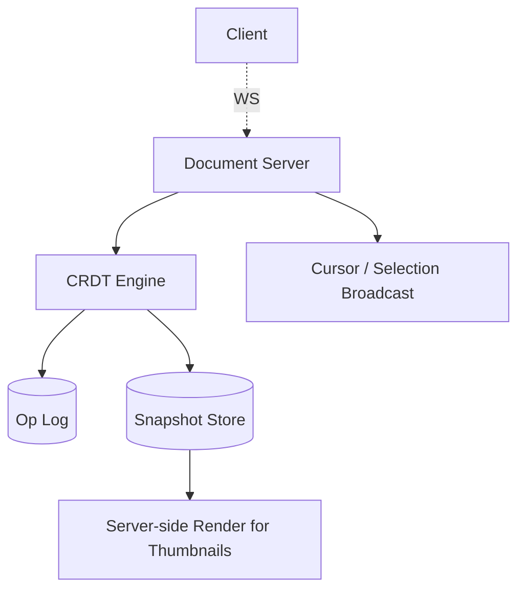
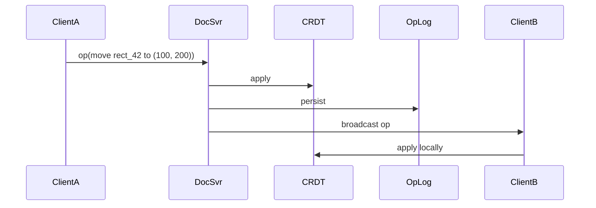

# Design a Collaborative Whiteboard (Figma/Miro)

> **TL;DR** — A collaborative whiteboard combines [Google Docs's →](./google-docs.md) real-time-editing problem with **vector graphics** and **infinite canvas**. Where docs sync text ops, whiteboards sync **object operations** (create, move, resize, delete) on a tree of shapes. **CRDTs** dominate this space (Figma's multiplayer infrastructure is famously CRDT-based). Big challenges: efficient rendering at 60 FPS with thousands of objects, viewport culling so distant edits don't render, and **persistent storage + history**. Cursor presence and selections add the social layer.

---

## 1. Requirements

### Functional
- Multiple users editing a canvas in real time.
- Vector primitives (rect, ellipse, line, text, image).
- Layers, groups, components.
- Comments / cursors / selections.
- Undo/redo per user.
- Versions / history.
- Infinite canvas (zoom + pan).

### Non-Functional
- Op propagation p99 < 200 ms.
- Render at 60 FPS with thousands of objects.
- No edits lost; convergent final state.
- Documents persist; reloadable.

---

## 2. High-Level Architecture



One server (or small set) owns each document. Clients connect via WebSocket.

---

## 3. Document Model

A whiteboard is a tree of objects:
```
Document
├── Page 1
│   ├── Frame
│   │   ├── Rect
│   │   └── Text
│   └── Ellipse
└── Page 2
    └── Group
        ├── Line
        └── Image
```

Operations:
- `insert(parent_id, object)`
- `delete(object_id)`
- `update(object_id, properties)`
- `reparent(object_id, new_parent)`

---

## 4. CRDT for the Object Tree

Concurrent edits must converge. Operations on disjoint objects commute naturally. The tricky cases:
- Concurrent reparent of same node.
- Concurrent property updates.

Tree CRDTs (Kleppmann's Move tree CRDT) handle reparenting.

For property updates: LWW per property, with vector clocks or hybrid logical clocks for ordering.

Each object has a globally unique ID. Operations carry the ID + version.

See [CRDTs →](../08-distributed-systems/crdts.md).

---

## 5. Op Propagation



Each client maintains a local CRDT replica. Server is the central coordinator (could be peer-to-peer but server simplifies persistence + cursors).

---

## 6. Persistence

Snapshot + op log model:
- Snapshot = serialized current state of CRDT.
- Op log = operations since last snapshot.
- Periodic snapshots reduce replay time on load.

Document size can grow large (Figma files into the GB). Lazy load by viewport.

---

## 7. Viewport Culling

A document might have 10K objects. Don't render off-screen ones.

- Spatial index (quadtree / R-tree) over objects.
- On viewport change, query "objects in viewport bounds."
- Only those are rendered.

See [R-Trees →](../19-advanced/r-trees.md).

---

## 8. Rendering

Browser canvases (HTML Canvas / WebGL) for performance.

Figma rebuilt their renderer in C++ → WebAssembly to hit 60 FPS at scale.

Layered rendering: redraw only changed regions.

---

## 9. Presence — Cursors and Selections

Each client broadcasts:
- Cursor position (every ~50 ms, throttled).
- Current selection (object IDs).

Server broadcasts to others in the doc. Ephemeral — not persisted.

Other clients render colored cursors with the user's name/avatar.

---

## 10. Undo / Redo

Per-user undo stack — undoing your move shouldn't undo someone else's.

CRDT-friendly: each op has a paired inverse. User's undo stack stores inverses of their own ops.

Conflicting undo (you moved a rect; someone deleted it; you undo your move) handled by treating the action as a no-op or restoring.

---

## 11. Comments

Comments attached to:
- A specific object.
- A region of the canvas.

Threaded; mention users.

Separate sub-document, also collaborative.

---

## 12. Components (Figma-specific)

Reusable design elements with overrides.
- Components defined once.
- Instances reference the master.
- Changes to master propagate to instances.
- Overrides per instance preserved.

Sophisticated; adds tree dependencies.

---

## 13. Scale Limits

Per-doc scaling:
- Hot docs (10+ concurrent editors) need careful CRDT performance.
- Sharding within doc by section/page possible but complex.

Most docs have 1–3 concurrent editors; the long tail of large collaborations is rare.

---

## 14. Common Mistakes

- **OT for tree operations** — gets ugly with reparenting. CRDT is cleaner.
- **Sync rendering on every op** — drops below 60 FPS. Batch and request animation frames.
- **No spatial index** — scrolling on big docs lags.
- **Single CRDT for entire doc with 100MB+** — load time and memory blow up. Lazy load.
- **Persisting cursor positions** — they're ephemeral.
- **No undo isolation per user** — undo of others' ops is unexpected.

---

## 15. Cheat Card

```
PURPOSE    Multi-user real-time collaborative graphics canvas.

CORE       Tree CRDT over object hierarchy; LWW for properties
           Server-mediated WebSocket op fan-out
           Op log + periodic snapshots for persistence
           Viewport-culled rendering with spatial index (quadtree)
           60 FPS canvas / WebGL rendering
           Per-user undo stacks

PRESENCE   Cursors / selections broadcast every ~50 ms; never persisted

PITFALLS   OT-for-trees, sync rendering, no viewport culling,
           single huge CRDT, persistent cursors.

RULE       Edits converge via CRDT.
           Rendering is its own performance problem.
```

---

## Resources

### Articles
- "How Figma's Multiplayer Technology Works" — Figma engineering blog (the canonical reference)
- "Designing Figma's Performance" — Figma engineering
- "A Move Operation for Tree CRDTs" — Kleppmann et al.

### Documentation
- **Yjs** — CRDT library, <https://github.com/yjs/yjs>
- **Automerge** — CRDT library, <https://automerge.org>

### Books
- "CRDTs Illustrated" essays — Martin Kleppmann
- "Crafting Interpreters" — Robert Nystrom (for tree-walking concepts, useful background)

### Videos
- "Multiplayer at Figma" — Figma talks
- "CRDTs in Practice" — various

### Adjacent reading
- [Google Docs →](./google-docs.md)
- [CRDTs →](../08-distributed-systems/crdts.md)
- [R-Trees →](../19-advanced/r-trees.md)
- [WebSockets →](../02-networking/websockets.md)

---

*Previous:* [← Live Streaming Platform](./twitch.md)  |  *Next:* [Email System (Gmail) →](./email-system.md)
