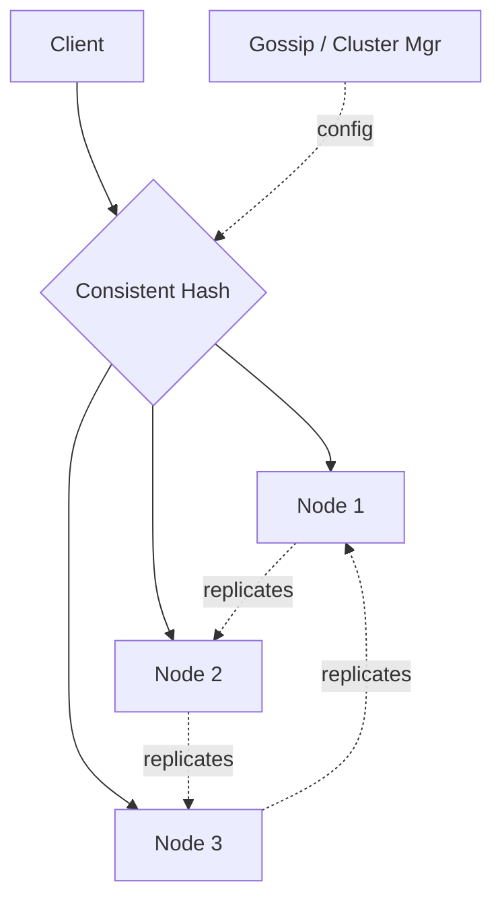

# Design Distributed Cache

> **TL;DR** — A distributed cache is **a fast hash table sharded across many machines**, sitting between your application and your database. The core problems are (1) **partitioning** keys across nodes — almost always **consistent hashing** — (2) **replication** for failures, (3) **eviction** when memory fills (LRU/LFU/ARC), (4) **client routing** (clients know which node holds which key, no proxy), and (5) **invalidation** (the second-hardest problem in CS, supposedly). Redis and Memcached are the canonical implementations; their design differences (data structures vs. pure KV, single-threaded vs. multi-threaded) inform every decision in this space.

---

## 1. Requirements

### Functional
- `GET / SET / DELETE` by key.
- TTL (expire keys after time).
- Eviction when at memory cap.
- Optional: data structures (lists, sets, hashes — Redis style).
- Optional: pub/sub.

### Non-Functional
- Latency: p99 < 1 ms within data center.
- Throughput: 1 M+ ops/sec per node.
- Availability: 99.99%.
- Horizontal scale: TB+ of memory aggregate.

---

## 2. High-Level Architecture



Clients hash keys to nodes; each node owns a partition of the keyspace.

---

## 3. Partitioning — Consistent Hashing

The fundamental algorithm. Hash function maps keys and nodes to a ring (0 to 2^32). Each key goes to the next node clockwise on the ring.

```
[hash space]: 0 -------- 2^32
Nodes hashed:     A    B    C   D
Key "foo" hashes to position → finds next clockwise node
```

Why not `hash(key) % N`? Because adding/removing a node remaps almost all keys. With consistent hashing, only ~1/N keys move when N changes.

**Virtual nodes**: each physical node owns hundreds of points on the ring. Smooths distribution and rebalancing.

See [Consistent Hashing →](../04-databases/consistent-hashing.md).

---

## 4. Replication

To survive node failures, each key is replicated to R nodes (the next R clockwise on the ring).

- Reads can go to any replica (eventually consistent).
- Writes go to all R; success after W acknowledge (quorum).
- R=3, W=2 is typical.

See [Quorum →](../08-distributed-systems/quorum.md).

Some caches (Memcached) don't replicate at all — losing a node loses its keys, and clients re-fetch from origin. Simpler, less reliable.

---

## 5. Client Routing

Two models:

### 5.1 Client-side routing (Memcached, Redis Cluster client)
Clients embed the consistent hash; route requests directly. Fast (no extra hop). Requires keeping cluster topology in sync via gossip or config service.

### 5.2 Proxy (Twemproxy, Envoy)
Stateless proxy in front of the cluster routes requests. Simpler clients. Extra hop, extra failure mode.

Redis Cluster uses client-side with "MOVED" responses when client routes wrong.

---

## 6. Memory Layout

Pure KV servers store key → value bytes in a hash table. Constraints:
- Memory budget per node (256 GB typical max).
- Per-key overhead (~50–100 bytes regardless of value size).
- Memcached uses **slab allocator** to reduce fragmentation.
- Redis uses dictionaries with various encodings.

---

## 7. Eviction

When memory cap reached, evict to make room:

- **LRU** (least recently used) — most common.
- **LFU** (least frequently used) — better hit rate when access patterns are stable, more expensive to maintain.
- **TTL-based** — only expire by time.
- **Random** — Redis offers this; surprisingly competitive at scale.

See [Eviction Policies →](../05-caching/eviction-policies.md).

Approximation matters: true LRU requires linked list updates on every access — expensive. Redis approximates with sampling.

---

## 8. Expiration (TTL)

Each key may have an expiry timestamp.
- **Lazy**: check at read time; if expired, return miss + delete.
- **Active**: background scan that evicts expired keys.

Redis combines both — lazy on access plus active sampling every 100 ms.

---

## 9. Persistence

Pure caches don't persist; they're regenerated from the database. But sometimes you want persistence:

- **AOF** (Append-only file): log every write; replay on restart.
- **RDB**: periodic snapshot.

Redis offers both. Trade-off: persistence costs durability for the cache's purpose (speed). Most caches run without persistence.

---

## 10. Single-Threaded vs Multi-Threaded

- **Memcached**: multi-threaded. Locks per slab.
- **Redis**: single-threaded for command processing (with I/O threading in newer versions). Simplicity + cache locality.

Counter-intuitive that single-threaded wins, but Redis at 1M ops/sec on one core proves it. Multi-thread your nodes by running multiple Redis processes / sharding within the box.

---

## 11. Read Pattern Optimizations

- **Multi-get pipelining**: client batches many GETs in one TCP roundtrip.
- **Pipelining**: dozens of commands flowing without waiting for individual replies.
- **Read-through cache**: cache server (or library) fetches from DB on miss, populates itself.

---

## 12. Cache Patterns (Recap)

- **Cache-aside**: app reads cache; on miss, reads DB and populates cache.
- **Read-through**: cache abstracts the DB; app only talks to cache.
- **Write-through**: writes go to cache, then DB synchronously.
- **Write-back**: writes go to cache, flush to DB later.

See [Cache Strategies →](../05-caching/cache-strategies.md).

---

## 13. Hot Keys

A single key (e.g., the current trending tweet ID) can receive millions of QPS — overwhelming the single shard that owns it.

Mitigations:
- **In-memory L1 cache** on each app server in front of the distributed cache.
- **Replicated hot keys** to multiple shards; clients pick randomly.
- **Hot-key detection** in the cache itself (Redis 5.0+ has hot key analysis tools).

---

## 14. Common Mistakes

- **`hash(key) % N`** — every scale event remaps the world. Use consistent hashing.
- **No replication, no plan for node failure** — outage when a node falls.
- **Cache stampede on key expiry** — N requests miss simultaneously, all hit DB. Use [stampede mitigation →](../05-caching/cache-pitfalls.md).
- **No eviction policy set** — `maxmemory` reached, writes start failing.
- **Storing very large values** — single 100 MB value in Redis blocks command processing.
- **No metrics on hit rate** — you can't tune what you don't measure.

---

## 15. Cheat Card

```
PURPOSE    Sharded in-memory KV store, sub-ms lookups in front of slower stores.

CORE       Consistent hashing partitions keys across nodes
           Replication factor R for HA; quorum reads/writes
           Client-side or proxy routing
           LRU/LFU eviction at memory cap
           TTL with lazy + active expiration

THROUGHPUT  ~1M ops/sec per node (single-threaded Redis style)
LATENCY     p99 < 1 ms within DC

PITFALLS   modulo sharding, no replication, no eviction policy,
           cache stampede, hot keys on one shard, huge values.

RULE       Cache is the database's bodyguard.
           The DB still has to survive the worst-case miss.
```

---

## Resources

### Articles
- "Scaling Memcached at Facebook" — Facebook (USENIX paper)
- "Redis Cluster Specification" — Redis docs
- "How Twitter Uses Redis to Scale" — Twitter engineering

### Documentation
- **Redis Cluster** — <https://redis.io/docs/management/scaling/>
- **Memcached** — <https://memcached.org>

### Books
- *Redis in Action* — Josiah Carlson
- *Designing Data-Intensive Applications* — Kleppmann

### Videos
- ByteByteGo: "Design a Distributed Cache"
- "Memcached at Facebook" talks

### Adjacent reading
- [Distributed Caching →](../05-caching/distributed-caching.md)
- [Redis Deep Dive →](../05-caching/redis-deep-dive.md)
- [Consistent Hashing →](../04-databases/consistent-hashing.md)
- [Cache Pitfalls →](../05-caching/cache-pitfalls.md)

---

*Previous:* [← Rate Limiter](./rate-limiter.md)  |  *Next:* [Distributed Counter →](./distributed-counter.md)
