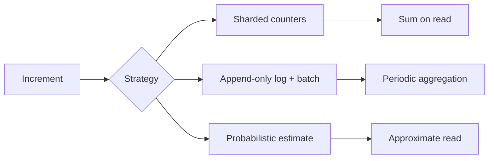
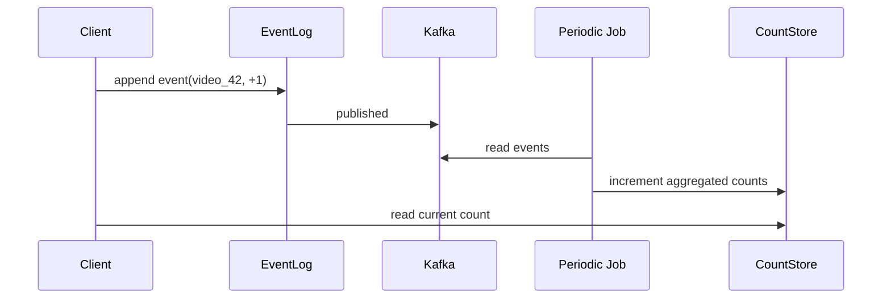

# Design Distributed Counter

> **TL;DR** — A naive counter is `UPDATE counts SET value = value + 1 WHERE id = X` — and it falls over the moment you have **a hot key**, because every increment serializes on one row. The fix is to **shard the counter** into N sub-counters, increment a random one, and sum on read. The variant chosen depends on read-vs-write trade-off: **sharded counters in Redis** (fast writes, fast reads), **append-only log + periodic aggregation** (writes never block, reads have lag), **probabilistic counters (HyperLogLog)** for cardinality. Counters at scale are why YouTube view counts update every few minutes, not in real time.

---

## 1. Requirements

### Functional
- Increment counter by N (often 1).
- Read current count.
- Read count over time window (last hour, last day) for some variants.
- Persistent across restarts.

### Non-Functional
- Increment latency p99 < 10 ms.
- Read latency p99 < 50 ms.
- Throughput: 100K+ increments/sec on hot counters.
- Accuracy: often eventual is fine.

---

## 2. The Hot-Key Problem

```
UPDATE counts SET value = value + 1 WHERE id = 'youtube_video_42'
```

- Acquires row lock.
- Two concurrent writes serialize.
- At 100K writes/sec to one row: chaos.

This is *the* classic system design failure mode.

---

## 3. Solution Family



---

## 4. Sharded Counters

Split the single counter into N shards. Each increment picks a random shard.

```
KEY:    count:video_42:shard_0  → 1247
        count:video_42:shard_1  → 1252
        count:video_42:shard_2  → 1239
        ...
        count:video_42:shard_15 → 1244

Increment:    INCR count:video_42:shard_rand(0..15)
Read:         MGET count:video_42:shard_0..15 → sum
```

Trade-off: writes scale ~N×; reads are O(N).

Storage: Redis is ideal — `INCR` is atomic and very fast.

For massive scale, the shards themselves are distributed across the Redis cluster.

---

## 5. Append-Only Log + Aggregation

Don't increment in place. Write an event for every action; periodically aggregate.



Writes are append-only — infinite throughput.
Reads see counts from the last aggregation cycle (e.g., 1-minute lag).

This is how YouTube view counts work — events go to a pipeline, counts update on a schedule.

---

## 6. Lambda / Kappa Architecture

For "live count + accurate count" semantics:
- **Speed layer**: real-time event stream → approximate counter (Redis).
- **Batch layer**: durable log → exact count via daily MapReduce.
- Read merges both.

See [Lambda vs Kappa →](../14-architecture/lambda-kappa.md).

---

## 7. Probabilistic Counting

For **unique counts** (e.g., unique viewers, unique users), exact counting requires storing the set — millions of bytes per key.

**HyperLogLog** estimates cardinality in 12 KB regardless of count:
- Hashes elements; tracks the maximum number of leading zeros in any hash.
- Estimates cardinality from that statistic.
- Error: ~2%.
- Mergeable across shards.

Redis has built-in `PFADD` / `PFCOUNT` / `PFMERGE`.

For approximate counting (not cardinality) — **Count-Min Sketch** for heavy hitters.

See [Probabilistic Data Structures →](../08-distributed-systems/probabilistic-data-structures.md).

---

## 8. The Read Path

Sharded counters:
```python
def read_count(id):
    keys = [f"count:{id}:shard_{i}" for i in range(N)]
    return sum(redis.mget(keys))
```

To avoid N reads per get: maintain a **cached aggregate** key, refreshed every few seconds by a background job. Reads hit the cache.

---

## 9. Persistence

Redis sharded counters can lose data on crash unless AOF/RDB enabled.

For durable counters: write events to Kafka first, derive counts. Source of truth = the log.

For "good enough" counts: Redis + periodic snapshot to durable store is fine.

---

## 10. Decay / Time Windows

"Likes in last hour" — needs time-bucketed counters.

```
KEY:    count:video_42:2024-05-20T14
        count:video_42:2024-05-20T15
        ...
```

Per-hour or per-minute buckets. Old buckets expired with TTL. Read sums recent buckets.

For sliding windows: maintain a ring buffer or sorted set of timestamped events.

---

## 11. Idempotency

If increments are retried, you double-count. Solutions:
- **Idempotency key** on the event; dedup on the receiver.
- **Use Kafka log offsets** as natural idempotency markers.

For exact counts on event streams, exactly-once semantics matter. See [Delivery Guarantees →](../07-messaging/delivery-guarantees.md).

---

## 12. Common Mistakes

- **One row in the DB for a hot key** — guaranteed to blow up.
- **Sharded counter without aggregation cache** — N Redis reads per page view.
- **Treating all counters the same** — most counters aren't hot. Don't over-engineer cold ones.
- **HyperLogLog when you need exact** — error compounds in business contexts.
- **No idempotency on event-driven counters** — retries inflate counts.
- **Synchronous DB writes on every increment** — kills throughput.

---

## 13. Cheat Card

```
PURPOSE    Increment counts at extreme rates without hot-row contention.

CORE       Three families:
           1. Sharded counters (Redis INCR across N shards)
           2. Append-only event log + periodic aggregation
           3. Probabilistic (HyperLogLog for uniques)

THROUGHPUT  Sharded: 100K+ inc/sec per key
            Log-based: virtually unlimited writes; read lag

ACCURACY   Sharded = exact. Probabilistic = ~2% error.

PITFALLS   single-row counter, no read-cache,
           lossy Redis without AOF, no idempotency on retries.

RULE       Hot counters are a fan-out problem.
           Pick a write strategy that doesn't serialize.
```

---

## Resources

### Articles
- "How Instagram Counts Likes" — Instagram Engineering (older posts)
- "Distributed Counters at Twitter" — Twitter Engineering
- "Counters in Cassandra" — DataStax docs

### Documentation
- **Redis INCR** — <https://redis.io/commands/incr/>
- **Redis HyperLogLog** — <https://redis.io/docs/data-types/hyperloglogs/>

### Books
- *Designing Data-Intensive Applications* — Kleppmann

### Videos
- ByteByteGo: "Distributed Counters"

### Adjacent reading
- [Probabilistic Data Structures →](../08-distributed-systems/probabilistic-data-structures.md)
- [Lambda vs Kappa Architecture →](../14-architecture/lambda-kappa.md)
- [Delivery Guarantees →](../07-messaging/delivery-guarantees.md)
- [Ad Click Aggregator →](./ad-click-aggregator.md)

---

*Previous:* [← Distributed Cache](./distributed-cache.md)  |  *Next:* [Web Crawler →](./web-crawler.md)
