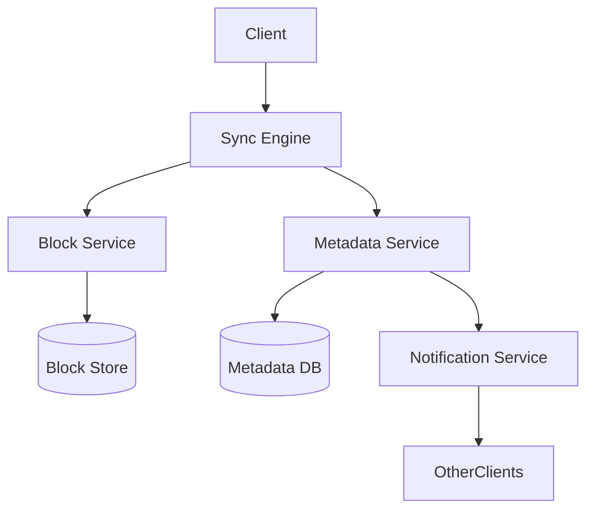
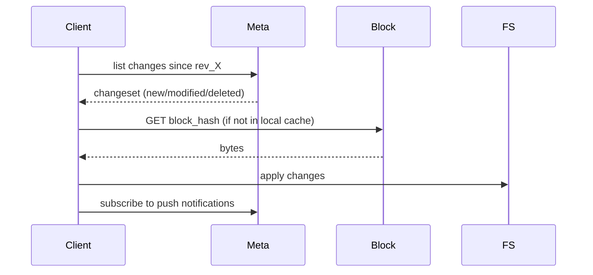
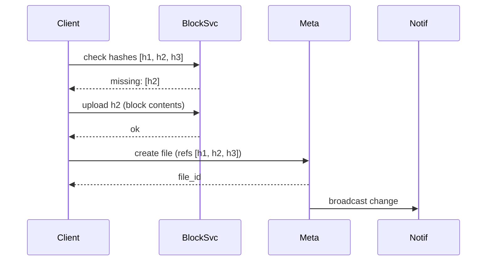

# Design Google Drive / Dropbox

> **TL;DR** — File sync is **block-level deduplication + a metadata service that pretends to be a filesystem**. Files are split into ~4 MB blocks, each hashed; the same block (e.g., an OS file shared across a million Macs) is stored once. The client tracks local state and syncs deltas. The metadata service is a sharded SQL store with per-user namespaces. Dropbox's "Magic Pocket" migration off S3 to their own storage is one of the most documented infrastructure projects in industry. Conflict resolution is the user-facing nightmare — most products give up and create `file (conflict copy).ext`.

---

## 1. Requirements

### Functional
- Upload, download, delete files.
- Sync across devices.
- Share with others (link or invite).
- Versions / restore.
- Folder structure.
- Conflict handling.
- Offline edits, sync when online.

### Non-Functional
- Latency: file open / list folder p99 < 500 ms.
- Durability: 11+ nines.
- Storage scale: exabytes globally.
- Bandwidth efficiency: don't re-upload unchanged blocks.

---

## 2. Back-of-the-Envelope

- Dropbox: ~500 M users, ~400 PB of data (after dedup).
- Average user: ~10 GB.
- Daily diff sync: small fractions of total — block dedup makes the difference.

---

## 3. High-Level Architecture



Two distinct services:
- **Metadata** (small, frequent, strong consistency): folder structure, file references, permissions.
- **Blocks** (large, infrequent, eventual consistency OK): actual file contents.

---

## 4. Block-Level Dedup

Each file is split into fixed-size blocks (~4 MB). Each block is content-hashed (SHA-256).

```
file.pdf → [block_hash_1, block_hash_2, block_hash_3, ...]
```

Storage:
- Block content stored once globally by hash. If two users have the same block, it's stored once.
- Client only uploads blocks the server doesn't have (check-then-upload).

Massive bandwidth and storage savings:
- Same OS binaries across millions of devices = stored once.
- Small edits to a big file = only changed blocks re-uploaded.

Privacy concern: server can see hash matches across users (a side channel — though content is encrypted, hashes leak existence). Dropbox addresses this with per-user salts in some modes.

---

## 5. Metadata

```
SCHEMA (files table)
  file_id      uuid
  owner_id
  parent_folder_id
  name
  block_hashes []
  version
  created_at
  modified_at
  deleted_at   nullable
```

Folder = special file with directory metadata. Folders form a tree.

Sharded by `user_id` (or namespace). Postgres / MySQL — these are normal OLTP workloads.

---

## 6. Sync Protocol



- Each user namespace has a monotonically increasing **revision number** (or vector of revisions per device).
- Client polls or subscribes to changes since last known revision.
- Push notifications via long-poll / WebSocket reduce sync latency.

---

## 7. Upload Flow



Only h2 (the new/changed block) crossed the wire.

---

## 8. Conflict Resolution

Two devices edit the same file offline, then come online.

Strategy: **last-write-wins on the file as a whole**, but the conflicted version is preserved as `file (Mac's conflicted copy 2024-05-20).docx`. User decides which to keep.

True merge requires understanding the file format — Dropbox doesn't do this. Google Docs handles this differently (operational transforms / CRDTs); see [Google Docs →](./google-docs.md).

---

## 9. Versioning

Each file modification creates a new version (immutable references to a new set of block hashes).
- Recent versions kept (30 days for free, longer for paid).
- Old versions garbage-collected after retention.
- Restore = pointer flip to old block set.

Cheap to keep many versions because blocks are deduped.

---

## 10. Sharing

- **Link sharing**: opaque short URL → file_id with permissions.
- **Direct sharing**: ACL entries `(file_id, recipient_user_id, role)`.
- **Folder sharing**: ACL on folder propagates to descendants.

Permissions checked on every read. Cached in a permissions service.

---

## 11. Storage Backend

Dropbox initially on S3, then built **Magic Pocket** in 2016 — own data centers with custom storage (Reed-Solomon erasure coding, custom hardware). Saved hundreds of millions in storage costs.

Erasure coding (e.g., 10+4 Reed-Solomon): split block into 10 data shards + 4 parity; can lose 4 shards and reconstruct. Cheaper than 3× replication. See [Erasure Coding →](../09-storage/erasure-coding.md).

---

## 12. Offline Mode

- Client cache holds local copies of files marked for offline.
- Edits queued; flushed to server when online.
- Conflict resolution as above.

LSM-style local log of pending operations.

---

## 13. Common Mistakes

- **Storing the whole file on every change** — bandwidth bill explodes. Block dedup.
- **Strong consistency for blocks** — unneeded. Metadata strong, blocks eventual is fine.
- **No content hashes** — can't dedup, can't verify integrity.
- **Conflicting writes overwrite silently** — preserve both, let user choose.
- **Metadata in a single Postgres** — needs sharding past a few TB.
- **Re-uploading entire folders on rename** — rename should be a metadata-only operation.

---

## 14. Cheat Card

```
PURPOSE    File sync + share across devices, with versioning.

CORE       File = list of content-hashed blocks (~4 MB each)
           Global block dedup; client uploads only missing blocks
           Metadata (folders, perms, refs) in sharded SQL
           Block store with erasure coding (Magic Pocket)
           Push notifications for sync; long-poll fallback

CONFLICTS  Last-write-wins on whole file; preserve "conflicted copy"

PITFALLS   no dedup, strong consistency on blocks,
           silent overwrites, full-file re-upload on edit,
           single metadata DB.

RULE       Hash everything. Sync deltas, not files.
```

---

## Resources

### Articles
- "Magic Pocket: how we built our own storage system" — Dropbox Engineering
- "Inside the Magic Pocket" — Dropbox Engineering deep dive
- "Speed and scaling: How Dropbox sync got faster" — Dropbox Engineering

### Documentation
- **Dropbox API** — <https://www.dropbox.com/developers>
- **rsync algorithm** — Andrew Tridgell's thesis on delta sync

### Videos
- ByteByteGo: "Design Dropbox"
- Dropbox @ Scale conference talks

### Adjacent reading
- [Object Storage →](../09-storage/object-storage.md)
- [Erasure Coding →](../09-storage/erasure-coding.md)
- [Google Docs →](./google-docs.md)
- [To-Do App with Offline Sync →](./todo-offline-sync.md)

---

*Previous:* [← Google Maps](./google-maps.md)  |  *Next:* [Google Docs →](./google-docs.md)
