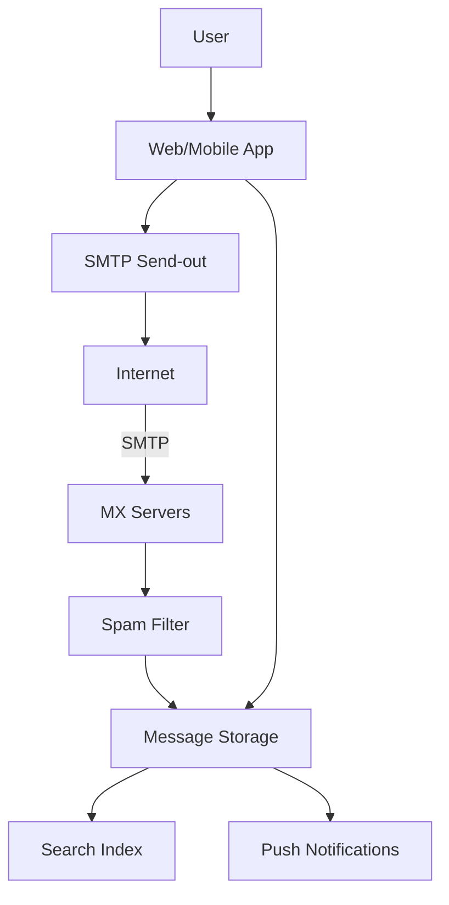

# Design an Email System (Gmail)

> **TL;DR** — Email is a **federated protocol** (SMTP) wearing decades of operational scar tissue, with a **search-heavy storage layer** on top. The architectural challenges: (1) accept billions of messages/day reliably (SMTP ingest with anti-spam at the door), (2) store petabytes of mostly-cold data with sub-second search, (3) **spam and abuse defense** which is a permanent ML war, (4) **delivery to other providers** (SMTP send-out with reputation management), (5) per-user **threading, labels, search**. Gmail revolutionized email storage with **server-side conversation threading** and **full-text search** — Google's existing infrastructure (Bigtable, GFS) was a perfect fit.

---

## 1. Requirements

### Functional
- Receive email via SMTP from external senders.
- Send email via SMTP to external recipients.
- Store messages, indexed by user.
- Threaded conversations.
- Labels / folders.
- Full-text search.
- Spam filtering.
- Attachments.

### Non-Functional
- Receive billions of messages/day.
- Storage: per-user GB+ retention.
- Search latency p99 < 500 ms.
- Spam catch rate > 99.9%.

---

## 2. High-Level Architecture



Mail comes in via SMTP, lands in storage, gets indexed; user UI reads from storage and search.

---

## 3. SMTP Ingest

External senders connect to your MX server:
- Connection-time blacklist checks (RBLs).
- TLS for transport security.
- SPF / DKIM / DMARC verification of sender identity.
- Greylisting / rate limits on suspicious senders.
- Anti-spam scoring.

If accepted, message lands in storage. If rejected, SMTP error returned (sender re-queues).

This layer is where most spam dies. The amount of incoming junk is staggering — 50%+ of all SMTP traffic is spam.

---

## 4. Spam Filtering

Layered defense:
1. **Network-level**: IP reputation, RBLs.
2. **Protocol-level**: SPF/DKIM/DMARC.
3. **Content-level**: Bayesian filters, ML classifiers on body/headers/URLs/links.
4. **Behavioral**: do other users mark this as spam?

Gmail's spam catch rate is famously good — they have decades of training data from billions of users.

---

## 5. Message Storage

```
SCHEMA
  msg_id        unique
  user_id       owner
  thread_id     groups related messages
  from, to, cc, subject
  date
  body          (HTML, text)
  labels        []
  attachments   refs to blob storage
```

- Stored in wide-column DB (Bigtable-style at Gmail; could be Cassandra or HBase).
- Partitioned by `user_id`.
- Attachments stored separately in blob storage (S3, GFS).
- Deduplication of identical messages within a user's inbox.

Per-user storage: GBs to tens of GBs. Hot recent messages in cache; cold messages on cheap storage.

---

## 6. Search

Gmail's signature feature: full-text search of years of email.

- Inverted index per user.
- Indexed fields: subject, body, headers, attachment content (extracted).
- Sharded by user_id (each user's inbox is a self-contained index).
- Updates indexed within seconds of receipt.

Tech: Bigtable + Lucene-like index, or Elasticsearch / OpenSearch for non-Google implementations.

---

## 7. Threading

Mail clients group related messages into conversations.

Algorithm:
- `In-Reply-To` / `References` headers (RFC 5322) define explicit reply chains.
- Subject matching ("Re: ..." patterns) as fallback.
- Each user's view groups by `thread_id`.

Gmail stores `thread_id` per message at receive time.

---

## 8. Labels and Folders

- **Folders** (IMAP-style): hierarchical, mutually exclusive.
- **Labels** (Gmail-style): tags, can apply many to one message.

Labels stored as a list on the message. Index by `(user_id, label)` enables "Show inbox" / "Show starred."

Server-side filtering rules apply labels automatically.

---

## 9. Sending (Outbound)

User clicks send:
- Message validated.
- Queued in outbound queue.
- SMTP delivered to recipient's MX (or queued if unreachable).
- Retried with backoff on transient failures.

Reputation management: your sending IPs must maintain reputation (low spam complaints) to be accepted by Gmail / Outlook / Yahoo as a sender.

---

## 10. Push and IMAP

- **Push** (mobile): notify devices on new message arrival.
- **IMAP**: legacy protocol for desktop clients; servers expose mailbox state.
- **JMAP** / proprietary APIs for modern apps.

WebSocket / long-poll for web clients to update inbox in real time.

---

## 11. Attachments

- Limited size (Gmail: 25 MB; Google Drive integration for larger).
- Stored in blob storage; messages reference by ID.
- Server-side virus scanning.
- Inline image previews.

---

## 12. Storage Tiers

- **Hot** (last 90 days): SSD, indexed, fast access.
- **Warm** (90 days – 2 years): cheaper disks.
- **Cold** (2+ years): object storage, slower but searchable.

Users notice slower search on very old mail — that's the tier transition.

---

## 13. Compliance and Legal

- Data residency (EU emails stay in EU storage).
- Encryption at rest and in transit.
- Legal holds (preserve specific user's mail during litigation).
- Privacy: no human reads user mail without due process.

---

## 14. Common Mistakes

- **No SPF/DKIM/DMARC** — spam from your domain, blacklisted everywhere.
- **No outbound reputation management** — your sends get rejected.
- **Storing attachments inline** — large messages clog rows.
- **No spam pipeline** — your service becomes unusable in weeks.
- **Index built lazily** — search lags freshness.
- **Sync IMAP servers without partitioning** — single-server limit caps users.

---

## 15. Cheat Card

```
PURPOSE    Receive, store, search, and send email at planetary scale.

CORE       SMTP ingest with anti-spam at the door
           Wide-column storage partitioned by user_id
           Per-user inverted index for search; updated within seconds
           Threading via In-Reply-To/References headers
           Labels as message tags; folders for exclusive grouping
           SPF/DKIM/DMARC for inbound + outbound identity

NUMBERS    Billions of msgs/day at Gmail
           50%+ of incoming SMTP = spam
           Storage in PBs; tiered hot/warm/cold

PITFALLS   no SPF/DKIM, no spam pipeline, attachments inline,
           single index across users, no reputation mgmt.

RULE       Email is a federated protocol with operational scars.
           Anti-spam is half the system.
```

---

## Resources

### Articles
- "How Gmail Works" — various Google engineering posts
- "Inside Gmail's spam fighters" — Google blog
- "Email Authentication: SPF, DKIM, DMARC" — Postmark, Mailgun blogs

### Documentation
- **RFC 5321** (SMTP), **RFC 5322** (Message Format)
- **DMARC** — <https://dmarc.org>
- **Postfix** — open-source SMTP server

### Books
- *Email Security with Cisco IronPort* (operational color)
- *The Cathedral and the Bazaar* (qmail/sendmail history)

### Videos
- ByteByteGo: "Design Gmail"

### Adjacent reading
- [Notification System →](./notification-system.md)
- [Object Storage →](../09-storage/object-storage.md)
- [Search Engines →](../04-databases/search-engines.md)
- [Inverted Indexes →](../19-advanced/inverted-index.md)

---

*Previous:* [← Collaborative Whiteboard](./collaborative-whiteboard.md)  |  *Next:* [Calendar System →](./calendar.md)
