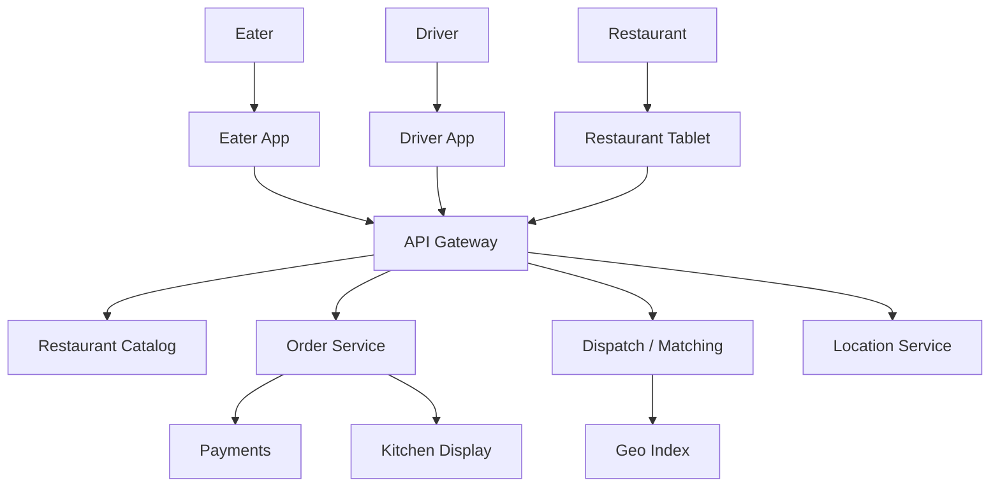
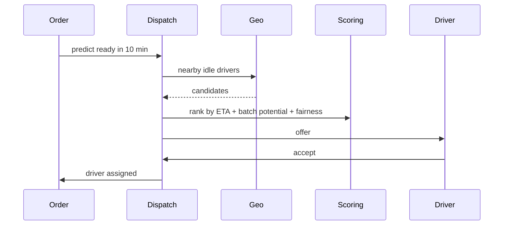

# Design a Food Delivery System (DoorDash)

> **TL;DR** — Food delivery is a **three-sided marketplace** (eaters, restaurants, drivers) on top of [Uber's geo-matching →](./uber.md) with extra coordination layers. The complications versus rideshare: (1) the trip has **three legs** (driver → restaurant → eater) instead of two, (2) **food readiness** is unreliable — restaurants are slow or fast unpredictably, (3) **batching** multiple orders for one driver, (4) **incentivizing supply** in real time (driver pay, surge). DoorDash has open-sourced parts of their architecture; the dispatch system is the most interesting piece.

---

## 1. Requirements

### Functional
- Eater browses restaurants, places order.
- Restaurant receives order, prepares food.
- Driver assigned, picks up, delivers.
- Real-time tracking for everyone.
- Payment.
- Ratings.

### Non-Functional
- Order placement p99 < 500 ms.
- Match-to-driver < 30 sec.
- ETA accuracy within ±5 minutes.
- Availability: 99.99% in active markets.

---

## 2. High-Level Architecture



Three apps; the orchestration brain is the Dispatch service.

---

## 3. Restaurant Catalog

- Menus, prices, hours, photos.
- Indexed for search by name, cuisine, location.
- Cached aggressively; menu rarely changes in a session.
- Photo CDN.

Cuisine search uses Elasticsearch with geospatial filters.

---

## 4. Order Lifecycle

```
CREATED → RESTAURANT_ACCEPTED → COOKING → READY_FOR_PICKUP →
DRIVER_ASSIGNED → PICKED_UP → IN_TRANSIT → DELIVERED
```

State machine, each transition emitting events.

Multiple parties watch this state:
- Eater sees "Cooking" then "On the way."
- Restaurant sees order, then "Driver arriving."
- Driver sees pickup, then route to eater.

---

## 5. Dispatch — The Matching Problem

When food is ready (or predicted ready), assign a driver.



Differs from rideshare:
- Match happens **before food is ready** (driver arrives just as food is plated).
- "Predicted ready time" comes from ML model trained on per-restaurant historical data.
- Optimize over time, not just space.

---

## 6. Order Batching

A driver can carry multiple orders simultaneously ("stacking"):
- Order A from restaurant X to eater 1.
- Order B from restaurant Y to eater 2.
- Or two orders from same restaurant.

Dispatch scores candidate driver-order pairings, considering:
- Geographic clustering.
- Time overlap (no order delayed too long).
- Driver capacity.

This is an instance of the **vehicle routing problem (VRP)** — NP-hard in general; heuristics + local search in practice.

---

## 7. ETA Calculations

Three ETAs to estimate:
1. Restaurant cooking time (from food ready model).
2. Driver-to-restaurant time.
3. Restaurant-to-eater time.

Sum + buffers = eater's promised ETA.

Each prediction is its own ML model trained on historical data. Real-time signals (current driver traffic, restaurant kitchen backup) adjust.

---

## 8. Location Tracking

Same as [Uber →](./uber.md):
- Driver app pings location every few seconds.
- In-memory geo index (H3 / geohash).
- Eater app pulls driver position for live tracking.

Battery-friendly cadence: ping less when not actively dispatched.

---

## 9. Real-Time Updates

Eater sees status changes within seconds:
- WebSocket / push notification on each transition.
- Map updates with driver position.
- Order status change UI.

---

## 10. Restaurant Operations

The "merchant" side has its own product:
- **Tablet** at restaurant shows incoming orders.
- Restaurant accepts (or rejects) order.
- "Mark ready" updates state.
- Kitchen Display Systems (KDS) integration in larger chains.

Outage handling: if restaurant doesn't respond in 60 sec, alert + auto-cancel for the eater.

---

## 11. Payments

- Charge eater at order placement.
- Split funds: restaurant share + driver pay + platform fee + taxes.
- Tips added after delivery.
- Payouts to restaurants and drivers per their schedules.

See [Payment System →](./payment-system.md).

---

## 12. Surge / Incentives

Demand exceeds supply in some areas:
- Offer bonus to drivers in that zone.
- Show "busy area" higher fees to eaters.

Computed per H3 cell every few minutes based on supply/demand ratios.

---

## 13. Common Mistakes

- **Matching when order is placed** — driver waits at restaurant. Match when food is nearly ready.
- **No food readiness prediction** — over- or under-shoot constantly.
- **No batching logic** — driver utilization tanks; costs go up.
- **Single-region dispatch cluster** — one city's outage shouldn't be global.
- **Synchronous restaurant tablet communication** — bad WiFi = orders missed. Push + ack.
- **No driver heartbeat** — drivers go offline; system doesn't know.

---

## 14. Cheat Card

```
PURPOSE    Three-sided marketplace: eater + restaurant + driver, with delivery logistics.

CORE       Restaurant catalog (Elasticsearch) + geo dispatch (H3-style index)
           Match driver to order when food predicted ready (not order time)
           Order batching via VRP-style heuristic optimization
           ML for cook time, drive time, delivery time
           Real-time tracking via WebSocket / push

INCENTIVES Per-cell surge by supply/demand ratio

PITFALLS   match at order time, no batching,
           no food readiness model, single-region dispatch,
           sync restaurant tablet calls.

RULE       Dispatch in time, not just space.
           Match the driver to the food being ready.
```

---

## Resources

### Articles
- "Things I Learned Building DoorDash" — DoorDash engineering blog
- "Real-Time Routing with Cassandra" — DoorDash engineering
- "Vehicle Routing Problem" — academic literature

### Documentation
- **H3** — <https://h3geo.org>
- **OSRM** — routing engine

### Videos
- ByteByteGo: "Design DoorDash"
- DoorDash engineering talks on QCon

### Adjacent reading
- [Uber / Lyft →](./uber.md)
- [Ride-Sharing Matchmaking →](./ride-matching.md)
- [Google Maps →](./google-maps.md)
- [Payment System →](./payment-system.md)

---

*Previous:* [← Ticketmaster](./ticketmaster.md)  |  *Next:* [Ride-Sharing Matchmaking →](./ride-matching.md)
