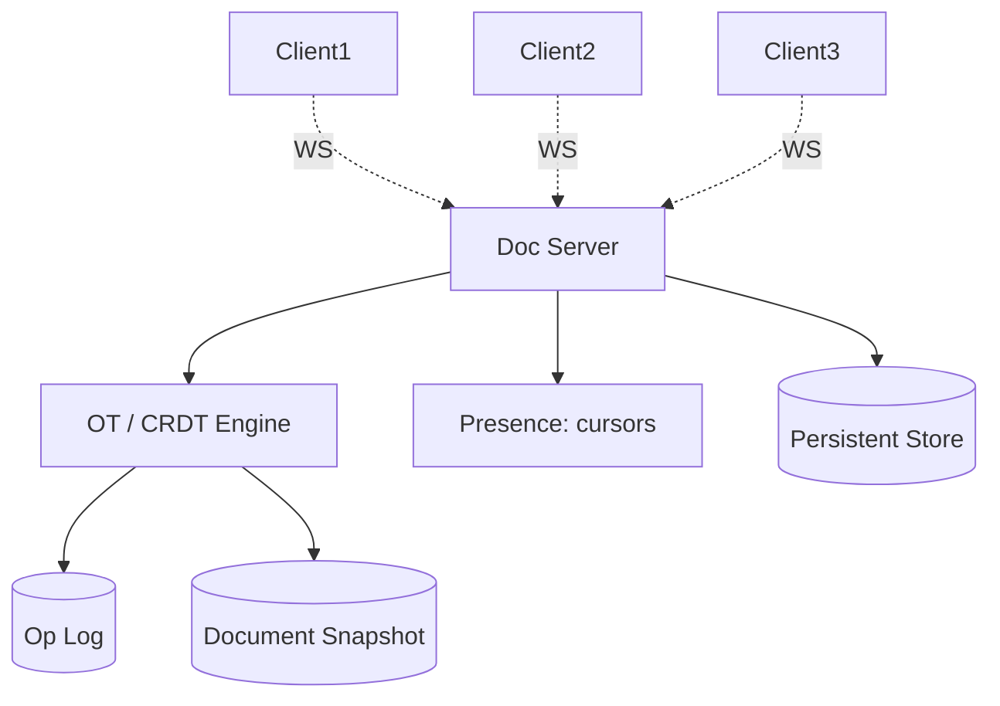
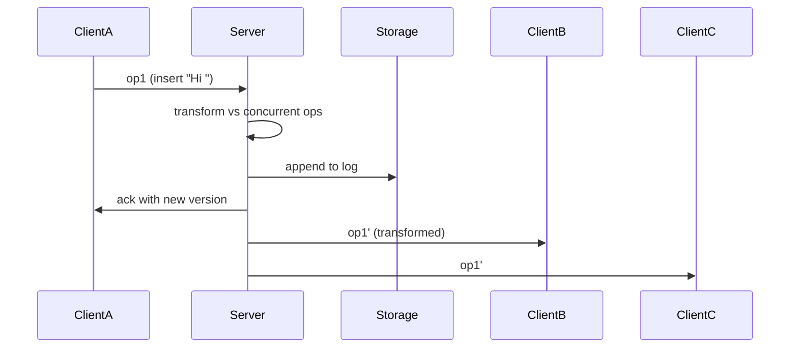

# Design Google Docs (Real-time Collaboration)

> **TL;DR** — Real-time collaboration is **conflict resolution for concurrent edits** in disguise. Two algorithms dominate: **Operational Transformation (OT)**, the one Google Docs actually uses (battle-tested but server-dependent), and **CRDTs**, the modern darling (peer-to-peer-friendly but complex). The system is a WebSocket-connected mesh of clients sharing a document; every keystroke is an operation transformed against concurrent operations and applied to all replicas. The hard parts: cursor positions, undo/redo across users, offline merges, and document size limits. Beyond ~10 simultaneous editors, contention starts to dominate.

---

## 1. Requirements

### Functional
- Multiple users editing the same document in real time.
- Cursor and selection indicators per user.
- Comments, suggestions.
- Offline edits with later sync.
- Version history.
- Rich text (bold, italic, headings, tables, images).
- Permissions: view / comment / edit.

### Non-Functional
- Edit propagation p99 < 200 ms among connected users.
- No edits lost.
- Consistent final state across all replicas.
- Scale: ~100 M+ active docs concurrently across Google.

---

## 2. Back-of-the-Envelope

- Average doc: small (KB to a few MB). Some massive ones (legal contracts).
- Active editing sessions: each generates ~1 op per keystroke under heavy editing.
- 10 K active docs being edited simultaneously × 5 ops/sec per active editor = ~50 K ops/sec across the system.

---

## 3. High-Level Architecture



Each document has a "shard" — one server (or small set) authoritative for it.

---

## 4. The Core Problem

Two users edit the same paragraph at position 5:
- User A: insert "Hi " at position 5.
- User B: delete character at position 5.

If applied naively in different orders, replicas diverge. Need an algorithm that always converges.

---

## 5. Operational Transformation (OT)

Each operation is **transformed against** concurrent operations before applying.

```
Op A: Insert("Hi ", pos=5)
Op B: Delete(pos=5)

If B applied first, then A:
  A becomes Insert("Hi ", pos=5)  # B deleted at 5, A still at 5

If A applied first, then B:
  B becomes Delete(pos=8)  # A inserted 3 chars, so B's pos shifts
```

Transform function: `T(op1, op2) → op1'` that produces the new form of `op1` given `op2` was applied first.

This must satisfy "Transformation Property 1" (TP1): both replicas converge to the same state regardless of order.

OT is server-centric: the server linearizes ops and assigns a version, transforms each new op against intervening ops, and broadcasts.

Google Docs uses OT.

---

## 6. CRDTs (Conflict-free Replicated Data Types)

Alternative approach: design the data type so any two replicas merge automatically without coordination.

For text: each character has a globally unique ID and a position in a tree/list (Logoot, RGA, Yjs's structures). Inserts and deletes commute by construction.

Pros:
- Works peer-to-peer.
- No central server needed for convergence.
- Operations can be applied in any order.

Cons:
- Memory overhead (per-character metadata).
- Complex implementations.
- Hard to do rich features (formatting) cleanly.

See [CRDTs →](../08-distributed-systems/crdts.md). Figma and Linear use CRDTs internally.

---

## 7. Document Model

Beyond plain text — Docs has rich content:
- Tree of nodes: document → paragraphs → text runs / images / tables.
- Each text run has formatting (font, size, weight).
- Operations can be insertText, deleteText, applyFormat, insertImage, etc.

OT for a tree-structured doc is harder than OT for plain text. Google built ETherPad-style refinements and a tree-aware OT.

---

## 8. Persistence

Per document:
- **Snapshot**: latest known state.
- **Op log**: every operation since last snapshot.
- New snapshot taken periodically (every N ops or T seconds).
- Storage: object store for snapshots + log; in-memory cache for active docs.

To restore on server failure: load latest snapshot, replay ops since.

---

## 9. WebSocket Flow



Each client maintains:
- Its local version of the doc.
- A list of ops sent but not yet acked.
- An "anchor" version it knows the server has.

On server confirmation, anchor advances.

---

## 10. Cursors and Presence

Per-user cursor positions broadcast as ephemeral events:
- Not persisted.
- Sent on every cursor move (throttled).
- Other clients see colored carets with the user's avatar/name.

When edits happen, cursor positions on other clients must be transformed too (someone inserted text before my cursor → my cursor shifts).

---

## 11. Offline Mode

Client makes edits offline; ops queued locally.

On reconnect:
- Client sends pending ops with anchor = last known version.
- Server transforms each against ops it received in the meantime.
- Returns new versions; client merges back.

Long offline periods → big op queue → larger merge.

---

## 12. Undo / Redo

Per-user undo stack — a user's undo should reverse only their changes, not others'.

This is **causal undo**: the operation to invert is the user's own most-recent op, transformed against everything that happened since (including others' ops).

OT handles this naturally; CRDTs require explicit history.

---

## 13. Permissions and Sharing

Standard share dialog: read / comment / edit roles. ACL on the doc.

Comments themselves are a separate document type (also collaborative).

---

## 14. Scale Limits

OT in a central server limits concurrent editors per doc (every op flows through the server). Past ~50 simultaneous editors, performance degrades.

Google addresses this with:
- Per-doc sharding (one shard owns one doc).
- Sub-second tolerance — most edits are sparse.
- "View only when over capacity."

---

## 15. Common Mistakes

- **Locking-based collaboration** ("editor 1 has the doc, others wait") — terrible UX.
- **Naive last-write-wins** — lost edits.
- **No transformation function** — replicas diverge silently.
- **Snapshot-only persistence** — server crash loses last few ops.
- **Cursor positions stored persistently** — they're ephemeral.
- **Permissions checked once on open** — must re-check on every op to handle revocation.

---

## 16. Cheat Card

```
PURPOSE    Real-time collaborative editing with offline support.

CORE       OT or CRDT for conflict-free merge of concurrent edits
           Per-doc server shard with WebSocket fan-out
           Persistent op log + periodic snapshots
           Cursor / presence as ephemeral broadcasts
           Permissions re-checked per op

ALGORITHMS OT: transform new op against intervening ops; server-centric
           CRDT: per-character globally unique IDs; merge-commutative

OFFLINE    Queue ops locally with anchor version → replay on reconnect

PITFALLS   no transform, locking-based, snapshot-only persistence,
           single-region for hot docs.

RULE       Edit ordering doesn't matter; convergence does.
```

---

## Resources

### Articles
- "What's different about the new Google Docs: Making collaboration fast" — Google Drive blog
- "Operational Transformation for Concurrency Control in Group Editors" — Ellis & Gibbs (foundational)
- "Logoot: a scalable optimistic replication algorithm" — Weiss et al.
- "A Comprehensive Study of Convergent and Commutative Replicated Data Types" — Shapiro et al.

### Documentation
- **Yjs** — CRDT library, <https://github.com/yjs/yjs>
- **ShareJS** — OT library

### Books
- "Building Real-Time Collaborative Apps" — various blog posts and conf talks

### Videos
- "Designing Google Docs: making collaboration fast" — Google I/O
- "CRDTs Illustrated" — Martin Kleppmann

### Adjacent reading
- [CRDTs →](../08-distributed-systems/crdts.md)
- [Collaborative Whiteboard →](./collaborative-whiteboard.md)
- [Dropbox →](./dropbox.md)
- [WebSockets →](../02-networking/websockets.md)

---

*Previous:* [← Google Drive / Dropbox](./dropbox.md)  |  *Next:* [Zoom / Video Conferencing →](./zoom.md)
