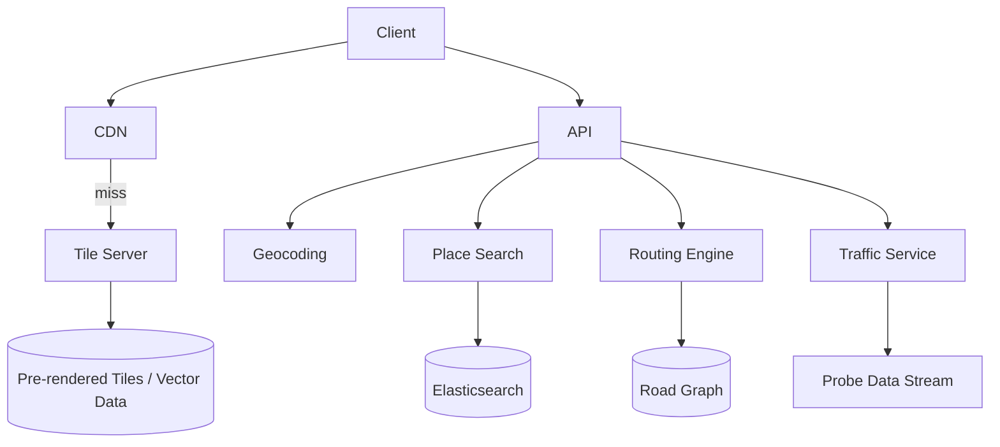

# Design Google Maps

> **TL;DR** — Maps is a **tile-serving system** wrapped around a **routing graph**. The map you see is millions of tiny pre-rendered images (or vector tiles) served from a CDN. Search and directions hit two very different backends: **place search** (essentially Elasticsearch with geospatial filters) and **routing** (Dijkstra/A* over a road graph, accelerated with **contraction hierarchies**). Real-time traffic is fed by anonymized device pings. The data-ops problem (keeping the map current globally) dwarfs the serving problem.

---

## 1. Requirements

### Functional
- Render maps at various zoom levels.
- Search places by name, category, address.
- Compute driving / walking / transit directions with ETAs.
- Real-time traffic.
- Street View.
- POI details, reviews.

### Non-Functional
- Tile fetch latency p99 < 100 ms (mostly CDN).
- Routing p99 < 500 ms.
- Map data updated weekly to monthly globally.
- Scale: ~1 B+ users monthly, ~1 B searches/day.

---

## 2. Back-of-the-Envelope

- Tile pyramid: each zoom level has 4× tiles of the previous. Zoom 0 = 1 tile; Zoom 20 = ~10¹² tiles per type.
- Serve only what's looked at — most tiles never requested.
- Routing graph: ~100 M road segments globally.

---

## 3. High-Level Architecture



---

## 4. Tile System

Earth divided into a tile pyramid. At zoom level z, the world is split into 2^z × 2^z tiles.
- Each tile addressed by `(z, x, y)`.
- 256×256 PNG (raster) or vector data (modern, smaller and re-stylable client-side).

URL: `/tile/{z}/{x}/{y}.png` — CDN heaven. Tiles are immutable until the map is re-rendered.

Rendering pipeline (batch):
1. OpenStreetMap-style geographic data ingested.
2. Per-zoom-level rendering pipeline produces tiles.
3. Distributed to CDN globally.

Higher zoom = more tiles. Lower zoom = fewer but with more detail compressed.

---

## 5. Geocoding

"Convert address → coordinates."

- Search index over addresses, with normalization (USPS-style address parsing).
- Reverse geocoding: coordinates → nearest address (kd-tree or geo-hash lookup).

---

## 6. Place Search

Elasticsearch / similar with geospatial filtering:
- Index of POIs (places of interest) with location, name, category, ratings.
- Query combines text relevance + distance + popularity.
- ML re-ranking for relevance to the user.

---

## 7. Routing — The Graph

Road network as a graph:
- Nodes: intersections.
- Edges: road segments with attributes (length, speed limit, restrictions).
- Hundreds of millions of edges globally.

Plain Dijkstra is too slow at this scale. Production engines use:

### 7.1 Contraction Hierarchies (CH)
Preprocessing builds a hierarchy of "more important" nodes (highways > local streets). Query algorithm exploits this: searches upward in hierarchy, then downward.
- Preprocessing: hours.
- Query: milliseconds for cross-country routes.

### 7.2 A* with heuristics
Dijkstra with a heuristic (straight-line distance to destination). Faster than pure Dijkstra; less than CH.

### 7.3 Highway hierarchies, ALT, hub labelings
Variants and combinations.

OSRM, Valhalla, Google's own routing all use some form of CH.

---

## 8. ETA and Traffic

Real-time traffic comes from anonymized device GPS pings (Android phones with location enabled).

- Probe data → stream processor (Flink) → per-segment speed estimates.
- Speeds joined into the routing graph; edge weights updated.
- Re-routing during the trip if conditions change.

Historical patterns also baked in: this segment is slow Tuesday at 5 PM.

ML for ETA prediction: starts with the deterministic route time, layers in traffic, learned per-segment biases, weather, events.

---

## 9. Street View

Imagery captured by camera cars (and elsewhere). Stored as 360° panoramas, indexed by location.

- Pano = collection of tiled images forming a sphere.
- Streamed by zoom and direction.
- Linked: each pano has neighbors (the next position along the road).

---

## 10. Directions UX

When a user asks for directions:
- Get current location + destination.
- Routing engine returns route (polyline of nodes).
- ETA calculated.
- Turn-by-turn instructions generated from edge attributes.
- Live updates as user moves (re-routing if off-route).

---

## 11. Map Data Updates

The data pipeline is huge:
- New roads, business openings/closures, edits from users (Google Map Maker historically; now via business profiles).
- Validation, conflict resolution.
- Tiles re-rendered.
- Routing graph rebuilt.

Updates rolled out region by region. Tile cache busted via URL versioning.

---

## 12. Common Mistakes

- **Naive Dijkstra at country scale** — too slow. Need CH/A*.
- **Serving tiles from your origin** — should be CDN.
- **No probe data privacy** — anonymization and aggregation are mandatory.
- **Routing without considering turn restrictions** — wrong directions in cities.
- **Single routing version** — when data updates, old routes mid-trip become inconsistent. Versioned graphs.
- **No transit modal separation** — driving, walking, transit each need different graphs.

---

## 13. Cheat Card

```
PURPOSE    Render the world; search places; route between them.

CORE       Tile pyramid (z,x,y) served from CDN
           Place search = ES with geospatial filters
           Routing = contraction hierarchies over road graph
           Real-time traffic from anonymized device probes
           Vector tiles for client-side restyling at no extra cost

NUMBERS    Billions of users, billions of searches/day
           Routing < 500 ms cross-country

PITFALLS   Dijkstra at scale, raw probe data, no turn restrictions,
           non-versioned graph mid-trip, single graph across modes.

RULE       Tiles are a CDN problem.
           Routing is preprocessing.
```

---

## Resources

### Articles
- "Contraction Hierarchies" — Geisberger et al.
- "Hub-Based Labeling Algorithms for Shortest Paths in Road Networks" — Abraham et al.
- "Real-time ETA prediction at Google" — Google research

### Documentation
- **OSRM** — <http://project-osrm.org>
- **Valhalla** — <https://github.com/valhalla/valhalla>
- **OpenStreetMap** — <https://www.openstreetmap.org>

### Books
- *Algorithms for Route Planning* — Bast, Delling et al. (survey paper)

### Videos
- ByteByteGo: "Design Google Maps"

### Adjacent reading
- [Uber / Lyft →](./uber.md)
- [Geohashing & Quadtrees →](../19-advanced/geohashing-quadtrees.md)
- [Web Crawler →](./web-crawler.md)
- [CDN →](../05-caching/cdn.md)

---

*Previous:* [← Google Search](./search-engine.md)  |  *Next:* [Google Drive / Dropbox →](./dropbox.md)
