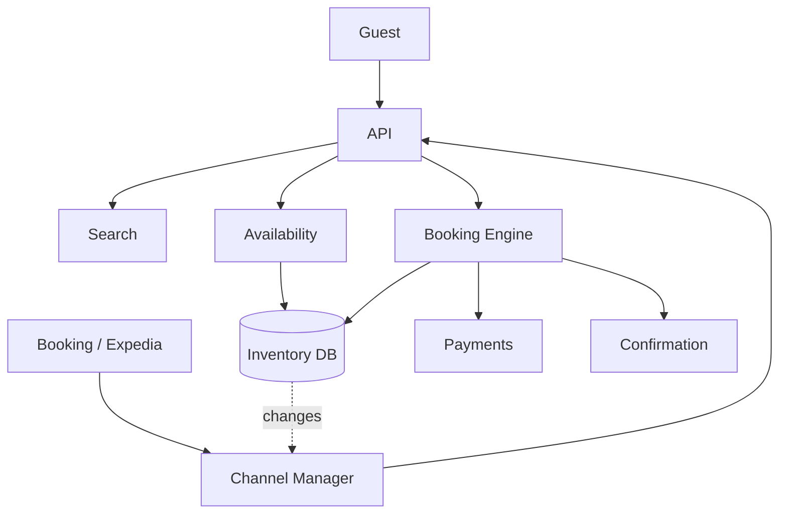

# Design a Hotel Reservation System

> **TL;DR** — A hotel reservation system is **inventory with a calendar dimension**: room-types × nights. The hard part is **avoiding overbooking** under concurrent bookings — N customers can try to book the last room at the same instant. Two related problems: (1) **rate management** (prices vary by night, channel, customer segment), (2) **GDS integration** (hotels sell via OTAs like Booking, Expedia + their own site; inventory must be shared without overselling). The reservation engine is essentially [Airbnb's calendar system →](./airbnb.md) plus traditional hospitality concepts (room types, room blocks, group bookings, allotments).

---

## 1. Requirements

### Functional
- Search hotels by location, dates, guests.
- Check availability and rates.
- Reserve a room (atomic).
- Cancel / modify.
- Multiple room types per hotel.
- Multi-channel distribution (own site + OTAs).
- Loyalty programs.

### Non-Functional
- Search p99 < 500 ms.
- No overbooking under concurrency.
- Availability accurate across channels within seconds.
- Scale: hundreds of millions of room-nights/year.

---

## 2. High-Level Architecture



Inventory is the source of truth. The Channel Manager replicates state to all distribution channels.

---

## 3. Inventory Model

```
SCHEMA
  hotel_id
  room_type_id    "Standard King", "Suite", ...
  date
  total_rooms     int
  sold_rooms      int
  available       = total - sold
  rate            money
  min_stay        nights
  closed_to_arrival bool
```

Per-hotel × per-room-type × per-night row. Hotel with 5 room types × 365 nights = ~1,800 rows. Millions of hotels worldwide.

---

## 4. Search

- Index hotels in Elasticsearch with geo, amenities, ratings.
- Query: location bounding box + dates + guest count.
- Filter by available rooms for the dates.
- Re-rank by relevance / personalization.

Availability check during search: pre-aggregate "has rooms for at least N nights in next K days" flags in index. Exact check at booking time.

See [Airbnb →](./airbnb.md) — same pattern.

---

## 5. Booking — Atomic Decrement

The critical operation: decrement `available` for each night of the stay.

```sql
UPDATE inventory
SET sold_rooms = sold_rooms + 1
WHERE hotel_id = ? AND room_type_id = ? AND date BETWEEN ? AND ?
  AND sold_rooms + 1 <= total_rooms
```

All-or-nothing: if any night returns 0 rows updated, rollback everything.

For multi-night stays, this is a transaction across N inventory rows. Postgres / MySQL handle this if rows are on the same partition.

For high contention (popular hotels on peak nights): use the **hold pattern** from [Airbnb →](./airbnb.md) — reserve with TTL, capture payment, confirm.

---

## 6. Overbooking Avoidance

The above pattern guarantees no overbooking within the system.

But many hotels deliberately overbook (predict cancellations). That's a policy decision, not a system bug — `total_rooms` may be set higher than actual.

---

## 7. Channel Manager (OTAs)

Hotels typically list on multiple channels (Booking, Expedia, Hotels.com, GDSs). The danger: oversell across channels.

Pull / push integration:
- **Push**: when inventory changes, push update to each channel.
- **Pull**: channels poll for availability before booking.
- **Atomic allocation**: each channel gets an allotment; can't oversell within it.

In practice, hotels use a Channel Manager (SiteMinder, Cloudbeds) that synchronizes inventory:
- On every booking, debit from the master inventory.
- Push the new availability to all OTAs.
- Race conditions still possible; reconciliation jobs catch them.

OTAs themselves call the GDS for real-time check before final confirmation.

---

## 8. Rates and Pricing

Rates vary by:
- Date (Saturday > Monday).
- Demand (event-driven surges).
- Length of stay (3-night discount).
- Channel (direct < OTA).
- Member rates.

Implementation: rate plans + override tables.
```
rate_plan: "BAR" (Best Available Rate), "AAA", "Member", "Promo"
rate_plan_by_date(hotel, room_type, plan, date) -> price
```

Yield management ML predicts demand and adjusts rates.

---

## 9. Cancellation Policies

Each rate has a policy:
- Non-refundable: charged at booking; full forfeit on cancel.
- Refundable until 24h before: free cancel.
- Penalty: 1 night charge.

Enforce policy at cancel time via the booking engine.

---

## 10. Group Bookings

Groups (weddings, corporate events) book blocks of rooms:
- Hold X rooms for a window without specific guests.
- Distribute attendees against the block.
- Release unsold rooms by cutoff date.

Separate inventory pool from public availability during the block.

---

## 11. Multi-Property Chains

Marriott, Hilton: hundreds of properties under one brand.
- Loyalty programs cross-property.
- Central reservation system.
- Per-property local PMS (Property Management System) for check-in / housekeeping.

---

## 12. Payments

Pre-authorize at booking; capture at check-in or no-show.

For non-refundable: capture at booking.

See [Payment System →](./payment-system.md).

---

## 13. Multi-Region

- Search globally distributed.
- Booking transactions go to a primary region (or partitioned by hotel home region).
- Cross-region read replicas for browse traffic.

---

## 14. Common Mistakes

- **No atomic inventory decrement** — overbooking.
- **Synchronous channel push in booking transaction** — slow OTAs delay confirmation.
- **No hold/reserve pattern** — payment slow → other users blocked.
- **Search hitting source of truth on each query** — too slow.
- **No reconciliation job** — silent overbooking accumulates.
- **Rates evaluated at search but re-priced at booking** — UX confusion (price changed!).

---

## 15. Cheat Card

```
PURPOSE    Search hotels, book rooms across multi-night calendars without overbooking.

CORE       Per-(hotel, room_type, night) inventory rows
           Atomic decrement across all nights in the stay
           Reserve with TTL → payment → confirm (Airbnb-style saga)
           Channel manager fanouts to OTAs; reconcile to avoid oversell
           Yield management ML for dynamic rates

INVENTORY  Rows = hotels × room types × nights × years
           Postgres OK to ~100K hotels; partition beyond

PITFALLS   non-atomic decrement, no hold pattern,
           sync OTA push, search-hits-source-of-truth, no reconcile.

RULE       Inventory is a calendar.
           Atomicity per booking is non-negotiable.
```

---

## Resources

### Articles
- "Building a Hotel Booking System" — various engineering blogs
- "OTA / Channel Manager integration" — hotel-tech blogs

### Documentation
- **GDS / OTA** standards (HTNG, OTA XML)
- **Postgres SERIALIZABLE isolation** — for concurrency

### Books
- "Revenue Management" — Robert Cross (yield management foundational)

### Videos
- ByteByteGo: hotel / booking system topics

### Adjacent reading
- [Airbnb / Booking →](./airbnb.md)
- [Ticketmaster →](./ticketmaster.md)
- [Payment System →](./payment-system.md)
- [Saga Pattern →](../07-messaging/saga-pattern.md)

---

*Previous:* [← Leaderboard](./leaderboard.md)  |  *Next:* [Parking Lot System →](./parking-lot.md)
