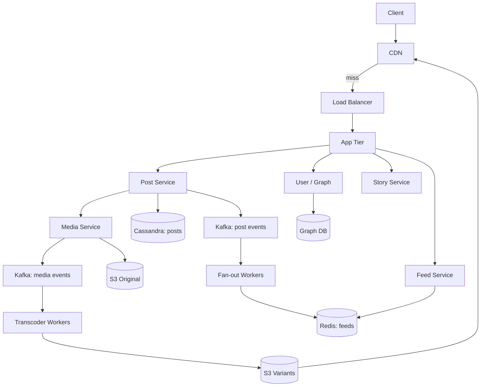
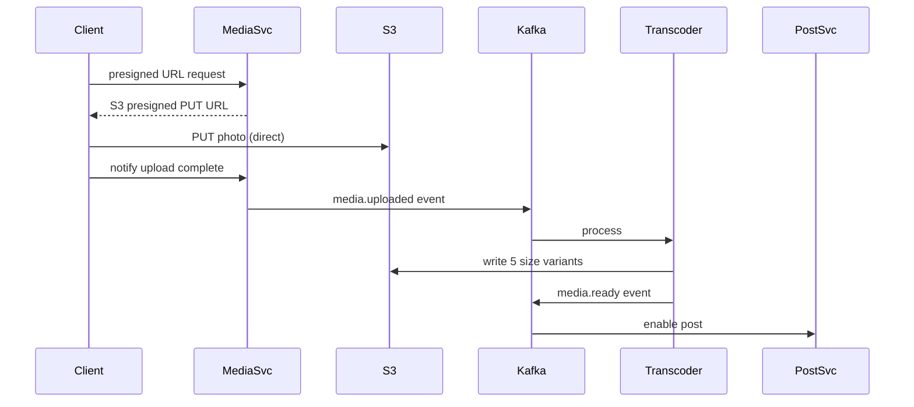

# Design Instagram

> **TL;DR** — Instagram is Twitter but with **media as the first-class citizen** instead of text. The feed problem (fan-out, hybrid push/pull) is identical. What changes is the **media pipeline**: photos are uploaded, transcoded into a half-dozen resolutions, delivered via CDN, and stored in object storage. The hot operations become **media ingest** (10 K uploads/sec peak), **CDN cache hit rates** (>95%), and **engagement counters** (likes per photo, hot keys). The Stories feature adds an ephemeral 24-hour layer with its own short-TTL storage.

---

## 1. Requirements

### Functional
- Upload a photo or short video.
- View your home feed (posts from people you follow).
- View a user's profile and post grid.
- Like, comment, share (DM).
- Follow / unfollow.
- Stories (24-hour ephemeral).
- Search hashtags and users.

### Non-Functional
- Latency: feed p99 < 200 ms, image load p99 < 500 ms from CDN.
- Availability: 99.99%.
- Scale: 2 B MAU, ~100 M photos/day, ~10 B image views/day.

---

## 2. Back-of-the-Envelope

- 100 M new photos/day → ~1,200 photos/sec average, ~10 K peak.
- Each photo stored in 5–6 sizes (thumb, low, medium, high, original) → ~3 MB total per post.
- 100 M × 3 MB × 365 = **~110 PB/year** in object storage.
- 10 B image views/day → ~115 K views/sec average. Most served from CDN edge.

---

## 3. High-Level Architecture



Two parallel pipelines: **post metadata** (looks like Twitter) and **media** (upload → transcode → CDN).

---

## 4. The Media Pipeline

This is what makes Instagram different from Twitter.



Key design choice: **client uploads directly to S3** via presigned URLs. Your app servers never touch the bytes. This is critical at scale — proxying images through your app tier would cost a fortune in bandwidth.

Variants (sizes generated):
- 150×150 thumbnail
- 320×320 low
- 640×640 medium
- 1080×1080 high
- 1080×1350 portrait
- Original (kept for reprocessing)

Stored as `photos/{post_id}/{size}.jpg` in S3. CDN caches each variant independently.

---

## 5. The Post Store

```
SCHEMA (Cassandra)
  post_id        Snowflake (time-sortable)
  user_id        author
  caption        text
  media_ids      list
  created_at
  location       geohash, nullable
  hashtags       list
```

Posts are stored once in a wide-column store, partitioned by user_id. Per-user post list is just `SELECT * WHERE user_id = ? ORDER BY post_id DESC LIMIT 30`.

---

## 6. The Feed (Same as Twitter)

Identical hybrid fan-out:
- Normal users (< 10 K followers): **fan-out on write** — push `post_id` to Redis lists for each follower.
- High-follower accounts: **fan-out on read** — feed service merges in their recent posts at read time.

Each user's home feed = sorted set in Redis, ~800 post IDs.

Feed ranking (the real magic):
- Recency.
- Engagement signal (likes, comments velocity).
- Relationship strength (interactions with this poster historically).
- ML model scores each candidate post.

Instagram switched from chronological to ranked in 2016, which is a feed-ranking system on top of the fan-out described in [Twitter →](./twitter.md).

---

## 7. CDN — The Most Important Layer

Instagram is mostly a CDN. At 10 B image views/day with ~3 MB/post, even 1% cache miss = a huge bandwidth bill.

- **Geo-distributed edge** (Facebook's own + Akamai/CloudFront historically).
- **Cache key** includes the size: `/photos/{post_id}/640.jpg`.
- **TTL**: long (days/weeks). Posts are immutable; deletes invalidate via signed URLs or new path.
- **Hit rate target**: > 98% at edge. Misses go to origin S3.

---

## 8. Stories

Ephemeral 24-hour content.

Differences from posts:
- TTL of 24 h — use S3 lifecycle expiration.
- View tracking — record who viewed each story (you see the viewer list).
- **Tray ordering** — ranked by engagement and recency.
- Smaller, often vertical-only video clips. Encoded differently.

Storage: short-TTL Redis index keyed by user, with story IDs ordered chronologically. Once expired, deleted from index, then S3 lifecycle deletes the asset.

---

## 9. Likes and Comments

- **Likes**: counter per post + edge `(user_id, post_id)`. At Bieber scale, counters are hot — use [distributed counter →](./distributed-counter.md) techniques (sharded counters in Redis, periodic flush to DB).
- **Comments**: separate Cassandra table partitioned by `post_id`, sorted by timestamp. Top-N comments cached.

Hot comments (viral posts) need pagination — `cursor` based, not offset, to handle inserts during scroll.

---

## 10. Search

- **Hashtag search**: maintain `hashtag → recent post IDs` reverse index. Updated via Kafka pipeline. Hot hashtags pre-aggregated.
- **User search**: typeahead on usernames + names. See [Typeahead →](./typeahead.md).
- **Photo search by content**: ML-based; embeddings stored in a [vector DB →](../04-databases/vector-databases.md).

---

## 11. Direct Messages

Separate subsystem (basically [WhatsApp →](./whatsapp.md) but inside the app). Messages stored in a different cluster, end-to-end encrypted in newer versions.

---

## 12. Multi-Region & Failover

Instagram serves globally. Read replicas of post metadata in each region. Photos served from regional CDN. Writes go to a primary region (US-East historically) — eventual consistency for global reads is acceptable.

For Stories, regional sharding by user works because most viewers are geographically near the poster.

---

## 13. Common Mistakes

- **Proxying photo uploads through app servers** — bandwidth bill explodes. Always direct-to-S3 via presigned URLs.
- **Storing only the original photo** — every device load re-downloads megabytes. Pre-generate sized variants.
- **Synchronous transcoding** — kills upload latency. Always async via queue.
- **Caching photos at app tier instead of CDN** — wrong layer. Photos belong at the edge.
- **Treating Stories as just shorter posts** — different storage TTL, ranking, and access pattern.
- **No view-count batching** — counting each view as a write is insane at 10 B/day. Batch in Redis, flush periodically.

---

## 14. Cheat Card

```
PURPOSE    Photo + video sharing social feed.

CORE       Direct-to-S3 upload via presigned URLs
           Async transcoder fanout: 5–6 size variants per photo
           CDN at the edge serves >98% of image traffic
           Same hybrid fan-out as Twitter for the feed
           Stories: 24h-TTL ephemeral, lifecycle-managed in S3

KEY METRICS  CDN hit rate > 98%
             Feed read p99 < 200 ms
             Upload latency dominated by client → S3 path

PITFALLS   proxying media through app servers,
           sync transcoding, single image size,
           hot counter rows on viral likes.

RULE       Photos are CDN traffic. Don't let them anywhere near your app servers.
```

---

## Resources

### Articles
- "Instagram Engineering" blog (engineering.fb.com filtered by Instagram)
- "Sharding & IDs at Instagram" — Instagram Engineering
- "Open-sourcing F4: Facebook's warm BLOB storage" — Facebook

### Documentation
- **S3 presigned URLs** — <https://docs.aws.amazon.com/AmazonS3/latest/userguide/PresignedUrlUploadObject.html>
- **CloudFront for image delivery** — <https://aws.amazon.com/cloudfront>

### Videos
- ByteByteGo: "Design Instagram"
- Facebook engineering talks on photo storage (Haystack, F4)

### Adjacent reading
- [Twitter →](./twitter.md)
- [News Feed →](./news-feed.md)
- [CDN →](../05-caching/cdn.md)
- [Object Storage →](../09-storage/object-storage.md)
- [Distributed Counter →](./distributed-counter.md)
- [Recommendation System →](./recommendation-system.md)

---

*Previous:* [← Twitter/X](./twitter.md)  |  *Next:* [Facebook News Feed →](./news-feed.md)
