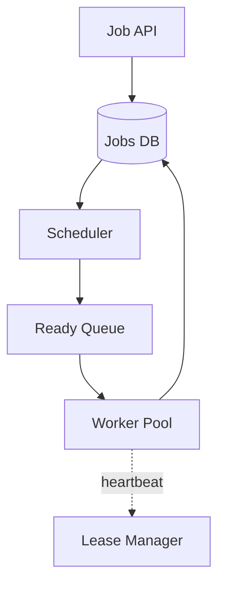
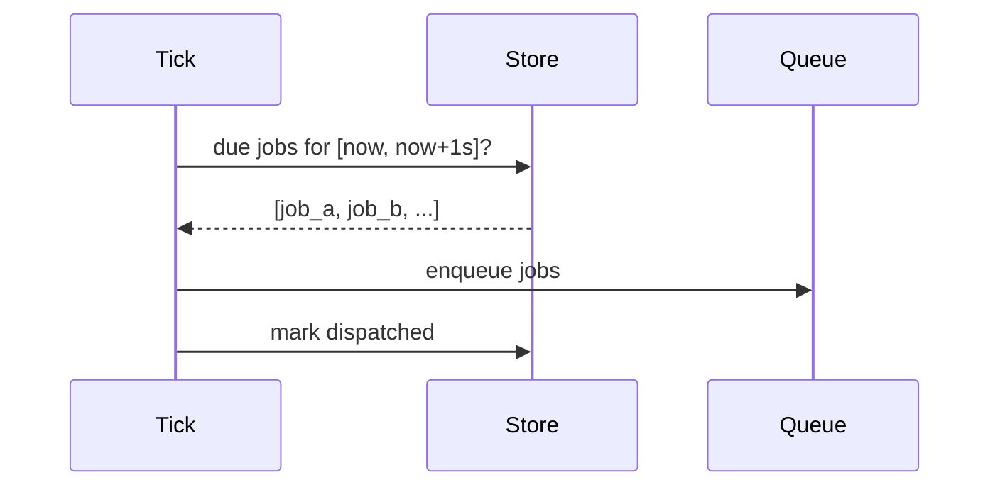

# Design a Distributed Job Scheduler

> **TL;DR** — A job scheduler runs **work at a specified time, exactly once, durably**, across a fleet of workers. Two flavors: **cron-style** (recurring at fixed intervals) and **delayed jobs** (run at a one-off future time). The hard parts are: (1) **avoiding duplicate execution** when workers fail mid-job, (2) **at-scale time-bucketing** — you can't scan a billion jobs to find "what's due in the next second," and (3) **exactly-once semantics** despite retries. Real systems: Kubernetes CronJob, Airflow, AWS EventBridge Scheduler, Sidekiq, Celery. The scheduling part is solved; the execution part is the operational nightmare.

---

## 1. Requirements

### Functional
- Schedule a job at a specific time (one-shot) or on a cron (recurring).
- Run the job on a worker.
- Retry on failure.
- Persistent (don't lose scheduled jobs on restart).
- Cancel/modify pending jobs.
- Track execution history.

### Non-Functional
- Latency: job triggers within ~1 second of scheduled time.
- Throughput: 100K+ jobs/sec at peak.
- Exactly-once execution (effectively).
- Durability: jobs survive scheduler crashes.

---

## 2. High-Level Architecture



The scheduler watches the clock and moves due jobs into the ready queue. Workers pull, lease, execute, and mark complete.

---

## 3. Storage of Pending Jobs

Naive: `SELECT * WHERE scheduled_at <= now()` every second. With a billion jobs, this kills the DB.

Better: **time-bucketed index** on `scheduled_at`. Or:

### 3.1 Sorted set in Redis
```
ZADD pending_jobs 1700000000 job_id_1
ZADD pending_jobs 1700000060 job_id_2
```
- Score = scheduled timestamp.
- `ZRANGEBYSCORE pending_jobs -inf <now>` returns due jobs.
- Atomic with `ZPOPMIN`.

### 3.2 Time-bucketed Cassandra
Partition by `(bucket = scheduled_minute, job_id)`. Read partition for current minute when its time comes.

For massive scale, time-bucketed wins.

---

## 4. The Tick Loop



Tick runs every ~100 ms. Each iteration:
1. Read jobs due in the next window.
2. Mark them as dispatched (atomic).
3. Enqueue for workers.

Atomicity prevents two scheduler instances from dispatching the same job.

---

## 5. Exactly-Once Execution

The dragon. True exactly-once is impossible across failures; you can get "effectively-once" by combining at-least-once delivery with idempotency.

Steps:
1. **Lease**: worker claims job atomically (`UPDATE WHERE state='pending' SET state='running', leased_by=worker_id`).
2. **Execute**: run the work. **Must be idempotent** — workers crash mid-execution.
3. **Complete**: atomic transition to done.
4. **Lease expiry**: if worker dies without completion, lease times out; another worker can claim.

The job's *side effects* must be idempotent — the framework can't guarantee that. Idempotency keys (passed to downstream services) are the standard tool.

See [Idempotency →](../03-apis/idempotency.md).

---

## 6. Worker Pool

Standard consumer pool:
- Pulls from ready queue (Kafka, SQS, Redis list, RabbitMQ).
- Acquires lease.
- Executes user code.
- On finish: marks done.
- On error: retries with exponential backoff (re-enqueue with delay).

Heartbeats during long jobs keep the lease alive.

---

## 7. Retries and DLQ

Failure handling policies per job type:
- Max attempts (e.g., 5).
- Backoff (e.g., exponential with jitter).
- After max → dead-letter queue for human inspection.

Track attempt count on the job row. Each retry increments.

---

## 8. Cron-Style Jobs

For recurring schedules ("every 5 min", "0 6 * * 1"):
- Store `cron_expr` on the job definition.
- On each execution, compute next run time and re-insert into pending.
- Or precompute next N execution times.

Beware: do not double-fire when scheduler restarts. Tracking "last successful run" timestamp avoids this.

---

## 9. Distributed Scheduling

For HA, run multiple scheduler instances. They must not double-dispatch.

Approaches:
- **Leader election**: only one scheduler tick at a time ([Leader Election →](../08-distributed-systems/leader-election.md)).
- **Partitioning**: each scheduler handles a slice of the keyspace (hash of job_id).
- **Atomic claim**: any scheduler can pick up jobs, but `UPDATE ... WHERE state='pending'` makes it safe.

Atomic claim is most common.

---

## 10. Workflow Orchestration

Beyond single jobs: workflows with steps, conditions, retries per step.

This is **Temporal**, **Airflow**, **AWS Step Functions** territory.
- Workflow defined as code (or YAML/JSON).
- Each step is a job; transitions defined by results.
- State machine persisted.
- See [Saga Pattern →](../07-messaging/saga-pattern.md) — long-running sagas are workflows.

---

## 11. Scaling Out

- **Multiple workers** consuming the same queue (horizontal).
- **Partitioned queues** by job type / priority.
- **Per-tenant scheduling** in multi-tenant systems.

A single scheduler tick is cheap (<10 ms with sorted set). Bottleneck is execution throughput, not scheduling.

---

## 12. Observability

- Per-job: scheduled-vs-actual run time skew.
- Workers: utilization, queue depth.
- Job types: success/failure rates.
- Alarming on stuck jobs (lease never released, missed schedules).

---

## 13. Common Mistakes

- **Polling all jobs every second** — DB cripples at scale.
- **No idempotency** — retries double-run side effects.
- **No leases** — worker crash = job stuck.
- **Single scheduler, no failover** — single point of failure.
- **Synchronous job execution** — long jobs hold up the queue.
- **No DLQ** — bad jobs retry forever, fill the system.
- **Cron drift** — wall clock skew across schedulers causes double or missed fires.

---

## 14. Cheat Card

```
PURPOSE    Trigger jobs at a future time, reliably and effectively-once.

CORE       Sorted-set or time-bucketed pending store (Redis ZSET / Cassandra)
           Tick loop pulls due jobs into ready queue
           Workers lease, execute, complete; lease expiry recovers crashes
           Idempotent job side effects (framework can't guarantee — you must)
           Cron: store cron_expr; insert next run on completion

THROUGHPUT  100K+ jobs/sec achievable with sharded queues

PITFALLS   poll-all DB queries, no leases, single scheduler,
           no DLQ, non-idempotent side effects.

RULE       Schedulers are at-least-once.
           Idempotency makes them effectively-once.
```

---

## Resources

### Articles
- "Temporal: Durable Execution" — Temporal docs
- "How Airbnb Schedules Workflows" — Airbnb engineering
- "Cron at Google" — Brendan Burns paper

### Documentation
- **Sidekiq** — <https://sidekiq.org>
- **Apache Airflow** — <https://airflow.apache.org>
- **AWS EventBridge Scheduler**
- **Temporal** — <https://temporal.io>

### Books
- *Site Reliability Engineering* — Google (Cron chapter)

### Videos
- ByteByteGo: "Design a Distributed Job Scheduler"

### Adjacent reading
- [Idempotency →](../03-apis/idempotency.md)
- [Leader Election →](../08-distributed-systems/leader-election.md)
- [Saga Pattern →](../07-messaging/saga-pattern.md)
- [Delivery Guarantees →](../07-messaging/delivery-guarantees.md)

---

*Previous:* [← Key-Value Store](./key-value-store.md)  |  *Next:* [Logging System →](./logging-system.md)
