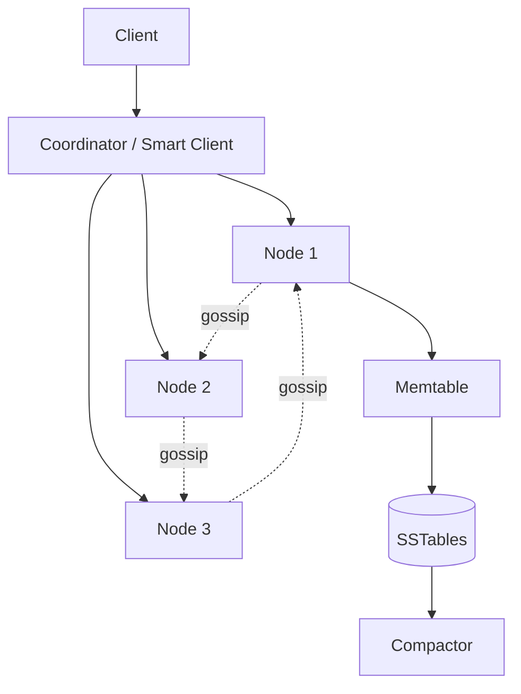
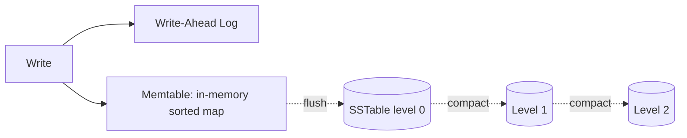
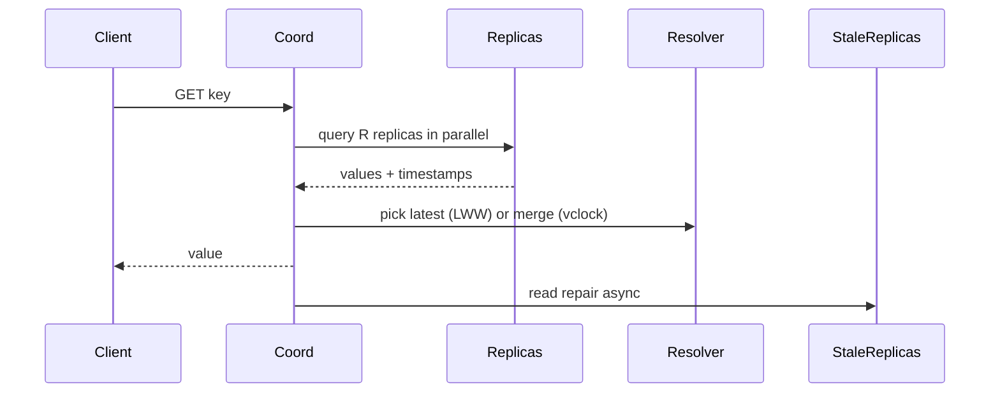
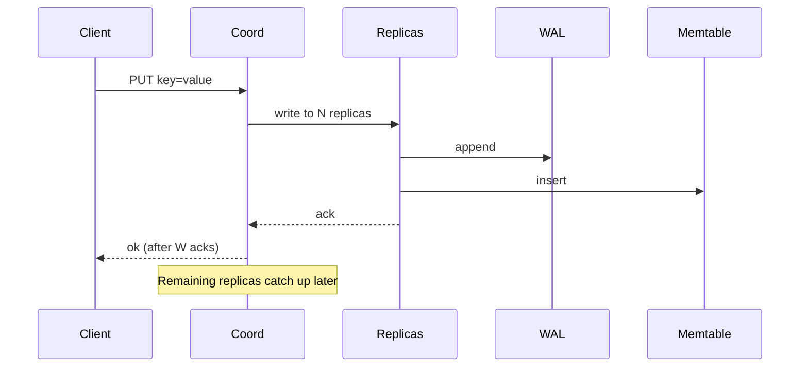

# Design a Key-Value Store

> **TL;DR** — A distributed KV store is the **Dynamo paper made real**: consistent hashing for partitioning, vector clocks or last-write-wins for conflict resolution, quorum reads/writes (N, R, W), gossip for cluster membership, and Merkle trees for anti-entropy. The internal storage engine is almost always an **LSM tree** (writes go to in-memory memtable → flushed to immutable SSTables → background compaction). DynamoDB, Cassandra, Riak, ScyllaDB are all members of this family — the differences are in tunables, not architecture. Building this from scratch is a six-month project; understanding it is a three-day read of Dynamo + LSM literature.

---

## 1. Requirements

### Functional
- `GET / PUT / DELETE` by key.
- Tunable consistency (strong, eventual).
- TTL on keys.
- Range scans (optional).

### Non-Functional
- Latency: p99 < 10 ms.
- Throughput: hundreds of thousands of ops/sec per node.
- Durability: replicated, survives node and disk failures.
- Scalability: horizontal, petabyte+.
- Availability: 99.99%+, even during failures.

---

## 2. High-Level Architecture



Every node is a peer; no single master.

---

## 3. Partitioning

**Consistent hashing** on the ring (see [Consistent Hashing →](../04-databases/consistent-hashing.md)).
- Each node owns a slice of the keyspace.
- Virtual nodes (~100 per physical node) smooth distribution.
- Adding/removing a node moves only 1/N of keys.

---

## 4. Replication

Each key is replicated to N nodes (typically N=3):
- Primary owner + next N-1 nodes clockwise on the ring.
- Cross-rack / cross-AZ awareness for fault tolerance.

Reads/writes use **quorums**:
- W = number of replicas that must ack a write.
- R = number of replicas that must respond to a read.
- If R + W > N: strong consistency (reads see all writes).
- R=W=1: maximum availability, eventual consistency.

Typical: N=3, R=2, W=2.

See [Quorum →](../08-distributed-systems/quorum.md).

---

## 5. The Storage Engine (LSM Tree)



- Writes go to WAL (durability) + memtable (fast).
- When memtable full, flushed to disk as immutable SSTable.
- Background compaction merges SSTables, removes deletes, deduplicates keys.

Reads check memtable → recent SSTables → older SSTables. **Bloom filters** per SSTable avoid disk reads for missing keys.

LSM optimizes writes at the cost of read amplification. Compaction is the ops burden — it consumes I/O and CPU.

See [Storage Engines →](../09-storage/storage-engines.md), [LSM-Trees →](../09-storage/storage-engines.md).

---

## 6. Conflict Resolution

When two replicas accept writes during a network partition, you have divergence. Options:

### 6.1 Last-Write-Wins (LWW)
Timestamp on each write. Highest timestamp wins. Simple, lossy.

### 6.2 Vector Clocks
Each write carries a vector of `(node_id → version)`. Reads see causal history; clients resolve concurrent conflicts.

### 6.3 CRDTs
Designed so conflicts merge deterministically. See [CRDTs →](../08-distributed-systems/crdts.md).

DynamoDB: LWW. Riak: vector clocks. Cassandra: LWW.

---

## 7. Gossip and Cluster Membership

How does each node know the topology?
- Periodic **gossip** messages exchanging cluster state.
- After a few rounds, all nodes converge on view.
- Node failures detected via heartbeat absence (typically phi-accrual failure detector).

See [Gossip Protocol →](../08-distributed-systems/gossip-protocol.md).

---

## 8. Anti-Entropy

Background process to repair divergent replicas:
- **Merkle trees** built per partition — hash hierarchy of stored data.
- Replicas compare trees: if root hashes differ, walk down to find divergent ranges.
- Repair only the diff.

See [Merkle Trees →](../08-distributed-systems/merkle-trees.md).

Also "read repair": on every read with multiple replicas, detect inconsistency and fix.

---

## 9. Hinted Handoff

When a replica is down during a write:
- Coordinator stores a "hint" — "this write was meant for node X."
- When X comes back, the hinted write is replayed.

Prevents permanent inconsistency from short outages.

---

## 10. Read Path



Coordinator picks the freshest value; updates stale replicas asynchronously.

---

## 11. Write Path



W=2 → ack after 2 of 3 replicas confirm.

---

## 12. Hotspots and Hot Keys

A single key with extreme traffic (the trending hashtag) hits one shard hard.

Mitigations:
- **Hot key replication** — replicate to extra nodes.
- **Client-side cache** in front of the store.
- **Sharded counters** for write-heavy hot keys.

---

## 13. Tail Latency

p99 in a quorum read is the slowest of R responses. If any replica is slow, the read is slow.

Mitigations:
- Hedged requests (send to R+1 replicas; cancel slowest).
- Speculative retries.
- Adaptive timeouts.

See [Tail Latency →](../16-performance/tail-latency.md).

---

## 14. Common Mistakes

- **No replication** — single-node failure = data loss.
- **Strong consistency everywhere** — kills availability under partitions; pick per-operation.
- **No compaction tuning** — read latency degrades; disk fills.
- **No anti-entropy** — divergence accumulates silently.
- **Synchronous cross-region replication** — adds tens of ms per write.
- **Single coordinator** — bottleneck; every node should be a coordinator.

---

## 15. Cheat Card

```
PURPOSE    Highly available, horizontally scalable KV store.

CORE       Consistent hashing for partitioning
           Replication factor N; quorum reads/writes (R + W > N for strong)
           LSM tree storage engine (WAL + memtable + SSTables + compaction)
           Bloom filters on SSTables to skip reads
           Gossip for cluster membership; Merkle trees for anti-entropy
           Hinted handoff for short-term failures
           Vector clocks or LWW for conflict resolution

TUNABLES   N=3, R=W=2 default. R=W=1 for AP-leaning.
           Read repair + active anti-entropy keep replicas consistent.

PITFALLS   no replication, no compaction strategy,
           strong consistency for all ops, single coordinator.

RULE       Dynamo paper + LSM tree + gossip = this entire family.
```

---

## Resources

### Articles
- "Dynamo: Amazon's Highly Available Key-value Store" — DeCandia et al. 2007
- "Cassandra — A Decentralized Structured Storage System" — Lakshman & Malik 2010
- "Bigtable" — Chang et al. 2006

### Books
- *Designing Data-Intensive Applications* — Kleppmann (replication, partitioning chapters)
- *Database Internals* — Alex Petrov

### Documentation
- **Cassandra docs** — <https://cassandra.apache.org/doc/>
- **DynamoDB Architecture** — <https://aws.amazon.com/blogs/database/category/database/amazon-dynamodb/>

### Videos
- CMU 15-721 Andy Pavlo lectures on distributed storage
- ByteByteGo: "Design a KV Store"

### Adjacent reading
- [Distributed Cache →](./distributed-cache.md)
- [Consistent Hashing →](../04-databases/consistent-hashing.md)
- [LSM Trees →](../09-storage/storage-engines.md)
- [Quorum →](../08-distributed-systems/quorum.md)
- [Merkle Trees →](../08-distributed-systems/merkle-trees.md)

---

*Previous:* [← Typeahead](./typeahead.md)  |  *Next:* [Job Scheduler →](./job-scheduler.md)
