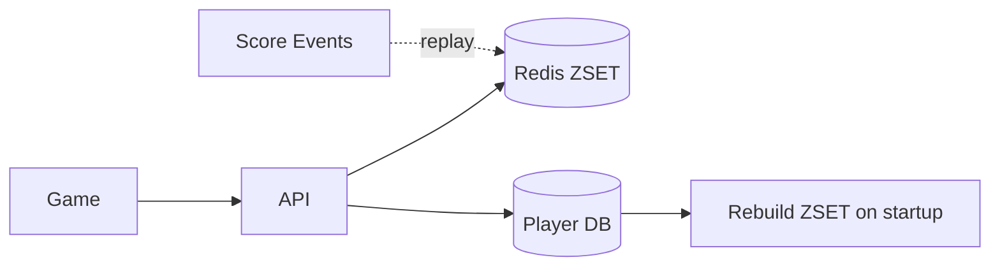

# Design a Leaderboard

> **TL;DR** — A leaderboard is **"top-N by score in a set of millions" — answered in milliseconds, updated on every score change**. The answer is almost always **Redis sorted sets (ZSET)**. `ZADD` updates a score; `ZREVRANGE` returns top-N; `ZREVRANK` returns a user's rank — all O(log N). Things get harder when you need (a) **multiple boards** (global, country, friends, weekly), (b) **massive boards** (100M+ players) where the rank of position 50,000 doesn't need to be exact, and (c) **historical** scores. Sharded ZSETs + percentile estimation are the techniques for scale.

---

## 1. Requirements

### Functional
- Submit score for player.
- Get top-N (with names/avatars).
- Get player's rank.
- Get neighboring players ("you are #42, players around you").
- Multiple boards (global, country, friends, time-windowed).

### Non-Functional
- Score update p99 < 10 ms.
- Top-N read p99 < 50 ms.
- Scale: 10M–100M players per board.
- Boards can be very busy (millions of score updates/min in mobile games).

---

## 2. Why Sorted Sets

Redis ZSET stores (member, score) pairs sorted by score.

Operations:
- `ZADD board score member` — O(log N).
- `ZREVRANGE board 0 9 WITHSCORES` — top 10. O(log N + K).
- `ZREVRANK board member` — get rank. O(log N).
- `ZINCRBY board delta member` — atomic increment.
- `ZSCORE board member` — current score.

This is literally the leaderboard primitive. Every other approach is comparing against ZSET.

---

## 3. Architecture



ZSET is the hot path. Player DB is source of truth for cross-validation and rebuild.

---

## 4. Multiple Boards

A typical game has:
- Global all-time.
- Weekly / daily.
- Friends.
- Country.
- Per-game-mode.

Each is its own ZSET. Update on score submission writes to each relevant board:
```
ZADD board:global score user_id
ZADD board:weekly:2024-W21 score user_id
ZADD board:country:US score user_id
ZADD board:friends:user_id ... (more complex)
```

Friends leaderboard typically built differently — each user has a small ZSET of their friends with their scores. Update only fans out to friends-of-the-user.

---

## 5. Time-Windowed Boards

Daily / weekly boards reset at intervals.

- Use distinct keys per window (`board:weekly:2024-W21`).
- Old windows TTL'd or archived.
- New window starts empty.

For sliding-window leaderboards (last 7 days): more complex. Keep per-event timestamps and aggregate, or maintain a windowed ZSET with explicit additions/removals.

---

## 6. Pagination

Returning top-100 is `ZREVRANGE 0 99`. Beyond that, paginate:
- `ZREVRANGE start end`.
- Cursor-based: pass last_score + member, continue with `ZREVRANGEBYSCORE`.

Stable across updates only if scores don't shift mid-scroll — usually fine for top-N reads.

---

## 7. Rank Queries

"What's player X's rank?" → `ZREVRANK board user_id`.

For very large boards (100M+), rank computation is O(log N) but reads from disk-paged data structures may be slow. Mitigations:
- **Approximate rank**: bucket scores by range; rank within bucket + sum bucket sizes above. Faster.
- **Periodic rank snapshot**: precompute every minute. Stale by up to a minute.

For "neighbors": `ZREVRANGE rank-5 rank+5`.

---

## 8. Sharding

A single ZSET that's 10M+ entries with millions of writes/min hits a single Redis node hard.

Sharding strategies:

### 8.1 By score range
Buckets: score 0–1000, 1000–10K, etc. Each shard's ZSET. Top-N pulls from highest bucket.

### 8.2 By user_id hash
N shards. Each shard owns ~1/N of users.
- Top-N requires fan-out and merge: query each shard's top-N, take top-N globally.
- Rank by user_id: query their home shard (fast).

### 8.3 Hybrid
Hot top portion (top 10K) in a single ZSET; long tail sharded. Top-N reads from the hot portion.

For most leaderboards, single ZSET is fine until you hit millions of players actively scoring.

---

## 9. Persistence

Redis losing the ZSET means rebuilding. Options:
- **AOF / RDB** on Redis.
- **Source of truth in DB**; rebuild ZSET on startup by streaming top scores.
- **Stream of score events**; replay from Kafka log on rebuild.

For competitive games, lost leaderboards are bad PR. Persist.

---

## 10. Anti-Cheat

High-score boards attract cheaters.

- Server-side validation of score (no client-trust).
- Anomaly detection (impossible scores filtered).
- Reputation/account flags.
- Periodic audit of top-N.

A leaderboard full of cheaters is unfun for honest players; takes the product down.

---

## 11. Friends Leaderboards

"Top among my friends" is per-user.

Approaches:
1. Per-user ZSET with friends' scores. Update on either friend's score change.
2. On query, fetch user's friends list, then `ZSCORE` each on global board, sort.

Approach 2 simpler; approach 1 faster for read-heavy.

---

## 12. Notifications

"Your friend Alice just beat you!" — fanout signal.

Compare scores; if Alice's new score > yours, send notification. See [Notification System →](./notification-system.md).

---

## 13. Common Mistakes

- **`SELECT * ORDER BY score LIMIT 10` in Postgres** — fine for 10K rows, dead at 10M.
- **Updating leaderboard synchronously in game loop** — adds latency. Use async.
- **No persistence** — Redis crash loses all standings.
- **Single ZSET at 100M+ entries** — single-shard contention.
- **No anti-cheat** — leaderboard becomes a meme.

---

## 14. Cheat Card

```
PURPOSE    Top-N by score; rank lookups in milliseconds.

CORE       Redis ZSET as primary; ZADD / ZREVRANGE / ZREVRANK
           Per-board ZSETs (global / weekly / country / friends)
           Time windows: key per window, TTL old ones
           Sharding by user-hash or score-range at very large scale
           Source of truth in DB; rebuild ZSET on startup

OPERATIONS
  Add/Update: ZADD board score user_id        — O(log N)
  Top-N:      ZREVRANGE board 0 N WITHSCORES  — O(log N + K)
  Rank:       ZREVRANK board user_id          — O(log N)

PITFALLS   SQL ORDER BY at scale, no persistence,
           single-ZSET at 100M, sync in game loop,
           no anti-cheat.

RULE       ZSET first. Shard only when you must.
```

---

## Resources

### Articles
- "Redis Sorted Sets" — Redis docs
- "Building a Leaderboard" — Redis Labs blog
- "Leaderboards at Scale" — various game engineering blogs

### Documentation
- **Redis ZSET commands** — <https://redis.io/commands/?group=sorted-set>

### Books
- *Redis in Action* — Josiah Carlson (chapter on leaderboards)

### Videos
- ByteByteGo: "Design a Leaderboard"

### Adjacent reading
- [Multiplayer Game Backend →](./multiplayer-game.md)
- [Distributed Cache →](./distributed-cache.md)
- [Redis Deep Dive →](../05-caching/redis-deep-dive.md)
- [Distributed Counter →](./distributed-counter.md)

---

*Previous:* [← Distributed ID Generator](./id-generator.md)  |  *Next:* [Hotel Reservation System →](./hotel-reservation.md)
