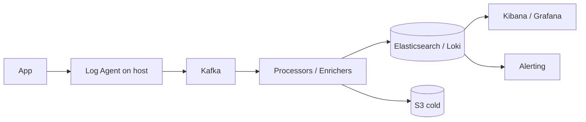

# Design a Distributed Logging System

> **TL;DR** — A distributed logging system ingests **petabytes/day of unstructured/semi-structured text** and lets engineers search it within seconds. The architecture is universal: **agents on hosts** (Fluent Bit, Filebeat, Vector) → **buffering queue** (Kafka) → **processing/enrichment** → **inverted-index storage** (Elasticsearch, Loki, ClickHouse) → **UI** (Kibana, Grafana). The hard problems are (1) **ingest scale** — billions of lines/sec without losing data, (2) **storage cost** — logs are expensive at TB scale; tiered storage and aggressive retention are mandatory, (3) **search latency** — engineers expect Google-fast results on terabytes, (4) **schema drift** — every team logs differently. ELK is the historical incumbent; Loki and ClickHouse-based systems are eating its lunch on cost.

---

## 1. Requirements

### Functional
- Collect logs from thousands of services.
- Index by time + service + level + arbitrary fields.
- Search by full-text or structured queries.
- Tail mode (live streaming).
- Alerts on log patterns.
- Retention policies (hot vs cold).

### Non-Functional
- Ingest: millions of log lines/sec.
- Search p99 < 5 sec on recent data.
- Durability: don't lose logs.
- Cost: hot storage is cheap; cold archive is cheaper.

---

## 2. High-Level Architecture



The pipeline is shaped like data flow. Each stage owned by a separate team in big orgs.

---

## 3. Agents

On every machine / container, a lightweight agent collects logs:
- Tails files, container stdout, journald.
- Parses (structured logs) or accepts raw lines.
- Buffers locally (small disk buffer for outages).
- Ships to central pipeline.

Common agents: Fluent Bit, Fluentd, Filebeat, Vector, OpenTelemetry Collector.

Critical: low CPU/memory footprint. A logging agent that uses 10% of a host's CPU is a bug.

---

## 4. Transport — Kafka

Why Kafka in the middle?
- **Decoupling**: producers and consumers don't lock-step.
- **Buffering**: absorbs ingest spikes (a service in panic logs 100× normal).
- **Replay**: re-process logs if downstream breaks.
- **Fan-out**: same log stream feeds search, analytics, and security.

Partitioning by service or hash for parallel consumption.

---

## 5. Processing

Stream processors enrich logs:
- Parse log lines (regex or grok for unstructured).
- Add metadata (host, region, env).
- Drop noise (debug logs in prod).
- Sample or redact PII.
- Convert to structured JSON for indexing.

Tools: Logstash, Vector, Flink, custom consumers.

---

## 6. Storage and Indexing

### 6.1 Elasticsearch (the ELK stack)
- Inverted index over log fields.
- Time-based indices (daily index "logs-2026.05.20").
- Hot/warm/cold tiers (SSDs → HDDs → object storage).
- Powerful but expensive: indexing costs CPU and storage.

### 6.2 Loki (Grafana)
- Indexes only labels (service, level, host) — not full text.
- Logs themselves stored compressed in object store.
- Cheap. Trade-off: full-text search is slower.

### 6.3 ClickHouse / column stores
- Schema-on-write with high compression.
- Fast aggregations.
- Some text search but worse than ES.

For big orgs with budget: ES. For cost-conscious: Loki or ClickHouse.

---

## 7. Tiered Retention

Logs decay in usefulness fast. Tiering:
- **Hot** (last 7 days): SSD, full index, fast search.
- **Warm** (8–30 days): cheaper disks, less RAM.
- **Cold** (30–90 days): object storage, slow but searchable.
- **Archive** (>90 days): S3 Glacier or similar; restore on demand.

Index lifecycle policies (ES ILM) automate transitions.

---

## 8. Search

Query patterns:
- "All errors in service X in last hour" → time + service + level filter.
- "Find the request that returned 500 with this trace_id" → exact field match.
- "What's the top exception in last 5 min?" → aggregation.

Inverted index on structured fields; full-text on message body.

Multi-stage search (recent first, then older) common — most queries are about the last hour.

---

## 9. Schema and Structured Logging

Unstructured logs are a tax. Best practice: **structured logging** (JSON):
```json
{"ts":"2026-05-20T14:32:01Z","level":"ERROR","svc":"checkout","msg":"payment failed","order_id":"o_42","err":"...","trace_id":"..."}
```

Indexable fields. Easy to query. Easy to alert on.

Schema drift is real — different teams use different field names. Conventions + linting required.

---

## 10. Alerts

Real-time pattern detection:
- "Error rate > X/min in service Y" → page on-call.
- "Specific exception appeared" → notify.

Implemented as continuous queries against the live stream (Kafka → Flink → alert engine), or by polling the index.

---

## 11. Trace Correlation

Each log line should carry a `trace_id` (and ideally `span_id`):
- Lets you reconstruct a request's path across services.
- Joins logs + metrics + traces in observability tools.

See [Distributed Tracing →](../13-observability/tracing.md) and [Three Pillars →](../13-observability/three-pillars.md).

---

## 12. PII and Compliance

Logs often contain PII. Compliance (GDPR, CCPA):
- Mask/redact in processing.
- Encrypt at rest.
- Honor deletion requests within retention windows.
- Access controls on log queries.

This is non-optional.

---

## 13. Common Mistakes

- **Logging everything at INFO** — fills disk; signal-to-noise dies.
- **Synchronous logging in critical path** — slow log shipping stalls the app. Buffer locally.
- **No structured logging** — unparseable mess at scale.
- **No retention policy** — costs balloon, queries get slow.
- **No sampling on high-volume services** — hot loops log 100K lines/sec.
- **Storing logs in the DB** — wrong tool; logs are append-only time-series.
- **Trusting timestamps from arbitrary clients** — use ingest-time too.

---

## 14. Cheat Card

```
PURPOSE    Centralized log ingest, index, search, alert.

CORE       Agent → Kafka → Processor → Index → UI
           Time-bucketed indices; hot/warm/cold tiering
           Structured (JSON) logging mandatory for queryable fields
           Inverted index (ES) for full-text; labels-only (Loki) for cost
           PII masking in processing pipeline

NUMBERS    Millions of lines/sec ingest at scale
           Hot 7 days SSD, cold 90 days object storage

PITFALLS   sync log shipping, no structured logs,
           no retention, single-tier hot storage, no sampling.

RULE       Logs are time-series text streams.
           Don't store them like documents.
```

---

## Resources

### Articles
- "Logging at Stripe" — Stripe Engineering
- "How Loki works" — Grafana Labs
- "Scaling Elasticsearch at Etsy" — Etsy engineering
- "Designing the Uber Logging Platform" — Uber engineering

### Documentation
- **Elasticsearch** — <https://www.elastic.co/elasticsearch>
- **Loki** — <https://grafana.com/oss/loki/>
- **OpenTelemetry Collector** — <https://opentelemetry.io>

### Books
- *Logging in Action* — Phil Wilkins

### Videos
- ByteByteGo: "Design a Logging System"
- Grafana Loki overview talks

### Adjacent reading
- [Logging Best Practices →](../13-observability/logging.md)
- [Log Aggregation →](../13-observability/log-aggregation.md)
- [Monitoring System →](./monitoring-system.md)
- [Distributed Tracing →](../13-observability/tracing.md)

---

*Previous:* [← Job Scheduler](./job-scheduler.md)  |  *Next:* [Metrics & Monitoring System →](./monitoring-system.md)
