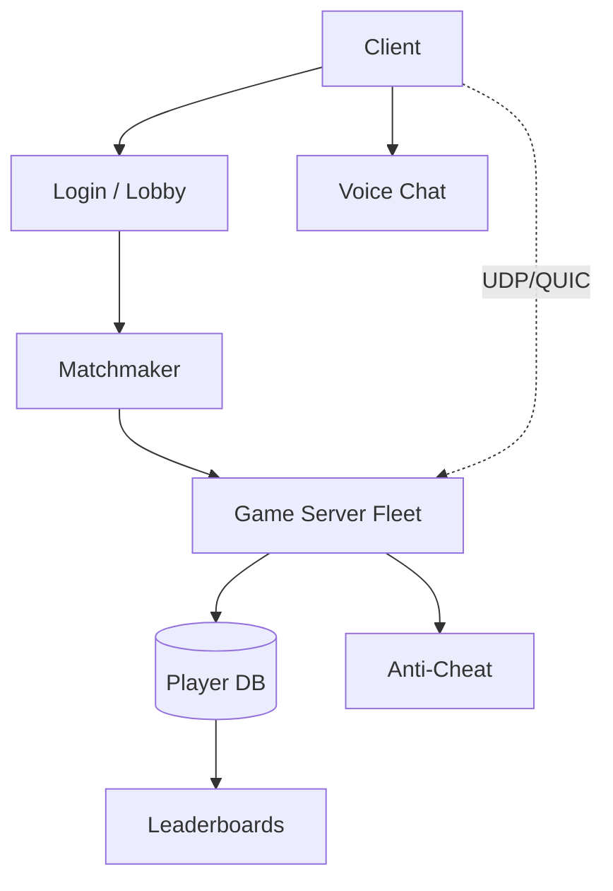

# Design an Online Multiplayer Game Backend

> **TL;DR** — A multiplayer game backend is **real-time state synchronization across players** with hard latency constraints (50–100 ms total round-trip). The architectural choices: **authoritative server** vs **lockstep** vs **client-side prediction with server reconciliation**. Most modern games use the third — clients predict locally, server is authoritative, mispredictions are corrected with smoothing. UDP dominates the transport (no head-of-line blocking; lost packets are tolerated). The pieces: **matchmaking** (find players of similar skill), **dedicated game servers** (one per match), **anti-cheat**, **leaderboards**, and **persistence** (progression, items, friends).

---

## 1. Requirements

### Functional
- Authenticate players.
- Matchmake by skill, region, mode.
- Run authoritative game simulation.
- Sync game state at ~30–60 Hz to all clients.
- Persist progression (level, items, friends).
- Voice chat.
- Anti-cheat.

### Non-Functional
- Latency p99 < 100 ms (player-to-server).
- 30–60 Hz tick rate.
- Availability: 99.9% during sessions.
- Concurrent matches: millions for AAA titles.

---

## 2. High-Level Architecture



Two tiers: **persistent services** (login, matchmaker, leaderboards) over standard tech, plus **per-match dedicated servers** for real-time sim.

---

## 3. Real-Time State Sync Models

### 3.1 Authoritative Server
Server runs game simulation; clients send inputs; server broadcasts state.
- Pros: cheat-resistant; deterministic outcomes.
- Cons: latency limited by RTT.

### 3.2 Lockstep / P2P
All clients run identical simulation; only inputs exchanged.
- Pros: low bandwidth.
- Cons: requires perfect determinism; cheating easy; high min latency.

Used in RTS games (Starcraft, AoE).

### 3.3 Client-Side Prediction + Server Reconciliation
Client predicts movement instantly; server is authoritative; client smooths corrections.
- Pros: feels instant despite latency.
- Cons: complex reconciliation; visible "rubber-banding" on mispredictions.

The modern default for FPS, MMOs, MOBAs.

---

## 4. Transport

UDP, not TCP. Why:
- TCP retransmits cause head-of-line blocking; a lost packet stalls everything.
- Old state is useless; we want freshest, not all.
- UDP allows custom reliability per message type (unreliable for state updates, reliable for chat).

Or QUIC (UDP-based but reliable streams) for newer titles.

Custom protocols per game; common patterns: snapshot delta compression, input frames, reliability layer for specific message types.

---

## 5. Tick Rate and Snapshots

Server runs simulation at fixed tick (e.g., 64 Hz in Counter-Strike).

Each tick:
- Apply player inputs received this tick.
- Update world state.
- Emit snapshots to clients.

Snapshots are deltas vs last ack'd state to minimize bandwidth.

Clients interpolate between snapshots for smooth visuals.

---

## 6. Matchmaking

Two goals: **skill-balanced matches** and **low queue times**.

Skill: ELO / Glicko / TrueSkill rating per player.

Matchmaker:
- Pool players in queue.
- Find groups within skill window.
- Widen window over time (less strict matches as wait grows).
- Optimize on region (low ping) + party size.

Implementation: in-memory pool sharded by region; match every few seconds.

See [Search Autocomplete →](./search-autocomplete.md) and [Recommendation System →](./recommendation-system.md) for similar windowed-matching patterns.

---

## 7. Dedicated Game Servers

Each match runs on a dedicated process / container:
- Server is the source of truth for the match.
- Stateless aside from the match — when match ends, process exits.
- Provisioned dynamically (Agones, Open Match for Kubernetes-based fleets).

Scaling: spin up servers to match demand; tear down after matches. Capacity planning for peaks.

---

## 8. Persistence

Player progression must survive crashes:
- Player profile (level, XP, currency).
- Inventory (items, skins).
- Friends.

Updates write-through after each match.

OLTP DB (sharded by player_id) + cache layer.

---

## 9. Leaderboards

Top-N players globally / regionally / per-mode.

- Redis sorted sets are perfect: `ZADD lb score player_id`, `ZREVRANGE` for top-N.
- Per-board (global, season, weekly, friends-only).
- See [Leaderboard →](./leaderboard.md).

---

## 10. Anti-Cheat

Authoritative server is the foundation. Beyond that:
- **Client integrity checks**: detect tampered binaries (Easy Anti-Cheat, BattlEye).
- **Statistical anomaly**: aim too good for human, impossible click patterns.
- **Server-side validation** of inputs: positions can't teleport, fire rate enforced.

Anti-cheat is an arms race. Major studios invest hundreds of engineers here.

---

## 11. Voice Chat

WebRTC or proprietary UDP voice protocols. See [Zoom →](./zoom.md) and [WebRTC →](../19-advanced/webrtc.md).

Low-bitrate codecs (Opus). Push-to-talk default to reduce bandwidth.

---

## 12. Regions and Latency

Players matched into their closest region's server pool. Cross-region matches lead to bad experiences.

Some games allow players to manually pick region (for friends in different geographies).

---

## 13. Reconnection

Network blips happen. Server must handle reconnects:
- Disconnected player tagged "AFK."
- Reconnect within timeout → catch up to current state, resume.
- Otherwise: bot fills in or player removed.

State snapshots make this manageable.

---

## 14. Common Mistakes

- **TCP for game state** — head-of-line blocking ruins gameplay.
- **No client prediction** — every input feels laggy.
- **Trusting clients** — invitations to cheat.
- **Synchronous DB writes per tick** — kills tick rate.
- **No reconnection** — momentary network loss = lost match.
- **One global server cluster** — cross-region latency.
- **Stateful matchmaker without partitioning** — single bottleneck.

---

## 15. Cheat Card

```
PURPOSE    Real-time multiplayer with low-latency state sync.

CORE       Authoritative server + client-side prediction
           UDP / QUIC; snapshot deltas at 30–60 Hz
           Dedicated game server per match; pooled and disposable
           Matchmaker: skill (TrueSkill) + region + party
           Anti-cheat: server-side validation + client integrity + stats
           Leaderboards in Redis sorted sets

LATENCY    Aim for < 100 ms RTT player-to-server
TICK       30–60 Hz typical; 128 Hz competitive shooters

PITFALLS   TCP, no prediction, client trust,
           DB writes per tick, no reconnect, single region.

RULE       Server is authoritative.
           Client predicts to feel instant.
```

---

## Resources

### Articles
- "Fast-Paced Multiplayer" series — Gabriel Gambetta (the canonical reference)
- "1500 Archers on a 28.8" — Mark Terrano (Age of Empires lockstep)
- "Source Engine Multiplayer Networking" — Valve developer wiki
- "Open Match: Matchmaking Infrastructure" — Google

### Documentation
- **Agones** — Kubernetes game servers
- **Photon, Mirror, Netcode for Game Objects** — middleware

### Books
- *Multiplayer Game Programming* — Joshua Glazer, Sanjay Madhav
- *Game Programming Patterns* — Robert Nystrom

### Videos
- GDC talks on networked games
- "Why Doom Plays the Same on Every Machine" — Glenn Fiedler

### Adjacent reading
- [Zoom →](./zoom.md)
- [WebRTC →](../19-advanced/webrtc.md)
- [Leaderboard →](./leaderboard.md)
- [WebSockets →](../02-networking/websockets.md)

---

*Previous:* [← Code Deployment System](./code-deployment.md)  |  *Next:* [Live Streaming Platform (Twitch) →](./twitch.md)
