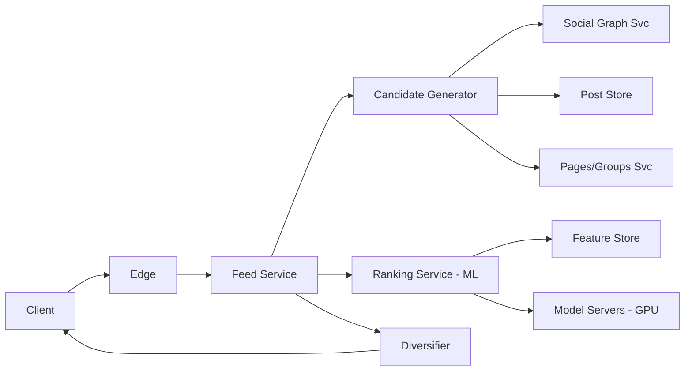
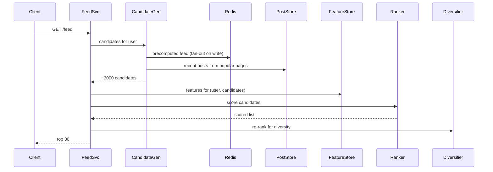

# Design Facebook News Feed

> **TL;DR** — A news feed is **the same fan-out problem as Twitter/Instagram**, but Facebook's twist is **ranking**: the feed isn't chronological, it's ML-ranked. The system has three concerns: (1) **candidate generation** — what posts are eligible to appear, (2) **scoring** — an ML model predicts engagement for each candidate, (3) **diversification** — avoid showing 5 baby photos in a row. The infra problem (fetching candidate posts fast) is well-understood. The science problem (ranking them) is where the engineering hours and GPU dollars go.

---

## 1. Requirements

### Functional
- Post text / photo / video / link.
- See ranked feed of posts from friends, pages followed, groups.
- Like, react, comment, share.
- Inline interactions (no page reload).

### Non-Functional
- Latency: feed p99 < 300 ms.
- Availability: 99.99%.
- Freshness: new content visible within seconds.
- Scale: ~3 B MAU, ~5 B posts/day across all sources (friends + pages + groups), ~100 B feed reads/day.

---

## 2. Back-of-the-Envelope

- 3 B users × 4 feed loads/day × 30 items each = ~360 B item ranks/day.
- Average user has ~300 friends, follows ~50 pages, in ~10 groups.
- Per feed load, candidate set ≈ a few thousand posts. ML must score them in ~100 ms.

---

## 3. High-Level Architecture



Three stages, each a separate service: candidate generation, ranking, diversification.

---

## 4. Stage 1 — Candidate Generation

Pull a few thousand posts a user *could* see. Sources:

- **Friends' recent posts** — from materialized feeds (Twitter-style fan-out).
- **Followed pages' recent posts** — fan-out on read; pages have many followers.
- **Group posts** — fan-out on read per group.
- **Recommended** ("People you may know" posts, trending in your network).
- **Sponsored** — ad inventory, scored separately, blended in.

Candidate set: ~1,000–5,000 post IDs.

Like Twitter, popular posters use **fan-out on read** while the long tail uses **fan-out on write**. The hybrid is the same pattern — see [Twitter →](./twitter.md) section 6.

---

## 5. Stage 2 — Ranking

For each candidate, predict P(user will engage). Engagement = like, comment, share, watch, click, dwell time.

### Feature inputs (per candidate)
- **Post features**: type (photo/video/link/text), creator, age, prior engagement.
- **User features**: user history, recent interactions with creator, dwell-time profile.
- **Context features**: time of day, device, current session signals.
- **Creator-viewer affinity**: how often this pair interacts.

### Model
- Multi-task deep neural network — predicts multiple actions (P(like), P(comment), P(share), P(watch>3s)).
- Final score = weighted sum (weights tuned per business objective — e.g., comments weighted more than likes).
- Served on **GPU inference servers**.
- Pre-trained offline daily; A/B tested for model rollouts.

### Latency budget
- 5,000 candidates × ML inference must complete in < 100 ms.
- Tricks: batch scoring on GPU, two-stage ranking (light model → heavy model for top N), feature pre-computation.

### Feature Store
A separate service caches pre-computed features for both users and posts. This is a [feature store →](../19-advanced/real-time-analytics.md) and looks like a low-latency KV (Cassandra + Redis tiers).

---

## 6. Stage 3 — Diversification

Picking the top-scored 30 raw could give you 10 photos in a row from the same friend. Diversification re-orders:

- **Type diversity**: mix photo / video / text / link.
- **Author diversity**: don't show 5 in a row from one person.
- **Topic diversity**: avoid topic clustering.
- **Ad pacing**: insert sponsored posts at controlled positions.

This is a constrained re-ranking problem solved by greedy algorithms or MMR (maximal marginal relevance).

---

## 7. Storage

- **Post store**: Cassandra-like wide column. Partition by `post_id` (Snowflake).
- **Per-user feed cache**: Redis ZSET of post IDs from fan-out on write.
- **Feature store**: KV with sub-10 ms p99 reads. Cassandra + Redis fronting.
- **Edges**: friends graph in TAO (Facebook's social graph cache layer over MySQL). See Adjacent reading.

---

## 8. TAO — The Social Graph

Facebook's TAO is the canonical example of a **graph cache layer**:
- Objects (posts, users, comments) and associations (likes, friend edges).
- Written through to MySQL, cached in memcached.
- Two-region cache hierarchy.
- Reads ~99.8% hit rate.

When designing a news feed, assume something like TAO between your services and the underlying DB.

---

## 9. Reading the Feed



End-to-end: ~150 ms typical, ~300 ms p99.

---

## 10. Writes — Posts and Engagement

- **Post**: write to post store, publish event to Kafka, fan-out workers update friend feeds.
- **Like / Reaction**: update counter, emit event for ranking signal pipeline.
- **Comment**: append to comment list, emit event, possibly notify post author.

Engagement events feed the ranking system's training data — every event is logged for offline model training.

---

## 11. Real-Time Signals

Some signals must be near-instant:
- **Trending**: aggregate likes/comments velocity in a stream processor (Flink), feed back into ranking within seconds.
- **"You and 12 friends liked"**: requires real-time friend-of-friend joins, often pre-computed by relationship-type partitioning.

---

## 12. Edge Cases

- **First-time user (cold start)**: no friends, no history. Fall back to popular content + onboarding suggestions.
- **Power user with 5K friends**: limit candidate set, sample with engagement bias.
- **Inactive user returns after months**: rebuild materialized feed lazily on first load.
- **Negative feedback** ("Hide this post"): used to update user's affinity scores; future similar candidates penalized.

---

## 13. Common Mistakes

- **Treating ranking as an afterthought** — chronological feed is what Facebook had in 2007; ranking is the entire product now.
- **Scoring everything every load** — pre-compute features, cache scores per (user, post) when possible.
- **No diversification** — a perfect-ranking feed is unwatchable. Greedy re-rank.
- **Ad blending too aggressively** — kills retention. Slot-based pacing.
- **No real-time engagement signals** — viral content can't surface fast enough. Use stream processing.
- **Treating fan-out and ranking as one system** — they're separate concerns with different SLAs.

---

## 14. Cheat Card

```
PURPOSE    Personalized ranked feed at planetary scale.

PIPELINE   Candidate Gen → ML Ranking → Diversification → Render
           ~5,000 candidates → ~30 visible

CANDIDATES  Fan-out cache (friends) + read-time merge (pages/groups)
            + recommendations + ads

RANKING    Multi-task DNN predicting engagement actions
           Two-stage: cheap model thins, heavy model ranks top N
           Feature store with sub-10ms p99 reads

LATENCY    Feed p99 < 300 ms end-to-end

PITFALLS   no diversification, sync feature lookups,
           treating ads as just another candidate, ignoring negative feedback.

RULE       The graph problem is solved. The ranking problem isn't.
```

---

## Resources

### Articles
- "TAO: Facebook's Distributed Data Store for the Social Graph" — USENIX paper
- "Inside Facebook's News Feed Ranking" — Facebook Engineering
- "Recommending the most relevant content" — Meta AI blog

### Books
- *Designing Data-Intensive Applications* — Kleppmann, ch. 1
- *Practical Recommender Systems* — Kim Falk

### Videos
- ByteByteGo: "Design Facebook Newsfeed"
- "TAO at Facebook" — Mark Marchukov, QCon

### Adjacent reading
- [Twitter →](./twitter.md)
- [Instagram →](./instagram.md)
- [Recommendation System →](./recommendation-system.md)
- [Distributed Counter →](./distributed-counter.md)
- [Real-Time Analytics →](../19-advanced/real-time-analytics.md)

---

*Previous:* [← Instagram](./instagram.md)  |  *Next:* [WhatsApp / Messenger →](./whatsapp.md)
