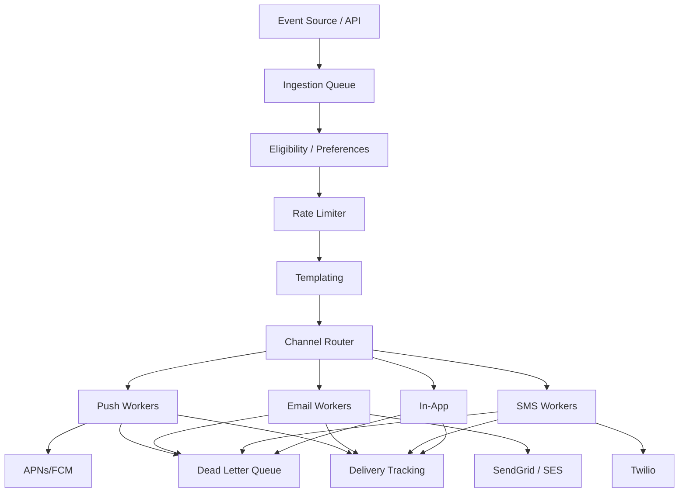
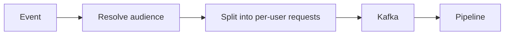

# Design Notification System

> **TL;DR** — A notification system is a **fan-out + delivery pipeline** that takes "send this message to these users via channels X, Y, Z" and reliably delivers across **push, email, SMS, in-app**, each with different SLAs and failure modes. The interesting work isn't sending one notification — it's deduplication, **user preferences and quiet hours**, **rate limiting per user** (don't spam), **delivery retries with provider failover** (APNs is down → fall back), and **template management**. At scale, billions of notifications/day across providers, with cost optimization (SMS is expensive, push is cheap).

---

## 1. Requirements

### Functional
- Send notification by channel: push (iOS/Android/Web), email, SMS, in-app.
- Templated content with personalization.
- Targeting (single user / group / segment).
- User preferences (channel, frequency, types).
- Quiet hours, time zones.
- Schedule for future delivery.
- Track delivery / engagement.

### Non-Functional
- Throughput: 100K+ notifications/sec at peak.
- Latency: trigger-to-delivery p99 < 30 sec (push), minutes for email.
- Reliability: at-least-once delivery with dedup.
- No spamming the user (rate limits).

---

## 2. Back-of-the-Envelope

- 1 B notifications/day average → ~12 K/sec, ~100 K/sec at peak (broadcast events).
- Push: ~free. SMS: ~$0.005 each. Email: cents per thousand.
- Single broadcast to 100 M users = one of the most expensive ops in your platform.

---

## 3. High-Level Architecture



Pipeline-shaped. Each stage is an independent service consuming a Kafka topic.

---

## 4. The Pipeline Stages

1. **Ingest**: API or event source publishes "notification request."
2. **Eligibility**: does this user want this kind of notification at this time?
3. **Rate limit**: have we sent too many to this user recently?
4. **Templating**: hydrate template with user-specific data.
5. **Channel routing**: pick channel(s) to deliver on.
6. **Delivery worker**: call APNs / FCM / SendGrid / Twilio.
7. **Tracking**: record delivery success / open / click.

Each stage is decoupled via Kafka.

---

## 5. User Preferences

```
SCHEMA (per-user)
  user_id
  channel_prefs   { push: true, email: true, sms: false }
  category_prefs  { marketing: false, security: true, ... }
  timezone
  quiet_hours     22:00 – 08:00
```

Stored in a fast KV (Redis-backed). Read on every notification.

---

## 6. Rate Limiting

Per-user buckets:
- Max notifications per hour / day.
- Per-category limits.

Implementation: sliding window or token bucket per user. See [Rate Limiter →](./rate-limiter.md).

Drop or batch notifications that would exceed the limit (depends on type — security alerts bypass).

---

## 7. Templating

Template language (Liquid, Handlebars, Mustache) plus per-user data:
```
"Hi {{first_name}}, your order #{{order_id}} has shipped!"
```

Templates versioned and stored in a CMS. Localization: per-template translations.

---

## 8. Channel Adapters

Each provider has its own SDK and rate limits:

| Channel | Provider | Auth | Limits |
|---------|---------|------|--------|
| iOS push | APNs | TLS cert | ~100K connections per app cert |
| Android push | FCM | server key | well documented |
| Email | SES, SendGrid, Mailgun | API key | sender reputation, throttling |
| SMS | Twilio, Vonage | API key | per-number-per-second |
| Web push | VAPID | keys | varies |

Workers wrap providers in a uniform interface, abstract the provider out.

---

## 9. Reliability

- **Retries** with exponential backoff for transient failures.
- **Provider failover**: SES down → fall back to SendGrid for email. Keep multiple providers configured.
- **Dead letter queue** for messages that fail all retries.
- **Idempotency** keys on send calls (prevent duplicate sends on retry).

---

## 10. Fan-Out for Broadcasts

When a single event triggers notifications to many users (e.g., "your team posted a new update" to all team members), fan-out happens upstream:



For huge audiences (100M+), use parallelism + batching aggressively. Avoid per-user DB queries; use cached user batches.

---

## 11. Delivery Tracking

Provider callbacks (webhooks) report delivery, open, click events. These flow into:
- **Delivery DB** (Cassandra-style) per notification.
- **Analytics pipeline** for aggregate metrics.
- Used for **bounce handling** (mark invalid emails dead).

---

## 12. Scheduled Notifications

Future-dated notifications:
- Stored in a scheduler service ([Job Scheduler →](./job-scheduler.md)).
- Triggered at the scheduled time → enqueued into the normal pipeline.
- Support: cron-like recurring, one-shot.

---

## 13. Common Mistakes

- **Synchronous send in the calling API** — slow providers block your APIs.
- **No user preferences check** — users unsubscribe (legally must allow).
- **No rate limiting** — one bug spams users; you lose them forever.
- **No idempotency** — retries cause duplicates.
- **One provider only** — when SES is down, you're down.
- **Sending SMS when push would work** — costs balloon.
- **No timezone awareness** — sends 3 AM notifications, users disable.

---

## 14. Cheat Card

```
PURPOSE    Reliable multi-channel delivery (push/email/SMS/in-app) at scale.

CORE       Kafka-staged pipeline: ingest → eligibility → rate-limit → template → send
           Per-channel workers wrap providers (APNs, FCM, SES, Twilio)
           Per-user preferences and quiet hours; rate limits per category
           Provider failover; DLQ on terminal failure
           Async tracking via provider webhooks

CHANNELS  Push (cheap) → Email (cheap) → SMS (expensive) → In-app
          Choose cheapest channel that satisfies urgency

PITFALLS   sync send, no idempotency, single provider,
           ignoring quiet hours, broadcasting via per-user DB queries.

RULE       Notifications are a pipeline.
           Failures at any stage must not lose messages.
```

---

## Resources

### Articles
- "Sending Push Notifications at Pinterest" — Pinterest Engineering
- "How Slack delivers notifications" — Slack Engineering
- "Architecting a Notification Service" — various engineering blogs

### Documentation
- **APNs** — Apple Push Notification Service
- **FCM** — Firebase Cloud Messaging
- **SendGrid / Mailgun / SES** APIs

### Tools
- Courier, Knock — notification-platform-as-a-service
- Kafka for pipeline
- Twilio, SendGrid for delivery

### Videos
- ByteByteGo: "Design a Notification System"

### Adjacent reading
- [Rate Limiter →](./rate-limiter.md)
- [Job Scheduler →](./job-scheduler.md)
- [Webhooks →](../02-networking/webhooks.md)
- [Message Brokers →](../07-messaging/message-brokers.md)

---

*Previous:* [← Zoom](./zoom.md)  |  *Next:* [Rate Limiter →](./rate-limiter.md)
