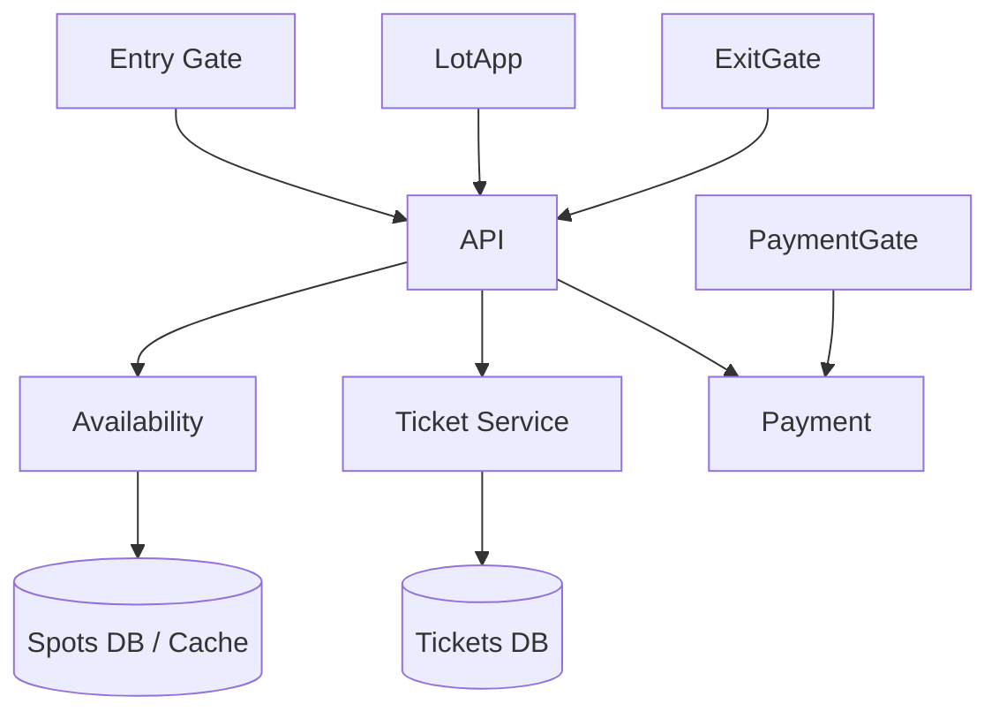

# Design a Parking Lot System

> **TL;DR** — A parking lot system is the **canonical OOD interview question** wearing system-design clothes. The interesting design choices: model spaces by **size** (motorcycle, compact, large, EV) and let vehicles fit into the smallest compatible size, **tickets/sessions** for entry-exit duration, **payment** with multiple gates (cash, card, app), and at multi-lot scale, **availability search + reservation**. Real-world: SpotHero, ParkMobile, JustPark are app-based versions. The system question is usually about a single lot; the scale question is about a city-wide network.

---

## 1. Requirements

### Functional
- Vehicle arrives → assigned a spot (or denied).
- Vehicle leaves → calculate fee and release spot.
- Multiple vehicle sizes (motorcycle / compact / large / oversized / EV).
- Multiple payment options.
- Display available spots.
- Optional: reserve in advance (apps).

### Non-Functional
- Entry latency < 1 sec (gate decision).
- Availability accurate.
- Scale single-lot: hundreds of spots. Multi-lot: millions.

---

## 2. Domain Model (OOD)

```
class Vehicle:
    license_plate: str
    type: MOTORCYCLE | CAR | TRUCK | EV

class ParkingSpot:
    spot_id: str
    size: SMALL | MEDIUM | LARGE | EV_CHARGER
    floor: int
    status: AVAILABLE | OCCUPIED | RESERVED

class Ticket:
    ticket_id: str
    vehicle_id
    spot_id
    entry_at: timestamp
    exit_at: timestamp (nullable)
    fee: money (nullable)
    paid: bool

class ParkingLot:
    lot_id
    spots: list[ParkingSpot]
    capacity_by_size: dict
```

OOP question variant: design the classes, methods, and inheritance. System-design variant: how does the data flow at scale.

---

## 3. Architecture



---

## 4. Spot Allocation

When a vehicle arrives:
1. Determine its size class.
2. Find the smallest available spot that fits it (waste less large space on small cars).
3. Mark `OCCUPIED`; issue ticket.

Algorithms:
- **Linear scan**: trivial, fine for small lots.
- **Priority queue per size**: O(log N) allocation.
- **Spatial layout**: pick nearest entry / shortest walk.

For multi-floor lots: prefer lower floors first; fall back upward.

---

## 5. Atomic Allocation

Under concurrency (busy garage at rush hour), two arrivals might race for the last spot:

```sql
UPDATE spots
SET status = 'OCCUPIED', vehicle_id = ?
WHERE spot_id = ? AND status = 'AVAILABLE'
```

Conditional update returns 0 rows if someone else got it; allocator picks another spot.

For lot-level capacity: simple atomic decrement of an available-count counter (sharded if hot).

---

## 6. Pricing

Common patterns:
- **Hourly**: $X per hour.
- **Tiered**: first hour $5, then $3/hour, max $20/day.
- **Time-of-day**: peak vs off-peak.
- **Subscription**: monthly pass.

Computed at exit based on `entry_at`, `exit_at`, and active rate schedule.

---

## 7. Payment

At exit (or in advance via app):
- Display fee.
- Accept card / cash / app payment.
- On success: open gate; mark ticket paid.

Integration with [Payment System →](./payment-system.md).

App-based: vehicle plate recognized via ANPR (camera + ML). Account auto-charged. No physical ticket.

---

## 8. License Plate Recognition (Modern)

ANPR (Automatic Number Plate Recognition) at entry/exit:
- Camera captures vehicle.
- ML model extracts plate text.
- Looked up against reservations / passes.
- Gate auto-opens for known plates.

Ticket implicit, billed by exit time minus entry time.

This is how most modern lots work — no paper ticket.

---

## 9. Reservations

For apps like SpotHero:
- User reserves a spot for a future time window.
- Inventory marked `RESERVED` for that window.
- On arrival: gate recognizes plate (or QR code), admits.

Reservation is essentially [Airbnb / hotel →](./hotel-reservation.md) with much shorter time units.

Overlap with walk-in inventory: split capacity (X spots for reservations, Y for walk-ins) or share with risk of "sold out."

---

## 10. Real-Time Availability

Mobile app shows "12 spots available."

- Each lot maintains a counter, decremented on entry / incremented on exit.
- Pushed to a central availability service.
- App queries with location filter (`hotels near me with > 0 spots`).

Slight staleness OK (a few seconds).

---

## 11. Multi-Lot Scale

City-wide network:
- Per-lot service handles allocation locally.
- Central registry of lots + availability.
- Search service (with geo index) for "near me."
- Reservation engine spans lots.

Looks more like an inventory marketplace than a single-lot allocator.

---

## 12. EV Charging

Special spot type:
- Has a charger; bookings include charge time.
- Pricing includes electricity.
- Communication with charger via OCPP protocol.
- Mismatches (someone parks non-EV) — sensor detection, fines.

---

## 13. Common Mistakes

- **Linear scan in giant lot** — slow allocation. Use a per-size structure.
- **No atomic allocation** — same spot allocated to two vehicles.
- **Storing every entry-exit in a single SQL table at city scale** — partition by lot.
- **No real-time availability** — app shows stale data; users arrive to full lot.
- **Trusting client-reported entry time** — use server timestamps.
- **No idempotency on exit gate** — repeated open requests double-charge.

---

## 14. Cheat Card

```
PURPOSE    Allocate parking spots, track sessions, charge fees.

CORE       Spot pool segmented by size (motorcycle/compact/large/EV)
           Smallest-fit allocation under atomic conditional update
           Tickets (or implicit via ANPR) track entry-exit
           Pricing computed at exit; pay before gate opens
           Reservation engine for app-based pre-booking
           Multi-lot scale → marketplace-like architecture

OOD ANGLE  Classes: Vehicle, ParkingSpot, Ticket, ParkingLot
            Spot.fit(vehicle); ParkingLot.assign(vehicle)

PITFALLS   no atomic allocation, linear scan, no real-time availability,
           trusting client timestamps, no idempotency on exit.

RULE       Atomic allocate.
           Use smallest fit.
           Bill on exit.
```

---

## Resources

### Articles
- "OOD: Parking Lot" — various interview prep blogs
- "ANPR systems at scale" — security industry papers

### Documentation
- **OCPP** — Open Charge Point Protocol for EV chargers

### Books
- *Cracking the Coding Interview* — parking lot is a recurring OOD problem
- *System Design Interview Vol. 2* — Alex Xu

### Videos
- ByteByteGo: OOD topics
- Various interview prep channels on parking lot design

### Adjacent reading
- [Hotel Reservation System →](./hotel-reservation.md)
- [Elevator System →](./elevator-system.md)
- [Ticketmaster →](./ticketmaster.md)

---

*Previous:* [← Hotel Reservation System](./hotel-reservation.md)  |  *Next:* [Elevator System →](./elevator-system.md)
