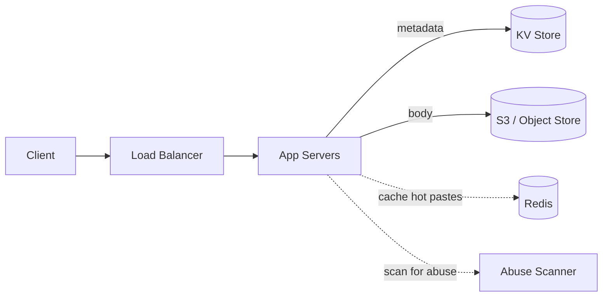
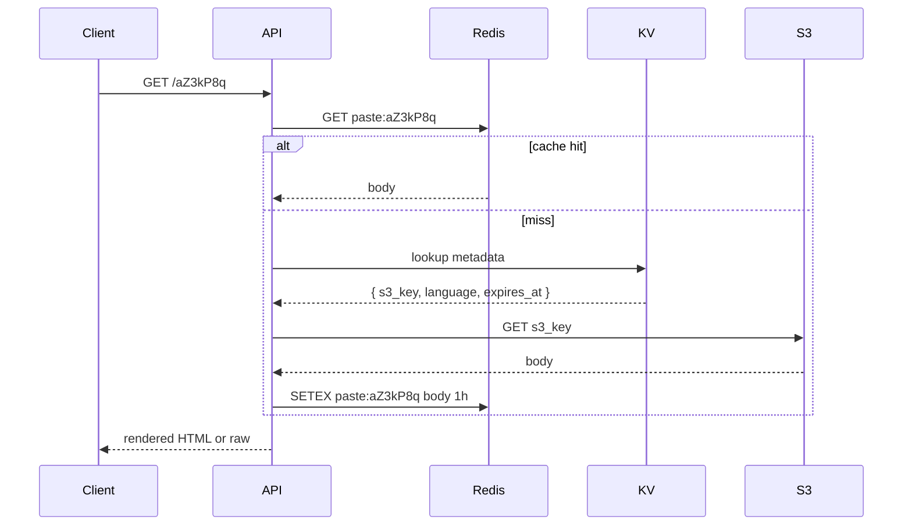

# Design a Pastebin

> **TL;DR** — Pastebin is a URL shortener with a body. Instead of `code → long URL`, it's `code → blob of text`. The blob can be **megabytes** instead of bytes, so the storage layer changes — **object storage (S3) for the body, KV for metadata**. Everything else (read-heavy lookups, base62 codes, expiration, abuse handling) carries over. The interesting twist is **paste size limits, syntax highlighting, and abuse**: pastebin is a notorious dumping ground for malware, credentials, and DMCA bait.

---

## 1. Requirements

### Functional
- `POST /paste` — submit text, get back a short URL.
- `GET /{code}` — return the original text (rendered as HTML with syntax highlighting, or raw).
- Optional: expiration (10 min / 1 hr / 1 day / never), private pastes, syntax language tag.

### Non-Functional
- Latency: p99 < 200 ms.
- Availability: 99.9%.
- Durability: don't lose pastes within their TTL.
- Scale: assume 10 M new pastes/day, 100 M reads/day, paste size 1 KB median / 1 MB max.

---

## 2. Back-of-the-Envelope

- 10 M pastes/day × 100 KB avg = **1 TB/day** written.
- 100 M reads/day → ~1,150 reads/sec average.
- Read:write ratio ≈ **10:1** (much lower than URL shorteners — pastes are often one-time shares).
- Storage at 1-year retention: ~365 TB. S3 cost: ~$8K/month.

---

## 3. High-Level Architecture



Two-tier storage is the key idea:
- **Metadata** (code, owner, ttl, language, size) → KV store.
- **Body** (the actual text) → S3 with object key = `pastes/{code}`.

Why separate? Because the body can be 1 MB and you don't want it sitting in your DB's row store. S3 also gives you durability + lifecycle TTLs for free.

---

## 4. Short-Code Generation

Same as [URL shortener →](./url-shortener.md): base62 of a counter, 8 chars (62⁸ ≈ 218 trillion). Pastebin uses 8-char codes; the extra character buys you 62× more space and reads about the same.

Custom slug? Same logic as URL shortener (`IF NOT EXISTS`).

---

## 5. The Body Storage

S3 (or GCS / Azure Blob / MinIO). Object key = paste code, content-type = `text/plain; charset=utf-8`.

Pros:
- 11 nines durability without you doing anything.
- **Lifecycle rules** delete pastes by TTL — set the expiration tag at upload, let S3 sweep.
- Cheap. Reads can serve directly from S3 via signed URLs for very large pastes.

Cons:
- ~50 ms read latency from S3 — not great for small pastes. Use **Redis or app-server local cache** in front for hot pastes.
- Per-object overhead — millions of tiny objects = noisy ops. Consider packing tiny pastes into larger blobs if median size is small.

---

## 6. Read Path



Two reads for cache misses (KV + S3) is the cost of decoupling. Worth it for write-side flexibility.

---

## 7. Expiration

Use S3 object lifecycle expiration via tagging:

```
PUT /pastes/aZ3kP8q
x-amz-tagging: ttl=1d
```

Lifecycle rule: objects tagged `ttl=1d` deleted after 1 day. AWS sweeps them; you don't write cleanup code.

For metadata: TTL on the KV row, or lazy check at read time.

---

## 8. Syntax Highlighting

Two options:
- **Server-side render** at write time. Store both raw text and rendered HTML. Faster reads, more storage.
- **Client-side render** with highlight.js or Prism. Lighter server, JS-dependent.

Pastebin.com uses server-side with a `?raw` parameter to bypass. Choose based on whether SEO/static rendering matters to you.

---

## 9. Abuse

Pastebin is a magnet for:
- Stolen credentials (db dumps, password lists).
- Malware payloads.
- DMCA-eligible content (source code dumps).
- Spam / phishing redirects.

Defenses:
- **Rate-limit** by IP and account ([Rate Limiting →](../03-apis/rate-limiting.md)).
- **Background scanner** — regex/ML for credit cards, AWS keys, common credential patterns. Auto-delete and notify.
- **Abuse reporting** endpoint with takedown SLA.
- **No bulk export API** — makes scraping painful.
- **Tor/proxy detection** at submission time.

This is non-optional. Pastebin's reputation is shaped by how aggressively this is enforced.

---

## 10. Private / Unlisted Pastes

- **Unlisted**: opaque code is the only access (security-by-obscurity).
- **Private**: requires auth; ACL on the metadata row.

For private, presigned S3 URLs with short expiry are an easy implementation — let S3 enforce access.

---

## 11. Edits and Versioning

Most pastebins don't allow edits; the immutability is part of the contract. If you do:
- Store versions as `{code}/v1`, `{code}/v2` in S3.
- Latest version pointer in KV.
- Cache layer must invalidate on write.

---

## 12. Common Mistakes

- **Storing pastes in the relational DB** — works at MVP, falls over at 100 GB. Move bodies to S3 early.
- **No abuse pipeline** — your service becomes a malware CDN within months.
- **Caching gigantic pastes in Redis** — memory blows up. Cap cached body size (e.g., < 64 KB) and stream large pastes directly from S3.
- **No size limit** — someone uploads `/dev/urandom` until they hit your storage cost ceiling.
- **Trusting `Content-Type` from client** — sniff it server-side; force text/plain.

---

## 13. Cheat Card

```
PURPOSE    Store and share text blobs via short opaque URLs.

CORE       Metadata in KV, body in S3 (lifecycle TTL for free)
           Read:write ~10:1 (lower than URL shortener)
           8-char base62 codes
           Cache hot pastes in Redis (with body size cap)

LIMITS     Max paste size: 1–10 MB
           Per-IP rate limit on writes
           Background abuse scanner

PITFALLS   bodies in SQL, no abuse pipeline, unbounded paste size,
           caching MB-size blobs in Redis.

RULE       Two-tier storage: structured metadata + opaque blob.
           Let S3 do the heavy lifting.
```

---

## Resources

### Articles
- "How to Build a Pastebin Service" — Educative system design course
- "Cloud Storage Performance" — AWS S3 best practices

### Documentation
- **S3 Lifecycle** — <https://docs.aws.amazon.com/AmazonS3/latest/userguide/object-lifecycle-mgmt.html>
- **highlight.js** — <https://highlightjs.org>

### Tools
- MinIO (self-hosted S3-compatible) — <https://min.io>
- ClamAV for content scanning

### Adjacent reading
- [URL Shortener →](./url-shortener.md)
- [Object Storage →](../09-storage/object-storage.md)
- [Rate Limiter →](./rate-limiter.md)
- [Cache Strategies →](../05-caching/cache-strategies.md)

---

*Previous:* [← URL Shortener](./url-shortener.md)  |  *Next:* [Twitter/X →](./twitter.md)
