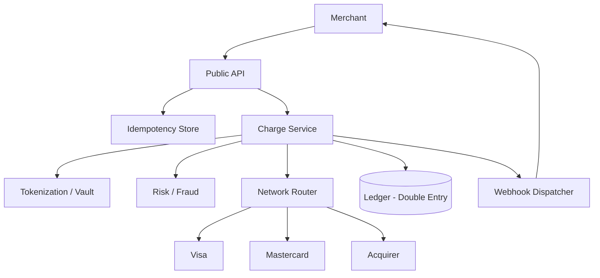

# Design a Payment System (Stripe-like)

> **TL;DR** — A payment system is a **money state machine that talks to banks**. The interesting parts aren't the database — they're (1) **idempotency** (network retries must not double-charge), (2) **double-entry bookkeeping** (every cent has two sides; balance sheets always reconcile), (3) **multi-currency**, (4) **regulatory compliance** (PCI-DSS, AML, KYC), and (5) **the bank integration nightmare** — each card network, processor, and acquirer has a different protocol and uptime profile. Stripe's blog posts on idempotency keys and online migrations are the canonical reading.

---

## 1. Requirements

### Functional
- Charge a customer's card (one-time or subscription).
- Refund a charge (full or partial).
- Payouts to merchants.
- Multiple payment methods: card, bank, wallet, BNPL.
- Multi-currency.
- Webhooks for merchant integration.
- Disputes / chargebacks.

### Non-Functional
- Availability: 99.999% for charges (any downtime = real lost revenue).
- Latency: p99 < 1 s for card charges.
- Durability: never lose a transaction.
- **Correctness**: ledger must always balance.
- Compliance: PCI-DSS Level 1, SOC 2, regional regs.

---

## 2. Back-of-the-Envelope

- Stripe: ~$1T+ processed/year. ~10–100 K transactions/sec peak.
- Average txn ~$50 (varies). ~500 bytes per transaction record.
- 24/7 service. Money never sleeps; banks do (batch settlement windows).

---

## 3. High-Level Architecture



The Network Router is the operational pain — multiple bank/network integrations, each with its own SLA and failure modes.

---

## 4. The API Surface

A charge is created with a POST:

```http
POST /v1/charges
Idempotency-Key: f7e9b...
Authorization: Bearer sk_live_...

{
  "amount": 4200,
  "currency": "usd",
  "source": "tok_visa_4242",
  "description": "Order #1234"
}
```

Stripe's API style is the gold standard. Key features:
- **Idempotency keys** on every mutating call.
- Versioned (each merchant can pin to an API version).
- Returns a `Charge` object that's later updated (events fire on state changes).

---

## 5. Idempotency

The defining problem. A client makes a request, gets a network timeout, retries. Without idempotency, you charge twice.

```
First request:  Idempotency-Key: abc → process, store result
Second request: Idempotency-Key: abc → return stored result
```

Implementation:
- KV store (Redis-backed, with persistent backup) keyed by `(merchant_id, idempotency_key)`.
- Stores the full response from the first call.
- TTL ~24 hours.
- Atomic check-and-insert: if key exists, return cached result.

See Stripe's blog ["Designing robust and predictable APIs with idempotency"](https://stripe.com/blog/idempotency) and [idempotency →](../03-apis/idempotency.md).

---

## 6. Tokenization and PCI

Storing raw card numbers triggers PCI-DSS Level 1 scope on your entire infrastructure. Avoid it:
- Card data is never stored in your application stores.
- At input, it's encrypted by the client SDK with a public key.
- Sent to a **vault** (isolated PCI-compliant store).
- Vault returns a **token** (`tok_visa_4242`) used for all subsequent operations.
- The vault is the only system that sees raw PANs.

This is how Stripe's `stripe.js` works — your servers never see card numbers.

---

## 7. The Ledger (Double-Entry)

This is the heart of the system.

Every money movement has two sides:
```
DEBIT  merchant_pending_balance   +$42.00
CREDIT customer_charge             +$42.00
```

Stored as **journal entries**, never updated, only appended. Account balances are derived (sum of entries).

```
SCHEMA (journal_entries)
  entry_id      uuid
  account_id    
  direction     debit | credit
  amount_minor  bigint (in cents)
  currency
  txn_id        groups related entries
  created_at
```

Constraints:
- Within a transaction, sum(debits) = sum(credits).
- Append-only — corrections are new entries, not edits.
- Per-account current balance maintained via materialized view or running sum.

Why double-entry? Reconciliation becomes mechanical. Every cent leaving "customer" must arrive at "merchant" (minus fees to "stripe revenue"). If they don't balance, something is broken — and you'll know immediately.

---

## 8. Network Routing

A card charge goes to:
1. **Issuer** (the customer's bank): authorizes.
2. **Network** (Visa, MC, Amex, Discover): the messaging layer.
3. **Acquirer** (merchant's bank): receives funds.
4. **Processor** (e.g., First Data): the actual integration point.

Stripe maintains integrations with all of these. Each has:
- Different protocols (ISO 8583, REST, EDI files).
- Different uptime (some have planned 6-hour daily downtimes).
- Different latency (US fast, some international slow).
- Different decline-rate profiles.

The **Network Router** chooses which path for a given card. Adaptive — if Visa's primary processor degrades, traffic shifts to a backup.

---

## 9. Fraud and Risk

Real-time scoring on every charge:
- ML model on features (card BIN, country mismatch, velocity, merchant history).
- High-risk → 3DS challenge (issuer-side authentication).
- Very high → decline outright.

Plus async pipelines for:
- Cross-merchant fraud detection.
- Chargeback prediction.
- AML/sanctions screening.

---

## 10. Refunds and Disputes

- **Refund**: reverse part or all of a charge. New journal entries with opposite direction. Network call to the processor.
- **Dispute (chargeback)**: cardholder disputes the charge with their bank. Funds clawed back; merchant must produce evidence. State machine: `needs_response` → `under_review` → `won` / `lost`.

Disputes have hard deadlines (often 7–14 days). Notification pipeline must reach merchants fast.

---

## 11. Webhooks

Merchants subscribe to events:
```
charge.succeeded
charge.failed
charge.refunded
dispute.created
payout.paid
```

Webhook delivery:
- Async after the event.
- Retried with exponential backoff on failure (24–72 hours typical).
- Signed with HMAC so merchants can verify authenticity.
- Per-merchant ordered delivery? Sometimes, depending on event type.

See [Webhooks →](../02-networking/webhooks.md).

---

## 12. Payouts

Money owed to merchants is paid out on a schedule (T+2 typical for US cards).

- Batch job sums each merchant's available balance daily.
- ACH (US) or SEPA (EU) transfer initiated.
- Result returned async (1–3 days for ACH to settle).
- Ledger updates: `merchant_available_balance` → `external_bank`.

---

## 13. Storage

- **Ledger**: Postgres / TiDB. Strict consistency, ACID. Sharded by merchant.
- **Idempotency store**: Redis with persistent backup.
- **Vault**: isolated, PCI-scoped, often a separate Postgres cluster.
- **Event stream**: Kafka.

Stripe famously runs Postgres at huge scale with online migrations. Their post on this is worth reading.

---

## 14. Multi-Currency

- Every account is denominated in a base currency.
- Cross-currency charges convert at a stored FX rate (refreshed hourly).
- FX gain/loss recorded as a separate journal entry.
- Settlement to merchant's bank may convert again.

---

## 15. Common Mistakes

- **No idempotency** — guaranteed double charges on network failures.
- **Storing card PANs** — instant PCI scope expansion + breach risk.
- **Mutating ledger entries** — corrupts the audit trail. Always append.
- **Synchronous webhook delivery in the charge path** — slow webhooks delay charge response. Always async.
- **One processor integration** — no failover. Use multiple.
- **No reconciliation** — silent ledger drift becomes a black hole.
- **Putting the FX rate at charge time only** — settlement may convert differently; track both.

---

## 16. Cheat Card

```
PURPOSE    Process money: charges, refunds, payouts, with auditability.

CORE       Idempotency keys on every mutating call
           Tokenization: cards never touch your stack
           Double-entry ledger; append-only journal
           Multi-network router with adaptive failover
           Async webhooks signed with HMAC

NUMBERS    99.999% availability target
           p99 < 1 s for card charge

PITFALLS   storing raw PANs, mutating ledger,
           sync webhooks, single processor,
           no idempotency, no reconciliation jobs.

RULE       Money has memory. Make every event immutable and reconcilable.
```

---

## Resources

### Articles
- "Designing robust and predictable APIs with idempotency" — Stripe blog
- "Online migrations at scale" — Stripe blog
- "Idempotency in distributed systems" — Stripe Engineering
- "Online Schema Migrations" — Brandur Leach
- Stripe's API documentation as a reference for design

### Documentation
- **Stripe API** — <https://stripe.com/docs/api>
- **PCI-DSS** — Payment Card Industry standard

### Books
- *Designing Data-Intensive Applications* — Kleppmann (transactions, ledgers)
- *Payment Systems in the U.S.* — Carol Coye Benson

### Videos
- "Stripe's API: Idempotency and More" — Brandur Leach
- ByteByteGo: "Design Stripe"

### Adjacent reading
- [Idempotency →](../03-apis/idempotency.md)
- [Saga Pattern →](../07-messaging/saga-pattern.md)
- [Webhooks →](../02-networking/webhooks.md)
- [Event Sourcing →](../07-messaging/event-sourcing.md)
- [Stock Exchange →](./stock-exchange.md)

---

*Previous:* [← Amazon / E-Commerce](./amazon.md)  |  *Next:* [Stock Exchange →](./stock-exchange.md)
