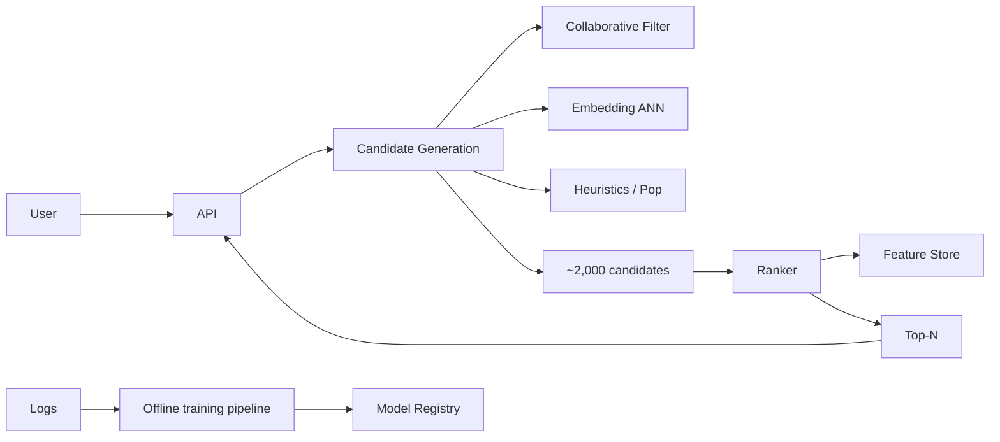
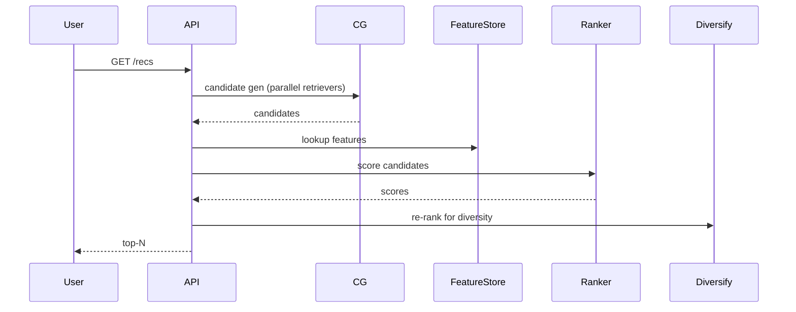

# Design a Recommendation System

> **TL;DR** — A recommender is **a two-stage retrieval + ranking pipeline** over user/item interactions. Stage one: **candidate generation** — pull a few thousand items the user *might* like from a billion-item catalog using cheap retrievers (collaborative filtering, embeddings + ANN, content rules). Stage two: **ranking** — a heavy ML model scores each candidate using rich features and produces the final top-N. Modern systems converge: **two-tower neural networks** for retrieval, **gradient-boosted trees or DNNs** for ranking, served via low-latency online inference. The hardest engineering: cold start, fast feature lookup, and serving p99 < 100 ms.

---

## 1. Requirements

### Functional
- Given user and context, return ranked list of items.
- Handle new users (cold start).
- Handle new items (cold start).
- Personalize over time as user behaves.
- Support multiple contexts (homepage, "similar items", post-purchase).

### Non-Functional
- Latency p99 < 100 ms.
- Throughput: matches traffic (10K+ recs/sec).
- Freshness: react to user behavior within minutes.
- Catalog: billions of items, hundreds of millions of users.

---

## 2. High-Level Architecture



Two-stage architecture, served online; trained offline.

---

## 3. Candidate Generation

Reduce billion-item catalog to ~1–10K candidates in milliseconds. Multiple retrievers, results unioned.

### 3.1 Collaborative Filtering
"Users who liked X also liked Y." Item-item or user-item matrix factorization.
- Pre-computed per-item neighborhood lists.
- Trigger from items in user's recent history.

### 3.2 Embedding-Based Retrieval
- User → embedding vector.
- Items → embedding vectors (in same space).
- Use **HNSW** or **FAISS** for approximate nearest-neighbor over million+ items in <10 ms.
- See [Embedding-Based Retrieval →](../19-advanced/embedding-retrieval.md).

### 3.3 Content-Based
- Match item attributes (genre, brand, category) to user preferences.
- Useful for cold-start items.

### 3.4 Heuristics
- Trending now.
- Popular in your country / for your demographic.
- Rule-based slots (sponsored, recently added).

Union, dedup, pass to ranker.

---

## 4. Two-Tower Models

A canonical architecture for retrieval:
- **User tower**: NN taking user features → user embedding.
- **Item tower**: NN taking item features → item embedding.
- Training: maximize dot-product similarity for positive (user, item) pairs from history.

At serving time:
- User tower runs online (per request).
- Item tower runs offline; item embeddings stored in ANN index.
- Retrieval = ANN search.

Massively scalable. Both YouTube and Pinterest use variants of this.

---

## 5. Ranking

Per candidate, predict P(engagement). Engagement = click, dwell, purchase, watch.

Features (~100s):
- User: demographics, history aggregates, recent context.
- Item: popularity, category, age.
- User × Item: prior interactions, similarity.
- Context: time, device, surface.

Models:
- **GBDT** (XGBoost, LightGBM) — fast, robust, easy to debug.
- **DNN** — richer interactions; expensive.
- **Wide & Deep** (Google) — combine memorization + generalization.

Multi-task DNN predicting multiple engagement types is the modern norm.

Score candidates → sort → top-N.

---

## 6. Feature Store

Critical for serving. Pre-computed features stored for sub-10ms lookup.

```
USER_FEATURES (key: user_id) → { recent_categories, total_purchases, ... }
ITEM_FEATURES (key: item_id)  → { popularity, age, embed_vec, ... }
```

Two-tier:
- **Online store**: Redis / DynamoDB / Cassandra. Hot. Low latency.
- **Offline store**: data lake. Training/eval.

Updates: features computed by streaming jobs (real-time) and batch (daily).

See [Feature Stores →](../19-advanced/real-time-analytics.md).

---

## 7. Online Serving



Latency budget breakdown for 100 ms:
- 10 ms: candidate gen (parallel).
- 30 ms: feature lookup.
- 30 ms: ranking inference.
- 30 ms: post-processing, network.

---

## 8. Cold Start

### User cold start
New user, no history. Fallbacks:
- Onboarding survey → seed preferences.
- Demographic / location-based.
- Popular content.
- Update model quickly as first interactions arrive.

### Item cold start
New items have no engagement data.
- Content-based features (text, image embeddings).
- Boost in retrieval temporarily ("exploration" budget).
- Multi-armed bandits to balance exploration vs exploitation.

---

## 9. Training Pipeline

Offline:
- Logs of (user, item, action, context, label).
- Feature engineering.
- Model training (TF, PyTorch, XGBoost).
- Evaluation on held-out + counterfactual (A/B replays).
- Push to model registry.

Online:
- Canary deploy → shadow → A/B test → full rollout.
- Continuous re-training (daily, hourly for fast-changing systems).

---

## 10. Diversification

Top-N by score might be too similar. Re-rank:
- MMR (Maximal Marginal Relevance).
- Slot diversity (different categories per position).
- Author/brand caps.

Helps user experience and exploration.

---

## 11. A/B Testing

The lifeblood of recommendation work. Every change ships behind an experiment:
- Hold-out groups isolated.
- Metrics tracked (CTR, conversion, dwell).
- Statistical significance gating launch.

Bad rollouts are easy — A/B catches them.

---

## 12. Common Mistakes

- **Single-stage retrieval (sort full catalog)** — impossible at billion-item scale.
- **No feature store** — feature lookup over OLTP DBs collapses latency.
- **Treating recs as DB query** — they're inference + retrieval.
- **No cold-start strategy** — new users / items get nothing.
- **No diversification** — feeds become repetitive; engagement drops.
- **No A/B framework** — can't validate changes.
- **Stale features** — recommendations lag behavior.

---

## 13. Cheat Card

```
PURPOSE    Personalized top-N from a vast catalog in <100 ms.

PIPELINE   Candidate Gen (CF + ANN + heuristics) → Ranking → Diversify
           Two-tower model for retrieval; GBDT/DNN for ranking
           Feature store for sub-10 ms feature lookup
           A/B framework wraps every change

COLD START Content features + popularity + bandits

NUMBERS    Billion items → ~2K candidates → top-N
           p99 < 100 ms end-to-end

PITFALLS   one-stage retrieval, no feature store,
           no diversification, no A/B testing,
           stale features.

RULE       Retrieve cheap.
           Rank rich.
```

---

## Resources

### Articles
- "Deep Neural Networks for YouTube Recommendations" — Google 2016
- "Real-time Personalization at Pinterest" — Pinterest engineering
- "Wide & Deep Learning for Recommender Systems" — Google 2016
- "Two-Tower Models" — various papers

### Books
- *Practical Recommender Systems* — Kim Falk
- *Recommender Systems: The Textbook* — Charu Aggarwal

### Documentation
- **Faiss** — <https://github.com/facebookresearch/faiss>
- **TensorFlow Recommenders** — <https://www.tensorflow.org/recommenders>

### Videos
- ByteByteGo: "Design Netflix Recommendations"
- "Building a Recommendation System" — Andrew Ng / Coursera

### Adjacent reading
- [News Feed →](./news-feed.md)
- [Embedding-Based Retrieval →](../19-advanced/embedding-retrieval.md)
- [Real-Time Analytics →](../19-advanced/real-time-analytics.md)
- [Spotify →](./spotify.md)
- [YouTube / Netflix →](./youtube-netflix.md)

---

*Previous:* [← Ad Click Aggregator](./ad-click-aggregator.md)  |  *Next:* [Search Autocomplete →](./search-autocomplete.md)
