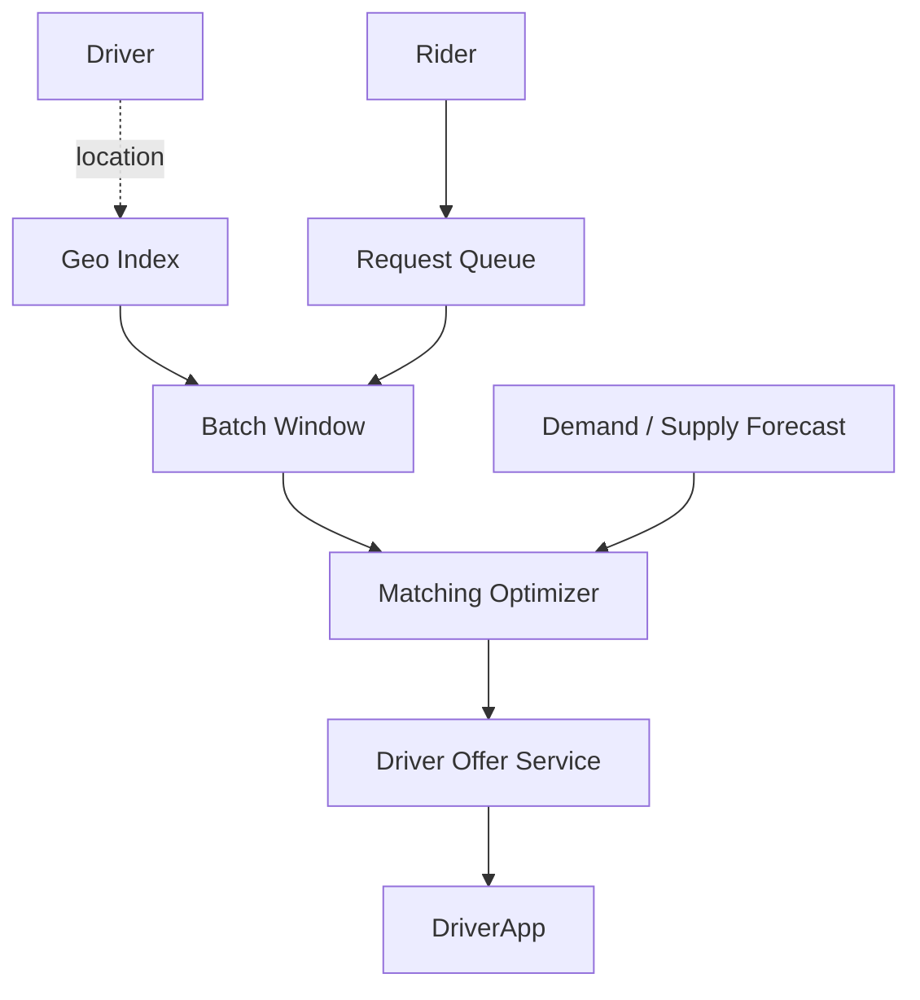

# Design a Ride-Sharing Matchmaking Engine

> **TL;DR** — Zooming into the **matching engine** of a rideshare system specifically: given a stream of ride requests and a fleet of drivers, produce assignments **every second** that minimize ETAs, maximize utilization, and respect fairness. The naive "nearest driver wins" is rarely optimal. Modern engines use **batch optimization windows** (collect requests for ~5 seconds, then solve a bipartite matching problem globally), **machine learning** to predict driver next-position and demand, and **reverse positioning** to keep supply where demand will be in 10 minutes. Uber's matching has been rewritten multiple times; the latest generations are batch-optimization based.

---

## 1. Requirements

### Functional
- Match rider requests to driver supply.
- Choose driver minimizing ETA + cost.
- Optionally batch shared rides (pool).
- Respect fairness (drivers see comparable opportunities).

### Non-Functional
- Decision latency: < 1 sec from request to driver offer.
- Throughput: thousands of matches/sec per metro at peak.
- Optimality: within ~5% of theoretical optimum.

---

## 2. Why Greedy Isn't Enough

Greedy "nearest available driver" fails because:
- A nearby idle driver might be the ideal match for a request arriving 3 seconds later.
- Two riders' optimal matches may be the same driver — greedy gives him to the first.
- Doesn't account for predicted future demand.

Picture: two requests, two drivers; greedy picks suboptimal pairings.

---

## 3. The Bipartite Matching Approach

Collect requests in a short window (1–5 sec). Each second, solve:

```
minimize  Σ ETA(driver_i, request_j) × assignment[i][j]
subject to each driver assigned to ≤ 1 request
          each request assigned to ≤ 1 driver
```

This is the assignment problem — solvable with **Hungarian algorithm** in polynomial time, or LP/MIP solvers with constraints.

In practice, problem sizes are tractable (city-level, hundreds to thousands of pairings).

---

## 4. Architecture



---

## 5. ETA Computation

For each candidate pairing, compute ETA from driver location to pickup.
- Pre-computed road graph with current traffic.
- Cached for repeated (origin, destination) pairs.

At a thousand pairings per match cycle, ETA service is in the hot path. Must be fast.

---

## 6. Demand Forecasting

ML model predicts:
- Where requests will come from in next 10 min (per H3 cell).
- Where supply needs to be.

Drivers may be re-positioned (via UI suggestions) to anticipated demand.

---

## 7. Pool / Shared Ride Matching

Combine multiple requests onto one driver:
- Each request has an O→D pair.
- Optimizer can combine requests whose paths overlap.
- Each rider's detour bounded (e.g., < 5 min extra).

Combinatorial explosion — heuristics + constraints + branch-and-bound.

UberPool, Lyft Line use this approach.

---

## 8. Reverse Positioning

When a metro area expects a surge in 20 min (event ending, etc.), pre-position drivers:
- Suggest re-positioning to drivers (sometimes with incentive).
- Influence dispatch decisions to prefer drivers who will be free near forecast demand.

---

## 9. Driver Acceptance

Once an offer is made:
- Driver has ~10-20 sec to accept.
- On accept: match committed.
- On decline: re-optimize with that pairing removed.

Driver acceptance rate is a feature in scoring (low-acceptance drivers get fewer offers).

---

## 10. Fairness

A naive optimizer concentrates matches on top performers, leaving others unhappy. Constraints:
- Spread offers across drivers within reasonable bounds.
- Penalize repeated short-trip assignments.
- Cap per-driver wait time.

---

## 11. Streaming Architecture

Continuous match cycles:
1. Window opens at t.
2. Collect requests + driver positions.
3. At t + W (e.g., 3 sec), solve and dispatch.
4. Window t+W to t+2W next batch.

Latency = W + solve time. W = 3 sec is a good balance.

For uber-low-latency markets, W=1 sec; for high-volume, W up to 10 sec for better optimality.

---

## 12. Multi-Objective Optimization

Real objective is more complex than just ETA:
```
minimize  α × Σ ETA + β × wait_time_so_far + γ × pool_savings + δ × fairness
```

Weights tuned by A/B testing per market.

---

## 13. Common Mistakes

- **Pure greedy nearest-driver** — suboptimal at any decent scale.
- **No window batching** — leaves optimization gains on the table.
- **No demand forecast** — supply mismatch grows; surge spikes.
- **Synchronous ETA lookups** — must be cached / pre-computed.
- **No driver acceptance signals** — keep offering to low-acceptance drivers, all riders wait.
- **No fairness constraints** — driver churn.

---

## 14. Cheat Card

```
PURPOSE    Optimal driver/rider assignment in seconds at metro scale.

CORE       Batch optimization window (1–5 sec) + Hungarian/LP solver
           Multi-objective: ETA + wait + pool savings + fairness
           Demand/supply forecasting for reverse positioning
           Pool matching: bounded detour per rider
           Driver acceptance feedback in scoring

THROUGHPUT  Thousands of matches/sec per metro
LATENCY     Decision in ≤ 1 s + window size

PITFALLS   pure greedy, no batching, no forecast,
           sync ETA, no acceptance signals, no fairness.

RULE       The optimal match next second is rarely the greedy match this second.
```

---

## Resources

### Articles
- "Real-Time Driver Allocation at Uber" — Uber Engineering
- "Improving Driver Allocations with Optimization" — Lyft engineering
- "Matching in Two-Sided Markets" — academic literature

### Documentation
- **Hungarian algorithm** — combinatorial optimization references
- **OR-Tools** — Google optimization library

### Books
- *Networks, Crowds, and Markets* — Easley & Kleinberg

### Videos
- Uber engineering talks on dispatch
- ByteByteGo: ride-sharing topics

### Adjacent reading
- [Uber / Lyft →](./uber.md)
- [Food Delivery →](./food-delivery.md)
- [Geohashing & Quadtrees →](../19-advanced/geohashing-quadtrees.md)
- [Google Maps →](./google-maps.md)

---

*Previous:* [← Food Delivery System](./food-delivery.md)  |  *Next:* [Code Deployment System →](./code-deployment.md)
