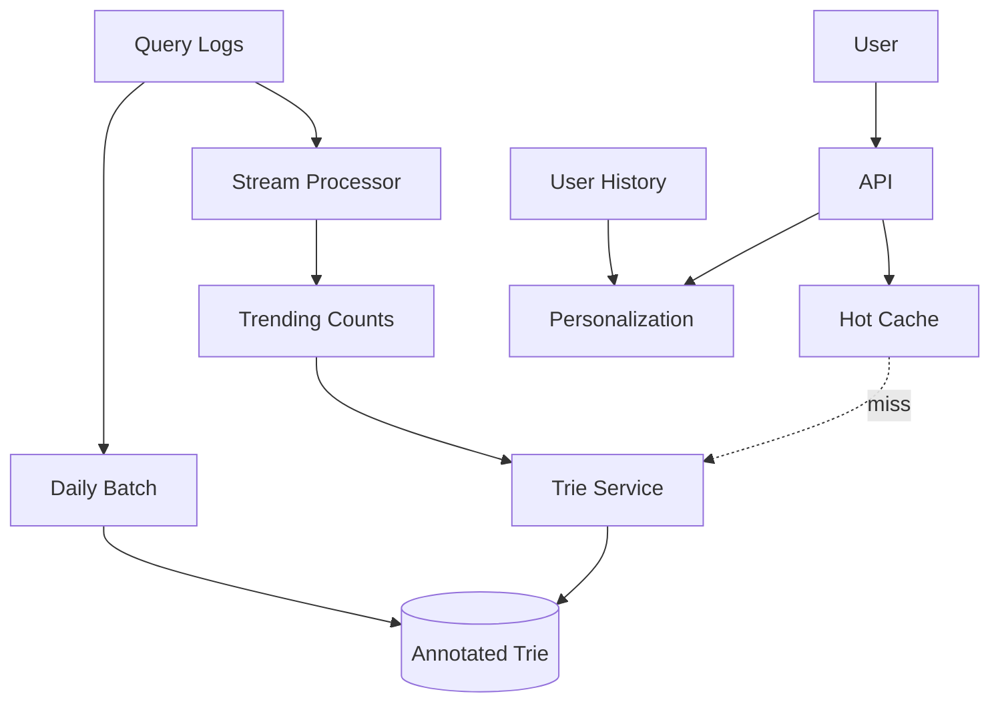
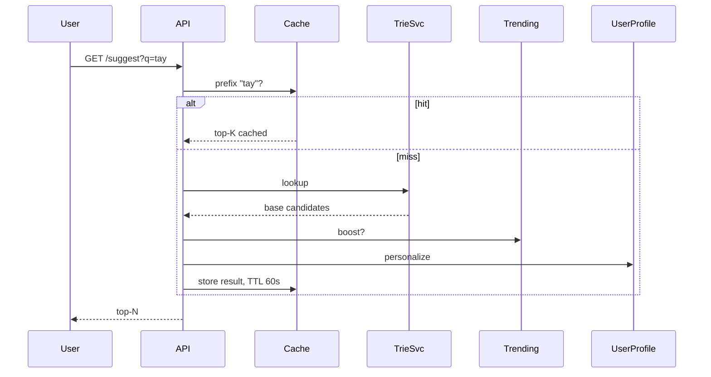

# Design a Search Autocomplete

> **TL;DR** — Search autocomplete extends [typeahead →](./typeahead.md) with **richer ranking, personalization, and real-time freshness**. Where typeahead returns top suggestions for a prefix, search autocomplete also has to handle (a) **trending queries** that explode in popularity within hours (a sports event, a news story), (b) **personalization** against the individual user's history, and (c) **misspellings** with fuzzy matching. The serving architecture is the same trie + cache pattern; the trick is the **streaming pipeline that updates suggestion weights from query logs continuously**.

---

## 1. Requirements

### Functional
- Return top-N suggestions for a query prefix.
- Personalize using history.
- Surface trending queries.
- Fuzzy match for typos.
- Support multiple languages.

### Non-Functional
- Latency p99 < 100 ms.
- Throughput: matches search QPS.
- Trending updates visible within minutes.

---

## 2. High-Level Architecture



Two updates to the trie: **batch** (daily, base popularity) and **stream** (real-time, trending).

---

## 3. The Base Trie

Built daily from aggregated query logs. Per node, stores top-K most popular completions for that prefix (see [Typeahead →](./typeahead.md)).

Pruning by minimum support threshold (e.g., query must appear ≥ 100 times in last 30 days) keeps the trie small.

---

## 4. Trending Layer

Stream processor (Flink/Spark) tracks **velocity** of queries:
- Count per query over rolling 5–60 minute windows.
- Compare to baseline (avg of last 24 hours).
- Spike detected → boost in suggestion weight.

When the user types "tay", base trie says ["taylor", "tax", "taco"...]; trending boost surfaces "taylor swift new album" if it spiked in the last hour.

Implementation: trending scores stored separately, merged into suggestion ranking at serving time.

---

## 5. Personalization

Each user has a profile:
- Their recent queries.
- Topics of interest.
- Demographics, location.

At serving time:
- Base top-K candidates from trie.
- Re-rank with personalization features.
- Boost candidates that match user's profile.

Personalization is usually 10–30% of overall ranking weight; popularity dominates.

For privacy, personalization features stay on the user's device or are anonymized aggregates.

---

## 6. Fuzzy Matching

Two approaches:

### 6.1 Edit-distance index
- N-gram index of all known queries.
- At query time, generate n-grams of the typed prefix.
- Look up candidates; filter by edit distance.

### 6.2 BK-trees
- Metric tree for nearest-neighbor in edit-distance space.

Apply when exact-prefix match returns few results.

---

## 7. Serving Stack



Hot prefixes are cached (sub-millisecond reads). Long-tail prefixes hit the trie.

---

## 8. Storage

- **Trie service**: in-memory, sharded by prefix's first char.
- **Trending counts**: Redis, refreshed every minute.
- **User profile**: KV store keyed by user_id.
- **Query logs**: Kafka → S3 + stream.

---

## 9. Indexed Phrases vs Single Words

Real queries are phrases. Suggest:
- Common phrases as units in the trie.
- Multi-word completions ("new york pizza near me").
- Boundary-aware tokenization.

---

## 10. Multi-Language

Each language gets its own trie.
- Detect from browser/locale.
- Some queries are multilingual; combine candidate sets.

---

## 11. Suppression and Safety

Some suggestions must be suppressed:
- Profanity.
- Defamatory queries about real people.
- Spam patterns.

Blocklists + ML classifiers. Mandatory.

---

## 12. Common Mistakes

- **No trending layer** — slow to react to news.
- **No cache** — same prefix re-computed millions of times.
- **No personalization decay** — old history dominates.
- **Single global trie** — locking contention on live updates.
- **Treating trending and base same way** — different update cadences, different weights.
- **Suggesting harmful queries** — content moderation is part of the system.

---

## 13. Cheat Card

```
PURPOSE    Sub-100 ms ranked completions with personalization + trending.

CORE       Annotated trie (per-prefix top-K) built daily
           Real-time trending layer (5–60 min windows)
           Per-user personalization at serving time
           Fuzzy matching via n-gram or BK-tree
           Hot prefix cache (Redis) in front

UPDATES    Base: daily batch from query logs
           Trending: stream every minute
           Personalization: live per user

PITFALLS   no trending, no cache, no suppression,
           personalization too heavy or too stale.

RULE       Two timescales in the suggestion mix:
           daily popularity + minute-by-minute velocity.
```

---

## Resources

### Articles
- "Building a Real-Time Spelling Correction" — Spotify Engineering
- "Google Trends" — Google Trends documentation
- "Search Autocomplete at LinkedIn" — LinkedIn engineering

### Documentation
- **Elasticsearch suggesters** — completion + phrase suggesters
- **Apache Lucene FST**

### Tools
- Elasticsearch, Algolia, Typesense
- Flink for streaming counts

### Videos
- ByteByteGo: "Design Search Autocomplete"

### Adjacent reading
- [Typeahead →](./typeahead.md)
- [Trie →](../19-advanced/trie.md)
- [Real-Time Analytics →](../19-advanced/real-time-analytics.md)
- [Recommendation System →](./recommendation-system.md)

---

*Previous:* [← Recommendation System](./recommendation-system.md)  |  *Next:* [Ticketmaster →](./ticketmaster.md)
