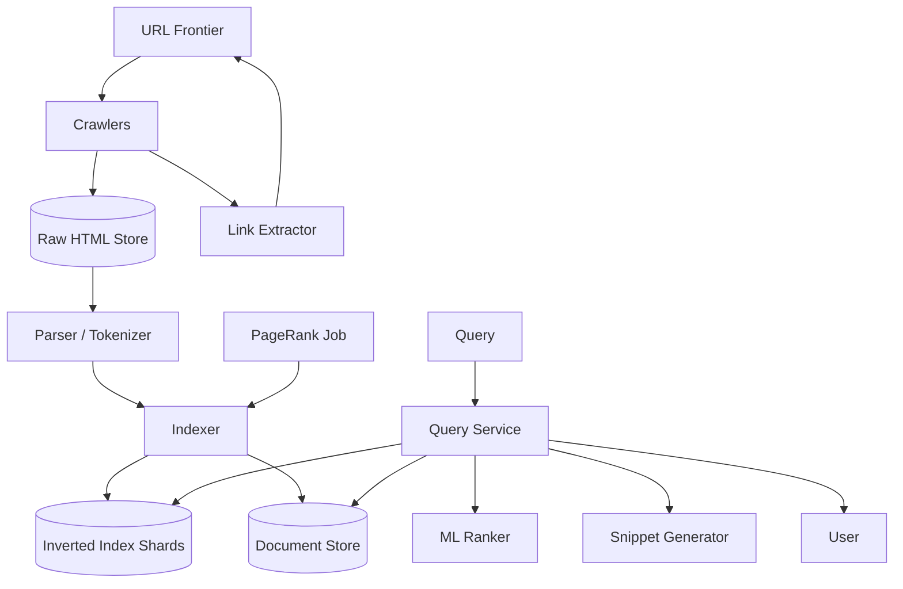
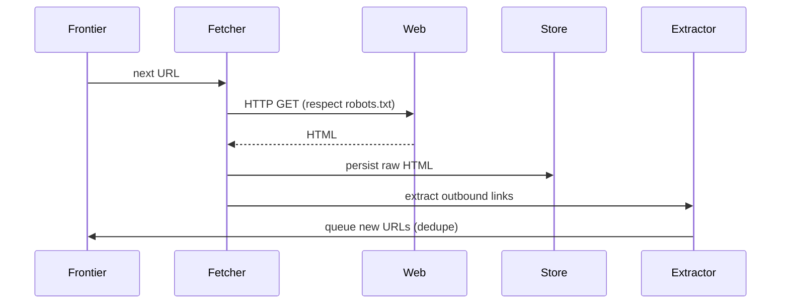
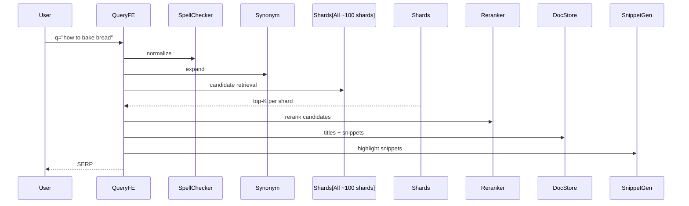

# Design Google Search / Web Crawler

> **TL;DR** — Web search is **three pipelines welded together**: a crawler that fetches the web, an indexer that turns pages into a searchable structure (the **inverted index**), and a serving system that answers queries in <100 ms by sharding that index across thousands of machines. The original Google papers (PageRank 1998, MapReduce 2004, Bigtable 2006) define the canonical approach. Crawling is constrained by politeness and infinite spider traps; indexing is a massive batch problem; serving is a low-latency distributed lookup with ML re-ranking on top. The hard numbers: index ~100 billion pages, query latency p99 < 200 ms.

---

## 1. Requirements

### Functional
- Crawl the public web continuously.
- Index page text, metadata, links.
- Serve query results ranked by relevance.
- Support phrase queries, operators, snippets, autocomplete.
- Personalization (light) and freshness for news.

### Non-Functional
- Query latency p99 < 200 ms.
- Availability: 99.99%.
- Index freshness: minutes for news, hours/days for general pages.
- Scale: ~100B+ pages indexed, ~100K queries/sec average, ~1M/sec peak.

---

## 2. Back-of-the-Envelope

- 100 B pages × ~100 KB average = 10 PB of raw HTML (compressed).
- Inverted index size: ~10–20% of raw text.
- Crawling: must fetch ~1 B+ pages/day to keep fresh. ~10 K pages/sec average.
- Serving: query touches ~100 shards in parallel; each must respond in milliseconds.

---

## 3. High-Level Architecture



Three sub-systems: crawl → index → serve. Each can be operated as a separate team and product.

---

## 4. The Crawler



Components:
- **URL frontier**: prioritized queue of URLs to fetch. Priority by PageRank estimate, freshness signals, and politeness windows.
- **Fetcher pool**: thousands of concurrent HTTP clients.
- **Politeness**: per-host rate limit, respect `robots.txt` (cache it).
- **Dedup**: URL canonicalization + content hashing (avoid storing duplicate pages from URL variants).
- **Trap detection**: infinite calendars, session-id URLs. Heuristics + per-host caps.

See [Web Crawler →](./web-crawler.md) for a deeper dive on the crawler itself.

---

## 5. Storage

Raw HTML lands in a large object store (GFS / Colossus at Google, S3 elsewhere). Bigtable-style wide-column for structured page metadata:
```
row_key:    reversed_url (com.google.www/search)
columns:    content, last_crawled, http_status, mime, language, page_rank, outlinks, ...
```

Reversing the URL groups pages from the same domain together — locality for crawl scheduling and link analysis.

---

## 6. The Inverted Index

The fundamental data structure of search.

```
Term         Postings List
"google"     [(doc_id=12, freq=3, pos=[5, 17, 42]), (doc_id=45, ...)]
"search"     [(doc_id=12, freq=8, ...), ...]
```

For each term, a sorted list of documents containing it, with positions and term frequencies.

Built by:
1. **Tokenize** each page (normalize, stem, remove stop words).
2. Emit `(term, doc_id, freq, positions)` triples.
3. **Shuffle/sort** by term across the cluster — this is what MapReduce was originally built for.
4. Compress and write per-term postings lists.

See [Inverted Indexes →](../19-advanced/inverted-index.md).

---

## 7. Sharding the Index

100 B pages across thousands of machines.

Two main strategies:
- **Document-sharded** (Google's approach): each shard holds the full index for a subset of documents. Query goes to all shards → each returns its top-K → aggregator picks global top-K.
- **Term-sharded**: each shard holds postings for a subset of terms. Query goes to only the shards that hold its query terms.

Google uses document-sharding because:
- Query terms are unpredictable (term-sharded means hot shards).
- Parallel processing of all shards balances load.
- Adding capacity = adding shards.

A query fans out to ~100 leaf nodes; each scans its own postings; results merge at root.

---

## 8. PageRank and Ranking

PageRank (the original Larry Page algorithm) treats the web as a graph and ranks pages by importance:
```
PR(p) = (1-d)/N + d × Σ (PR(q) / outlinks(q))
        for each q that links to p
```

Computed by iterative MapReduce jobs over the link graph. Per-page PageRank value joined into the index.

Modern ranking is much more — hundreds of signals + ML:
- **BM25** (term-based relevance).
- **Click-through models** (which results users actually click).
- **Personalization** (history, location).
- **Freshness**, **authority**, **quality**.
- **Neural language models** for query understanding (BERT, then transformer-based language understanding).

Re-ranking happens after the inverted index returns candidate documents — typically top-1000 from initial retrieval are re-scored by the neural ranker.

See [PageRank →](../19-advanced/pagerank.md), [TF-IDF & BM25 →](../19-advanced/tf-idf-bm25.md).

---

## 9. Query Serving



Latency budget: 200 ms total.
- ~10 ms QueryFE preprocessing.
- ~50–100 ms parallel shard fanout.
- ~30 ms re-ranking.
- ~30 ms snippet + UI.

This is one of the most heavily optimized fanout systems in existence.

---

## 10. Freshness — News and Real-Time

A separate "fresh" index handles brand-new content:
- Crawl prioritizes news/social signals.
- Indexed in a smaller, faster pipeline (minutes instead of hours/days).
- Merged into query results when relevant.

---

## 11. Spam and Quality

Massive ML pipeline to:
- Identify content farms, link spam, doorway pages.
- Detect cloaking (different content shown to crawlers).
- Penalize or remove low-quality results.

Without this, search results would be unusable within weeks.

---

## 12. Multi-Region

The index is replicated across multiple data centers globally. Each region's query traffic is served locally. Crawling is also globally distributed for politeness and reach.

---

## 13. Common Mistakes

- **Term-sharding the inverted index** — hot terms create hot shards.
- **No `robots.txt` cache** — repeated fetches; ethics violation.
- **No URL canonicalization** — index blows up with duplicates.
- **Synchronous ranking on every query against full DNN** — pre-filter with cheap retrieval, then re-rank.
- **Caching SERPs naively** — long-tail queries (which dominate) have low cache hit rate; cache at sub-result level.
- **No spam pipeline** — the SEO industry will eat your search engine.

---

## 14. Cheat Card

```
PURPOSE    Crawl, index, and rank the web; query latency < 200 ms.

CORE       Three pipelines: crawl → index → serve
           Inverted index, document-sharded across thousands of nodes
           PageRank + BM25 + ML re-ranker
           Fresh index for news; main index for long-tail

NUMBERS    100B+ pages indexed
           ~100K queries/sec; p99 < 200 ms
           Index built by MapReduce-style batch (the original use case)

PITFALLS   term-sharding, no canonicalization, sync DNN ranking,
           no robots.txt politeness, no spam defense.

RULE       Search is fanout + ranking.
           Fanout is solved; ranking is the moat.
```

---

## Resources

### Articles
- "The Anatomy of a Large-Scale Hypertextual Web Search Engine" — Brin & Page 1998
- "MapReduce: Simplified Data Processing on Large Clusters" — Dean & Ghemawat 2004
- "Bigtable: A Distributed Storage System for Structured Data" — Chang et al. 2006
- "BERT and BERT-like Models in Search" — Google research blog

### Books
- *Introduction to Information Retrieval* — Manning, Raghavan, Schütze (free online)
- *Search Engines: Information Retrieval in Practice* — Croft, Metzler, Strohman

### Videos
- ByteByteGo: "Design Google Search"
- "Web Search Engines at Google" — Jeff Dean talks

### Adjacent reading
- [Web Crawler →](./web-crawler.md)
- [PageRank →](../19-advanced/pagerank.md)
- [TF-IDF & BM25 →](../19-advanced/tf-idf-bm25.md)
- [Inverted Indexes →](../19-advanced/inverted-index.md)
- [Typeahead →](./typeahead.md)
- [MapReduce →](../17-big-data/mapreduce.md)

---

*Previous:* [← Stock Exchange](./stock-exchange.md)  |  *Next:* [Google Maps →](./google-maps.md)
