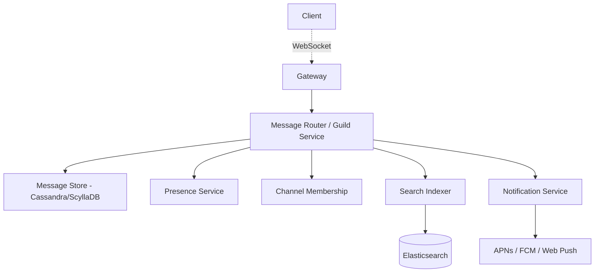
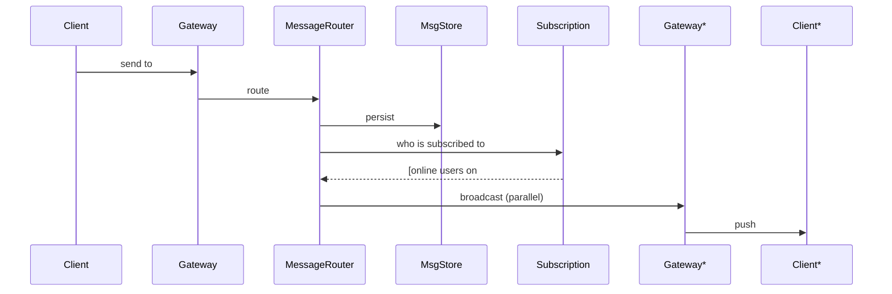

# Design Slack / Discord

> **TL;DR** — Slack and Discord are WhatsApp with **channels**, **persistent searchable history**, and **multi-tenancy**. The shift from 1:1 messaging to large channels (a Discord server can have 100K+ members) changes the fan-out model — broadcasts dominate. History is stored forever, so the message store is much larger than WhatsApp's. Slack is sharded by **workspace**; Discord switched from Cassandra to **ScyllaDB** when message volume hit 1 trillion. The interesting engineering: per-channel write ordering, real-time presence at scale, and search over chat history.

---

## 1. Requirements

### Functional
- Workspaces / servers, each containing channels (public, private, DMs).
- Channels with messages, threads, reactions, files.
- Mentions, notifications.
- Search over full history.
- Voice / video (Discord more so).
- Integrations (bots, webhooks, slash commands).

### Non-Functional
- Latency: message broadcast p99 < 500 ms.
- Availability: 99.99%.
- Durability: never lose a message; history kept indefinitely (Slack: variable by plan).
- Scale: Discord ~150 M MAU, ~4 B messages/day; Slack ~20 M DAU, ~1 B+ messages/day across workspaces.

---

## 2. Back-of-the-Envelope

- 4 B msgs/day → ~50 K writes/sec average, ~200 K peak.
- Per message, fan-out = channel members online → easily 10×–1000× write amplification.
- Storage: ~1 KB/msg × 4 B × 365 = ~1.5 PB/year (Discord). Compressed in storage.
- Connections: tens of millions concurrent WebSockets.

---

## 3. High-Level Architecture



Same family as WhatsApp + persistent message store + search.

---

## 4. The Connection Layer

Discord calls it **Gateway**. Persistent WebSocket, similar to WhatsApp:
- Client connects, subscribes to the channels they care about.
- Server pushes events: messages, presence updates, typing, reactions.
- Discord uses Elixir/Erlang for Gateway servers — same reasons as WhatsApp (millions of connections per box on BEAM).
- Slack uses Java/Go-based services.

---

## 5. Channels and Fan-Out

When you send a message to `#general` with 50 K members:



Key insight: you only need to push to **online subscribers** who currently care about that channel. Offline users will get the message on next history fetch — no per-user inbox needed (unlike WhatsApp).

This is huge for scaling. A 100 K-member channel with 1 K online subscribers = 1 K pushes, not 100 K.

Subscription tracking: each Gateway server keeps track of which channels its connected users are viewing or subscribed to. Channel → Gateway servers list maintained in a fast lookup (Redis or similar).

---

## 6. The Message Store

Discord wrote a famous blog post about migrating Cassandra → ScyllaDB.

Schema (Cassandra/ScyllaDB):
```
PK:  channel_id, bucket
CK:  message_id (Snowflake)
     author_id
     content
     edited_at
     reactions (map<emoji, list<user_id>>)
```

Partitioned by `(channel_id, bucket)` where bucket is e.g. month, to bound partition size. Within a partition, messages are sorted by Snowflake ID (chronological).

**Read pattern**: "give me the 50 messages before timestamp X in this channel" — sequential read of a partition.

Hot channels can become hot partitions. Sub-bucketing fixes that, but introduces multi-partition reads when paging across bucket boundaries.

---

## 7. Snowflake-Style Ordering

Each message gets a Snowflake ID. Within a channel, IDs are monotonically increasing. This is the basis for:
- Pagination cursors ("messages before id=...").
- Read state ("you've read up to id=...").
- Mention notifications (your last unread ID per channel).

---

## 8. Presence at Scale

Presence is famously hard. Discord wrote about it:
- Each user has presence (online/idle/dnd/offline).
- Each user is "subscribed" to receive presence updates from their friends list (small).
- For large servers with many members, presence is **not** broadcast to everyone — clients fetch on-demand or subscribe selectively.

Storage: in-memory clustered service, sharded by user_id. Presence updates are noisy, so heavy filtering is required to keep them from drowning the WebSocket.

---

## 9. Reactions

Reactions are aggregate counts plus per-user state ("did I react?"). At scale on viral messages they're hot counters.

Storage:
- Per-message: `{ emoji: count, my_reaction: bool }`.
- Per-reaction event written to a log; counts may use distributed counters at hot moments.

---

## 10. Search

Index every message into Elasticsearch (or Solr).
- **Workspace-scoped index** in Slack (each customer's data isolated).
- **Channel-scoped queries** with auth filtering.
- Async indexing — sub-second to a few seconds typical.
- Permissions enforced server-side; query must include channels user has access to.

---

## 11. Notifications

Three contexts:
- **Mention** (`@user`): pushes notification regardless of channel mute state.
- **Channel-level**: respects user's notification setting (all / mentions only / none).
- **Direct message**: always notifies.

Notification service is a separate consumer of the message event stream. Routes to APNs/FCM/Email/Desktop.

---

## 12. Threads

Messages can have replies. A thread is a sub-conversation rooted at a message.

Storage: thread reply messages stored similarly to channel messages but partitioned by `thread_id`. Updates to the root message track latest reply timestamp.

Read pattern: load root + recent replies. Subscriptions to thread events are separate from channel events.

---

## 13. Voice / Video (Discord)

WebRTC under the hood:
- Each voice channel has a media server (SFU — Selective Forwarding Unit).
- Joining sets up RTP streams via the media server.
- See [Zoom →](./zoom.md) and [WebRTC →](../19-advanced/webrtc.md).

Discord's voice infrastructure is largely Rust-based for performance.

---

## 14. Multi-Tenancy (Slack)

Each workspace is essentially an isolated tenant.
- **Database sharding** by workspace_id (common pattern).
- **Workspace-level resource limits** prevent noisy neighbors.
- **Custom features per plan** (history retention, search depth).

Discord's model is flatter — guilds (servers) but a single user identity.

---

## 15. Bots and Webhooks

- **Incoming webhooks**: URL endpoint per webhook; POST sends a message.
- **Outgoing webhooks / Events API**: subscribe to events, receive HTTP callbacks.
- **Slash commands**: invoke an external service for synchronous response.
- **Bots**: persistent WebSocket connections like regular clients.

At scale, bots are a significant source of traffic. Rate-limit them aggressively.

---

## 16. Common Mistakes

- **Fanning out to all channel members** when most are offline — only push to online subscribers.
- **No partition bucketing** on channel messages — hot channels (e.g. announcements at scale) blow up Cassandra partitions.
- **Synchronous search indexing** — kills write latency. Always async.
- **Treating presence as broadcast** — quadratic blow-up at server scale.
- **No per-channel rate limiting on bots** — one badly-written bot can flood channels.
- **Single-region presence service** — global presence requires cross-region propagation, expensive.

---

## 17. Cheat Card

```
PURPOSE    Multi-tenant team chat with channels, history, search.

CORE       Persistent WebSocket (Gateway servers, BEAM-style)
           Broadcast to ONLINE channel subscribers, not all members
           Snowflake IDs for per-channel ordering
           Cassandra/ScyllaDB partitioned by (channel_id, bucket)
           Elasticsearch for search, async-indexed

NUMBERS    Discord: 150M MAU, 4B msgs/day, trillions in storage
           Slack: 20M DAU, channel scope ~100s–10Ks

PITFALLS   broadcasting to offline users, hot channel partitions,
           sync indexing, presence storms on large servers.

RULE       Push to who is listening; let history catch up the rest.
```

---

## Resources

### Articles
- "How Discord Stores Trillions of Messages" — Discord Engineering
- "How Discord Stores Billions of Messages" — Discord Engineering (the older one with Cassandra)
- "Scaling Slack" — Slack engineering blog
- "How Discord Handles Two and Half Million Concurrent Voice Users" — Discord

### Videos
- "Discord's migration to ScyllaDB" — talks on YouTube
- ByteByteGo: "Design Slack"

### Tools
- Elixir / Phoenix / BEAM
- ScyllaDB, Cassandra
- Elasticsearch

### Adjacent reading
- [WhatsApp →](./whatsapp.md)
- [Wide-Column Stores →](../04-databases/wide-column-stores.md)
- [WebSockets →](../02-networking/websockets.md)
- [Distributed ID Generator →](./id-generator.md)

---

*Previous:* [← WhatsApp / Messenger](./whatsapp.md)  |  *Next:* [YouTube / Netflix →](./youtube-netflix.md)
