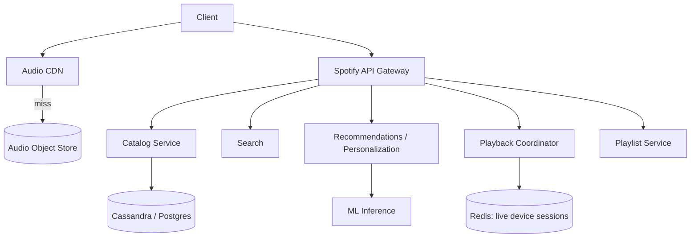
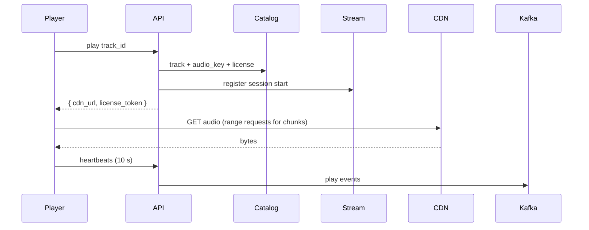

# Design Spotify (Music Streaming)

> **TL;DR** — Spotify is YouTube without the upload problem (catalog is curated from labels) and with **much tighter latency** (music users won't tolerate a 2-second start). Three challenges define the system: (1) a fixed catalog of ~100 M tracks must be deliverable instantly to 500 M users, (2) **personalized recommendations** are the product (Discover Weekly, Daily Mixes), (3) **playback continuity** across devices ("Spotify Connect"). The audio file pipeline is simpler than video — fewer variants, smaller files — so the engineering hours go into discovery and the recommendation graph.

---

## 1. Requirements

### Functional
- Browse and search catalog (~100 M tracks, 6 M podcasts).
- Stream a track on demand.
- Playlists (personal, collaborative, editorial, algorithmic).
- Recommendations (Discover Weekly, Release Radar, Daily Mix).
- Cross-device playback ("Spotify Connect").
- Offline downloads (Premium).
- Social: follow friends, share, see what they're playing.

### Non-Functional
- Track start latency p99 < 200 ms.
- Availability: 99.99%.
- Scale: ~600 M users, ~250 M premium, ~100 M tracks, ~3 B streams/day.

---

## 2. Back-of-the-Envelope

- 100 M tracks × ~5 MB (Ogg Vorbis at ~160 kbps) = ~500 TB catalog.
- 3 B streams/day → ~35 K stream starts/sec average.
- Each stream is ~3 min × 160 kbps = ~3.5 MB delivered.
- Daily egress: 3 B × 3.5 MB = ~10 PB/day from CDN.

---

## 3. High-Level Architecture



The audio path is dead simple (CDN). The brains live in recommendations and the personalization stack.

---

## 4. The Audio Storage and Delivery

- Each track stored as multiple bitrates: 96 / 160 / 320 kbps (Premium) and lossless FLAC (Hi-Fi).
- Files in **Ogg Vorbis** or AAC depending on platform.
- Stored as immutable objects in S3/GCS-like storage; URL = `audio/{track_id}/{bitrate}.ogg`.
- Delivered via CDN with very long TTLs (catalog is immutable per release).
- **Encrypted** with per-track keys (DRM-lite for premium content).

---

## 5. The Catalog

```
SCHEMA
  track_id     UUID
  title
  artists      list
  album_id
  duration_ms
  release_date
  popularity   denormalized float
  audio_keys   { bitrate -> object_key }
```

Tracks, albums, artists, labels — a normalized music graph. Stored in a mix of Postgres (transactional) and Cassandra (high-volume lookups by ID).

Plus heavy indexing for search and ranking.

---

## 6. Search

Inverted index over track titles, artist names, album titles, podcast titles. Plus typeahead.

Spotify's search has a strong relevance bias toward the user — popular results for that user/region/language rank higher. ML re-ranking on top of base Elasticsearch.

See [Search Autocomplete →](./search-autocomplete.md).

---

## 7. Recommendations

The product. Several systems combined:

### 7.1 Collaborative filtering (CF)
"People who listened to X also listened to Y." Matrix factorization on the user-track interaction matrix. Pre-computed nightly.

### 7.2 Content-based
Audio analysis: tempo, key, energy, danceability. Tracks with similar acoustic features cluster together.

### 7.3 Embeddings
Each track gets a vector embedding in a shared space; user has a "taste embedding" updated by their listens. Nearest-neighbor search ([HNSW / FAISS →](../19-advanced/embedding-retrieval.md)) for candidate generation.

### 7.4 Playlist generation
- **Discover Weekly**: personalized playlist refreshed every Monday. Mix of new candidates from your taste cluster.
- **Release Radar**: new releases from artists similar to your taste.
- **Daily Mix**: per-genre clusters from your listening history.

These are produced by offline batch jobs (Hadoop/Spark) over the past week's listening events, written to a serving store.

---

## 8. Playback

Client requests a track:



- Range requests fetch ~5–10 second chunks at a time.
- Client pre-buffers next chunk for gapless playback.
- Heartbeat events drive both Reporting (royalty accounting) and Recommendations training data.

---

## 9. Spotify Connect (Cross-Device)

Move playback between devices seamlessly:

- Each device that's online registers in a **device registry** (Redis, keyed by user).
- "Current playback state" lives in a per-user object (currently-playing track, position, queue, volume).
- One device is "active"; others are "available."
- Control commands (play/pause/skip) go via API → currently-active device.
- The active device pushes state updates back.

This is essentially a small **state-machine-as-a-service** per user.

---

## 10. Offline Downloads

Premium users can download tracks for offline play.
- App fetches encrypted audio files locally.
- License token allows playback for ~30 days.
- License must be refreshed by going online.
- DRM ensures files can't be played outside the app.

---

## 11. Royalties and Accounting

Every stream counts toward royalty payments to rights holders. Royalty pipeline:
- Play events → Kafka → batch aggregator.
- Per-track, per-region, per-month counts.
- Reconciliation with rights metadata.
- Output: royalty reports per label/artist.

This is more important than it sounds — Spotify pays out billions/year and must be exact.

---

## 12. Podcasts

Different content type, same skeleton:
- Hosted audio files (longer; tens of MB each).
- Episode metadata.
- Subscription state per user.
- Personalization (Spotify recommends podcast episodes too).

Podcast hosts upload via Anchor or directly. Spotify ingests, transcodes (often just to 96 kbps mono).

---

## 13. Social

- Follow friends, see what they're playing.
- Collaborative playlists with concurrent edits → CRDT-friendly data model ([CRDTs →](../08-distributed-systems/crdts.md)).
- "Friends activity" sidebar requires presence + recent plays per friend.

---

## 14. Common Mistakes

- **Pre-loading the whole track** — wastes bandwidth on songs the user skips after 5 s. Stream chunks; pre-buffer ~30 s.
- **Computing recommendations synchronously per request** — they should be batch-computed and served from cache.
- **One bitrate for all networks** — same lesson as video. Match to connection.
- **Tracking plays in OLTP DB** — billions/day. Use event stream.
- **Royalty calculation as part of online path** — keep it batch.
- **Treating Spotify Connect like one server** — it's a state-machine pattern needing real coordination.

---

## 15. Cheat Card

```
PURPOSE    On-demand music streaming + personalization.

CORE       Curated immutable catalog → CDN delivery (long TTLs)
           Track files stored in S3-like; multiple bitrates
           Range-request chunked playback (~5–10 s chunks)
           Per-user taste embeddings + collaborative filtering
           Discover Weekly / Daily Mix = batch personalization

NUMBERS    600M users, 100M tracks, 3B streams/day
           ~10 PB/day egress, p99 track start < 200 ms

PITFALLS   sync recommendations, pre-loading whole tracks,
           single bitrate, OLTP for plays, royalty in hot path.

RULE       Audio is a CDN problem.
           Spotify is a personalization problem.
```

---

## Resources

### Articles
- "Spotify's Discover Weekly: How machine learning finds your new music" — Spotify Engineering
- "Spotify Connect Architecture" — Spotify Engineering
- "The Music Streaming Sessions Dataset" — Spotify research

### Documentation
- **HLS / DASH** — also used for music in some platforms
- **Ogg Vorbis**, **Opus** — audio codecs

### Videos
- ByteByteGo: "Design Spotify"
- "Building Spotify's Recommendation System" — Spotify R&D talks

### Adjacent reading
- [YouTube / Netflix →](./youtube-netflix.md)
- [Recommendation System →](./recommendation-system.md)
- [Embedding-Based Retrieval →](../19-advanced/embedding-retrieval.md)
- [CDN →](../05-caching/cdn.md)

---

*Previous:* [← YouTube / Netflix](./youtube-netflix.md)  |  *Next:* [Uber / Lyft →](./uber.md)
