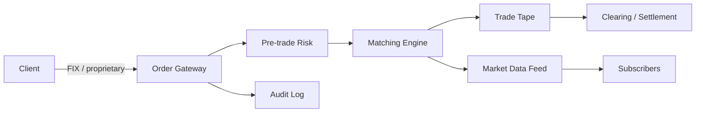
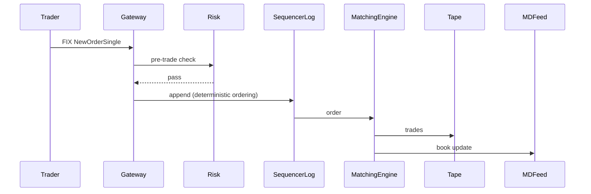

# Design a Stock Exchange / Trading System

> **TL;DR** — A stock exchange is **the canonical example of a low-latency, high-throughput, single-machine-fast system that must also be reliable**. The core is a **matching engine** that pairs buy and sell orders in **microseconds** — and in many production exchanges, this is a *single-threaded process on a beefy box* because shared-memory beats distributed coordination at that latency. Around it sit **order management, market data dissemination, risk checks, clearing & settlement, surveillance**. NASDAQ's INET runs at ~30 microsecond matching latency. The lessons here are useful even outside finance: when latency matters more than scale, the right answer is often to make one machine very fast.

---

## 1. Requirements

### Functional
- Submit limit / market / stop / IOC / FOK orders.
- Match orders by price-time priority.
- Cancel / modify orders.
- Publish market data (top of book, depth, trades).
- Settlement / clearing integration.
- Risk checks (pre-trade and post-trade).

### Non-Functional
- **Tail latency**: matching p99 < 100 µs (microseconds).
- Throughput: millions of orders/sec.
- Availability: 99.999% during market hours.
- Determinism: same inputs produce same outputs (replayable).
- Fairness: equal access for participants.

---

## 2. Back-of-the-Envelope

- US equity markets: ~10 B orders/day, ~500 K orders/sec peak.
- Matching engine target: sub-microsecond per trade.
- Market data: each trade triggers updates to thousands of subscribers — fanout multiplier of ~1000×.

---

## 3. High-Level Architecture



The matching engine is sacred. Everything else exists to either feed it inputs or react to its outputs.

---

## 4. The Matching Engine

**Single-threaded. In-memory. Deterministic.**

State:
- Per-symbol **limit order book** (LOB): two sorted lists (bids descending, asks ascending) of price levels, each containing a FIFO queue of orders at that price.

```
Bids                Asks
$101.05  100 sh     $101.10  500 sh
$101.04  300 sh     $101.11  100 sh
$101.03  500 sh     $101.12  200 sh
```

Algorithm on a new order:
1. If buy ≥ best ask: match against ask queue in FIFO order until quantity satisfied or no overlap.
2. Else add to bid book at its price level.
3. Emit trade events for each fill.

Time complexity: O(log n) for adding to the book (sorted insertion), O(1) for matching against top of book.

**Why single-threaded?** Determinism + cache locality. Distributed matching needs consensus — which adds milliseconds. A single thread on a Xeon with hot L1 cache hits 50 ns/order.

Replication for HA: hot standby receiving the same input stream. Active-passive failover with synchronized state.

---

## 5. Order Flow



**The Sequencer** is critical: it assigns a strict order to incoming events so the engine is deterministic regardless of which gateway received it.

---

## 6. Latency Engineering

What makes this system different from everything else in this book.

- **Kernel bypass networking** (Solarflare/OpenOnload, DPDK, RDMA) — userspace TCP/UDP stacks.
- **Lock-free / wait-free data structures** in hot paths.
- **Cache-aware data layouts** — order book in contiguous memory, cache lines aligned.
- **No GC** — written in C++ or Rust; Java versions tune the GC heavily (LMAX uses CMS).
- **Co-location** — exchange leases rack space inside the data center so HFT firms minimize cable length.
- **Hardware timestamps** on every event for audit.

LMAX's **Disruptor** pattern (lock-free ring buffer + single-writer principle) is the public design that demonstrated millions of ops/sec on commodity hardware.

---

## 7. Market Data

Every trade and every book change must be broadcast to subscribers.

- **Multicast UDP** in production exchanges — broadcast is cheap.
- **Sequence numbers** so subscribers detect gaps.
- **Snapshot + delta** model: periodic full snapshots, between-snapshots are deltas.
- **Multiple feeds**: Level 1 (top of book), Level 2 (depth), trade feed, statistics.

Subscriber latency: microseconds within the data center, milliseconds across the country.

---

## 8. Pre-Trade Risk

Before an order reaches the engine, check:
- Sufficient margin / buying power.
- Position limits.
- Fat-finger checks (order 1000× larger than normal).
- Self-trade prevention.

Must complete in microseconds. Generally implemented as in-memory rules engine adjacent to the gateway.

---

## 9. Clearing and Settlement

After a trade:
- **Clearing**: novation — central counterparty (CCP) becomes counterparty to both sides.
- **Netting**: aggregate net obligations.
- **Settlement**: T+1 (one business day later) actual delivery of cash and securities.

These run on separate systems (DTCC in US) on slower timelines. Trade events feed into the clearing pipeline as messages.

---

## 10. Persistence and Recovery

Must replay if matching engine crashes.
- **Input event log** (the sequencer's output) is the source of truth.
- On restart, replay log into matching engine to rebuild state.
- Periodic checkpoint snapshots to bound replay time.

This is **event sourcing** in its purest form. See [Event Sourcing →](../07-messaging/event-sourcing.md).

---

## 11. Surveillance

Real-time monitoring for market manipulation:
- Spoofing detection.
- Layering.
- Wash trading.
- Front-running.

Pattern detection on the trade stream. Triggers may halt trading or flag participants.

---

## 12. Failover and HA

Active-passive pair with shared input log:
- Primary processes orders, emits to log.
- Standby consumes the log and maintains identical state.
- On primary failure: standby promotes, gateways re-point.
- Failover target: < 1 second downtime.

True active-active would require consensus on order sequencing — adds latency the engine can't afford.

---

## 13. Common Mistakes

- **Distributing the matching engine across nodes** — consensus latency dominates; just don't.
- **Synchronous database writes in the order path** — log is fine; DB is not.
- **TCP_NODELAY misunderstanding** — set it, but also tune everything else.
- **Java with default GC** — long pauses kill tail latency.
- **Using Kafka for the input log** — too slow; the sequencer is a custom thing.
- **No determinism** — failover divergence is catastrophic.
- **Risk checks at the matching engine** — must be earlier in the pipeline.

---

## 14. Cheat Card

```
PURPOSE    Order matching at microsecond latency, with auditability.

CORE       Single-threaded matching engine, in-memory limit order book
           Deterministic ordering via a Sequencer (event log = source of truth)
           Pre-trade risk before orders hit the engine
           Multicast UDP market data feed
           Active-passive failover with shared input log

LATENCY    Matching < 100 µs p99; HFT-co-lo subscribers see µs market data

PITFALLS   distributed matching, sync DB writes,
           GC pauses, no determinism, risk at engine.

RULE       Make one machine very fast.
           Replicate the input, not the engine state.
```

---

## Resources

### Articles
- "LMAX Architecture" — Martin Fowler / LMAX Exchange
- "The LMAX Disruptor pattern" — LMAX Exchange technical paper
- NASDAQ INET / NYSE Pillar architecture overviews
- "How exchanges are built" — Jane Street Tech Blog

### Books
- *Trading and Exchanges* — Larry Harris
- *Algorithmic Trading and DMA* — Barry Johnson
- *Flash Boys* — Michael Lewis (pop science but useful color)

### Documentation
- **FIX protocol** — <https://www.fixtrading.org>
- **LMAX Disruptor** — <https://lmax-exchange.github.io/disruptor/>

### Videos
- "LMAX — How to Do 100K TPS at Less than 1ms Latency" — Martin Thompson
- "Mechanical Sympathy" series — Martin Thompson

### Adjacent reading
- [Event Sourcing →](../07-messaging/event-sourcing.md)
- [Payment System →](./payment-system.md)
- [Concurrency vs Parallelism →](../16-performance/concurrency-parallelism.md)
- [Tail Latency →](../16-performance/tail-latency.md)

---

*Previous:* [← Payment System](./payment-system.md)  |  *Next:* [Google Search / Web Crawler →](./search-engine.md)
