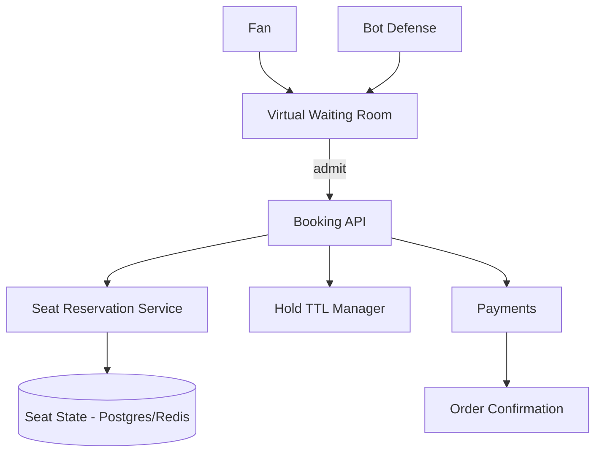

# Design a Ticketing System (Ticketmaster)

> **TL;DR** — Ticketing is the **canonical thundering-herd problem**: millions of fans hammer the system at 10:00:00 AM for Taylor Swift tickets, where supply is fixed and contention is brutal. The hard problems are (1) **reserving a seat without double-selling**, (2) **fair queueing under load** (everyone arrives in the same second), (3) **payment within a short hold window**, (4) **bot defense** (scalpers automate at scale). The signature pattern: a **virtual waiting room** that gates traffic into the booking system, plus **seat-level row locking** for the actual reservation.

---

## 1. Requirements

### Functional
- Browse events, venues, seat maps.
- Reserve a seat for short window (5–15 min).
- Complete payment to confirm.
- Release reservation if not paid.
- Refunds, exchanges.

### Non-Functional
- During on-sale: handle 10M+ concurrent users; ~100K bookings in minutes.
- **No double bookings, ever.**
- Latency p99 < 1 s during peak.
- Fairness in queueing.

---

## 2. High-Level Architecture



The waiting room is the load shed; the seat service is the source of truth.

---

## 3. The Virtual Waiting Room

When you arrive at on-sale time, you're put in a queue:
- Each user gets a queue position (random or arrival-time).
- Periodically, N users are admitted to the booking system.
- Others wait, see live position updates.

Implementation:
- Cookie / token with queue ID.
- Static, CDN-served queue page.
- Backend ticket admission service controls flow.

This caps load on the booking system to what it can handle.

---

## 4. Bot Defense

Scalper bots are an arms race. Defenses:
- CAPTCHA / device fingerprint.
- Behavioral analysis (mouse moves, timing).
- Rate limit per IP/account.
- Identity verification on high-demand events.
- Velocity caps (max N tickets per account).

Even with defenses, bots account for a huge share of attempts. Ticketmaster's Verified Fan tries to authenticate humans ahead of on-sale.

---

## 5. Seat Reservation

The core consistency problem.

```
SCHEMA
  event_id
  seat_id
  state       AVAILABLE | RESERVED | SOLD
  reserved_by user_id
  reserved_at timestamp
  expires_at
```

Two strategies:

### 5.1 Pessimistic DB row lock
Postgres `SELECT ... FOR UPDATE` on seat row.
- Locks the row until commit.
- Other transactions wait.
- Works at moderate concurrency; queues at peak.

### 5.2 Conditional update / Redis
```
UPDATE seats SET state='RESERVED', reserved_by=X, expires_at=now+10m
WHERE seat_id=Y AND state='AVAILABLE'
```
- Atomic conditional update.
- Either the update succeeds (you got the seat) or returns 0 rows (someone else got it).
- Non-blocking; fast.

Redis variant: `SET seat:Y owner-X NX EX 600` — "set if not exists, expire in 600s."

For seat selection on a map, lock multiple seats atomically:
```
MULTI
SET seat:A NX EX 600
SET seat:B NX EX 600
EXEC
```
Either both succeed or roll back.

---

## 6. The Hold Window

Reservation has a TTL (~10 min) for the user to complete payment.

- Redis TTL handles expiry automatically.
- Background job sweeps expired Postgres rows.
- On payment success → upgrade RESERVED to SOLD.
- On payment failure / abandon → seat returns to AVAILABLE.

---

## 7. Payment

Standard payment flow:
- Authorize at checkout (hold funds on card).
- Capture on confirmation.
- See [Payment System →](./payment-system.md).

If payment fails mid-flow, release the seat.

---

## 8. Seat Map UI

Frontend shows venue map with available/reserved/sold seats.
- Static seat layout per venue.
- Live availability via WebSocket (or polling).
- Updates as others reserve/release.

Backend pushes seat state changes to subscribers. At peak, this is a high-fanout event stream.

---

## 9. Inventory Models

Three common:

### 9.1 Reserved seating
Each seat is a specific location; users pick exact seats.

### 9.2 General admission
Pool of N tickets; no specific seat. Decrement counter atomically.

### 9.3 Tiered pricing
Sections with different prices. Allocate from each section's pool.

GA is much simpler — a single hot counter. Reserved seating is the harder design.

---

## 10. Distributed Inventory

Hot events: one event's seats partitioned across multiple shards by section/row. Reduces contention.

Redis is excellent here — single-threaded per shard, atomic operations, fast.

---

## 11. Fairness

Random queue order > FIFO at on-sale (FIFO punishes anyone with slower internet).

Per-account ticket caps prevent one account from buying all of stadium.

Multiple per-event tiers (presales, fan club, public) implemented as separate queues with different start times.

---

## 12. Refunds and Exchanges

- Refunds: return seat to AVAILABLE; reverse payment.
- Exchanges: atomic swap of seats (lock both old and new, release old, commit new).
- Strict deadlines (until event start typically).

---

## 13. Common Mistakes

- **Letting all traffic into booking simultaneously** — system melts.
- **Optimistic locking with high contention** — retries thrash.
- **No hold expiration** — abandoned carts permanently block inventory.
- **Storing seat state only in slow OLTP** — Redis layer needed for hot events.
- **No bot defense** — fans get nothing; scalpers profit.
- **One global ticketing service** — concert in one region shouldn't melt the others.

---

## 14. Cheat Card

```
PURPOSE    Fixed-supply ticket sales under thundering-herd load.

CORE       Virtual waiting room caps concurrent booking attempts
           Seat state in Redis (atomic SET NX) or Postgres (row lock)
           Hold TTL ~10 min; auto-release on expiry
           Bot defense (CAPTCHA, fingerprint, account caps)
           Per-account purchase limits enforce fairness

INVENTORY  Reserved: per-seat conditional update
           GA: atomic decrement of pool

PITFALLS   no waiting room, no TTL, no bot defense,
           pessimistic locks at peak, single global cluster.

RULE       Demand is bursty; supply is fixed.
           The waiting room is non-negotiable.
```

---

## Resources

### Articles
- "How Ticketmaster Handles the Taylor Swift Problem" — various press / engineering posts
- "Building a Virtual Waiting Room" — Cloudflare, AWS engineering blogs
- "Distributed Locking with Redis" — Redis docs (Redlock)

### Documentation
- **Redis SET NX** — <https://redis.io/commands/set/>
- **Cloudflare Waiting Room** — <https://www.cloudflare.com/products/waiting-room/>

### Books
- *Designing Data-Intensive Applications* — Kleppmann (transactions)

### Videos
- ByteByteGo: "Design Ticketmaster"

### Adjacent reading
- [Airbnb / Booking →](./airbnb.md)
- [Hotel Reservation System →](./hotel-reservation.md)
- [Distributed Locks →](../08-distributed-systems/distributed-locks.md)
- [Saga Pattern →](../07-messaging/saga-pattern.md)

---

*Previous:* [← Search Autocomplete](./search-autocomplete.md)  |  *Next:* [Food Delivery System →](./food-delivery.md)
