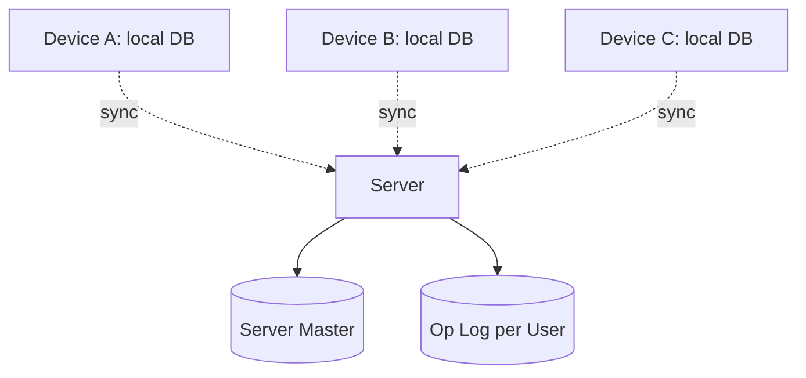
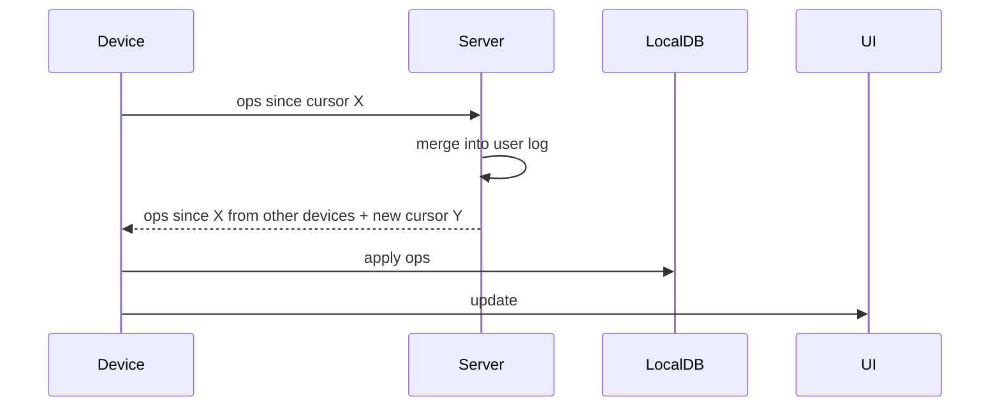

# Design a To-Do App with Offline Sync

> **TL;DR** — A to-do app sounds easy until you support **offline edits across multiple devices** without losing anything or creating conflicts. The architecture: **local SQLite (or IndexedDB) per device** + **append-only operation log** + **server sync with conflict resolution**. Two flavors: **operation-based** (log every action with a logical clock; server replays in order) or **CRDT-based** (data types that merge automatically). Real systems: Things, Bear, Notion (CRDT-based for blocks), Linear (sync engine is the headline feature).

---

## 1. Requirements

### Functional
- Create / edit / delete tasks.
- Lists / projects.
- Reminders, due dates.
- Tags, attachments.
- Sync across devices.
- Edit while offline; sync on reconnect.

### Non-Functional
- Latency: edits feel instant (local-first).
- Sync within seconds when online.
- Battery and bandwidth efficient.
- Conflict-free convergence.

---

## 2. High-Level Architecture



Local-first: writes happen locally, propagate to server, fan out to other devices.

---

## 3. Local-First Architecture

Each device has a full local copy of the user's data in SQLite / IndexedDB / Core Data.

- All reads/writes are local: instant UX.
- Background sync to server.
- Server is just a sync hub; UI doesn't depend on it.

This is the model Linear, Notion, Figma, and Bear all use.

---

## 4. Operation Log

Every change is an operation:
```
op_id          UUID + Lamport clock
device_id
user_id
type           CREATE_TASK | UPDATE_TASK | DELETE_TASK | ...
target_id      task_id
payload        {fields changed}
ts             local timestamp
```

Log is append-only. Local DB derived state is computed from replaying ops.

When online:
- Device sends new ops to server.
- Server merges into its log (assigns global order via [Hybrid Logical Clocks →](../08-distributed-systems/clocks.md)).
- Server pushes ops to other devices of same user.

---

## 5. Conflict Resolution

Two devices edit the same task offline.

### 5.1 Last-Write-Wins per field
Each field has its own version. Highest timestamp wins.

Pros: simple. Cons: silent data loss on field overlap.

### 5.2 CRDTs
Each task is a CRDT (map of CRDTs per field). Concurrent updates merge automatically.

For text fields (description), use a sequence CRDT. For lists (subtasks), use Logoot-style ordered list.

This is more complex but loses less data.

### 5.3 Operational Transform
Less common for to-dos; common for collaborative text.

For simple to-do fields, LWW per field is usually fine. For description editing, use CRDT.

---

## 6. Sync Protocol



Each device tracks a per-user sync cursor (highest op_id from server).

Sync triggered by:
- App foreground.
- Periodic background.
- Push notification ("you have new changes").

---

## 7. Server Storage

The server is mostly a sync log:
- Append-only ops table per user.
- Optionally materialized snapshot (current state per task) for queries.
- Snapshot rebuilt periodically.

Sharded by user_id.

---

## 8. Cross-Device Push

For "instant" sync between online devices:
- Server has WebSocket / push channel per device.
- On new op committed, push to all devices except sender.
- Devices fetch and apply.

Push payload can contain ops directly or just a "you have new data" ping.

---

## 9. Conflicts in UX

When LWW silently loses data, users complain. Better:
- Detect concurrent edits.
- Show user "this was changed elsewhere; here are both versions."
- Or merge cleanly via CRDT (no user intervention).

Notion and Linear handle this with CRDTs.

---

## 10. Reminders

Local schedule:
- Each task with a reminder has a local timer.
- OS schedules notification (iOS UNUserNotificationCenter, Android AlarmManager).
- Cross-device: server also schedules a backup reminder via push.

Don't double-fire — coordinate via a "delivered" marker synced to server.

---

## 11. Attachments

Larger payloads:
- Direct-to-S3 upload from client.
- Reference in op log.
- Sync metadata first, body lazy-loaded.

---

## 12. Encryption

Local DB encrypted at rest (OS-level keystores).

For E2EE (Bear, Standard Notes): server only sees ciphertext. Sync engine works on opaque blobs.

---

## 13. Common Mistakes

- **Server-first architecture** — apps feel laggy. Local-first is non-negotiable.
- **No operation log** — diffs hard to compute; conflicts hard to reason about.
- **Naive LWW across whole task** — entire edits clobbered.
- **No HLC / logical clock** — physical timestamps clash with clock drift.
- **Snapshot-only sync** — bandwidth-heavy; doesn't support offline edits well.
- **No background sync** — users lose work when app crashes before sync.

---

## 14. Cheat Card

```
PURPOSE    Local-first task management with conflict-free multi-device sync.

CORE       Per-device SQLite/IndexedDB; full local copy of user data
           Append-only operation log per user
           Hybrid Logical Clocks for ordering across devices
           Server is a sync hub + storage; doesn't gate reads
           LWW per field or CRDTs for richer fields (text, lists)
           Push for low-latency cross-device sync

PRINCIPLES Local-first: app works offline; sync is background
           Convergence: same ops → same state on every device

PITFALLS   server-first, naive whole-record LWW,
           physical timestamps, snapshot-only sync.

RULE       Edits land locally first.
           The server is just the hub.
```

---

## Resources

### Articles
- "Local-First Software" — Ink & Switch (foundational essay)
- "Sync Engine at Linear" — Linear engineering posts
- "How Figma's Multiplayer Tech Works" — Figma engineering
- "Building Notion's Sync Engine" — Notion engineering

### Documentation
- **Yjs**, **Automerge** — CRDT libraries
- **Watermelon DB**, **Realm**, **PouchDB / CouchDB** — sync-engine libraries

### Books
- *Designing Data-Intensive Applications* — Kleppmann (relevant chapters on replication)

### Videos
- "Local-First" talks from Ink & Switch
- "Sync Engines" — Tuomas Artman (Linear) talks

### Adjacent reading
- [Dropbox →](./dropbox.md)
- [CRDTs →](../08-distributed-systems/crdts.md)
- [Clocks (HLC) →](../08-distributed-systems/clocks.md)
- [Google Docs →](./google-docs.md)

---

*Previous:* [← Calendar System](./calendar.md)  |  *Next:* [Distributed ID Generator →](./id-generator.md)
