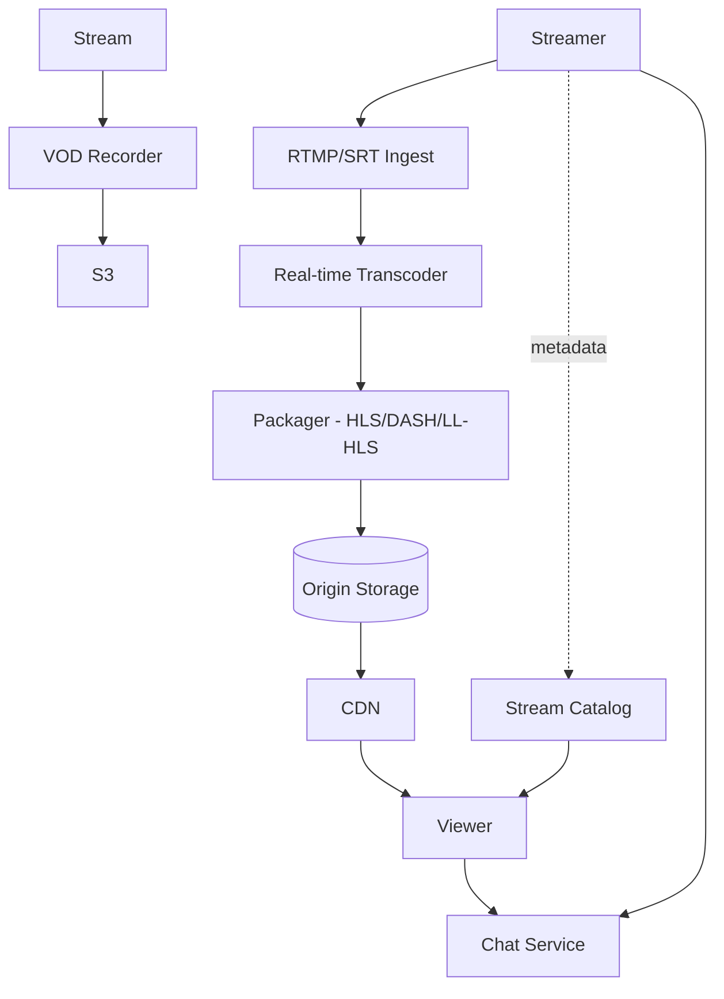

# Design a Live Streaming Platform (Twitch)

> **TL;DR** — Live streaming is **YouTube but with the latency dial cranked up**. Instead of pre-encoded VOD, video is encoded **in real time** as the streamer streams. The pipeline: **RTMP/SRT ingest from streamer → real-time transcoder → ABR packager (HLS/LL-HLS/CMAF) → CDN edge to viewers**. The end-to-end latency is the defining metric — Twitch's standard is ~10 seconds; ultra-low-latency modes get to 1–3 seconds. Chat is a parallel subsystem (millions of concurrent users in a popular stream sending messages). Discovery and recommendations matter as much as the streaming itself.

---

## 1. Requirements

### Functional
- Streamer broadcasts via OBS / mobile (RTMP/SRT ingest).
- Multi-bitrate transcoding for adaptive streaming.
- Viewers watch via HLS/DASH or low-latency variants.
- Real-time chat per stream.
- Concurrent stream metrics (viewer count).
- VOD recording for later playback.
- Subscriptions, donations, bits.

### Non-Functional
- End-to-end latency target: 2–10 sec depending on mode.
- Concurrent viewers per stream: millions for top streams.
- Availability: 99.99%.
- Scale: ~10 M concurrent viewers peak across all streams.

---

## 2. High-Level Architecture



Live pipeline on the left; chat and catalog on the right.

---

## 3. Ingest

Streamers push via:
- **RTMP** — older, ubiquitous, ~2 sec ingest latency.
- **SRT** — newer, better packet loss handling.
- **WebRTC** — for sub-second ingest (still emerging).

Each ingest point is regional (closest to streamer for low pre-encoding latency).

Encoder receives the live stream, normalizes to a known codec (typically H.264).

---

## 4. Real-Time Transcoding

The expensive part. Each stream is transcoded into multiple bitrate ladders:
- 1080p60, 1080p, 720p, 480p, 360p, 160p.
- All must be produced in real time, sub-second behind ingest.

Per-stream CPU/GPU is significant. Big streamers (1M concurrent viewers) justify dedicated GPU encoders.

Twitch built custom infrastructure for this; AWS Elemental MediaLive is the cloud equivalent.

---

## 5. Packaging

Transcoded streams chopped into segments and wrapped in HLS/DASH manifests.

- **Standard HLS**: 6 sec segments, ~10 sec latency.
- **LL-HLS (Low-Latency HLS)**: 1 sec segments + partial segments, ~3 sec latency.
- **CMAF chunked**: smaller chunks, ~2 sec latency.
- **WebRTC**: sub-second; cost-prohibitive at scale.

Each variant served from the same origin.

---

## 6. CDN Distribution

Origin sends to global edge CDN. Viewers fetch segments via HTTP GET — pure CDN delivery.

Hot streams have segments **pushed** to edges proactively (pre-warming) to avoid origin overload at scale.

Twitch peers heavily with ISPs (similar to Netflix Open Connect strategy).

---

## 7. Chat

The hidden challenge. Popular stream = 10K msgs/sec, 10M viewers reading.

Architecture:
- WebSocket connections to chat servers (similar to [Discord →](./slack.md)).
- Per-stream room.
- Fan-out only to currently watching viewers.
- Moderation (auto-mod + human mods).
- Chat history limited (last few hundred messages).

For mega-streams, chat itself becomes a scaling problem. Twitch uses IRC-derived protocol over WebSockets.

---

## 8. Concurrent Viewer Counts

- Each session ping increments a counter per stream.
- TTL-based to handle silent disconnects.
- Stored in Redis with refresh from CDN edge logs.
- Aggregated globally per stream.

Hot streams = hot counter; use [distributed counter →](./distributed-counter.md) techniques.

---

## 9. Discovery

- Browse by game / category.
- Recommended streams (personalized).
- "Popular now."

Same recommender patterns as [YouTube →](./youtube-netflix.md) but live: candidates only include currently-live streams.

---

## 10. VOD

After stream ends, segments are stitched into a single playable file:
- Stored to S3.
- Available as on-demand replay.
- Clips: short user-generated highlights cut from VOD.

This is just YouTube territory after the fact.

---

## 11. Monetization

- Subscriptions (recurring).
- Bits (one-time tips).
- Ad insertion at midroll points.
- Donations via Stripe / external.

Real-time event display ("X just subscribed") triggered via webhooks from payment system.

---

## 12. Latency Profile (End to End)

Typical Twitch:
- Streamer → ingest: ~1 sec.
- Transcoding: ~1 sec.
- Packaging: ~2 sec (segment size).
- CDN: ~0.5 sec.
- Player buffer: ~5 sec.
- Total: ~9–10 sec.

LL-HLS / CMAF cuts player buffer dramatically.

---

## 13. Common Mistakes

- **Transcoding cheap streams in real time** — cost explodes. Pass-through for small streams (no transcoding ladder).
- **No CDN** — origin servers can't serve millions.
- **Single chat server per stream** — millions of viewers can't share one box.
- **Synchronous viewer counts** — DB writes per join/leave kill it.
- **No anti-piracy / DRM for paid streams** — content lifted.
- **No segment cleanup** — disk fills with stale live segments.

---

## 14. Cheat Card

```
PURPOSE    Real-time video broadcast to global audiences.

CORE       RTMP/SRT ingest → real-time transcoder ladder → HLS/LL-HLS
           Segments served via CDN; pre-warm hot streams to edges
           Chat = WebSocket per-room, fan-out to current viewers
           Concurrent viewer counts in Redis (TTL-based)
           VOD = stitched segments archived after stream

LATENCY    Standard HLS ~10 s; LL-HLS ~3 s; WebRTC < 1 s

PITFALLS   transcoding cheap streams full ladder,
           no CDN, single chat server, sync viewer counters.

RULE       Live = real-time transcoding + CDN distribution.
           Chat is a separate service.
```

---

## Resources

### Articles
- "How Twitch Streams Video at Scale" — Twitch engineering
- "LL-HLS specification" — Apple
- "Building a Streaming Service" — various engineering blogs
- "CMAF for Low-Latency Streaming" — DASH-IF

### Documentation
- **HLS** — <https://developer.apple.com/streaming/>
- **OBS Studio** — open-source ingest

### Tools
- FFmpeg, GStreamer
- AWS MediaLive, MediaPackage
- Mux, Ant Media Server

### Videos
- Twitch engineering talks
- ByteByteGo: "Design Twitch"

### Adjacent reading
- [YouTube / Netflix →](./youtube-netflix.md)
- [Slack / Discord →](./slack.md) (chat patterns)
- [CDN →](../05-caching/cdn.md)
- [WebRTC →](../19-advanced/webrtc.md)
- [Zoom →](./zoom.md)

---

*Previous:* [← Multiplayer Game Backend](./multiplayer-game.md)  |  *Next:* [Collaborative Whiteboard →](./collaborative-whiteboard.md)
